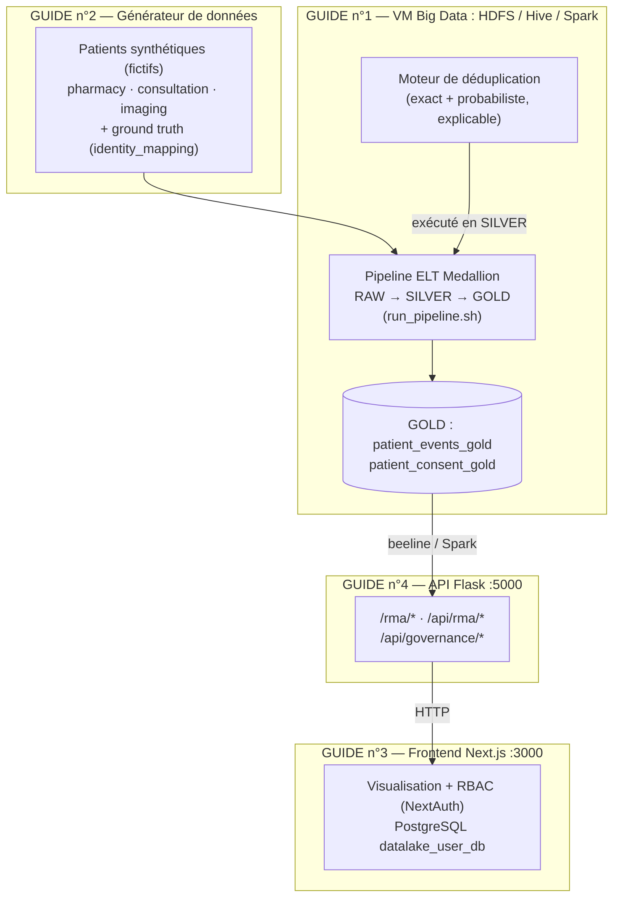

# Guides techniques — Plateforme Big Data Patients

Guides complets regroupés pour les utilisateurs et développeurs. Remplace la documentation éparpillée
(références historiques dans `archives/datalake_mavis/`, README locaux) : **les chemins ci-dessous
correspondent au dépôt consolidé `Mon_Memoire/projet/code-source`**.

## Index

| # | Guide | Sujet | Prérequis |
|---|-------|-------|-----------|
| 1 | [`guide-vagrant.md`](guide-vagrant.md) | VM Big Data : création, démarrage, (ré)initialisation, pipeline ELT, arrêt | Vagrant + VirtualBox, base MMT_DB (Laragon) |
| 2 | [`guide-generateur-donnees.md`](guide-generateur-donnees.md) | Générateur de données patients synthétiques (3 sources) + ground truth | Python 3.8+, `faker`/`pandas` |
| 3 | [`guide-frontend.md`](guide-frontend.md) | Application de visualisation Next.js (optionnelle) | Node.js 18+, backend API allumé |
| 4 | [`guide-backend.md`](guide-backend.md) | API Flask (port 5000) : endpoints, lancement, tests, gouvernance | Pipeline ELT GOLD + Hive actifs |

## Vue d'ensemble

## Emplacement du code consolidé

| Composant | Chemin dans `Mon_Memoire` |
|-----------|---------------------------|
| VM + ELT + API | `projet/code-source/provision/` (`Vagrantfile`, `bootstrap.sh`, `scripts/`, `api/`) |
| Moteur de dédup / gouvernance | `projet/code-source/engine/` |
| Générateur + évaluation | `projet/code-source/evaluation/` (`synthetic-patient-generator/`, `evaluate_engine.py`) |
| Frontend | `projet/code-source/front-optional/` |
| SQL PostgreSQL central | `projet/code-source/sql/schema.sql` |

## Bonnes pratiques transverses

- Données **synthétiques uniquement** ; ne jamais commiter `data/`, `provision/metadata/`,
  `provision/config/data_sources.json`, `.env`.
- Config ELT non committée : partir de `provision/config/data_sources.example.json` → `data_sources.json`.
- Config pipeline `provision/config/pipeline.yaml` et FHIR `provision/config/fhir_entities.json` :
  **commités** et modifiables sans toucher au code (chargés par `scripts/utils/paths.py`).
- Warehouse Spark = **HDFS uniquement** (jamais vboxsf).
- Docs complémentaires : `documents/documentation/` (manuel conceptuel), `projet/code-source/README.md`
  (guide technique du code), `ai/dev/pipeline_elt.md`, `ai/dev/architecture.md`.