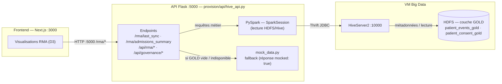

# Guide Backend — API Flask (port 5000)

API JSON qui expose les données de la couche **GOLD** du Data Lake au frontend : endpoints RMA
(Rapport Mensuel d'Activité) + **gouvernance** (rate de doublons, statut de consentement par finalité).

## 1. Vue d'ensemble

| Élément | Valeur |
|---|---|
| Emplacement | `projet/code-source/provision/api/` |
| Technologie | Flask + PySpark (lecture Hive/HDFS) |
| Port | 5000 |
| Fichiers | `hive_api.py` (app), `mock_data.py` (fallback), `test_api.py` (tests), `test.py` (endpoint de démo) |
| Prérequis | Pipeline ELT GOLD produit + HiveServer2/Metastore actifs (VM) |

### Chaîne d'appel



## 2. Prérequis

1. **Pipeline ELT exécuté** — table `datalake_gold.patient_events_gold` existante (`guide-vagrant.md`).
2. **HiveServer2 + Metastore actifs** dans la VM.
3. **Environnements** : VM provisionnée (`~/api-venv` créé par `bootstrap.sh`).
4. **Config de connexion** : `provision/config/data_sources.json` présents (cf. `guide-vagrant.md`).

Vérifier la table GOLD :
```bash
vagrant ssh
beeline -u jdbc:hive2://localhost:10000 -n vagrant \
  -e "SELECT count(*) FROM datalake_gold.patient_events_gold;"
```

Vérifier le venv :
```bash
vagrant ssh
source ~/api-venv/bin/activate
python -c "import flask; print(flask.__version__)"
```

## 3. Lancement

```bash
# Dans la VM
vagrant ssh
cd ~/datalake-final
source ~/api-venv/bin/activate
python -m provision.api.hive_api
# L'API démarre sur http://0.0.0.0:5000
```

Vérification rapide :
```bash
curl http://localhost:5000/rma/last_sync
curl http://localhost:5000/rma/admissions_summary
```

> Le venv `~/api-venv` peut être activé automatiquement au login (profil configuré par le provision).

## 4. Health check startup (`provision/test_startup.sh`)

```bash
bash provision/test_startup.sh                    # silencieux
bash provision/test_startup.sh --verbose          # détails + logs
bash provision/test_startup.sh --report           # rapport JSON dans provision/reports/
```

Checks : statut VM (CRITIQUE) · HiveServer2/beeline (CRITIQUE) · API `/rma/last_sync` (CRITIQUE) ·
fraîcheur `sync_metadata.json` (IMPORTANT) · lecture GOLD (OPTIONNEL). Code de sortie **0** = prêt,
**1** = à ne pas utiliser. Usage orchestration : `bash provision/test_startup.sh || exit 1`.

## 5. Endpoints

### 5.1 RMA — endpoints principaux

| Méthode | Endpoint | Description | Params |
|---|---|---|---|
| GET | `/rma/last_sync` | Dernière synchro pipeline | — |
| GET | `/rma/admissions_summary` | Total admissions, mortalité infantile/maternelle | `start`, `end`, `sex` |
| GET | `/rma/top_diagnostics` | Top N diagnostics | `limit`, `start`, `end`, `sex` |
| GET | `/rma/diagnostics_heatmap` | Diagnostics par tranche d'âge | `limit`, `start`, `end`, `sex` |
| GET | `/rma/diagnostics_list` | Liste paginée | `page`, `limit`, `start`, `end`, `sex` |

### 5.2 RMA — endpoints spécifiques

| Méthode | Endpoint | Description | Params |
|---|---|---|---|
| GET | `/api/rma/mortality` | Morbidité/mortalité par catégorie | `start`, `end`, `sex` |
| GET | `/api/rma/maternity` | Accouchements mensuels (agrégé) | `start`, `end`, `sex` |
| GET | `/api/rma/laboratory` | Activité laboratoire | — |
| GET | `/api/rma/malaria` | Prise en charge paludisme | — |

> `/api/rma/laboratory` et `/api/rma/malaria` renvoient des **données vides** (sources externes hors GOLD).

### 5.3 Gouvernance (déduplication + consentement)

| Méthode | Endpoint | Description |
|---|---|---|
| GET | `/api/governance/duplicates` | Taux de doublons (`duplicate_rate`), 145 masters / 69 doublons — référence 07/09/2026 : `duplicate_rate` = **32.24 %**, `mocked: false` |
| GET | `/api/governance/consent` | Statistiques de consentement (par finalité) depuis `patient_consent_gold` |

### 5.4 Paramètres communs

| Param | Défaut | Description |
|---|---|---|
| `start` | -365 j | Date début `YYYY-MM-DD` |
| `end` | aujourd'hui | Date fin |
| `sex` | tous | `male` / `female` |
| `limit` | 5 ou 15 | Nombre max de résultats |
| `page` | 1 | Numéro de page (`diagnostics_list`) |

### 5.5 Format de réponse

```json
{
  "success": true,
  "filters": { "start": "2025-08-26", "end": "2026-08-26", "sex": null },
  "data": { "total_admissions": 1234, "mortalite_infantile": 3.2, "mortalite_maternelle": 0.85 }
}
```

## 6. Tests

Suite de tests des endpoints (14/14 PASS, dont gouvernance) :
```bash
# Depuis la VM :
cd ~/datalake-final
python -m provision.api.test_api
# Ou depuis Windows (port 5000 forwardé) :
python projet/code-source/provision/api/test_api.py
```
Sortie attendue : liste `✅ PASS /endpoint ...` puis `RÉSULTAT : 14/14 PASS — 0 FAIL — 0 SKIP`.

**Test avec les données réelles** (désactive le repli mock) :
```bash
RMA_USE_MOCK=false python -m provision.api.test_api
```
Le flag se lit dans `hive_api.py:55` : `USE_MOCK_FALLBACK = os.environ.get("RMA_USE_MOCK", "true")`.
Par défaut, un endpoint renvoie des données fictives si la table GOLD est vide (`mocked: true` dans la
réponse). En production, exécuter le pipeline puis `RMA_USE_MOCK=false`.

## 7. Structure du code

```
provision/api/
├── hive_api.py      # appl. Flask : endpoints + requêtes PySpark
├── mock_data.py     # fallback / données fictives quand GOLD indisponible
├── test_api.py      # tests automatisés des endpoints (14)
└── test.py          # mini-app de démo (endpoint /patients_by_year)
```

## 8. Fichiers associés

| Fichier | Rôle |
|---|---|
| `provision/scripts/run_pipeline.sh` | Pipeline ELT → GOLD (`guide-vagrant.md`) |
| `provision/metadata/sync_metadata.json` | Métadonnées de synchronisation |
| `provision/test_startup.sh` | Health check complet |
| `sql/schema.sql` | Schéma PostgreSQL central (master, consent, api_user, audit) |

## 9. Limites connues

| Problème | Détail | Priorité |
|---|---|---|
| Auth JWT non implémentée sur l'API | tous les endpoints sont ouverts (RBAC porté sur le front) | Haute |
| `/api/rma/laboratory` | données vides — source externe requise | Moyenne |
| `/api/rma/malaria` | données vides — source externe requise | Moyenne |
| Pas de cache | chaque requête interroge Hive | Basse |
| Pas de validation paramètres | invalides → 500 | Basse |

## 10. Dépannage rapide

| Symptôme | Cause probable | Correctif |
|---|---|---|
| `500` sur un endpoint RMA | GOLD absent ou Hive éteint | pipeline ELT + redémarrer metastore/HS2 (`guide-vagrant.md`) |
| Réponses « mock » | `mock_data` activé (fonction de repli) | produire le GOLD ; vérifier flag `mocked` dans la réponse |
| `/api/governance/duplicates` vide | SILVER/moteur non exécuté | lancer le pipeline (étape 3/4) |
| Port 5000 occupé | autre service | `vagrant halt`/`port` conflictuel → changer de port forward ou tuer le process |
| Python 3.8 des dépendances | libs sorties de compatibilité | respecter RapidFuzz (pas de NLP lourd) `[AGENTS.md]` |

## 11. Suite logique

- Consommation par le front : **`GUIDE/guide-frontend.md`**.
- Détail du moteur/gouvernance : `documents/documentation/api.md`, `documents/documentation/consentement_gouvernance.md`.