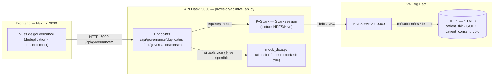

# Guide Backend — API indicateurs du warehouse (Flask, port 5000)

API JSON qui expose les **indicateurs de gouvernance** du Data Lake au frontend : taux de
doublons (déduplication SILVER) et statut du **consentement par finalité** (GOLD).

## 1. Vue d'ensemble

| Élément | Valeur |
|---|---|
| Emplacement | `projet/code-source/provision/api/` |
| Technologie | Flask + PySpark (lecture Hive/HDFS) |
| Port | 5000 |
| Fichiers | `hive_api.py` (app), `mock_data.py` (fallback), `test_api.py` (tests) |
| Prérequis | Pipeline ELT SILVER/GOLD produit + HiveServer2/Metastore actifs (VM) |

### Chaîne d'appel


```mermaid
flowchart LR
    subgraph FRONT["Frontend — Next.js :3000"]
        UI["Vues de gouvernance<br/>(déduplication · consentement)"]
    end

    subgraph API["API Flask :5000 — provision/api/hive_api.py"]
        ROUTES["Endpoints<br/>/api/governance/duplicates · /api/governance/consent"]
        PYSPARK["PySpark — SparkSession<br/>(lecture HDFS/Hive)"]
        MOCK["mock_data.py<br/>fallback (réponse mocked: true)"]
    end

    subgraph HADOOP["VM Big Data"]
        HS2["HiveServer2 :10000"]
        WAREHOUSE[("HDFS — SILVER<br/>patient_fhir · GOLD · patient_consent_gold")]
    end

    UI -->|"HTTP :5000 /api/governance/*"| ROUTES
    ROUTES -->|"si table vide / Hive indisponible"| MOCK
    ROUTES -->|"requêtes métier"| PYSPARK
    PYSPARK -->|"Thrift JDBC"| HS2
    HS2 -->|"métadonnées / lecture"| WAREHOUSE
```

## 2. Prérequis

1. **Pipeline ELT exécuté** — tables `datalake_silver.patient_fhir` et
   `datalake_gold.patient_consent_gold` existantes (`guide-vagrant.md`).
2. **HiveServer2 + Metastore actifs** dans la VM.
3. **Environnements** : VM provisionnée (`~/api-venv` créé par `bootstrap.sh`).
4. **Config de connexion** : `provision/config/data_sources.json` présents (cf. `guide-vagrant.md`).

Vérifier une table :
```bash
vagrant ssh
beeline -u jdbc:hive2://localhost:10000 -n vagrant \
  -e "SELECT count(*) FROM datalake_silver.patient_fhir;"
```

Vérifier le venv :
```bash
vagrant ssh
source ~/api-venv/bin/activate
python -c "import flask; print(flask.__version__)"
```

## 3. Lancement

```bash
# Dans la VM
vagrant ssh
cd ~/datalake-final
source ~/api-venv/bin/activate
python -m provision.api.hive_api
# L'API démarre sur http://0.0.0.0:5000
```

Vérification rapide :
```bash
curl http://localhost:5000/api/governance/duplicates
curl http://localhost:5000/api/governance/consent
```

> Le venv `~/api-venv` peut être activé automatiquement au login (profil configuré par le provision).

## 4. Health check startup (`provision/test_startup.sh`)

```bash
bash provision/test_startup.sh                    # silencieux
bash provision/test_startup.sh --verbose          # détails + logs
bash provision/test_startup.sh --report           # rapport JSON dans provision/reports/
```

Checks : statut VM (CRITIQUE) · HiveServer2/beeline (CRITIQUE) · API `/api/governance/duplicates`
(CRITIQUE) · fraîcheur `sync_metadata.json` (IMPORTANT) · lecture table (OPTIONNEL).
Code de sortie **0** = prêt, **1** = à ne pas utiliser. Usage orchestration :
`bash provision/test_startup.sh || exit 1`.

## 5. Endpoints

### 5.1 Gouvernance (déduplication + consentement)

| Méthode | Endpoint | Description |
|---|---|---|
| GET | `/api/governance/duplicates` | KPIs déduplication (patients, masters, doublons, taux, méthodes) depuis `datalake_silver.patient_fhir` |
| GET | `/api/governance/consent` | Statistiques de consentement (par finalité) depuis `patient_consent_gold`, liste + agrégats |

### 5.2 Paramètres

| Param | Défaut | Description |
|---|---|---|
| `limit` | 200 | Nombre max de consentements renvoyés |

### 5.3 Format de réponse

```json
{
  "success": true,
  "filters": {},
  "data": {
    "total_patients": 65214,
    "total_masters": 62180,
    "duplicates": 3034,
    "duplicate_rate": 4.65,
    "by_method": {"exact": 1876, "probabilistic": 1158}
  },
  "mocked": true
}
```

Le drapeau `mocked` vaut `true` uniquement en secours backend (jeu de démonstration), `false`
lorsque la donnée provient des tables SILVER/GOLD.

## 6. Tests

Suite de tests des endpoints (3/3 PASS) :
```bash
# Depuis la VM :
cd ~/datalake-final
python -m provision.api.test_api
# Ou depuis Windows (port 5000 forwardé) :
python projet/code-source/provision/api/test_api.py
```
Sortie attendue : liste `✅ PASS /endpoint ...` puis `RÉSULTAT : 3/3 PASS — 0 FAIL — 0 SKIP`.

## 7. Structure du code

```
provision/api/
├── hive_api.py      # appl. Flask : endpoints + requêtes PySpark
├── mock_data.py     # fallback / jeu de démonstration quand SILVER/GOLD indisponible
├── test_api.py      # tests automatisés des endpoints (3)
└── README.md        # documentation de l'API
```

## 8. Fichiers associés

| Fichier | Rôle |
|---|---|
| `provision/scripts/run_pipeline.sh` | Pipeline ELT → SILVER/GOLD (`guide-vagrant.md`) |
| `provision/metadata/sync_metadata.json` | Métadonnées de synchronisation |
| `provision/test_startup.sh` | Health check complet |
| `sql/schema.sql` | Schéma PostgreSQL central (master, consent, api_user, audit) |

## 9. Limites connues

| Problème | Détail | Priorité |
|---|---|---|
| Auth JWT non implémentée sur l'API | tous les endpoints sont ouverts (RBAC porté sur le front) | Haute |
| Pas de cache | chaque requête interroge Hive | Basse |
| Pas de validation paramètres | invalides → 500 | Basse |

## 10. Dépannage rapide

| Symptôme | Cause probable | Correctif |
|---|---|---|
| `500` sur un endpoint | table SILVER/GOLD absente ou Hive éteint | pipeline ELT + redémarrer metastore/HS2 (`guide-vagrant.md`) |
| Réponses « mock » | `mock_data.py` activé (fonction de repli) | produire SILVER/GOLD ; vérifier flag `mocked` dans la réponse |
| `/api/governance/duplicates` vide | SILVER/moteur non exécuté | lancer le pipeline (étape 3/4) |
| Port 5000 occupé | autre service | `vagrant halt` / port conflictuel → changer de port forward ou tuer le process |
| Python 3.8 des dépendances | libs sorties de compatibilité | respecter RapidFuzz (pas de NLP lourd) `[AGENTS.md]` |

## 11. Suite logique

- Consommation par le front : **`GUIDE/guide-frontend.md`**.
- Détail du moteur/gouvernance : `documents/documentation/api.md`, `documents/documentation/consentement_gouvernance.md`.