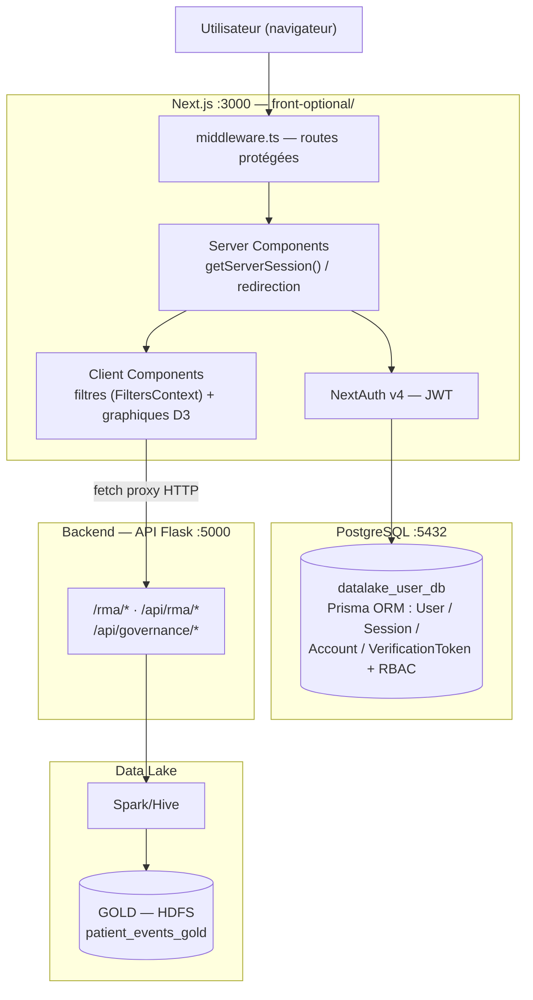

# Guide Frontend — Application de visualisation (Next.js)

Application Web de visualisation du Data Lake (optionnelle, non requise pour le pipeline). Le projet
s'appelle `visualisation_app` (emplacement consolidé : `projet/code-source/front-optional/`).

## 1. Vue d'ensemble

| Élément | Valeur |
|---|---|
| Emplacement | `projet/code-source/front-optional/` |
| Framework | Next.js 15.4.6 (App Router + Turbopack) |
| Langage | TypeScript 5.9 |
| Styling | Tailwind CSS v4 + shadcn/ui (New York, Zinc) |
| Visualisation | D3.js v7 (graphiques SVG customisés) |
| Auth | NextAuth v4 (JWT + Prisma adapter) |
| BDD | PostgreSQL via Prisma ORM |
| Port | 3000 |

## 2. Dépendances et prérequis

- **Node.js 18+** (compatible Next.js 15).
- **PostgreSQL** démarré sur `localhost:5432` (base `datalake_user_db`).
- **Backend API** lancé — `GUIDE/guide-backend.md` (le front interroge `localhost:5000`).

Vérifier Node :
```bash
node --version   # v18.x+ ; npm --version
```

## 3. Installation et démarrage

```bash
cd F:\MBDS\STAGE\PROJECT\Mon_Memoire\projet\code-source\front-optional

# 1. Dépendances
npm install

# 2. Variables d'environnement — créer `.env` à la racine :
#    NEXT_PUBLIC_SERVER_URL=http://localhost:5000
#    DATABASE_URL="postgresql://postgres:<PASSWORD>@localhost:5432/datalake_user_db?schema=public"
#    NEXTAUTH_SECRET=<64 hex aléatoires>
#    NEXTAUTH_URL=http://localhost:3000

# 3. Initialiser PostgreSQL (schéma Prisma)
npx prisma migrate dev --name init

# 4. Peupler les utilisateurs par défaut
npx prisma db seed

# 5. Lancer le serveur de développement
npm run dev
```

Application accessible sur **http://localhost:3000**.

### Comptes par défaut (seed)

| Rôle | Email | Mot de passe |
|---|---|---|
| ADMIN | `dataviz@mmt.mg` | `dataviz` |
| MEDECIN | `medecin@mmt.mg` | `dataviz` |

> Base PostgreSQL requise : `datalake_user_db` (auth). Plus de détails : `front-optional/README.md`.

## 4. Commandes utiles

```bash
npm run dev      # serveur de développement (Turbopack)
npm run build    # build de production
npm run start    # démarrer le build de production
npm run lint     # linter ESLint
```

## 5. Schéma de la BDD (auth)

Le schéma Prisma (`prisma/schema.prisma` + `prisma/seed.js`) définit utilisateurs et sessions
NextAuth. Modèles typiques : `User` (avec `role`), `Account`, `Session`, `VerificationToken`.
Migration initiale : `npx prisma migrate dev --name init`.

## 6. Structure du projet

```
front-optional/
├── prisma/            # schema.prisma · seed.js · migrations/
├── src/
│   ├── app/
│   │   ├── layout.tsx · page.tsx (→ /login) · globals.css
│   │   ├── login/     # connexion
│   │   ├── dashboard/ # KPIs + top diagnostics
│   │   ├── rma/       # visualisations RMA
│   │   │   ├── page.tsx               # Tableau 5 — diagnostics
│   │   │   ├── morbidite/page.tsx     # Tableau 9 — morbidité/mortalité
│   │   │   ├── maternite/page.tsx     # Tableaux 11 & 12
│   │   │   ├── laboratoire/page.tsx   # Tableau 16
│   │   │   └── paludisme/page.tsx     # Tableau 25
│   │   ├── settings/  # paramètres
│   │   ├── users/     # gestion utilisateurs (ADMIN)
│   │   └── api/       # auth (NextAuth) + users (CRUD)
│   ├── components/    # Header · Sidebar · Heatmap · ui/ (shadcn) · rma/*
│   ├── context/       # FiltersContext (période, sexe)
│   ├── lib/           # auth.ts · prisma.ts · rbac.ts · utils.ts
│   └── middleware.ts  # protection des routes
├── pages/api/rma/diagnostics.ts   # route legacy (Pages Router)
└── ... configs (next.config.ts, tsconfig.json, package.json)
```

## 7. Architecture et flux de données

**Hybride client-serveur** :
1. **Server Components** (`page.tsx`) : vérification `getServerSession()`, redirection si non connecté.
2. **Client Components** (`*Client.tsx`) : interactivité, fetch et graphiques D3.
3. **Backend externe** : le front proxy ses requêtes vers `localhost:5000` (endpoints `/rma/*`).

```
Utilisateur → Next.js (port 3000) → API Flask (port 5000) → Spark/Hive Data Lake
                                        └→ PostgreSQL (auth, utilisateurs)
```



## 8. RBAC

- **NextAuth v4** (JWT) + Prisma adapter.
- Deux rôles : `ADMIN` et `MEDECIN` (définition dans `src/lib/rbac.ts`).
- Middleware protégeant `/dashboard`, `/settings`, `/rma/*`.
- Routes `/users/*` réservées au rôle `ADMIN`.

## 9. Visualisations RMA

| Route | Tableau RMA | Type de graphique | Statut |
|---|---|---|---|
| `/rma` | T5 — Diagnostics CIM-10 | Heatmap + tableau paginé | Actif |
| `/rma/morbidite` | T9 — Morbidité/mortalité | Bar chart horizontal | En dév. |
| `/rma/maternite` | T11 & T12 — Maternité/CPN | Line chart + KPIs | En dév. (données fictives) |
| `/rma/laboratoire` | T16 — Laboratoire | Donut + bar chart | En dév. |
| `/rma/paludisme` | T25 — Paludisme | Line chart + KPIs | En dév. |

## 10. Dépannage rapide

| Symptôme | Cause probable | Correctif |
|---|---|---|
| `NEXT_PUBLIC_SERVER_URL` non défini | `.env` manquant | créer `.env` (section 3) puis relancer `npm run dev` |
| Erreur Prisma `database does not exist` | base `datalake_user_db` absente | démarrer PostgreSQL puis `npx prisma migrate dev --name init` |
| Page de graphiques vide dans certaines routes | endpoint backend non implémenté / données fictives | vérifier `/api/rma/laboratory` et `/api/rma/malaria` (vides par conception) |
| Erreur de connexion backend | API Flask éteinte | lancer l'API (voir `guide-backend.md`) |
| Auth échoue / 401 | tat de session invalide | re-seed : `npx prisma db seed` (comptes par défaut) |

## 11. Suite logique

- Le front consomme les endpoints de l'API → **`GUIDE/guide-backend.md`**.
- Fichiers de référence : `front-optional/README.md`, `front-optional/FONCTIONNALITES.md`,
  `front-optional/structure_interface.md`, `front-optional/graphes.md`.