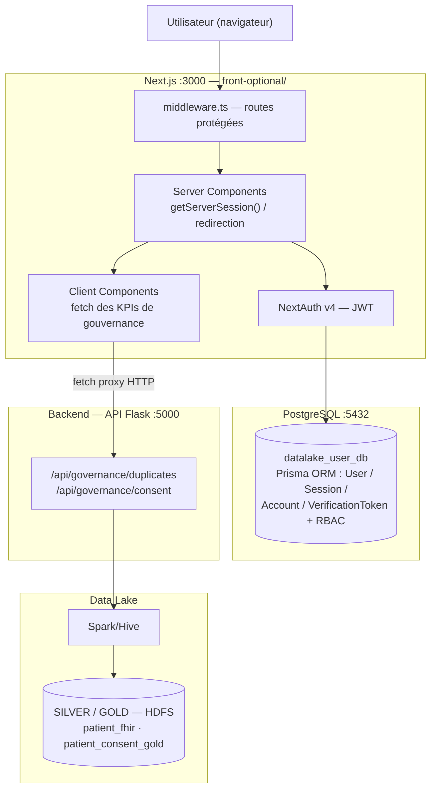

# Guide Frontend — Application de visualisation (Next.js)

Application Web de visualisation du Data Lake (optionnelle, non requise pour le pipeline). Le projet
s'appelle **DataViz Gouvernance** (emplacement consolidé : `projet/code-source/front-optional/`).

## 1. Vue d'ensemble

| Élément | Valeur |
|---|---|
| Emplacement | `projet/code-source/front-optional/` |
| Framework | Next.js 15.4.6 (App Router + Turbopack) |
| Langage | TypeScript 5.9 |
| Styling | Tailwind CSS v4 + shadcn/ui (New York, Zinc) |
| Auth | NextAuth v4 (JWT + Prisma adapter) |
| BDD | PostgreSQL via Prisma ORM |
| Port | 3000 |

## 2. Dépendances et prérequis

- **Node.js 18+** (compatible Next.js 15).
- **PostgreSQL** démarré sur `localhost:5432` (base `datalake_user_db`).
- **Backend API** lancé — `GUIDE/guide-backend.md` (le front interroge `localhost:5000`).

Vérifier Node :
```bash
node --version   # v18.x+ ; npm --version
```

## 3. Installation et démarrage

```bash
cd F:\MBDS\STAGE\PROJECT\Mon_Memoire\projet\code-source\front-optional

# 1. Dépendances
npm install

# 2. Variables d'environnement — créer `.env` à la racine :
#    NEXT_PUBLIC_SERVER_URL=http://localhost:5000
#    NEXT_PUBLIC_GOVERNANCE_API_URL=http://localhost:8000
#    NEXT_PUBLIC_GOVERNANCE_API_KEY=<clé api_user au rôle admin/analyst>
#    DATABASE_URL="postgresql://postgres:<PASSWORD>@localhost:5432/datalake_user_db?schema=public"
#    NEXTAUTH_SECRET=<64 hex aléatoires>
#    NEXTAUTH_URL=http://localhost:3000

# 3. Initialiser PostgreSQL (schéma Prisma)
npx prisma migrate dev --name init

# 4. Peupler les utilisateurs par défaut
npx prisma db seed

# 5. Lancer le serveur de développement
npm run dev
```

Application accessible sur **http://localhost:3000**.

### Comptes par défaut (seed)

| Rôle | Email | Mot de passe |
|---|---|---|
| ADMIN | `dataviz@mmt.mg` | `dataviz` |
| MEDECIN | `medecin@mmt.mg` | `dataviz` |

> Base PostgreSQL requise : `datalake_user_db` (auth). Plus de détails : `front-optional/README.md`.

## 4. Commandes utiles

```bash
npm run dev      # serveur de développement (Turbopack)
npm run build    # build de production
npm run start    # démarrer le build de production
npm run lint     # linter ESLint
```

## 5. Schéma de la BDD (auth)

Le schéma Prisma (`prisma/schema.prisma` + `prisma/seed.js`) définit utilisateurs et sessions
NextAuth. Modèles typiques : `User` (avec `role`), `Account`, `Session`, `VerificationToken`.
Migration initiale : `npx prisma migrate dev --name init`.

## 6. Structure du projet

```
front-optional/
├── prisma/            # schema.prisma · seed.js · migrations/
├── src/
│   ├── app/
│   │   ├── layout.tsx · page.tsx (→ /synthese) · globals.css
│   │   ├── login/     # connexion
│   │   ├── synthese/  # synthèse (déduplication + consentement + chaîne)
│   │   ├── doublons/  # KPIs de déduplication
│   │   ├── gouvernance/ # consentements purpose-by-purpose
│   │   ├── settings/  # paramètres
│   │   ├── users/     # gestion utilisateurs (ADMIN)
│   │   └── api/       # auth (NextAuth) + users (CRUD)
│   ├── components/    # Header · Sidebar · MockedBanner · ui/ (shadcn)
│   ├── lib/           # api.ts (gouvernance) · auth.ts · prisma.ts · rbac.ts · utils.ts
│   └── middleware.ts  # protection des routes
└── ... configs (next.config.ts, tsconfig.json, package.json)
```

## 7. Architecture et flux de données

**Hybride client-serveur** :
1. **Server Components** (`page.tsx`) : vérification `getServerSession()`, redirection si non connecté.
2. **Client Components** (`*Client.tsx`) : interactivité et fetch des KPIs de gouvernance.
3. **Backend externe** : le front proxy ses requêtes vers `localhost:5000` (endpoints
   `/api/governance/*`).

```
Utilisateur → Next.js (port 3000) → API Flask (port 5000) → Spark/Hive Data Lake
                                        └→ PostgreSQL (auth, utilisateurs)
```


```mermaid
flowchart TB
    U["Utilisateur (navigateur)"]

    subgraph NEXT["Next.js :3000 — front-optional/"]
        MID["middleware.ts — routes protégées"]
        SS["Server Components<br/>getServerSession() / redirection"]
        NC["NextAuth v4 — JWT"]
        CC["Client Components<br/>fetch des KPIs de gouvernance"]
    end

    subgraph PGSQL["PostgreSQL :5432"]
        DB[("datalake_user_db<br/>Prisma ORM : User / Session /<br/>Account / VerificationToken + RBAC")]
    end

    subgraph BEND["Backend — API Flask :5000"]
        GOV["/api/governance/duplicates<br/>/api/governance/consent"]
    end

    subgraph DL["Data Lake"]
        HIVE2["Spark/Hive"]
        WAREHOUSE2[("SILVER / GOLD — HDFS<br/>patient_fhir · patient_consent_gold")]
    end

    U --> MID --> SS
    SS --> NC --> DB
    SS --> CC
    CC -->|"fetch proxy HTTP"| GOV --> HIVE2 --> WAREHOUSE2
```

## 8. RBAC

- **NextAuth v4** (JWT) + Prisma adapter.
- Deux rôles : `ADMIN` et `MEDECIN` (définition dans `src/lib/rbac.ts`).
- Middleware protégeant `/settings`, `/synthese`, `/doublons`, `/gouvernance`, `/pipeline`.
- Routes `/users/*` réservées au rôle `ADMIN`. L'édition de la planification (`/pipeline`) est
  réservée au rôle `ADMIN` (lecture ouverte à tout utilisateur connecté).

## 9. Pages

| Route | Contenu | Source API |
|---|---|---|
| `/` | Redirection vers `/synthese` | — |
| `/synthese` | Synthèse : déduplication + consentement + chaîne RAW/SILVER/GOLD | `/api/governance/duplicates`, `/api/governance/consent` |
| `/doublons` | KPIs de déduplication (masters, doublons, taux, méthodes) | `/api/governance/duplicates` |
| `/gouvernance` | Consentements purpose-by-purpose + filtre par finalité | `/api/governance/consent` |
| `/pipeline` | **Pipeline ELT** : planification (fréquence/heure, mode de reprise), état du dernier run, sources suivies | API gouvernance `:8000` — `GET/PUT /pipeline/schedule`, `GET /pipeline/status` |
| `/settings` | Paramètres du compte | — |
| `/users` | Gestion des utilisateurs (admin) | `/api/users` |

Chaque page affiche un bandeau « Données de démonstration » dès que le backend répond
`mocked: true` : aucune valeur n'est présentée comme issue de données réelles.

## 10. Dépannage rapide

| Symptôme | Cause probable | Correctif |
|---|---|---|
| `NEXT_PUBLIC_SERVER_URL` non défini | `.env` manquant | créer `.env` (section 3) puis relancer `npm run dev` |
| Erreur Prisma `database does not exist` | base `datalake_user_db` absente | démarrer PostgreSQL puis `npx prisma migrate dev --name init` |
| KPIs « n/d » + bandeau démo | endpoint backend indisponible / fallback mock | lancer le pipeline SILVER/GOLD (voir `guide-vagrant.md`) |
| Erreur de connexion backend | API Flask éteinte | lancer l'API (voir `guide-backend.md`) |
| Page `/pipeline` en erreur | API gouvernance `:8000` éteinte ou mauvaise clé | lancer `uvicorn engine.governance.app:app` ; vérifier `NEXT_PUBLIC_GOVERNANCE_API_URL/KEY` dans `.env` |
| Auth échoue / 401 | état de session invalide | re-seed : `npx prisma db seed` (comptes par défaut) |

## 11. Suite logique

- Le front consomme les endpoints de l'API → **`GUIDE/guide-backend.md`**.
- Fichiers de référence : `front-optional/README.md`, `front-optional/FONCTIONNALITES.md`,
  `front-optional/structure_interface.md`.