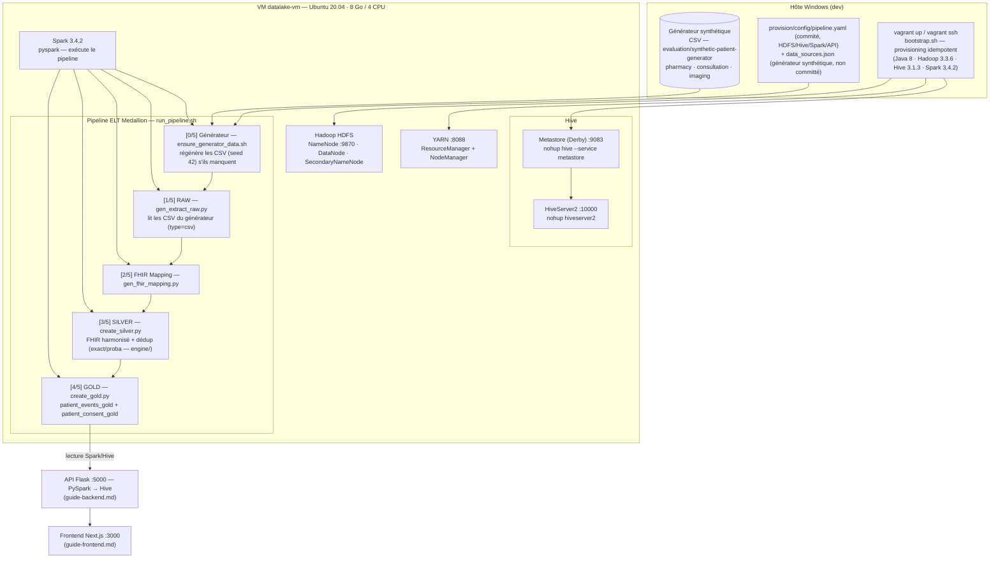

# Guide Vagrant — VM Big Data (Hadoop / Hive / Spark)

Guide complet de démarrage, relance, (ré)initialisation et arrêt de la VM qui porte le pipeline ELT
Medallion (RAW → SILVER → GOLD) de la plateforme.

## 1. Vue d'ensemble

| Caractéristique | Valeur |
|---|---|
| Box | `ubuntu/focal64` |
| Hostname / VM | `datalake-vm` |
| IP privée | `192.168.56.10` |
| RAM / CPU | 8 Go / 4 CPU |
| Stack installée | Java 8, Hadoop 3.3.6, Hive 3.1.3, Spark 3.4.2 |
| Dossier synced | `projet/code-source/` (hôte) ↔ `/home/vagrant/datalake-final` (VM) |
| Ports forwardés | 9870 (HDFS UI), 9864 (Datanode), 8088 (YARN UI), 8042, 10000 (HiveServer2), 5000 (API) |

Emplacement : `Mon_Memoire/projet/code-source/provision/` (`Vagrantfile`, `bootstrap.sh`).

> Le provisioning (`bootstrap.sh`) est **idempotent** (marqueur `~/.provisioned`) : il installe la stack,
> les dépendances Python (`pyspark`, `sshtunnel`, `paramiko`, `rapidfuzz`, `flask`, ...), le driver JDBC
> `postgresql-42.7.3.jar` dans `$SPARK_HOME/jars/`, initialise le Metastore Derby et formate le NameNode.

### Stack complète et flux ELT



## 2. Avertissements importants

| Problème | Impact | Contournement |
|---|---|---|
| **Stockage NameNode dans `/tmp`** | Tout reboot efface le namespace HDFS | Re-formater le NameNode avant chaque démarrage post-reboot |
| **Données HDFS perdues après reboot** | RAW/SILVER/GOLD à refaire | Relancer le pipeline complet (`run_pipeline.sh`) |
| **CSV générateur manquants** | Sources du pipeline absentes | L'étape 0 les régénère (seed 42) ; sinon générer sur l'hôte (`guide-generateur-donnees.md`) |
| **vboxsf ne supporte pas les renames atomiques** | Spark ne peut pas écrire dans le partage | Warehouse Spark **toujours sur HDFS** — ne pas modifier `spark.sql.warehouse.dir` |
| **`pkill -f` tue la commande SSH elle-même** | Session coupée | `pkill -f 'hive' -u vagrant` (ciblé) |

## 3. Initialisation (une seule fois, après `vagrant up` la 1ʳᵉ fois)

```bash
# --- Sur Windows ---
cd F:\MBDS\STAGE\PROJECT\Mon_Memoire\projet\code-source\provision
vagrant up                # provisionne la VM (bootstrap.sh tourne automatiquement)
vagrant ssh               # connexion à la VM

# --- Dans la VM ---
source /etc/profile.d/bigdata.sh   # charge JAVA_HOME, HADOOP_HOME, etc.
```

**Vérification post-init** :
```bash
jps | sort               # doit montrer : NameNode, DataNode, SecondaryNameNode
hive --version            # doit afficher Hive 3.1.3
pyspark --version         # doit afficher Spark 3.4.2
```

> **Avant tout pipeline**, préparer la configuration ELT (non committée) :
> ```bash
> # Sur l'hôte
> cp provision/config/data_sources.example.json provision/config/data_sources.json
> # Pas d'édition requise : sources = CSV du générateur synthétique (seed 42).
> # Sources avancées MAVIS/MMT_DB : voir config/data_sources.mavis.example.json.
> ```
>
> `pipeline.yaml` (chemins HDFS, bases Hive, tables, mémoire Spark, tranches d'âge, port API) et
> `fhir_entities.json` (schéma FHIR + synonymes + mapping table→entité) sont **commités** : aucun
> copie ni édition requise pour un lancement par défaut. Seule `data_sources.json` est à créer.
> Le chemin `dir` des sources CSV utilise le token `{PROJECT_ROOT}` (résolu par `paths.expand_path`),
> ex. `{PROJECT_ROOT}/evaluation/synthetic-patient-generator/data/raw/pharmacy`.

## 4. Démarrage complet (après un reboot de la VM)

### Étape 1 — Démarrer la VM (sur Windows)
```bash
cd F:\MBDS\STAGE\PROJECT\Mon_Memoire\projet\code-source\provision
vagrant up
vagrant ssh
```

### Étape 2 — Re-formater le NameNode (obligatoire après chaque reboot)
> `/tmp/hadoop-vagrant/dfs/name` est vidé au reboot → le NameNode refuse de démarrer sans reformat.
```bash
hdfs namenode -format -force -nonInteractive
```

### Étape 3 — Démarrer Hadoop + YARN (ordre strict)
```bash
start-dfs.sh          # NameNode :9870, DataNode :9866
start-yarn.sh         # ResourceManager :8088, NodeManager
```
Vérifier les 5 processus : `jps | sort` → `NameNode, DataNode, SecondaryNameNode, ResourceManager, NodeManager`.

### Étape 4 — Démarrer le Metastore + HiveServer2
> Double-fork `(nohup ... &)` pour que les processus survivent à la fermeture de la session SSH.
```bash
# Metastore (port :9083) — d'abord
(bash -c 'nohup hive --service metastore > /tmp/metastore.log 2>&1 &')
sleep 30    # attente obligatoire

# HiveServer2 (port :10000)
(bash -c 'nohup hiveserver2 > /tmp/hs2.log 2>&1 &')
sleep 30    # attente obligatoire
```
Vérification :
```bash
jps | grep RunJar     # 2 processus RunJar (metastore + HS2)
beeline -u jdbc:hive2://localhost:10000 -n vagrant --silent=true -e 'SHOW DATABASES;'
```

### Étape 5 — Données du générateur synthétique (automatique)
Le pipeline garantit ses données à l'**étape 0** (`ensure_generator_data.sh`) : si un CSV manque,
la source concernée est régénérée avec le seed fixe 42 (déterministe).
- Volume : réglable via `GENERATOR_PATIENTS` (défaut 500 patients maîtres).
- Sources : `evaluation/synthetic-patient-generator/data/raw/{pharmacy,consultation,imaging}/`.
- Générateur schématique : `GUIDE/guide-generateur-donnees.md`.

> **MMT_DB (PostgreSQL Laragon) et MAVIS (distant)** restent **optionnels** : à activer seulement avec
> `config/data_sources.mavis.example.json`. Le tunnel SSH MAVIS (`102.16.7.154:8090` → pg 5433 local)
> est géré par `gen_extract_raw.py` (`sshtunnel`). Sans ces sources, le pipeline tourne sur le générateur seul.

### Étape 6 — Lancer le pipeline ELT complet
```bash
# Dans la VM
cd ~/datalake-final

# Option A — mode simple (étape 0 = données générateur intégrées) :
bash provision/scripts/run_pipeline.sh
# Option B — arrière-plan :
nohup bash provision/scripts/run_pipeline.sh > /tmp/pipeline.log 2>&1 &
# Option C — pas-à-pas avec log (étape 0 automatique incluse) :
bash provision/scripts/ensure_generator_data.sh
/home/vagrant/api-venv/bin/python -m provision.scripts.ELT.gen_extract_raw 2>&1 | tee -a provision/logs/elt.log
/home/vagrant/api-venv/bin/python -m provision.scripts.ELT.gen_fhir_mapping 2>&1 | tee -a provision/logs/elt.log
/home/vagrant/api-venv/bin/python -m provision.scripts.ELT.create_silver 2>&1 | tee -a provision/logs/elt.log
/home/vagrant/api-venv/bin/python -m provision.scripts.ELT.create_gold  2>&1 | tee -a provision/logs/elt.log
```
Suivre : `tail -f ~/datalake-final/provision/logs/elt.log`.

**Durées typiques** (VM 8 Go / 4 CPU, 500 patients maîtres) :
| Étape | Durée approx. |
|---|---|
| [0/5] Données générateur (étape 0) | < 1 min (skip si présentes) |
| [1/5] Extraction RAW (CSV) | 1–2 min |
| [2/5] FHIR Mapping | < 1 min |
| [3/5] Transformation SILVER | 1–2 min |
| [4/5] Création GOLD | 5–8 min |

> `WARN NativeCodeLoader` / `WARN Utils: hostname resolves to loopback` = **warnings normaux**, pas des erreurs.

### Étape 7 — Valider les résultats
```sql
-- Via beeline (dans la VM)
beeline -u jdbc:hive2://localhost:10000 -n vagrant --silent=true --outputformat=tsv2 \
  -e "SELECT \`_source_table\`, COUNT(*) AS nb FROM datalake_silver.encounter_fhir GROUP BY \`_source_table\` ORDER BY nb DESC;"
beeline -u jdbc:hive2://localhost:10000 -n vagrant --silent=true --outputformat=tsv2 \
  -e "SELECT COUNT(*) AS events FROM datalake_gold.patient_events_gold;"
```
Référence du run consolidé (07/09/2026) : **SILVER patient = 214 lignes** (76 pharmacy + 76 consultation +
62 imaging), **145 masters**, **69 doublons** (`is_duplicate`, `match_method=exact`), GOLD
`patient_consent_gold` = 145 lignes. Depuis le branchement des tables d'événements du générateur,
SILVER contient aussi `encounter_fhir` (achats + consultations + examens) et GOLD alimente
`patient_events_gold`. Métadonnées : `cat provision/metadata/sync_metadata.json`.

### Étape 8 — Arrêt propre
```bash
# Dans la VM
pkill -f 'hive' -u vagrant    # tue metastores/HS2 seulement
sleep 3
stop-yarn.sh
stop-dfs.sh
exit
# Sur Windows
vagrant halt
```

## 5. Réinitialisation complète (reset total)

À utiliser si : repartir de zéro, données corrompues/incohérentes, `data_sources.json` modifié,
bases Hive obsolètes.

1. **Stopper les services** : `pkill -f 'hive' -u vagrant` ; `sleep 3` ; `stop-yarn.sh` ; `stop-dfs.sh`.
2. **Purger les bases Hive** :
   ```bash
   hive -e "DROP DATABASE IF EXISTS datalake_silver CASCADE;"
   hive -e "DROP DATABASE IF EXISTS datalake_gold CASCADE;"
   hive -e "DROP DATABASE IF EXISTS datalake_raw CASCADE;"
   ```
3. **Nettoyer le metastore Derby (optionnel)** :
   ```bash
   rm -rf ~/metastore_db && cd ~/hive && schematool -dbType derby -initSchema && cd ~
   ```
4. **Re-formater le NameNode** :
   ```bash
   rm -rf /tmp/hadoop-vagrant/dfs
   hdfs namenode -format -force -nonInteractive
   ```
5. **Relancer la pile complète** (époques 2–6 de la section 4) puis le pipeline.
6. **Vérifier** : `SHOW DATABASES` (bases recréées) + comptages.

## 6. Relance partielle (SILVER + GOLD uniquement)

Si l'extraction RAW est déjà faite (pas besoin de retélécharger) :
```bash
cd ~/datalake-final
/home/vagrant/api-venv/bin/python -m provision.scripts.ELT.create_silver
/home/vagrant/api-venv/bin/python -m provision.scripts.ELT.create_gold
```

## 7. Fichiers clés

| Fichier (dans `projet/code-source/provision/`) | Rôle |
|---|---|
| `bootstrap.sh` | Installation unique de la stack (idempotent via `~/.provisioned`) |
| `Vagrantfile` | Définition de la VM + synced folder + ports |
| `scripts/run_pipeline.sh` | Orchestrateur des 5 étapes ELT (arrêt sur erreur) |
| `scripts/ensure_generator_data.sh` | Étape 0 : régénère les CSV du générateur (seed 42) si absents |
| `scripts/ELT/gen_extract_raw.py` | Étape 1 : sources → parquet HDFS (postgres/sqlite/CSV) |
| `scripts/ELT/gen_fhir_mapping.py` | Étape 2 : colonnes → mapping FHIR |
| `scripts/ELT/create_silver.py` | Étape 3 : RAW → SILVER (FHIR harmonisé + dédup moteur `engine/`) |
| `scripts/ELT/create_gold.py` | Étape 4 : SILVER → GOLD (analytique + consentement) |
| `config/data_sources.json` | Sources (générateur synthétique par défaut) — **non committé** |
| `config/pipeline.yaml` | Configuration pipeline (HDFS, Hive, tables, Spark, API) — **commité**, tunable |
| `config/fhir_entities.json` | Schéma FHIR + synonymes + mapping table→entité — **commité**, tunable |
| `api/hive_api.py` | API Flask (voir `guide-backend.md`) |
| `test_startup.sh` | Health check Vagrant/Hive/API/métadonnées |

## 8. Ports

| Service | Port | Usage |
|---|---|---|
| HDFS NameNode UI | 9870 | Interface web Hadoop |
| YARN ResourceManager UI | 8088 | Interface web YARN |
| Hive Metastore | 9083 | Thrift metastore (Derby) |
| HiveServer2 | 10000 | JDBC/Beeline |
| Flask API | 5000 | API JSON (frontend) |
| PostgreSQL MMT_DB | 5432 | Optionnel (sources avancées — Laragon) |
| Tunnel MAVIS | 8090 (distant) | Optionnel (sources avancées) |

## 9. Dépannage rapide

| Symptôme | Cause probable | Correctif |
|---|---|---|
| `NameNode` refuse de démarrer | namespace `/tmp/hadoop-vagrant/dfs/name` vidé | `hdfs namenode -format -force -nonInteractive` |
| Spark écrit sur vboxsf / erreurs de rename | warehouse sur partage | remettre `spark.sql.warehouse.dir = hdfs://localhost:9000/...` |
| `beeline` ne répond pas | HS2 pas (re)démarré | revoir étape 4 (metastore puis HS2, `sleep 30`) |
| SILVER explosé (nb lignes = carré) | mapping dynamique capture une clé intra-table (ex. `patient_uuid`) | exclure la colonne de jointure du mapping FHIR ; valider par `check_data.py` |
| Pipeline bloqué | `JAVA_HOME` mal défini (`\bin` en trop) | `_resolve_java_home()` normalise (déjà intégré) |

## 10. Suite logique

- Une fois le GOLD produit → **API Flask** : `GUIDE/guide-backend.md`.
- Pour le **frontend** : `GUIDE/guide-frontend.md`.