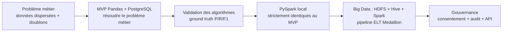

# Chapitre 1 — Introduction

> **Statut** : rédigé (07/09/2026)

## Objectif

Présenter le contexte du stage, la problématique métier (centralisation de données patients
multi-sources, qualité et identité), les objectifs du projet et la démarche générale suivie
(approche en 3 niveaux : MVP → Spark → Big Data).

---

## 1.1 Contexte de l'organisme d'accueil

Ce stage de Master 2 MBDS (spécialité Big Data) se déroule au sein de **Madagascar Medical
Technology (MMT)**. La société intervient dans le domaine de la santé à Madagascar et exploite
des systèmes d'information médicaux : on retrouve dans les configurations du projet des bases de
gestion hospitalière fondées sur GNU Health (tables `gnuhealth_patient`, `party_party`,
`gnuhealth_family` de la base MMT_DB) ainsi qu'une plateforme de gestion hospitalière distante
(`mavis_notheme`, 11 tables dont `hms_patient`, `res_partner`, `hms_diseases`)
[cahier_des_charges.md §1 et §6].

Comme la plupart des organisations de santé, l'établissement fait coexister **plusieurs systèmes
d'information indépendants** : consultations, pharmacies, laboratoires, imagerie, dossiers
médicaux. Chacun possède sa propre base, son propre format et ses propres identifiants
[cahier_des_charges.md §1].

## 1.2 Problématique métier

Le même patient est enregistré dans plusieurs systèmes, **sous des formes différentes** :

```text
Pharmacie     → Jean Rakoto · 0341234567 · 1990-01-10
Consultation  → Rakoto Jean · +261341234567 · 10/01/1990
Imagerie      → J. RAKOTO · 034 123 4567 · 1990/01/10
```

Exemple réel du cas de référence de la plateforme : les trois enregistrements ci-dessus
représentent une seule et même personne [deduplication.md §7].

Cette situation pose trois problèmes concrets :

1. **Dispersion** : les données d'un patient sont réparties entre plusieurs fichiers et bases,
   sans vue globale.
2. **Hétérogénéité** : identifiants, libellés et formats diffèrent (le genre apparaît tour à tour
   sous les formes `H/F`, `male/female`, `Homme/femme` selon la source) — voir chapitre 3.
3. **Absence de gouvernance** : rien ne garantit qui peut accéder à quelle donnée, pour quelle
   finalité, et dans quelles conditions.

Les conséquences sont des risques d'erreurs médicales (dossier éclaté), des difficultés
d'analyse (agrégats faux en présence de doublons) et des failles de confidentialité.

> **Problématique** : comment concevoir une plateforme capable d'intégrer, nettoyer, dédupliquer
> et centraliser des données patients issues de sources hétérogènes, tout en assurant la
> traçabilité des identités et la gouvernance des accès basée sur le consentement du patient ?
> [cahier_des_charges.md §1]

## 1.3 Objectifs

| # | Objectif | Illustration concrète |
|---|---|---|
| 1 | **Centraliser** les données dans une architecture Big Data | pipeline ELT Medallion RAW → SILVER → GOLD [cahier_des_charges.md §4.1] |
| 2 | **Nettoyer et standardiser** selon un modèle commun | modèle canonique `CanonicalPatient` côté déduplication, schéma pivot FHIR côté ELT [cahier_des_charges.md §7] |
| 3 | **Dédupliquer** avec une logique toujours explicable | master patient, identity map, score + méthode + seuil [cahier_des_charges.md §4.2] |
| 4 | **Gouverner les accès** | rôles (RBAC), consentement *purpose-by-purpose*, audit d'accès, clés API hachées [cahier_des_charges.md §4.3] |
| 5 | **Visualiser** les indicateurs | dashboard RMA (frontend considéré optionnel) [cahier_des_charges.md §4.5] |
| 6 | **Évaluer** la déduplication | vérité terrain (ground truth), précision / rappel / F1 [cahier_des_charges.md §4.4 / §8] |

Les données manipulées sont **exclusivement synthétiques** : la confidentialité est un actif du
projet, pas un obstacle de démonstration [AGENTS.md].

## 1.4 Démarche : une progression en trois niveaux

Le projet ne part pas d'un besoin de « Big Data pour le Big Data ». Il suit une approche
progressive, chaque technologie étant introduite **par besoin** :



| Niveau | Contenu | Légitimité |
|---|---|---|
| **1 — MVP** | CSV + Pandas + PostgreSQL : extraction, nettoyage, déduplication, master patient, dashboard | résoudre le problème métier d'abord, au plus simple |
| **2 — Spark** | PySpark local, résultats **strictement identiques** au MVP (parité vérifiée) | passer à l'échelle sans changer la logique métier |
| **3 — Big Data** | Data Lake + HDFS + Hive + Spark, pipeline ELT Medallion 4 étapes, API Flask | traiter des volumes réels dans une architecture médicale |

Les deux premiers niveaux proviennent du PoC `test_bigdata`, le troisième du PoC `datalake_mavis`.
Ce dépôt unique en est la **fusion consolidée** : un seul dépôt, une seule
documentation, le moteur de déduplication porté dans `engine/`, l'évaluation ground-truth et le
consentement intégré à la couche GOLD [cahier_des_charges.md §10].

## 1.5 Périmètre et livrables

Périmètre fonctionnel couvert par ce stage :

- pipeline ELT Big Data en 4 étapes (RAW → mapping FHIR → SILVER → GOLD), orchestré par
  `run_pipeline.sh`, logs `elt.log`, suivi `sync_metadata.json` [cahier_des_charges.md §4.1] ;
- moteur de déduplication exact + probabiliste (seuil 0.80, pondération nom 0.5 / naissance 0.3 /
  téléphone 0.2), implémenté en Pandas **et** en PySpark [cahier_des_charges.md §4.2] ;
- gouvernance : RBAC, consentement par finalité, audit d'accès, clés API hachées SHA-256
  [cahier_des_charges.md §4.3] ;
- deux API REST : données (Flask, endpoints `/rma/*`) et gouvernance (lecture seule) ;
- évaluation de la déduplication sur données synthétiques easy / medium / hard.

Hors périmètre (assumés comme tels) : frontend Next.js (optionnel), export VM `.box`, Docker/CI.

## 1.6 Contexte chiffré (repères)

Les principaux chiffres vérifiables, détaillés dans les chapitres 3 à 6, sont :

- **Générateur** : 500 patients maîtres, 1 057 enregistrements répartis sur 3 sources
  (pharmacy 404, consultation 353, imaging 300), 3 niveaux de difficulté (easy 10 % / medium 30 % /
  hard 50 % de variations) [synthetic-patient-generator].
- **Évaluation (dataset hard)** : Precision **1.000**, Recall **0.287**, F1 **0.447**, zéro faux
  positif, parité MVP = Spark parfaite [evaluation_truth.md].
- **Pipeline fusion** (run 07/09/2026, sources CSV synthétiques) : 4/4 vert, SILVER `patient_fhir`
  **214** lignes, **145** masters, **69** doublons liés, GOLD consentements 145, API **14/14 PASS**
  sur données réelles [ai/memoire/contexte_projet.md].

## 1.7 Plan du mémoire

| Chapitre | Contenu |
|---|---|
| **2 — État de l'art** | Entity Resolution / Master Patient Index, mesures de similarité, FHIR, architecture Big Data (Medallion, HDFS, Hive, Spark), consentement et RGPD |
| **3 — Analyse** | sources hétérogènes, générateur de données synthétiques avec vérité terrain, exigences et contraintes |
| **4 — Conception** | architecture 3 niveaux, modèle canonique, algorithmes de déduplication, schéma PostgreSQL, gouvernance |
| **5 — Réalisation** | implémentation : générateur, pipeline ELT, moteur (Pandas/Spark), interfaces, Data Lake |
| **6 — Tests & évaluation** | stratégie de test, évaluation ground-truth, difficultés rencontrées, limites |

## Conclusion et transition

La problématique posée, les objectifs fixés et la démarche en trois niveaux définissent la feuille
de route. Il nous faut maintenant situer cette plateforme par rapport aux concepts et standards
existants : c'est l'objet de l'état de l'art au chapitre 2 (entity resolution, Master Patient Index,
FHIR, architectures Big Data et cadre du consentement).