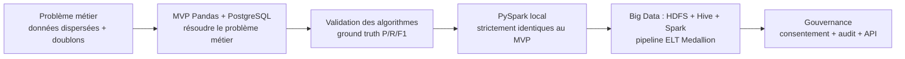

# Chapitre 1 — Introduction

> **Statut** : rédigé (07/09/2026, actualisé 27/09/2026)

## Objectif

Présenter le contexte du stage, la problématique métier (centralisation de données patients
multi-sources, qualité et identité), les objectifs du projet et la démarche générale suivie
(approche en 3 niveaux : MVP → Spark → Big Data).

---

## 1.1 Contexte de l'organisme d'accueil

Ce stage de Master 2 MBDS (spécialité Big Data) se déroule au sein de **Madagascar Medical
Technology (MMT)**. La société intervient dans le domaine de la santé à Madagascar et exploite
des systèmes d'information médicaux : on retrouve dans les configurations du projet des bases de
gestion hospitalière fondées sur GNU Health (tables `gnuhealth_patient`, `party_party`,
`gnuhealth_family` de la base MMT_DB) ainsi qu'une plateforme de gestion hospitalière distante
(`mavis_notheme`, 11 tables dont `hms_patient`, `res_partner`, `hms_diseases`)
[cahier_des_charges.md §1 et §6].

Comme la plupart des organisations de santé, l'établissement fait coexister **plusieurs systèmes
d'information indépendants** : consultations, pharmacies, laboratoires, imagerie, dossiers
médicaux. Chacun possède sa propre base, son propre format et ses propres identifiants
[cahier_des_charges.md §1].

## 1.2 Problématique métier

Le même patient est enregistré dans plusieurs systèmes, **sous des formes différentes** :

```text
Pharmacie     → Jean Rakoto · CIN 101 02404 5 · 1990-01-10
Consultation  → Rakoto Jean · 101024045 · 10/01/1990
Imagerie      → J. RAKOTO · 101024045 · 1990/01/10
```

Exemple réel du cas de référence de la plateforme : les trois enregistrements ci-dessus
représentent une seule et même personne [deduplication.md §7].

Cette situation pose trois problèmes concrets :

1. **Dispersion** : les données d'un patient sont réparties entre plusieurs fichiers et bases,
   sans vue globale.
2. **Hétérogénéité** : identifiants, libellés et formats diffèrent (le genre apparaît tour à tour
   sous les formes `H/F`, `male/female`, `Homme/femme` selon la source) — voir chapitre 4.
3. **Absence de gouvernance** : rien ne garantit qui peut accéder à quelle donnée, pour quelle
   finalité, et dans quelles conditions.

Les conséquences sont des risques d'erreurs médicales (dossier éclaté), des difficultés
d'analyse (agrégats faux en présence de doublons) et des failles de confidentialité.

> **Problématique** : comment concevoir une plateforme capable d'intégrer, nettoyer, dédupliquer
> et centraliser des données patients issues de sources hétérogènes, tout en assurant la
> traçabilité des identités et la gouvernance des accès basée sur le consentement du patient ?
> [cahier_des_charges.md §1]

## 1.3 Objectifs

Six mots reviennent dans tous les chapitres. Ils sont expliqués ici en français courant ; le
**glossaire (chapitre 9)** reprend l'ensemble du vocabulaire employé.

- **ELT** : on **charge** d'abord les fichiers tels quels, on **transforme** ensuite — l'inverse
  d'un ETL classique, où l'on transforme avant d'écrire.
- **Medallion** : ranger la donnée dans trois zones de qualité croissante — **RAW** (brut,
  inchangé) → **SILVER** (nettoyé, standardisé) → **GOLD** (prêt à analyser).
- **MPI** : l'annuaire qui reconnaît qu'un patient est le même d'un système à l'autre, et lui
  attribue un identifiant unique.
- **Déduplication** : rapprocher les fiches identiques dispersées dans plusieurs systèmes, en
  pouvant **expliquer** chaque fusion.
- **RBAC** : les droits d'accès sont portés par un **rôle** (`admin`, `analyst`, `viewer`), pas
  par une personne.
- **Consentement par finalité** : le patient autorise **un usage précis** (`api_access`,
  `research`, `analytics`) — c'est le *purpose-by-purpose*.

**Tableau 1 — Les six objectifs du cahier des charges et l'illustration concrète retenue pour chacun d'eux.**

| # | Objectif | Illustration concrète |
|---|---|---|
| 1 | **Centraliser** les données dans une architecture Big Data | pipeline ELT Medallion RAW → SILVER → GOLD [cahier_des_charges.md §4.1] |
| 2 | **Nettoyer et standardiser** selon un modèle commun | modèle canonique `CanonicalPatient` côté déduplication, schéma pivot FHIR côté ELT [cahier_des_charges.md §7] |
| 3 | **Dédupliquer** avec une logique toujours explicable | master patient, identity map, score + méthode + seuil [cahier_des_charges.md §4.2] |
| 4 | **Gouverner les accès** | rôles (RBAC), consentement *purpose-by-purpose*, audit d'accès, clés API hachées [cahier_des_charges.md §4.3] |
| 5 | **Visualiser** les indicateurs | dashboard RMA (frontend considéré optionnel) [cahier_des_charges.md §4.5] |
| 6 | **Évaluer** la déduplication | vérité terrain (ground truth), précision / rappel / F1 [cahier_des_charges.md §4.4 / §8] |

Les données manipulées sont **exclusivement synthétiques** : la confidentialité est un actif du
projet, pas un obstacle de démonstration [AGENTS.md].

## 1.4 Démarche : une progression en trois niveaux

Le projet ne part pas d'un besoin de « Big Data pour le Big Data ». Il suit une approche
progressive, chaque technologie étant introduite **par besoin** :


```mermaid
flowchart LR
    P[Problème métier<br/>données dispersées + doublons] --> M[MVP Pandas + PostgreSQL<br/>résoudre le problème métier]
    M --> V[Validation des algorithmes<br/>ground truth P/R/F1]
    V --> S[PySpark local<br/>strictement identiques au MVP]
    S --> B[Big Data : HDFS + Hive + Spark<br/>pipeline ELT Medallion]
    B --> G[Gouvernance<br/>consentement + audit + API]
```

> **Figure 1 — La démarche du projet : six étapes, chacune introduite par un besoin. La
> validation des algorithmes conditionne le passage à l'échelle, la gouvernance vient
> s'appuyer sur la zone GOLD.**

Le **niveau 1 — MVP** utilise CSV, Pandas et PostgreSQL pour l'extraction, le nettoyage, la
déduplication et le master patient, afin de résoudre le problème métier d'abord, au plus
simple. Le **niveau 2 — Spark** passe à PySpark local avec des résultats **strictement
identiques** au MVP, la parité étant vérifiée : passer à l'échelle sans changer la logique
métier. Le **niveau 3 — Big Data** mobilise le Data Lake, HDFS, Hive et Spark, un pipeline
ELT Medallion en 4 étapes et une API Flask, pour traiter des volumes réels dans une
architecture médicale. Deux volets sont enfin **transverses** : la validation des
algorithmes (vérité terrain, précision / rappel / F1), puis la gouvernance (consentement,
audit, API) — on ne passe pas à l'échelle ni on n'ouvre les accès avant que la preuve soit
verte.

Le schéma ci-dessus détaille ces deux étapes transverses : la **validation des algorithmes**, qui
conditionne le passage à Spark, et la **gouvernance**, traitée en dernier car elle s'appuie sur
la zone GOLD. Ce ne sont pas des niveaux de technologie, mais deux moments où l'on s'arrête
pour vérifier avant d'aller plus loin.

Les deux premiers niveaux proviennent du PoC `test_bigdata`, le troisième du PoC `datalake_mavis`.
Ce dépôt unique en est la **fusion consolidée** : un seul dépôt, une seule
documentation, le moteur de déduplication porté dans `engine/`, l'évaluation ground-truth et le
consentement intégré à la couche GOLD [cahier_des_charges.md §10].

## 1.5 Périmètre et livrables

Périmètre fonctionnel couvert par ce stage :

- pipeline ELT Big Data en 4 étapes (RAW → mapping FHIR → SILVER → GOLD), orchestré par
  `run_pipeline.sh`, logs `elt.log`, suivi `sync_metadata.json` [cahier_des_charges.md §4.1] ;
- moteur de déduplication exact + probabiliste (seuil 0.80, pondération nom 0.5 / naissance 0.3 /
  CIN 0.1 / ville de naissance 0.1), implémenté en Pandas **et** en PySpark [cahier_des_charges.md §4.2] ;
- gouvernance : RBAC, consentement par finalité, audit d'accès, clés API hachées SHA-256
  [cahier_des_charges.md §4.3] ;
- deux API REST : données (**Flask**, endpoints `/rma/*`, sur les données GOLD) et gouvernance
  (**FastAPI**, lecture seule, avec contrôle de consentement) ;
- évaluation de la déduplication sur données synthétiques easy / medium / hard.

Hors périmètre (assumés comme tels) : frontend Next.js du PoC (le dashboard de démonstration
n'a pas été repris dans le dépôt consolidé), export VM `.box`, Docker/CI.

## 1.6 Contexte chiffré (repères)

Les principaux chiffres vérifiables, détaillés dans les chapitres 4 à 7, sont :

- **Générateur** : 500 patients maîtres, 1 057 enregistrements répartis sur 3 sources
  (pharmacy 404, consultation 353, imaging 300), 3 niveaux de difficulté (easy 10 % / medium 30 % /
  hard 50 % de variations) [synthetic-patient-generator].
- **Évaluation (dataset hard)** : Precision **1.000**, Recall **0.422**, F1 **0.594**, zéro faux
  positif, parité MVP = Spark parfaite [evaluation_truth.md].
- **Pipeline fusion** (run 07/09/2026, sources CSV synthétiques) : 4/4 vert, SILVER `patient_fhir`
  **214** lignes, **145** masters, **69** doublons liés, GOLD consentements 145, API **14/14 PASS**
  sur données réelles [ai/memoire/contexte_projet.md].

## 1.7 Plan du mémoire

**Tableau 2 — Le plan du mémoire : neuf chapitres, du contexte de l'organisme au glossaire, puis bibliographie et annexes.**

| Partie | Contenu |
|---|---|
| **1 — Introduction** | contexte de l'organisme, problématique, objectifs, démarche, périmètre et repères chiffrés |
| **2 — État de l'art** | Entity Resolution / Master Patient Index, mesures de similarité, FHIR, architecture Big Data (Medallion, HDFS, Hive, Spark), consentement et RGPD |
| **3 — Étude de l'existant** | systèmes d'information en place à MMT (MAVIS, MMT_DB, CLINIQUE) et leurs limites ; solutions du domaine (MPI/DMP, MDM, Data Lake santé, open source) ; grille de comparaison et verdict |
| **4 — Analyse** | sources hétérogènes, générateur de données synthétiques avec vérité terrain, exigences et contraintes, rôles et parties prenantes, cas d'utilisation, gestion de la configuration, budget |
| **5 — Conception et architecture** | architecture technique en trois niveaux et bout-en-bout, modèle canonique, algorithmes de déduplication, schéma PostgreSQL, gouvernance |
| **6 — Réalisation** | implémentation : générateur, pipeline ELT, moteur (Pandas/Spark), interfaces, Data Lake |
| **7 — Tests & évaluation** | stratégie de test, évaluation ground-truth, difficultés rencontrées, limites |
| **8 — Conclusion générale** | réponse à la problématique, arbitrages, limites assumées, perspectives, bilan pour la formation |
| **9 — Glossaire** | le vocabulaire du projet expliqué en français courant, et les objets du dépôt (tables, scripts, couches) |

La bibliographie et les **annexes** (A à F : pipeline, base centrale, moteur de rapprochement,
API de gouvernance, API RMA, données synthétiques) suivent ces neuf chapitres, comme dans les
deux rapports de référence.

## Conclusion et transition

La problématique posée, les objectifs fixés et la démarche en trois niveaux définissent la feuille
de route. Il faut d'abord situer cette plateforme par rapport aux concepts et standards
existants : c'est l'objet de l'**état de l'art** (chapitre 2 — entity resolution, Master Patient
Index, FHIR, architectures Big Data, cadre du consentement), puis examiner **ce qui existe déjà**
au chapitre 3 — les systèmes de l'établissement et les solutions du marché. Le chapitre 4 analyse
ensuite le besoin de façon opérationnelle.