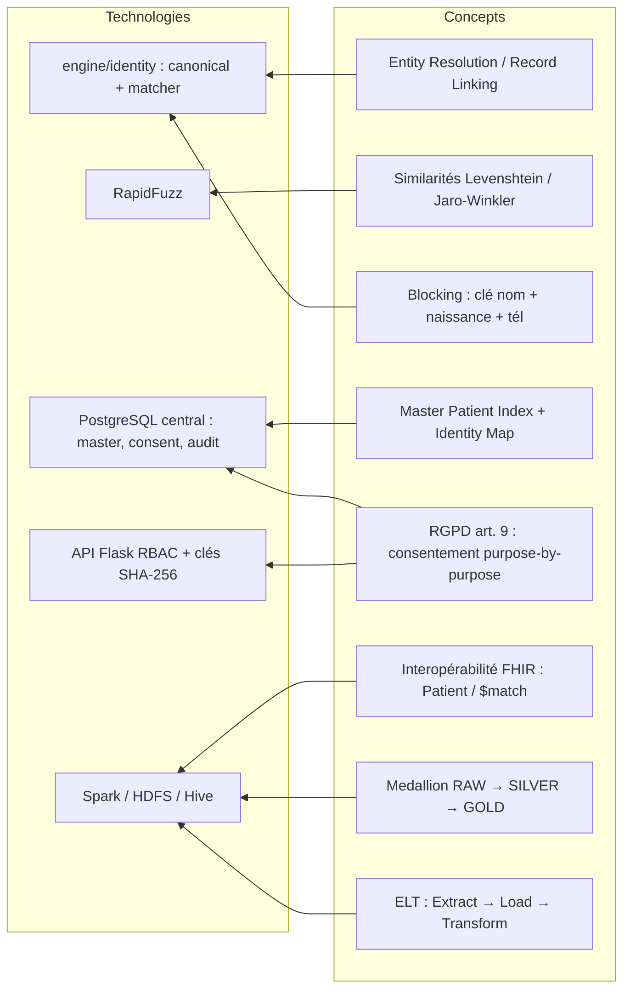

# Chapitre 2 — État de l'art

> **Statut** : rédigé (08/09/2026)

## Objectif

Situer la plateforme par rapport aux concepts et standards existants : Entity
Resolution et Record Linkage (historique, définitions, mesures de similarité,
blocking), Master Patient Index (MPI) et interopérabilité FHIR, architectures Big
Data (HDFS, MapReduce, Spark, Hive, Data Lake Medallion) et cadre juridique du
consentement sur les données de santé. Chaque concept est relié au rôle qu'il joue
dans le projet, conformément au document conceptuel
[`bigdata_concepts.md`](../documents/documentation/bigdata_concepts.md).

---

## 2.1 Entity Resolution et Record Linkage

Le problème central du projet — déterminer si des enregistrements issus de sources
différentes désignent la même personne — porte un nom générique : **Entity Resolution**
(ER), également appelé *record linkage*, *data matching*, *duplicate detection* ou
*fusion de doublons* selon les communautés [B1], [B3].

Les fondements théoriques datent de 1969 : **Fellegi et Sunter** formalisent la
décision d'appariement de deux enregistrements en comparant leurs champs et en
concluant à un match, un non-match ou un match indéterminé
(« possible match ») [B2]. Ce modèle probabiliste est encore la référence des
systèmes d'ER modernes [B1].

Le processus générique, décrit par Elmagarmid et al. [B1] et détaillé par Christen
[B3], se décompose en étapes :

| Étape | Rôle | Application dans le projet |
|---|---|---|
| **Prétraitement** | nettoyer, standardiser les champs | `CanonicalPatient` : casse, accents, téléphones, dates [deduplication.md §3] |
| **Indexation (blocking)** | réduire les comparaisons en groupes de candidats | préfixe nom, année de naissance, préfixe téléphone [deduplication.md §4] |
| **Comparaison** | mesurer la similarité champ à champ | RapidFuzz, score pondéré [deduplication.md §5] |
| **Classification** | décider match / non-match | seuil 0.80, exact puis probabiliste [deduplication.md §5] |
| **Évaluation** | mesurer la qualité sur une vérité terrain | ground truth P/R/F1 [evaluation.md] |

Le résultat attendu de l'ER est une **réconciliation d'identités** : un patient
présent sous plusieurs formes dans plusieurs systèmes doit être reconnu comme une
seule entité physique, sans fusion erronée de personnes distinctes — c'est
l'équilibre **précision vs rappel** propre au domaine.

> **Point de vocabulaire.** Entity Resolution = déterminer si deux enregistrements
> désignent la même entité [B1] ; le résultat produit un **golden record** (fiche
> consolidée) et une **identity map** (table de correspondance traçable).

## 2.2 Mesures de similarité

Deux chaînes qui désignent la même personne diffèrent rarement d'un seul caractère :
les variantes *Jean Rakoto* / *Rakoto Jean* / *J. RAKOTO* imposent de comparer des
chaînes de caractères, pas seulement des égalités.

Les mesures classiques du domaine [B1], [B3] :

| Mesure | Principe | Usage typique |
|---|---|---|
| **Levenshtein** | distance d'édition : nombre minimal d'insertions / suppressions / substitutions | nom, prénom |
| **OSA (optimal string alignment)** | Levenshtein + transposition de deux caractères adjacents (souvent qualifié de « Damerau » en pratique) | fautes de frappe |
| **Jaro–Winkler** | similarité orientée début de chaînes (préfixe commun pondéré) | initiales, noms tronqués |
| **Token-based** (`fuzz.ratio`, `token_sort_ratio`) | comparaison des séquences de mots, indépendante de l'ordre | *Rakoto Jean* vs *Jean Rakoto* |

Le projet utilise **RapidFuzz**, bibliothèque Python/C++ MIT qui implémente ces
mesures avec un processeur rapide et un fallback pur Python [B4]. Son intérêt
décisif est **opérationnel** : léger, compatible Python 3.8 (indispensable sur la
VM), sans dépendance NLP lourde — le recours à `sentence_transformers` a été
explicitement **interdit** (crash sous Python 3.8) [bigdata_concepts.md §8].

Le score combine trois champs **pondérés** et **configurables** [deduplication.md §5] :

| Critère | Poids |
|---|---:|
| Nom | 0.50 |
| Date de naissance | 0.30 |
| Téléphone | 0.20 |

Décision : **score ≥ 0.80 → fusion automatique**, sinon pas de fusion (aucune
logique arbitraire). Les deux valeurs — pondérations et seuil — sont calibrées sur
le cas de référence « Jean Rakoto » et vérifiées par évaluation ; sur le jeu de
difficulté « hard », la similarité seule plafonne le rappel autour de **0.287**
(F1 0.447, précision 1.000) — voir chapitre 6 [evaluation_truth.md].

## 2.3 Blocking et complexité

Comparer chaque enregistrement à tous les autres est **quadratique** : pour n
patients, n² comparaisons. La pratique standard du domaine, le **blocking** (ou
indexation), regroupe les enregistrements en blocs de candidats partageant une clé
grossière (préfixe de nom, année de naissance, préfixe téléphonique) ; le matching
n'est exécuté que **dans chaque bloc** [B1], [B3].

Dans le projet, la clé de matching est `(nom normalisé, birth_date, phone)`
[deduplication.md §2] et le moteur exploite deux index bornés :
`_MasterIndex` (version Pandas) et `_BoundedMasterIndex` (version Spark)
[deduplication.md §8]. Cette limite de comparaison est un point clé de passage à
l'échelle : sans elle, un volume de l'ordre du million de patients imposerait
10¹² comparaisons.

## 2.4 Master Patient Index et interopérabilité FHIR

En santé, l'ER aboutit à un référentiel d'identités : le **Master Patient Index
(MPI)** — chaque patient des bases sources est rattaché à un identifiant synthétique
unique, le *master patient*, via une **identity map** traçable
[deduplication.md §6] :

| Source | ID source | Master ID | Score | Méthode |
|---|---|---|---|---|
| pharmacy | 15 | 102 | 1.000 | exact |
| consultation | 88 | 102 | 0.950 | probabilistic |
| imaging | IMG-20 | 102 | 0.920 | probabilistic |

La démarche rejoint la norme d'interopérabilité **FHIR** (HL7 Fast Healthcare
Interoperability Resources), qui prescrit au §8.1.11 un service dédié : le
`$match` retourne, à partir d'une liste de champs patients, la liste des
correspondances candidates selon un score de similarité explicite [B5]. Le projet
s'aligne sur cette philosophie — *search + match par score* — tout en l'implémentant
localement.

Côté format, FHIR sert de **schéma pivot** : 4 entités (`Patient`, `Encounter`,
`Condition`, `Observation`) harmonisent des sources structurées différemment
[bigdata_concepts.md §8]. Le mapping automatique des colonnes vers FHIR combine
correspondance exacte, dictionnaire de synonymes et *fuzzy matching* (seuil 60 %) —
toujours sans modèle NLP lourd.

## 2.5 Consentement et RGPD sur les données de santé

Les données de santé sont une **catégorie particulière** de données à caractère
personnel : leur traitement est **en principe interdit** par l'article 9 du RGPD,
sauf dérogation dont le **consentement explicite** (art. 9.2.a) [B10]. En droit
français, la loi Informatique et Libertés reprend ce principe (art. 6) et ses
exceptions (art. 44) [B11]. La CNIL rappelle en outre deux distinctions :
article 6 (base légale) et article 9 (dérogation données sensibles) se cumulent ;
le consentement au **traitement** diffère du consentement aux soins [B11], [B12].

Le projet incarne ces principes dans le système, et non à côté :

- **RBAC** : rôles `admin` / `analyst` / `viewer` (plateforme), contrôle par clé API
  [consentement_gouvernance.md §2 / §5] ;
- **consentement *purpose-by-purpose*** : table `consent` liée au `master_patient_id`,
  avec finalité (`purpose`), périmètre (`data_scope`), validité, et valeur
  `granted` / `revoked` — un accès est refusé **même à un utilisateur autorisé** si
  la finalité n'est pas consentie [consentement_gouvernance.md §3] ;
- **audit** : chaque tentative (autorisée ou refusée) est journalisée dans
  `access_audit` [consentement_gouvernance.md §4] ;
- **sécurité des accès machine** : clés API **hachées SHA-256** en base, jamais en
  clair [consentement_gouvernance.md §5].

Toutes les données manipulées sont **synthétiques** : la conformité est un actif de
conception (exigence du cahier des charges), pas un obstacle de démonstration.

## 2.6 Big Data : HDFS, MapReduce, Spark, Hive

**HDFS** (Hadoop Distributed File System) est le socle de stockage distribué : une
architecture NameNode (métadonnées) + DataNodes (blocs), avec **réplication**
défaut et **data locality** au profit des traitements [B6]. Dans le projet, le Data
Lake repose sur HDFS : parquet RAW/SILVER/GOLD sous `/datalake/*`, tables Hive
externes par-dessus [bigdata_concepts.md §4].

Le premier modèle de calcul distribué, **MapReduce**, a été supplanté en pratique
par **Apache Spark**, qui garde les données **en mémoire** entre les étapes et
généralise le modèle (RDD/DataFrame) — largement utilisé via son API Python
**PySpark** [B7]. **Hive** apporte la couche SQL sur le Data Lake : metastore
(thrift://localhost:9083) et HiveServer2/beeline (port 10000) [B8].

| Brique | Rôle dans le projet | Fait vérifiable |
|---|---|---|
| HDFS | entrepôt du Data Lake (parquet) | `spark.sql.warehouse.dir = hdfs://localhost:9000` [bigdata_concepts.md §4] |
| Spark (PySpark) | mapping FHIR, normalisation, dédup, GOLD | config VM 8 Go : 4g/2g, 8 partitions [bigdata_concepts.md §6] |
| Hive | tables externes SILVER/GOLD, analyses SQL | `datalake_gold.patient_events_gold` [bigdata_concepts.md §5] |

Constat mesuré du projet : sur petits volumes (~6 à 36 lignes), Pandas est ~1–2 ms
contre ~0.4–4 s pour Spark — l'overhead JVM domine. Spark se justifie sur le
**volume** ; le projet le conserve aussi pour la **démonstration de parité**
(résultats strictement identiques au pipeline Pandas) [bigdata_concepts.md §2].

## 2.7 Data Lake Medallion et ELT

Le **modèle Medallion** (Databricks) organise le lac en **zones de qualité
croissante** : RAW (brut, inchangé) → SILVER (nettoyé, standardisé, doublons
identifiés) → GOLD (agrégé, prêt à l'analyse) [B9]. Chaque zone est un état
distinct de la donnée, ce qui garantit traçabilité, rejeu et séparation exigée par
la gouvernance [bigdata_concepts.md §3].

| Couche | Rôle | Dans le projet |
|---|---|---|
| **RAW** | brute, sans transformation | parquet `/datalake/raw/{source}/{table}` + tables externes |
| **SILVER** | nettoyée, **normalisée FHIR**, doublons marqués | `datalake_silver.*_fhir` (4 tables) |
| **GOLD** | agrégats prêts à l'analyse | `datalake_gold.patient_events_gold` (17 colonnes, 8 tranches RMA) |

Le pipeline suit la logique **ELT** (extract → load → transform) : l'ingestion
charge la donnée **telle quelle** dans RAW, la transformation s'applique *a
posteriori* dans les zones suivantes — c'est le **schéma-on-read**, caractéristique
du Data Lake [bigdata_concepts.md §7].

## 2.8 Positionnement de la solution retenue

Face à cet état de l'art, les choix du projet sont assumés et explicables :

| Choix | Alternative écartée | Justification |
|---|---|---|
| **RapidFuzz** + synonymes | NLP lourd (`sentence_transformers`) | crash Python 3.8 ; mapping fake illustratif |
| **MPI local + FHIR pivot** | DMP/MPI réglementaire dédié | périmètre stage, données synthétiques |
| **Seuil 0.80 pondéré 0.5/0.3/0.2** | seuil à 3 niveaux (90/70) | parité ground-truth, logique explicable |
| **3 niveaux MVP → Spark → Big Data** | Big Data direct | chaque technologie introduite par besoin |
| **Parité Pandas = Spark vérifiée** | logiques divergentes | démontrer que scale ≠ changement de sémantique |

## 2.9 Cartographie concept → technologie

## Conclusion et transition

L'état de l'art établit le vocabulaire et les références du mémoire : Entity
Resolution fondée sur Fellegi–Sunter [B2], similarités RapidFuzz [B4], MPI et FHIR,
consentement RGPD art. 9 [B10], architecture Big Data Medallion [B9] portée par
HDFS/Hive/Spark. Chaque concept est **réincarné dans un choix de conception**
détaillé au chapitre 4. Avant la conception, le chapitre 3 analyse précisément le
besoin : les sources hétérogènes (pharmacy, consultation, imaging), leur générateur
avec vérité terrain, et les contraintes réelles (VM 8 Go, nœud distant).

### Références citées

[B1] Elmagarmid et al., *Duplicate Record Detection: A Survey*, IEEE TKDE 2007.
[B2] Fellegi & Sunter, *A Theory for Record Linkage*, JASA 1969.
[B3] Christen, *Data Matching*, Springer 2012.
[B4] RapidFuzz documentation, rapidfuzz.github.io/RapidFuzz.
[B5] HL7 FHIR §8.1.11, Resource Patient (v5.0.0), hl7.org/fhir/patient.html.
[B6] Apache Hadoop, HDFS Design.
[B7] Apache Spark, spark.apache.org.
[B8] Apache Hive, hive.apache.org.
[B9] Databricks, Lakehouse Medallion Architecture.
[B10] RGPD, article 9.
[B11] CNIL, *Quelles formalités pour les traitements de données de santé ?*
[B12] CNIL, *RGPD et professionnels de santé libéraux*.

Voir `references/bibliographie.md` (numérotation complète et URLs).