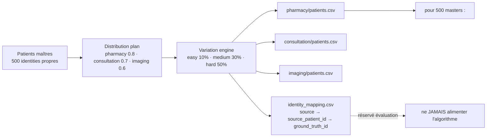

# Chapitre 3 — Analyse

> **Statut** : rédigé (08/09/2026)

## Objectif

Analyser le besoin avant toute conception : sources de données et leur
hétérogénéité, générateur de données synthétiques avec vérité terrain, exigences
fonctionnelles et non fonctionnelles, et contraintes techniques (VM 8 Go, nœud
distant instable, interdiction de NLP lourd). Cette analyse justifie les choix de
conception du chapitre 4.

---

## 3.1 Exigences fonctionnelles et non fonctionnelles

Le cahier des charges fixe six objectifs [cahier_des_charges.md §3], traduits ici
en exigences vérifiables :

| # | Exigence fonctionnelle | Critère de succès |
|---|---|---|
| F1 | **Centraliser** les données hétérogènes dans un Data Lake | pipeline ELT Medallion RAW → SILVER → GOLD |
| F2 | **Nettoyer / standardiser** selon un modèle commun | modèle canonique `CanonicalPatient` + pivot FHIR |
| F3 | **Dédupliquer** de façon **explicable** | master patient + identity map (score, méthode, seuil) |
| F4 | **Gouverner les accès** | RBAC + consentement *purpose-by-purpose* + audit + clés SHA-256 |
| F5 | **Visualiser** les indicateurs | dashboard RMA (optionnel) |
| F6 | **Évaluer** la déduplication | vérité terrain, précision / rappel / F1 |

Exigences non fonctionnelles : données **fictives uniquement** ; pipeline **rejouable**
et **idempotent** ; dédup **déterministe et reproductible** (seed) ; logique **toujours
explicable** ; architecture évolutive au volume (Spark) sans changer la sémantique.

## 3.2 Sources de données et hétérogénéité

Trois sources métier, modélisées sur les systèmes réellement rencontrés en
établissement (consultations, pharmacies, imagerie) [cahier_des_charges.md §1] :

| Source | Fichier | Identifiant | Champs patients |
|---|---|---|---|
| **pharmacy** | `pharmacy/patients.csv` | `client_id` | `nom_complet, naissance, telephone, adresse, sexe` |
| **consultation** | `consultation/patients.csv` | `patient_code` | `prenom, nom, date_naiss, phone_number, genre` |
| **imaging** | `imaging/patients.csv` | `id_personne` | `patient_name, dob, tel, sex` |

L'hétérogénéité est **triple** et volontaire :

1. **Structure** : nom dans une seule colonne (`nom_complet`, `patient_name`) ou deux
   (`prenom + nom`) ; identifiants différents (`client_id` / `patient_code` /
   `id_personne` — `PH000001` / `MED000001` / `IMG000001`).
2. **Vocabulaire** : le genre apparaît sous les formes `H`/`F` (pharmacy),
   `male`/`female` (consultation), `Homme`/`femme` (imaging)
   [deduplication.md §2] — source des générateurs `SEXE_LABELS` / `GENRE_LABELS` /
   `SEX_LABELS`.
3. **Formats** : dates `01/02/1934`, `08-06-1943`, `YYYY-MM-DD` ; téléphones
   `0341234567`, `034 123 4567`, `+261341234567`, ou vides.

Le même patient réel apparaît donc sous des formes différentes, par exemple le cas
de référence « Jean Rakoto » des trois sources [deduplication.md §7] (chapitre 1).
Chaque source adjoint ses transactions métier : achats (pharmacy), consultations
(consultation), examens (imaging).

## 3.3 Générateur de données synthétiques et vérité terrain

L'évaluation objective exige de **connaître la vérité** — impossible avec de vraies
données. Le générateur
[`synthetic-patient-generator`](../projet/code-source/evaluation/synthetic-patient-generator/README.md)
produit des données fictives **et** leur vérité terrain, en 7 étapes
(déterministe : `RANDOM_SEED = 42`, locale `fr_FR`, préfixes téléphone malgaches
`032/033/034/038`) :

- **Patients maîtres** `master_patients.csv` : 500 identités propres (défaut des
  évaluateurs `--patients 500 --seed 42`).
- **Distribution** : probabilités de présence 0.8 / 0.7 / 0.6 par source →
  **1 057 enregistrements** répartis **404 / 353 / 300**
  (`identity_mapping.csv` compté : 500 groupes `GT000001..GT000500`).
- **Variation engine** : niveaux de difficulté `easy 10 % / medium 30 % / hard 50 %`
  de probabilité par variation ; types débloqués progressivement — easy :
  casse, espaces, formats date/téléphone ; medium (ajout) : inversion
  nom/prénom, typo légère ; hard (ajout) : typo, abréviation, valeur manquante.
- **Vérité terrain** : `identity_mapping.csv` (colonnes `source, source_patient_id,
  ground_truth_id`) **jamais fournie à l'algorithme**, réservée à l'évaluation
  [deduplication.md — règle métier].

Transactions adjointes (dataset hard) : 792 achats (pharmacie, 1–3/patient),
519 consultations (1–2/patient), 450 examens imagerie (1–2/patient).

> **Deux usages distincts.** Le dataset **hard** (404/353/300) sert à
> l'**évaluation** de la dédup (chapitre 6). Le dataset **brut** d'ingestion
> (76/76/62 enregistrements) alimente le **pipeline ELT** de démonstration :
> 214 lignes SILVER, 145 masters, 69 doublons — run 07/09/2026
> [contexte_projet.md].

## 3.4 Contraintes techniques et environnementales

| Contrainte | Nature | Traitement adopté |
|---|---|---|
| **VM 8 Go / 4 cœurs** | mémoire limitée (Spark gourmand) | `executor 4g / driver 2g`, `shuffle.partitions=8` [cahier_des_charges.md §11] |
| **Nœud distant MAVIS instable** | source PostgreSQL distante (`mavis_notheme`, 11 tables, tunnel SSH) | répliques locales de dev (`rebuild_mavis_db.py`, 73 090 lignes) ; données finales synthétiques |
| **Interdiction NLP lourd** | `sentence_transformers` crash sous **Python 3.8** | RapidFuzz + dictionnaire de synonymes (`fhir_synonyms.py`) |
| **Stockage Spark sur partage vboxsf interdit** | corruption `part-*.snappy.parquet` | warehouse toujours `hdfs://localhost:9000` |
| **Reproductibilité** | évaluation et dédup déterministes | seed 42, seuil 0.80, pondérations 0.5/0.3/0.2 fixes |
| **Données sensibles** | RGPD art. 9 | **synthétiques uniquement** + gouvernance implémentée dans le système |

Environnement de référence : VM `ubuntu/focal64` (Vagrant) — Hadoop 3.3.6, Hive
3.1.3, Spark 3.4.2, venv Python, ports redirigés (9870 HDFS, 10000 Hive, 5000 API)
[provision/Vagrantfile].

## 3.5 Synthèse de l'analyse

L'analyse dégage trois besoins dominants :
1. **Interpréter des formats divergents** → un modèle canonique + un pivot FHIR.
2. **Dédupliquer sans vérité** → mesures de similarité + seuil, évaluées sur
   ground truth (chapitre 2, 4, 6).
3. **Pouvoir passer à l'échelle** → choix Spark + Data Lake Medallion.

Sans aspect de l'état de l'art « pour la forme » : chaque technologie répond à un
besoin identifié ici.

## Conclusion et transition

Le besoin est précis : trois sources hétérogènes, des exigences claires et des
contraintes rebutées une à une. Le chapitre 4 conçoit la réponse : architecture en
trois niveaux, modèle canonique, algorithmes de déduplication (blocking,
exact + probabiliste, seuil 0.80), schéma PostgreSQL et gouvernance
(consentement, audit, clés API).

### Références

- `documents/cahier_des_charges.md` §1, §3, §6, §7, §11.
- `documents/documentation/deduplication.md` §2, §7 et règle métier.
- `evaluation/synthetic-patient-generator/README.md` et `config/settings.py`.
- `ai/memoire/contexte_projet.md` (chiffres du run final).
- `provision/Vagrantfile`, `bootstrap.sh`.