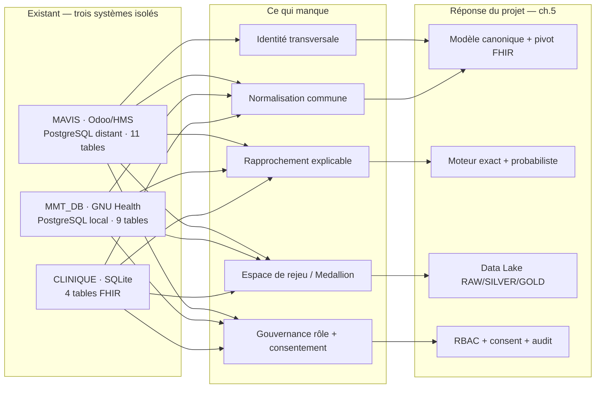

# Chapitre 3 — Étude de l'existant

> **Statut** : rédigé (27/09/2026)

## Objectif

Avant de concevoir, examiner ce qui existe déjà : (a) les **systèmes d'information en place à
MMT**, (b) les **solutions logicielles du domaine** (MPI/DMP, MDM/ETL, plateformes Data Lake
santé, open source), (c) ce que le projet peut **réutiliser** et ce qu'il doit **refaire**.

> **Portée de l'étude.** Aucun de ces produits n'a été déployé sur la VM ni mesuré : la
> comparaison s'appuie sur leur **documentation** et sur les **schémas réellement capturés** dans
> le dépôt. Les capacités citées sont donc des **capacités annoncées**, jamais des résultats
> obtenus [AGENTS.md — règle d'honnêteté des livrables].

---

## 3.1 Les systèmes d'information existants à MMT

Trois systèmes sources ont été rencontrés puis capturés (schémas et volumes) au cours du stage
[`archives/datalake_mavis/LOG.md`](../archives/datalake_mavis/LOG.md) :

| Source | Socle | Volume vérifiable | Tables retenues | Particularités relevées |
|---|---|---|---|---|
| **MAVIS** (`mavis_notheme`) | Odoo + module HMS, PostgreSQL **distant** (tunnel SSH) | 73 090 lignes en réplique locale ; 1 260 tables détectées sur le nœud distant | 11 (`hms_patient`, `res_partner`, `hms_physician`, `hms_diseases`, `acs_ethnicity`, `ir_attachment`, `hr_employee`, `res_users`, `patient_death_register`, `product_product`, `account_move`) | nœud distant **instable** (102.16.7.154) ; jointure `hms_patient.partner_id = res_partner.id` vérifiée **9 791 / 9 791** |
| **MMT_DB** | GNU Health, PostgreSQL local | 60 271 lignes, 9 tables | 3 extraites (`gnuhealth_patient`, `party_party`, `gnuhealth_family`) | modèle GNU Health ; 5 clés étrangères découvertes automatiquement (`gnuhealth_patient.name → party_party.id`, `.family → gnuhealth_family.id`, …) |
| **CLINIQUE** | SQLite | 54 582 lignes, 0 violation de clé étrangère | 4 (`patients`, `visits`, `diagnoses`, `observations`) | seule source **déjà alignée** sur les 4 entités FHIR |
| **pharmacy / consultation / imaging** | CSV (générateur synthétique) | 76 / 76 / 62 au run de référence ; 404 / 353 / 300 pour l'évaluation | `patients` + tables de transactions | jeu de démonstration reproductible (seed 42) |

Chaque système est un logiciel **spécialisé et complet dans son périmètre** : GNU Health est un
logiciel libre de gestion hospitalière (EMR, HMIS, LIMS, 40 paquets métier) [B19] ; MAVIS repose
sur l'ERP Odoo étendu par des applications hospitalières tierces sous licence [B20]. Aucun de ces
produits n'est conçu pour être le référentiel d'identité transverse de l'établissement.

### Ce que l'existant ne fournit pas

1. **Aucun identifiant patient transversal.** Chaque base a son propre namespace
   (`hms_patient`, `gnuhealth_patient`, `client_id`, `patient_code`, `id_personne`). Le CIN, seul
   identifiant métier stable, est **absent d'environ un quart des patients** et n'est pas
   stocké dans les mêmes colonnes selon la source.
2. **Aucune normalisation.** Pas de schéma pivot : le genre se lit `H/F` en pharmacie,
   `male/female` en consultation, `Homme/femme` en imagerie ; les dates et les CIN obéissent à
   des formats différents. Chaque base est cohérente avec elle-même, pas avec les autres.
3. **Aucun rapprochement d'identité.** Le PoC d'origine a compté **24 872 marqueurs de doublon**
   dans ses tables Silver (run du 24/08) — un constat de volume, sans référentiel patient ni
   justification de fusion traçable [ai/memoire/contexte_projet.md].
4. **Aucune gouvernance des accès.** Ni rôles, ni consentement par finalité, ni journal d'accès ;
   le cahier des charges exige au contraire un hébergement **interne** des données et un contrôle
   par couple **rôle + consentement** [cahier_des_charges_stage_M2_MBDS.docx §2.2 et §3].
5. **Aucun espace de rejeu.** Les bases sont isolées : pas de zone RAW de référence, pas de
   traçabilité transformation → résultat. L'incident 11 du PoC l'a montré — un `overwrite`
   exécuté dans la boucle par source a laissé `patient_fhir` avec **9 791 patients seulement**
   au lieu de l'union des sources [pipeline_elt.md — pièges anti-régression].

> **Figure 3 — Trois systèmes isolés, cinq manques, quatre réponses : l'existant à MMT,
> et le chemin du projet chapitre par chapitre.**

## 3.2 Les solutions logicielles du domaine

Quatre familles de produits couvrent, partiellement, le besoin. Trois sigles reviennent
souvent : le **MPI** (Master Patient Index, un annuaire de patients qui attribue un identifiant
unique à chaque personne), le **DMP** (Data Management Platform, une plateforme qui pilote la
qualité des données d'un établissement) et le **MDM** (Master Data Management, la même
approche appliquée aux données de référence, patients ou non). Pour chacune, ce qu'elle apporte
et ce qui bloque son adoption dans le contexte du stage :

| Solution | Famille | Apport pour le besoin | Ce qui bloque l'adoption ici |
|---|---|---|---|
| **InterSystems EMPI** [B13] | MPI / DMP santé | Moteur d'identité déterministe **et** probabiliste, rapprochement de référence (LexisNexis LexID), création d'un enregistrement composite par personne, services IHE **PIX** (MRN → MPI ID) et **PDQ** (démographiques partiels → MPI IDs) | Produit **propriétaire et sous licence**, conçu pour des systèmes de santé nord-américains ; son atout est un **référentiel externe** de population, incompatible avec l'exigence d'hébergement interne ; ne couvre ni le Data Lake Medallion ni la gouvernance par consentement |
| **Talend MDM** [B14] | MDM / ETL commercial | *Integrated Matching* : *match and survivorship*, **golden record**, tâches de fusion revues par des gestionnaires de données (« data stewards »), seuils de confiance paramétrables | Suite commerciale lourde ; la **survivorship** suppose une autorité de gestion des données et un poste de travail à valider ; pas d'interopérabilité **FHIR** native ; ne résout pas la gouvernance d'accès aux données patients |
| **Azure Health Data Services** [B17] | Plateforme Data / cloud santé | Service **FHIR** et **DICOM** managés, export massif `$export` vers Data Lake Storage Gen2, service de **dé-identification** (27 entités, opérations `TAG` / `REDACT` / `SURROGATE`) | Service **cloud managé** : incompatible avec la contrainte d'**hébergement interne** et avec le réseau de l'établissement ; ne fournit **ni MPI ni déduplication** |
| **HAPI FHIR** [B16] | Open source (Java, Apache 2.0) | Implémentation de référence du serveur FHIR : validation, stockage, opérations REST, recherche, `$match` | Fournit l'**interopérabilité** mais **ni rapprochement d'identité, ni gouvernance, ni zones de qualité** : à lui seul il ne résout aucun des trois problèmes de la fiche 1.2 |
| **Splink** [B15] | Open source (Python, MoJ) | Lien probabiliste d'enregistrements à l'échelle : modèle **Fellegi-Sunter**, estimation par **EM**, backends Spark/SQL, ~1 million d'enregistrements en une minute | Excellent sur le **cœur** algorithmique, mais la calibration EM produit des poids **non lisibles** par un data steward ; ni gouvernance, ni Medallion, ni audit d'accès. Le projet a préféré un **score pondéré explicable** (ch. 5) |
| **Apache Atlas** [B18] | Open source (gouvernance Hadoop) | Catalogue, **lineage** de bout en bout, classifications type `PII` / `SENSITIVE` propagées le long des traitements | Gouvernance de **métadonnées**, pas contrôle d'accès : n'exerce aucun filtrage au runtime, n'implémente ni consentement par finalité ni journal d'accès |

## 3.3 Grille de comparaison

Six critères ont été retenus, déduits de la fiche 1.2 (disperser, dédupliquer, gouverner) et des
contraintes du ch. 4. `✔` = capacité annoncée par la documentation, `◐` = partielle,
`✖` = absente. **Aucune mesure : lecture documentaire.**

| Critère | InterSystems EMPI | Talend MDM | Azure HDS | HAPI FHIR | Splink | Apache Atlas | Solution du stage |
|---|:---:|:---:|:---:|:---:|:---:|:---:|:---:|
| Déduplication **explicable** (score + méthode + justification) | ✔ | ✔ | ✖ | ✖ | ◐ | ✖ | **✔ testé** |
| Interopérabilité **FHIR** | ◐ | ✖ | ✔ | ✔ | ✖ | ✖ | **✔ testé** |
| Gouvernance **rôle + consentement + audit** | ◐ | ◐ | ✔ | ✖ | ✖ | ◐ | **✔ conçu** |
| Montée en charge **Big Data** (HDFS/Spark) | ◐ | ✔ | ✔ | ✖ | ✔ | ✔ | **✔ testé** |
| **Hébergement interne** (on-premise) | ✔ | ✔ | ✖ | ✔ | ✔ | ✔ | **✔ testé** |
| Faisabilité **VM 8 Go / Python 3.8** | ✖ | ✖ | ✖ | ✖ | ◐ | ✖ | **✔ testé** |

Lecture : **aucun produit ne coche les six cases**. Les solutions les plus complètes sur l'identité
(EMPI, Talend) sont les plus lourdes et les plus coûteuses ; les solutions conformes à
l'hébergement interne ne résolvent ni le rapprochement, ni la gouvernance, ni l'explicabilité. Le
cahier des charges fixe en outre un délai de **4 mois** et un environnement **entièrement
interne** [cahier_des_charges_stage_M2_MBDS.docx §1 et §3].

## 3.4 Verdict et espace de manœuvre

**Décision.** Le projet ne réinvente pas les concepts : il **réutilise les standards et les
algorithmes de l'existant** et n'écrit que la chaîne d'exécution et de gouvernance, qu'aucune
solution ne peut fournir dans le contexte imposé.

| Élément repris de l'existant | Provenance | Implémentation retenue |
|---|---|---|
| Décision *match / non-match* probabiliste | Fellegi-Sunter [B2] | score pondéré explicable 0.5 / 0.3 / 0.1 / 0.1, seuil 0.80 (ch. 5) |
| Service de correspondance par score | FHIR `$match` [B5] | `engine/identity/matcher.py` — même philosophie, sans serveur FHIR |
| Interopérabilité par schéma pivot | FHIR [B5] | 4 entités `patient / encounter / condition / observation` |
| Stockage en zones de qualité croissante | Medallion [B9] | RAW / SILVER / GOLD sur HDFS + Hive |
| Rapprochement multi-sources | MPI / identity map [B13] | `master_patient` + `patient_identity_map` en PostgreSQL |
| Gouvernance et traçabilité | catalogue de métadonnées [B18] | **l'inverse** : le contrôle est exercé *au runtime* (RBAC, consentement, audit) et non seulement sur les métadonnées |

Trois écarts assumés, justifiés par le besoin et non par la commodité :

- **Pas d'estimation EM** (à la différence de Splink) : les poids restent **lisibles et
  modifiables** par un gestionnaire de données, condition posée par l'exigence « jamais fusionner
  sans logique explicable » [deduplication.md — règle métier].
- **Pas de référentiel externe** (à la différence d'EMPI) : aucune donnée de tiers n'entre dans
  la plateforme, conformément à l'hébergement interne.
- **Pas de service managé** (à la différence d'Azure HDS) : le Data Lake est interne à la VM
  (Hadoop 3.3.6, Hive 3.1.3, Spark 3.4.2) [Vagrantfile, bootstrap.sh].

> **Limite honnête de l'étude.** Les produits cités sont décrits **d'après leur documentation** et
> n'ont **pas été installés ni exécutés** : la grille compare des capacités annoncées, non des
> performances mesurées. Une évaluation comparative réelle demanderait un banc d'essai hors
> périmètre du stage.

## Conclusion et transition

L'existant fournit trois systèmes riches mais **isolés**, sans identité transverse, sans
normalisation, sans gouvernance ni espace de rejeu ; et un marché qui ne couvre jamais les six
critères à la fois dans nos contraintes. La décision qui en découle est une **chaîne sur mesure,
adossée aux standards** (Fellegi-Sunter, FHIR, Medallion) plutôt qu'un produit. Le chapitre 4
analyse maintenant le besoin de manière opérationnelle : sources et leur hétérogénéité réelle,
générateur de données avec vérité terrain, exigences et contraintes.

### Références citées

- [B2] Fellegi & Sunter, 1969 ; [B5] HL7 FHIR §8.1.11 ; [B9] Databricks, Medallion —
  détaillés en [références](02-etat-de-l-art.md).
- [B13] InterSystems EMPI / IRIS for Health (PIX, PDQ) — voir `references/bibliographie.md`.
- [B14] Talend MDM, *Integrated Matching*. [B15] Splink (Fellegi-Sunter, EM).
- [B16] HAPI FHIR. [B17] Azure Health Data Services. [B18] Apache Atlas.
- [B19] GNU Health. [B20] Odoo, applications hospitalières.

Fichiers du dépôt : `archives/datalake_mavis/LOG.md` (captures de schéma, incidents) ;
`documents/documentation/bases_de_donnees.md` (recension des couches) ;
`documents/documentation/architecture.md` (services, ports) ;
`documents/Cahier_des_charges_stage_M2_MBDS.docx` (exigences d'hébergement et de sécurité).
