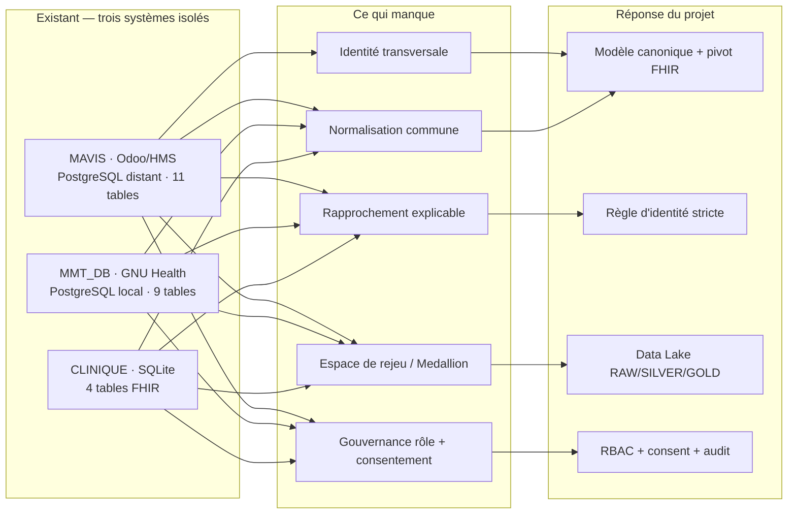
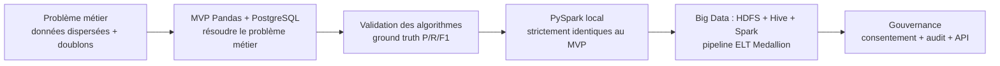

# Chapitre 3 — Étude de l'existant et solution envisagée

## 3.1 Description de l'existant

### 3.1.1 Vision utilisateur (description externe)

Du point de vue d'un utilisateur, chaque service travaille dans **son propre logiciel** : la
gestion hospitalière s'appuie sur MAVIS, une application Odoo étendue par un module de gestion
hospitalière ; les dossiers médicaux relèvent de GNU Health (base MMT_DB) ; une clinique tient
ses patients, visites, diagnostics et observations dans une base à part (CLINIQUE). Chaque
logiciel est **complet dans son périmètre** : on y crée un patient, on y consulte son historique,
on y saisit ses actes.

Ce que l'utilisateur ne peut pas faire, en revanche, c'est **passer d'un système à l'autre** :

- une recherche de patient ne renvoie que les fiches du logiciel ouvert ; les fiches du même
  patient dans les autres services restent invisibles ;
- la même personne apparaît sous des formes différentes selon le service (l'exemple « Jean
  Rakoto » du § 1.2.1), sans que rien ne signale qu'il s'agit d'elle ;
- aucun écran ne dit qui a consulté un dossier, ni pour quelle finalité, ni si le patient y a
  consenti.

> **Précision de méthode.** Cette vision externe est reconstituée à partir des schémas capturés
> (§ 3.1.2) et du cahier des charges ; aucune enquête auprès des utilisateurs n'a été conduite,
> l'axe « personas » étant hors périmètre du stage (§ 2.1.1).

### 3.1.2 Vision développeur (description interne)

Trois systèmes sources ont été rencontrés puis capturés (schémas et volumes) au cours du stage
[`documents/journal_poc_datalake_mavis.md`](../documents/journal_poc_datalake_mavis.md) :

**Tableau 12 — Les quatre sources capturées au stage : socle technique, volume vérifié, tables retenues et particularités relevées.**

| Source | Socle | Volume vérifiable | Tables retenues | Particularités relevées |
|---|---|---|---|---|
| **MAVIS** (`mavis_notheme`) | Odoo + module HMS, PostgreSQL **distant** (tunnel SSH) | 73 090 lignes en réplique locale ; 1 260 tables détectées sur le nœud distant | 11 (`hms_patient`, `res_partner`, `hms_physician`, `hms_diseases`, `acs_ethnicity`, `ir_attachment`, `hr_employee`, `res_users`, `patient_death_register`, `product_product`, `account_move`) | nœud distant **instable** (102.16.7.154) ; jointure `hms_patient.partner_id = res_partner.id` vérifiée **9 791 / 9 791** |
| **MMT_DB** | GNU Health, PostgreSQL local | 60 271 lignes, 9 tables | 3 extraites (`gnuhealth_patient`, `party_party`, `gnuhealth_family`) | modèle GNU Health ; 5 clés étrangères découvertes automatiquement (`gnuhealth_patient.name → party_party.id`, `.family → gnuhealth_family.id`, …) |
| **CLINIQUE** | SQLite | 54 582 lignes, 0 violation de clé étrangère | 4 (`patients`, `visits`, `diagnoses`, `observations`) | seule source **déjà alignée** sur les 4 entités FHIR |
| **pharmacy / consultation / imaging** | CSV (générateur synthétique) | 76 / 76 / 62 au run de référence ; 404 / 353 / 300 pour l'évaluation | `patients` + tables de transactions | jeu de démonstration reproductible (seed 42) |

Chaque système est un logiciel **spécialisé et complet dans son périmètre** : GNU Health est un
logiciel libre de gestion hospitalière (EMR, HMIS, LIMS, 40 paquets métier) [B19] ; MAVIS repose
sur l'ERP Odoo étendu par des applications hospitalières tierces sous licence [B20]. Aucun de ces
produits n'est conçu pour être le référentiel d'identité transverse de l'établissement.

**Méthode de la capture.** L'étude de l'existant repose sur une **capture reproductible**, pas sur
une impression : le schéma de chaque base a été introspecté puis consigné dans le dépôt
[`documents/journal_poc_datalake_mavis.md`](../documents/journal_poc_datalake_mavis.md), ce qui permet de relire le
diagnostic sans refaire les relevés. Trois chiffres de cette capture doivent être lus pour ce
qu'ils établissent — et pour ce qu'ils n'établissent pas.

- **1 260 tables détectées sur le nœud MAVIS, 11 retenues.** La capture mesure l'étendue du
  problème (un ERP étendu, pas un dossier patient) ; elle ne prétend pas être un inventaire
  exhaustif, et le sous-ensemble retenu est un **choix** documenté, pas un maximum.
- **Une jointure vérifiée ligne à ligne** : `hms_patient.partner_id = res_partner.id`
  rend **9 791 / 9 791** lignes. L'intégrité référentielle existe *à l'intérieur* d'une source ;
  c'est l'**absence d'équivalent** entre sources qui pose problème.
- **5 clés étrangères découvertes automatiquement** dans le modèle GNU Health, contre
  **0 violation** dans CLINIQUE, seule base déjà alignée sur les 4 entités FHIR. L'hétérogénéité
  n'est donc pas un défaut de qualité des bases : les trois sont cohérentes, mais selon des
  conventions différentes.

Enfin, le nœud MAVIS étant instable (102.16.7.154), les volumes cités sont ceux de la **réplique
locale** : ils prouvent l'ordre de grandeur, pas l'état temps réel du serveur de production.

**Les sources de démonstration.** Les données réelles ne pouvant pas être utilisées, trois
sources synthétiques reproduisent l'hétérogénéité observée, sur le modèle des systèmes
réellement rencontrés en établissement (consultations, pharmacies, imagerie). Ces fichiers CSV sont des **sources de test** : ils servent
uniquement à exercer et à évaluer la plateforme sur des données fictives, générées avec une
graine fixe. Ils ne représentent pas les sources de production : en établissement, la
plateforme lirait directement les bases des services (PostgreSQL, SQLite ou autre), par la
même couche d'extraction.

**Tableau 13 — Les trois sources synthétiques et leur identifiant.**

| Source | Fichier | Identifiant |
|---|---|---|
| **pharmacy** | `pharmacy/patients.csv` | `client_id` |
| **consultation** | `consultation/patients.csv` | `patient_code` |
| **imaging** | `imaging/patients.csv` | `id_personne` |

L'hétérogénéité est **triple** et volontaire :

1. **Structure** : nom dans une seule colonne (`nom_complet`, `patient_name`) ou deux
   (`prenom + nom`) ; identifiants différents (`client_id` / `patient_code` /
   `id_personne` — `PH000001` / `MED000001` / `IMG000001`).
2. **Vocabulaire** : le genre s'écrit `H`/`F` (pharmacy), `male`/`female` (consultation)
   ou `Homme`/`femme` (imaging).
3. **Formats** : dates `01/02/1934`, `08-06-1943` ou `1934-02-01` ; CIN espacé
   (`101 02404 5`), compact (`101024045`) ou **absent** (environ un patient sur quatre) ;
   ville de naissance en toutes lettres.

Un même patient apparaît donc sous des formes différentes, comme dans le cas de référence
« Jean Rakoto » (§ 1.2.1). Chaque source a aussi ses transactions : achats (pharmacy),
consultations (consultation), examens (imaging).

## 3.2 Critique de l'existant

1. **Aucun identifiant patient transversal.** Chaque base a son propre espace d'identifiants
   (`hms_patient`, `gnuhealth_patient`, `client_id`, `patient_code`, `id_personne`). Le CIN, seul
   identifiant métier stable, est **absent d'environ un quart des patients** et n'est pas
   stocké dans les mêmes colonnes selon la source.
2. **Aucune normalisation.** Pas de schéma pivot : le genre se lit `H/F` en pharmacie,
   `male/female` en consultation, `Homme/femme` en imagerie ; les dates et les CIN obéissent à
   des formats différents. Chaque base est cohérente avec elle-même, pas avec les autres.
3. **Aucun rapprochement d'identité.** Le PoC d'origine a compté **24 872 marqueurs de doublon**
   dans ses tables Silver (run du 24/08) — un constat de volume, sans référentiel patient ni
   justification de fusion traçable.
4. **Aucune gouvernance des accès.** Ni rôles, ni consentement par finalité, ni journal d'accès ;
   le cahier des charges exige au contraire un hébergement **interne** des données et un contrôle
   par couple **rôle + consentement** (cahier des charges, § 2.2 et § 3).
5. **Aucun espace de rejeu.** Les bases sont isolées : pas de zone RAW de référence, pas de
   traçabilité transformation → résultat. L'incident 11 du PoC l'a montré — un `overwrite`
   exécuté dans la boucle par source a laissé `patient_fhir` avec **9 791 patients seulement**
   au lieu de l'union des sources.

> **Figure 1 — Trois systèmes isolés, cinq manques, quatre réponses : l'existant à MMT,
> et la réponse que le projet apporte à chacun de ses manques.**

## 3.3 Solutions envisagées

Deux voies étaient ouvertes. La première — **adopter un produit** — a été écartée par l'état de
l'art : aucune solution ne couvre les sept critères dans les contraintes du stage (§ 2.3). La
seconde — **une chaîne sur mesure adossée aux standards** — a été retenue, et construite
progressivement.

**Une progression en trois niveaux.** Le projet ne part pas d'un besoin de « Big Data pour le
Big Data ». Il suit une approche progressive, chaque technologie étant introduite **par
besoin** :

> **Figure 2 — La démarche du projet : six étapes, chacune introduite par un besoin. La
> validation des algorithmes conditionne le passage à l'échelle, la gouvernance vient
> s'appuyer sur la zone GOLD.**

Le **niveau 1 — MVP** utilise CSV, Pandas et PostgreSQL pour l'extraction, le nettoyage, la
déduplication et le patient maître, afin de résoudre le problème métier d'abord, au plus
simple. Le **niveau 2 — Spark** passe à PySpark local avec des résultats **strictement
identiques** au MVP, la parité étant vérifiée : passer à l'échelle sans changer la logique
métier. Le **niveau 3 — Big Data** mobilise le Data Lake (HDFS, Hive, Spark), un pipeline
ELT Medallion en cinq étapes, planifiable et rejouable, et des API d'exposition, pour préparer
des volumes plus importants. Deux étapes sont **transverses** : la validation des algorithmes
sur une vérité terrain, qui conditionne le passage à Spark, et la gouvernance (consentement,
audit, API), traitée en dernier car elle s'appuie sur la zone GOLD. Ce ne sont pas des niveaux
de technologie, mais deux moments où l'on vérifie avant d'aller plus loin : on ne passe à
l'échelle et on n'ouvre les accès qu'une fois les tests réussis.

Les deux premiers niveaux proviennent du PoC `test_bigdata`, le troisième du PoC `datalake_mavis`.
Ce dépôt unique en est la **fusion consolidée** : un seul dépôt, une seule
documentation, le moteur de déduplication porté dans `engine/`, l'évaluation sur vérité terrain et le
consentement intégré à la couche GOLD.

**Première réponse : un contrat de normalisation.** Le point 2 de la critique a une conséquence
de conception directe : l'hétérogénéité relevée a été convertie en un **contrat de normalisation
explicite** plutôt qu'en un simple constat (chapitres 6 et 7). Les trois sources synthétiques
n'écrivent pas seulement le même champ sous des noms différents (`sexe` en pharmacie, `genre` en
consultation, `sex` en imagerie) : elles **encodent le genre différemment** (`H/F`,
`male/female`, `Homme/femme`). Le moteur y répond par des listes fermées, dans
`engine/identity/canonical.py` :

**Tableau 14 — Le contrat de normalisation.**

| Champ | Règle de normalisation appliquée | Comportement en cas d'échec |
|---|---|---|
| Genre | liste fermée de 5 libellés masculins et 4 féminins → `M` / `F` | valeur **vide** (jamais devinée) |
| CIN | seuls les chiffres sont conservés | valeur **vide** si la longueur sort de 6 à 12 chiffres |
| Date de naissance | ISO (`-` ou `/`) sinon lecture jour-mois-année | **inconnue** (`None`) |
| Nom | accents, casse et ponctuation supprimés | chaîne vide si le nom est absent |

Une règle gouverne les quatre : **aucune valeur n'est devinée**. Un genre hors liste, un CIN mal
formé ou une date illisible produisent une valeur vide qui **exclut** l'enregistrement de toute
fusion (identité incomplète) : un champ douteux ne peut donc pas provoquer un rapprochement. Ce contrat est testé sur les trois sources synthétiques ; son application aux
formats MAVIS et CLINIQUE est documentée mais **hors du run de référence**, qui n'exploite que les
sources CSV (§ 7.3).

## 3.4 Objectifs principaux et livrables

Les objectifs principaux sont les six objectifs du cahier des charges (Tableau 2, § 1.2.2),
traduits en exigences vérifiables F1 à F6 au chapitre 5.

**Périmètre fonctionnel** couvert par ce stage :

- pipeline ELT Big Data en cinq étapes (préparation des sources → RAW → mapping FHIR →
  SILVER → GOLD), orchestré par `run_pipeline.sh`, avec **reprise** d'un run échoué,
  **ingestion incrémentale**, **planification** et **historique chiffré** de chaque run
  conservé en base ;
- moteur de déduplication par règle d'identité stricte (CIN, genre, date et ville de naissance
  identiques ; v1 : score pondéré, seuil 0,80), implémenté en Python **et** dans Spark ;
- gouvernance : rôles, consentement par finalité, journal d'accès, clés d'API hachées (SHA-256) ;
- deux API REST : l'API des **indicateurs** (Flask), qui lit les zones SILVER et GOLD, et l'API
  de **gouvernance** (FastAPI), qui sert les patients sous contrôle du consentement et réserve à
  l'administrateur l'enregistrement des consentements et de la planification ;
- évaluation de la déduplication sur trois jeux synthétiques (facile, moyen, difficile).

**Hors périmètre** : les tableaux de bord d'analyse du prototype d'origine ne sont pas repris ;
l'interface web se limite au **pilotage du pipeline** et à la consultation des patients, et reste
optionnelle au sens du cahier des charges. Le **déploiement** chez le commanditaire (serveur de production, export VM `.box`,
Docker/CI) n'entre pas dans le stage : la plateforme est livrée comme un prototype reproductible
sur sa VM de développement.

**Tableau 15 — Les livrables et leur état à la fin du stage.**

| # | Livrable (cahier des charges, § 10) | État |
|---|---|---|
| 1 | Code source complet (dépôt unique `Mon_Memoire`) | réalisé |
| 2 | Pipeline ELT Big Data (provision et scripts PySpark) | réalisé — 4 étapes sur 4 au run de référence du 07/09/2026 ; orchestration actuelle en 5 étapes |
| 3 | Moteur de déduplication et évaluation sur vérité terrain | réalisé |
| 4 | PostgreSQL central (patients maîtres, consentement, audit) | réalisé ; alimenté par le pipeline sur une base de **test** (30/09/2026), pas de base de production |
| 5 | API des indicateurs et API de gouvernance | réalisé |
| 6 | Documentation technique et manuel conceptuel (`documents/`) | réalisé |
| 7 | Frontend optionnel (Next.js) | réalisé partiellement (pilotage du pipeline, consultation des patients) — optionnel |
| 8 | Rapport de stage et support de soutenance | réalisé |

## Conclusion et transition

L'existant fournit trois systèmes riches mais **isolés**, sans identité transverse, sans
normalisation, sans gouvernance ni espace de rejeu. L'analyse en dégage trois besoins
dominants :

1. **Interpréter des formats divergents** → un modèle canonique et un pivot FHIR.
2. **Reconnaître un même patient sans identifiant commun** → une règle explicable (d'abord un
   score de similarité, puis une règle stricte), évaluée sur une vérité terrain (chapitres 2, 7
   et 8).
3. **Pouvoir passer à l'échelle** → Spark et un Data Lake Medallion.

S'y ajoutent deux exigences transverses : **l'explicabilité** de toute décision (§ 7.1) et la
**gouvernance par consentement** (§ 2.1.6, § 7.2.3), qu'il faut concevoir dès le départ plutôt
qu'ajouter après coup. Le chapitre 4 décrit la **démarche projet** qui a permis de construire cette réponse :
méthode, rôles, contraintes, planning et budget.
