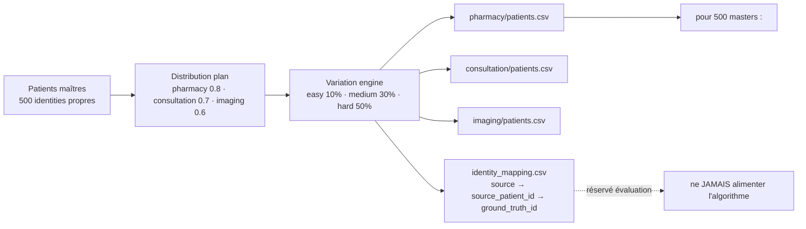

# Chapitre 4 — Analyse

> **Statut** : rédigé (08/09/2026, actualisé 27/09/2026)

## Objectif

Analyser le besoin avant toute conception : sources de données et leur
hétérogénéité, générateur de données synthétiques avec vérité terrain, exigences
fonctionnelles et non fonctionnelles, contraintes techniques (VM 8 Go, nœud
distant instable, interdiction de NLP lourd), **contexte local et conditions
d'applicabilité**, et **conduite de projet**. Cette analyse justifie les choix de
conception du chapitre 5, une fois l'existant examiné au chapitre 3.

---

## 4.1 Exigences fonctionnelles et non fonctionnelles

Le cahier des charges fixe six objectifs [cahier_des_charges.md §3], traduits ici
en exigences vérifiables :

**Tableau 15 — Les six exigences fonctionnelles et leur critère de succès vérifiable.**

| # | Exigence fonctionnelle | Critère de succès |
|---|---|---|
| F1 | **Centraliser** les données hétérogènes dans un Data Lake | pipeline ELT Medallion RAW → SILVER → GOLD |
| F2 | **Nettoyer / standardiser** selon un modèle commun | modèle canonique `CanonicalPatient` + pivot FHIR |
| F3 | **Dédupliquer** de façon **explicable** | master patient + identity map (score, méthode, seuil) |
| F4 | **Gouverner les accès** | RBAC + consentement *purpose-by-purpose* + audit + clés SHA-256 |
| F5 | **Visualiser** les indicateurs | vues de gouvernance : déduplication et consentement (optionnel) |
| F6 | **Évaluer** la déduplication | vérité terrain, précision / rappel / F1 |

Exigences non fonctionnelles : données **fictives uniquement** ; pipeline **rejouable**
et **idempotent** ; dédup **déterministe et reproductible** (seed) ; logique **toujours
explicable** ; architecture évolutive au volume (Spark) sans changer la sémantique.

## 4.2 Sources de données et hétérogénéité

Trois sources métier, modélisées sur les systèmes réellement rencontrés en
établissement (consultations, pharmacies, imagerie) [cahier_des_charges.md §1] :

**Tableau 16 — Les trois sources synthétiques : nom de fichier et identifiant, qui portent des noms différents d'une source à l'autre. Le mapping champ par champ vers le modèle canonique est donné au chapitre 5.**

| Source | Fichier | Identifiant |
|---|---|---|
| **pharmacy** | `pharmacy/patients.csv` | `client_id` |
| **consultation** | `consultation/patients.csv` | `patient_code` |
| **imaging** | `imaging/patients.csv` | `id_personne` |

L'hétérogénéité est **triple** et volontaire :

1. **Structure** : nom dans une seule colonne (`nom_complet`, `patient_name`) ou deux
   (`prenom + nom`) ; identifiants différents (`client_id` / `patient_code` /
   `id_personne` — `PH000001` / `MED000001` / `IMG000001`).
2. **Vocabulaire** : le genre apparaît sous les formes `H`/`F` (pharmacy),
   `male`/`female` (consultation), `Homme`/`femme` (imaging)
   [deduplication.md §2] — source des générateurs `SEXE_LABELS` / `GENRE_LABELS` /
   `SEX_LABELS`.
3. **Formats** : dates `01/02/1934`, `08-06-1943`, `YYYY-MM-DD` ; CIN
   `101 02404 5`, `101024045` (espacé ou compact), ou **absent** (~25 % des
   patients maîtres) ; ville de naissance en toutes lettres.

Le même patient réel apparaît donc sous des formes différentes, par exemple le cas
de référence « Jean Rakoto » des trois sources [deduplication.md §7] (chapitre 1).
Chaque source adjoint ses transactions métier : achats (pharmacy), consultations
(consultation), examens (imaging).

## 4.3 Générateur de données synthétiques et vérité terrain

L'évaluation objective exige de **connaître la vérité** — impossible avec de vraies
données. Le générateur
[`synthetic-patient-generator`](../projet/code-source/evaluation/synthetic-patient-generator/README.md)
produit des données fictives **et** leur vérité terrain, en 7 étapes
(déterministe : `RANDOM_SEED = 42`, locale `fr_FR`, CIN malgache couvert à
~75 % des maîtres) :

> **Figure 4 — La chaîne du générateur : 500 patients maîtres, une distribution par
> défaut, le moteur de variation (easy / medium / hard), puis les trois sources
> synthétiques. La table de vérité reste hors du champ de l'algorithme.**

- **Patients maîtres** `master_patients.csv` : 500 identités propres (défaut des
  évaluateurs `--patients 500 --seed 42`), dont ~75 % portent un **CIN**.
- **Distribution** : probabilités de présence 0.8 / 0.7 / 0.6 par source →
  **1 057 enregistrements** répartis **404 / 353 / 300**
  (`identity_mapping.csv` compté : 500 groupes `GT000001..GT000500`).
- **Variation engine** : niveaux de difficulté `easy 10 % / medium 30 % / hard 50 %`
  de probabilité par variation ; types débloqués progressivement — easy :
  casse, espaces, formats date/CIN ; medium (ajout) : inversion
  nom/prénom, typo légère ; hard (ajout) : typo, abréviation, valeur manquante
  (naissance ou ville de naissance — **jamais le CIN**, dont l'absence est une
  décision de niveau maître, cohérente entre les sources).
- **Vérité terrain** : `identity_mapping.csv` (colonnes `source, source_patient_id,
  ground_truth_id`) **jamais fournie à l'algorithme**, réservée à l'évaluation
  [deduplication.md — règle métier].

Transactions adjointes (dataset hard) : 792 achats (pharmacie, 1–3/patient),
519 consultations (1–2/patient), 450 examens imagerie (1–2/patient).

> **Deux usages distincts.** Le dataset **hard** (404/353/300) sert à
> l'**évaluation** de la dédup (chapitre 7). Le dataset **brut** d'ingestion
> (76/76/62 enregistrements) alimente le **pipeline ELT** de démonstration :
> 214 lignes SILVER, 145 masters, 69 doublons — run 07/09/2026
> [contexte_projet.md].

## 4.4 Contraintes techniques et environnementales

**Tableau 17 — Les six contraintes du stage et le traitement adopté pour chacune.**

| Contrainte | Nature | Traitement adopté |
|---|---|---|
| **VM 8 Go / 4 cœurs** | mémoire limitée (Spark gourmand) | `executor 4g / driver 2g`, `shuffle.partitions=8` [cahier_des_charges.md §11] |
| **Nœud distant MAVIS instable** | source PostgreSQL distante (`mavis_notheme`, 11 tables, tunnel SSH) | répliques locales de dev (`rebuild_mavis_db.py`, 73 090 lignes) ; données finales synthétiques |
| **Interdiction NLP lourd** | `sentence_transformers` crash sous **Python 3.8** | RapidFuzz + dictionnaire de synonymes (`fhir_synonyms.py`) |
| **Stockage Spark sur partage vboxsf interdit** | corruption `part-*.snappy.parquet` | warehouse toujours `hdfs://localhost:9000` |
| **Reproductibilité** | évaluation et dédup déterministes | seed 42, seuil 0.80, pondérations 0.5/0.3/0.1/0.1 fixes |
| **Données sensibles** | RGPD art. 9 | **synthétiques uniquement** + gouvernance implémentée dans le système |

Environnement de référence : VM `ubuntu/focal64` (Vagrant) — Hadoop 3.3.6, Hive
3.1.3, Spark 3.4.2, venv Python, ports redirigés (9870 HDFS, 10000 Hive, 5000 API)
[provision/Vagrantfile].

## 4.5 Contexte local et conditions d'applicabilité

Un prototype reproductible sur sa VM ne devient un outil utilisable que si les
contraintes du terrain ont été regardées. Quatre plans de la réalité malgache
conditionnent l'applicabilité du projet — et deux d'entre eux n'ont **pas** pu
être résolus dans le périmètre du stage, ce qui doit être dit.

**Tableau 18 — Les quatre plans de réalité du contexte local, et ce que chacun change à la solution ; le dernier reste non traité.**

| Plan de réalité | Observation de terrain | Conséquence sur la solution | État |
|---|---|---|---|
| **Données de santé dispersées** | chaque service tient son propre registre (pharmacie, consultation, imagerie), sans identifiant commun | justifie l'Entity Resolution et le MPI : l'identifiant partagé doit être **reconstruit**, pas supposé | traité |
| **Organisation et rôles** | le service concerned n'a pas de référentiel d'identité ; la clé d'accès est un couple (identifiant fonctionnel, mot de passe) | l'API d'accès a été conçue sur un modèle **clé API + rôle** plutôt que sur des comptes nominatifs, plus simple à configurer sans annuaire | traité |
| **Infrastructure et connectivité** | réseau intermittent, alimentation non garantie, pas de cluster | conception **mono-nœud** et **rejouable** : un run complet repart de zéro et produit le même résultat (seed fixe) | traité |
| **Données sensibles, contexte juridique** | cadre juridique national des données de santé **non vérifié** dans ce stage : seul le RGPD et la loi française ont été étudiés (§2.5) | la conformité présentée est **européenne**, à transposer au droit malgache (loi sur les données à caractère personnel, autorité de protection) | **non traité** |

Deux points doivent rester explicites, car ils sont les plus souvent omis dans un
projet de ce type :

1. **Le droit applicable n'est pas celui du pays de l'établissement.** Le stage
   s'est appuyé sur le RGPD [B10] et les recommandations CNIL [B11], [B12] parce
   que ce sont les références accessibles depuis le stage. Elles constituent un
   **exigendum de conception exigeant** (finalité déterminée, minimisation,
   traçabilité, consentement explicite) et non une certification de conformité
   locale. La vérification du droit malgache — et de l'existence d'une autorité
   de contrôle — reste à faire avant toute mise en production.
2. **La volumétrie réelle n'a pas été utilisée.** Toutes les données sont
   synthétiques, générées à l'échelle du prototype (quelques centaines de lignes
   en SILVER, §4.3). Le dimensionnement réel de l'établissement — volumétrie,
   cardinalité, taux de doublons observé — est **inconnu** et conditionne le choix
   du seuil de similarité (§2.2) comme le partitionnement du blocking.

> **Ce que le contexte local change concrètement.** Sans annuaire d'identité, la
> gestion des accès par clé API avec trois rôles est un compromis pragmatique et
> non un choix esthétique. Avec un annuaire, elle serait remplacée par du vrai
> RBAC nominatif ; le travail sur le consentement (§2.5, §5.5) resterait
> inchangé, car il est indépendant du mode d'authentification.

## 4.6 Conduite de projet et jalons

Le stage a suivi une **démarche incrémentale en cinq jalons**, chaque jalon
n'étant stabilisé (tests, évaluation) avant d'engager le suivant. Cette
progression est un choix de gestion du risque autant que de méthode technique.

**Tableau 19 — Les cinq jalons du stage : contenu, critère de sortie atteint et preuve correspondante.**

| Jalon | Contenu | Critère de sortie | Preuve |
|---|---|---|---|
| **J1 — Socle** | générateur de données synthétiques + vérité terrain | 44 tests verts, 500 masters, 3 niveaux de difficulté | `evaluation/synthetic-patient-generator/` |
| **J2 — Moteur** | canonique + blocking + exact/probabiliste (Pandas) | précision 1.000, parité Pandas = Spark | `engine/identity/`, `evaluation_truth.md` |
| **J3 — Big Data** | pipeline ELT Medallion RAW → SILVER → GOLD | 4/4 étapes vertes, 214 lignes SILVER, 145 masters, 69 doublons | `run_pipeline.sh`, `elt.log` |
| **J4 — Gouvernance** | RBAC, clés API, consentement *purpose-by-purpose*, audit, refus 403 journalisé | suite de tests complète verte, dont 403 et 401 vérifiés | `engine/governance/`, `tests/` |
| **J5 — Mémoire** | structuration en 9 chapitres (glossaire inclus), état de l'art sourcé, mise en cohérence de la preuve | 20 références citées, aucun chiffre non vérifiable | ce dépôt |

**Règles de pilotage appliquées** : ne pas engager une évolution avant que le
contrôle ciblé du niveau précédent soit vert ; toute décision d'architecture est
tracée avec sa raison (ce mémoire) ; chaque limite constatée est écrite dans le
chapitre des limites plutôt que passée sous silence ; les données de test ne sont
jamais remplacées par des données réelles, y compris quand elles seraient
plus-commodes à obtenir.

> **Ce que ce découpage a permis, et ce qu'il a coûté.** Il a rendu chaque jalon
> démontrable indépendamment, donc présentable en soutenance sans dépendre de la
> disponibilité de la VM. Il a en revanche consume du temps de réintégration
> entre Pandas et Spark : la parité stricte exigait de porter l'algorithme deux
> fois, ce qui n'aurait pas été nécessaire si le choix de l'échelle avait été
> arrêté plus tôt. C'est la principale leçon de conduite de projet tirée du stage
> (§8.4).

## 4.7 Rôles, parties prenantes et équipe projet

Avant toute notion de rôle applicatif, il faut distinguer deux plans qui se ressemblent et
que les rapports de référence traitent séparément : **les rôles du projet**, qui décident de
quoi pendant le stage, et **les rôles d'exécution** (`admin`, `analyst`, `viewer`), qui
régissent ce qu'un utilisateur de l'API a le droit de lire une fois le logiciel livré. Les
premiers sont décrits ici, les seconds au § 2.5 et au § 5.5.

Les parties prenantes du projet sont au nombre de quatre, et l'équipe de développement
tient en une seule personne :

- **Le commanditaire**, Madagascar Medical Technology (MMT), représenté par l'encadrant
  professionnel. Il porte les deux contraintes structurantes du stage : l'**hébergement
  interne** — les données ne doivent pas quitter les machines de l'établissement, donc aucun
  service cloud externe — et l'usage de **données synthétiques** uniquement, aucune donnée
  réelle de patient ne devant être mobilisée, y compris quand elle serait plus facile à
  obtenir. Il valide par ailleurs les trois finalités déclarées à l'API.
- **L'encadrant professionnel** fait le lien entre le besoin métier et sa formulation
  technique : c'est lui qui arbitre, entre les options presented au chapitre 8, de celle que
  le commanditaire valide.
- **L'encadrant pédagogique** encadre le stage du point de vue de la formation et évalue ce
  mémoire au regard du plan imposé.
- **Le stagiaire**, auteur du projet, conçoit, développe, teste et documente. Il n'a pas
  d'équipe de développement : toute décision technique qu'il n'a pas pu trancher avec ses
  encadrants est écrite comme une question ouverte, pas comme un choix Assume.

> **Point d'honnêteté sur la taille de l'équipe.** Le stage a été mené à effectif constant
> et réduit : un développeur, deux encadrants, un commanditaire. Cela a des effets
> mesurables. D'abord, la revue de code et les tests de revue mutuelle, qui supposent au moins
> deux personnes, n'ont pas eu lieu : la seule relecture est celle que j'ai faite moi-même, ce
> qui limite la valeur de mes tests comme preuve externe. Ensuite, la séparation des rôles
> décrite plus haut n'a pas de contrepartie technique : il n'existe pas, dans le dépôt,
> d'outil de revue de code ni de piste d'audit permettant de distinguer une modification faite sous une
> consigne de celle prise en autonomie.

## 4.8 Cas d'utilisation

Les exigences fonctionnelles du § 4.1 énoncent ce que le logiciel doit faire ; les cas
d'utilisation ci-dessous précisent **qui** le fait, **à partir de quand** et **ce qui se passe
quand ça échoue**. Ils reprennent les étapes du pipeline détaillées au chapitre 6, mais vues
par l'usage et non par l'implémentation, et sont écrits comme des scénarios, pas comme des
lignes de code.

**CU1 — Ingester un lot de sources.** *Acteur* : le développeur, ou le processus automatique
lui-même. *Prérequis* : trois fichiers CSV présents, un par source. *Déroulement* :
l'extraction lit chaque source et écrit ses fiches dans `raw_patient_record` et dans la zone
RAW du Data Lake, sans transformation. *Résultat attendu* : le nombre de lignes de RAW égale
la somme des lignes lues. *Cas limite* : un fichier source absent ou tronqué interrompt le lot
et l'erreur est journalisée dans `elt.log` — le lot n'est jamais repris à moitié, ce qui
interdit d'obtenir une zone RAW partiellement écrite.

**CU2 — Ramener des formats différents à un modèle unique.** *Acteur* : le processus
automatique. *Prérequis* : la zone RAW remplie. *Déroulement* : l'étape de mapping FHIR
associe chaque champ attendu à la colonne source la plus proche, puis la normalisation produit
le modèle canonique `CanonicalPatient` dans la zone SILVER. *Résultat attendu* : toute fiche,
quelle que soit sa source, sort au même format. *Cas limite* : un champ sans équivalent dans
la source reste vide et n'est pas deviné ; le mapping est écrit dans un fichier de règles et
non dans le code, pour qu'un changement de source ne demande pas de modifier le programme.

**CU3 — Dédoupliquer et décider qui est le même patient.** *Acteur* : le processus
automatique. *Prérequis* : la zone SILVER, et une vérité terrain pour évaluer le résultat.
*Déroulement* : le blocking réduit les comparaisons, le rapprochement exact s'applique d'abord,
puis le rapprochement probabiliste pondéré par champ, au-dessus du seuil de 0,80. *Résultat
attendu* : un `master_patient` par personne retenue, et une `patient_identity_map` qui relie
**chaque** fiche d'origine au master retenu, avec son score et la méthode qui a décidé. *Cas
limite* : deux fiches très proches mais non fusionnées restent traçables comme faux
négatifs, avec leur score ; aucune fusion n'est appliquée sans inscription dans cette table,
donc aucune fusion n'est invisible.

**CU4 — Appliquer le consentement avant d'exposer la donnée.** *Acteur* : le processus
automatique. *Prérequis* : les tables de déduplication et de consentement. *Déroulement* :
la construction de la zone GOLD ne conserve, pour chaque master, que les finalités
effectivement accordées, avec le refus par défaut en l'absence d'avis. *Résultat attendu* :
aucune donnée sans consentement n'atteint la zone GOLD. *Cas limite* : le refus est
définitif tant qu'il n'est pas levé ; il n'y a pas d'« accès provisoire ».

**CU5 — Interroger l'API pour un patient donné.** *Acteur* : un utilisateur authentifié, ou
une application tierce présentant une clé d'API. *Prérequis* : une clé connue de la table
`api_user`, et un consentement enregistré. *Déroulement* : la clé est résolue en utilisateur
et en rôle, la finalité demandée est comparée aux consentements, la réponse est renvoyée, et
l'appel est journalisé dans `access_audit`. *Résultat attendu* : la liste des patients ou le
détail d'un patient, avec une trace d'audit systématique. *Cas limite* : un consentement
manquant ou une finalité non accordée produit un **403** — et non un 404 silencieux, ni une
liste réduite — et ce refus est journalisé au même titre qu'un accès accordé. C'est le point
où se joue la crédibilité du dispositif de gouvernance : un refus doit être visible.

**CU6 — Consulter les vues de gouvernance (déduplication et consentement).** *Acteur* : un
lecteur du frontend DataViz. *Prérequis* : la zone SILVER/GOLD peuplée, ou le jeu de
démonstration. *Déroulement* : le frontend appelle l'API REST des indicateurs du warehouse et
affiche les KPIs de déduplication (masters, doublons, méthodes) et de consentement
(accords/refus par finalité). *Résultat attendu* : des indicateurs calculés sur les données
dédupliquées, donc sans double comptage. *Cas limite* : ce frontend est explicitement
**optionnel** dans le cahier des charges ; il est servi avec un repli sur un jeu de
démonstration chaque fois que Hive/Spark ne répond pas, ce repli étant signalé comme tel à
l'écran. Le mémoire ne présente donc pas le frontend comme un résultat du projet, mais comme
une illustration de ce que la zone GOLD pourrait exposer.

## 4.9 Gestion de la configuration

Trois objets rendent le projet rejouable : ce qui est versionné, ce qui est déclaré, et ce
qui est vérifié. Les séparer est ce qui permet à un tiers de reconstruire un résultat à
partir du dépôt seul, sans dépendre d'une machine encore allumée.

**Ce qui est versionné.** Le dépôt Git est la source de vérité du projet : code, scripts du
pipeline, configuration de référence, tests, et ce mémoire. Chaque jalon correspond à des
commits identifiables, et les documents de suivi (`ai/dev/logs.md`,
`ai/dev/suivi_avancement.md`) enregistrent ce qui a été décidé et pourquoi. Les données
patients ne sont pas versionnées : elles sont régénérées par le générateur synthétique, avec
une graine fixe (`RANDOM_SEED = 42`) qui rend la génération reproductible. Les secrets et les
fichiers de configuration contenant des identifiants sont exclus du dépôt et fournis par
variables d'environnement ; c'est une contrainte de sécurité, pas une commodité.

**Ce qui est déclaré, et non codé en dur.** Les sources de données, les chemins et les
identifiants sont décrits dans des fichiers de configuration lus au démarrage, jamais
écrits dans le code. Les paramètres qui gouvernent le comportement — le nombre de partitions,
le seuil de rapprochement à 0,80, les poids par champ, les finalités autorisées — sont
explicites et regroupés : les modifier ne demande pas de toucher à la logique, et le chapitre 7
peut ainsi annoncer des résultats reproductibles. Le manifeste des figures
(`documents/figures/manifest.json`) joue le même rôle pour la documentation : il associe chaque
diagramme à son chapitre et à sa ligne, et il est revérifié à chaque export.

**Ce qui est vérifié.** La suite de tests est exécutée à chaque jalon, et son résultat vert
constitue le critère de sortie du jalon suivant : on n'engage pas une évolution sur un niveau
de test cassé. Les journaux du pipeline (`elt.log`) conservent la trace des volumes traités à
chaque étape, ce qui permet de comparer une exécution à une autre sans la rejouer. La
rejouabilité est également une propriété du code : le pipeline est idempotent, et un
traitement peut être relancé depuis la zone SILVER sans dupliquer ni corrompre les zones
en aval.

> **Ce que cette gestion de la configuration ne fait pas.** Elle ne garantit pas
> l'exploitabilité en conditions de production : les fichiers de configuration contenant les
> identifiants sont locaux au poste de développement, et le déploiement automatisé sur un
> serveur du commanditaire n'a pas été réalisé. Ce qui est démontré ici, c'est la
> reproductibilité depuis le dépôt, pas la mise en production.

## 4.10 Budget du projet

**Avertissement méthodologique.** Les montants ci-dessous sont des **hypothèses de travail
étiquetées**, construites sur l'ordre de grandeur des rapports de référence, et non des
comptes réels. Aucun de ces chiffres ne provient d'une facture ou d'un document comptable du
commanditaire. Ils sont présentés dans cette forme parce que les deux rapports de référence
comportent un budget, et qu'un mémoire sans cette rubrique laisserait cette question ouverte
au jury ; ils doivent être remplacés par les chiffres réels du commanditaire avant toute
diffusion. Ce qui est réel, en revanche, est indiqué séparément : les licences sont
réellement nulles, et le matériel est réellement déjà acquis.

**Tableau 20 — Budget du projet : coûts humains, matériels et logiciels (hypothèses de travail, à remplacer par les chiffres réels du commanditaire).**

| Poste | Base de calcul | Coût mensuel (Ar) | Coût sur 4 mois (Ar) |
|---|---|---|---|
| Développeur (stagiaire) | 1 ETP sur la durée du stage | 1 000 000 | 4 000 000 |
| Encadrement professionnel et pédagogique | 2 × 0,1 ETP | 150 000 | 600 000 |
| Poste de travail du développeur | matériel déjà acquis, aucun achat | 0 | 0 |
| Machine virtuelle du projet | fournie par le commanditaire, hébergée sur le poste existant | 0 | 0 |
| Logiciels et licences | 100 % open source | 0 | 0 |
| Connexion Internet | déjà acquise | 0 | 0 |
| **Total** | | **1 150 000** | **4 600 000** |

> **Ce qui est vérifiable, et ce qui ne l'est pas.** Le **budget logiciel et matériel réel
> est zéro** : Hadoop, Spark, Hive, PostgreSQL, Next.js et l'ensemble des dépendances sont
> libres, aucune licence n'a été achetée, et le développement s'est fait sur un poste de
> travail et une machine virtuelle déjà existants, dont le commanditaire est le Fournisseur.
> C'est un avantage décisif de l'open source dans un contexte où les moyens sont limités, et
> il est attesté par les fichiers de dépendances du dépôt. Le **coût humain ne l'est pas** :
> les montants du tableau sont des hypothèses, et le stage n'a pas été rémunéré, donc sa
> valorisation n'a de sens que par rapport à un coût de recrutement équivalent. La ligne la
> plus sous-estimée de tout projet de ce type n'est d'ailleurs pas l'infrastructure, mais le
> temps passé à réconcilier deux implémentations d'un même algorithme, dont la parité stricte
> (§ 5.6) a fait un choix d'architecture et non un simple contrôle.

## 4.11 Synthèse de l'analyse

L'analyse dégage trois besoins dominants :
1. **Interpréter des formats divergents** → un modèle canonique + un pivot FHIR.
2. **Dédupliquer sans vérité** → mesures de similarité + seuil, évaluées sur
   ground truth (chapitres 2, 5 et 7).
3. **Pouvoir passer à l'échelle** → choix Spark + Data Lake Medallion.

À ces trois besoins s'ajoutent deux exigences transverses que le contexte local
rend non négociables : **l'explicabilité** de toute décision (§2.11) et la
**gouvernance par consentement** (§2.5, §5.5), qui ne peuvent être traitées après
coup — une fois les données dédupliquées sans elle, la traçabilité du refus est
perdue.

Sans aspect de l'état de l'art « pour la forme » : chaque technologie répond à un
besoin identifié ici.

## Conclusion et transition

Le besoin est précis : trois sources hétérogènes, des exigences claires, des
contraintes rebutées une à une, un contexte local dont on a extrait ce qui change
la solution, et une conduite de projet en cinq jalons vérifiables. Le chapitre 5
conçoit la réponse : architecture en trois niveaux, modèle canonique, algorithmes
de déduplication (blocking, exact + probabiliste, seuil 0.80), schéma PostgreSQL
et gouvernance (consentement, audit, clés API).

### Références

- `documents/cahier_des_charges.md` §1, §3, §6, §7, §11.
- `documents/documentation/deduplication.md` §2, §7 et règle métier.
- `evaluation/synthetic-patient-generator/README.md` et `config/settings.py`.
- `ai/memoire/contexte_projet.md` (chiffres du run final).
- `provision/Vagrantfile`, `bootstrap.sh`.
- `projet/code-source/engine/governance/` (gouvernance, J4).
- `ai/dev/logs.md`, `ai/dev/suivi_avancement.md` (jalons J1 à J5).