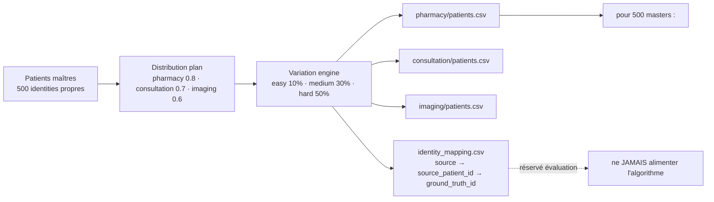

# Chapitre 4 — Analyse

> **Statut** : rédigé (08/09/2026, actualisé 27/09/2026)

## Objectif

Analyser le besoin avant toute conception : sources de données et leur
hétérogénéité, générateur de données synthétiques avec vérité terrain, exigences
fonctionnelles et non fonctionnelles, contraintes techniques (VM 8 Go, nœud
distant instable, interdiction de NLP lourd), **contexte local et conditions
d'applicabilité**, et **conduite de projet**. Cette analyse justifie les choix de
conception du chapitre 5, une fois l'existant examiné au chapitre 3.

---

## 4.1 Exigences fonctionnelles et non fonctionnelles

Le cahier des charges fixe six objectifs [cahier_des_charges.md §3], traduits ici
en exigences vérifiables :

| # | Exigence fonctionnelle | Critère de succès |
|---|---|---|
| F1 | **Centraliser** les données hétérogènes dans un Data Lake | pipeline ELT Medallion RAW → SILVER → GOLD |
| F2 | **Nettoyer / standardiser** selon un modèle commun | modèle canonique `CanonicalPatient` + pivot FHIR |
| F3 | **Dédupliquer** de façon **explicable** | master patient + identity map (score, méthode, seuil) |
| F4 | **Gouverner les accès** | RBAC + consentement *purpose-by-purpose* + audit + clés SHA-256 |
| F5 | **Visualiser** les indicateurs | dashboard RMA (optionnel) |
| F6 | **Évaluer** la déduplication | vérité terrain, précision / rappel / F1 |

Exigences non fonctionnelles : données **fictives uniquement** ; pipeline **rejouable**
et **idempotent** ; dédup **déterministe et reproductible** (seed) ; logique **toujours
explicable** ; architecture évolutive au volume (Spark) sans changer la sémantique.

## 4.2 Sources de données et hétérogénéité

Trois sources métier, modélisées sur les systèmes réellement rencontrés en
établissement (consultations, pharmacies, imagerie) [cahier_des_charges.md §1] :

| Source | Fichier | Identifiant | Champs patients |
|---|---|---|---|
| **pharmacy** | `pharmacy/patients.csv` | `client_id` | `nom_complet, naissance, cin, ville_naissance, adresse, sexe` |
| **consultation** | `consultation/patients.csv` | `patient_code` | `prenom, nom, date_naiss, no_cin, ville_nai, genre` |
| **imaging** | `imaging/patients.csv` | `id_personne` | `patient_name, dob, cin_number, birth_place, sex` |

L'hétérogénéité est **triple** et volontaire :

1. **Structure** : nom dans une seule colonne (`nom_complet`, `patient_name`) ou deux
   (`prenom + nom`) ; identifiants différents (`client_id` / `patient_code` /
   `id_personne` — `PH000001` / `MED000001` / `IMG000001`).
2. **Vocabulaire** : le genre apparaît sous les formes `H`/`F` (pharmacy),
   `male`/`female` (consultation), `Homme`/`femme` (imaging)
   [deduplication.md §2] — source des générateurs `SEXE_LABELS` / `GENRE_LABELS` /
   `SEX_LABELS`.
3. **Formats** : dates `01/02/1934`, `08-06-1943`, `YYYY-MM-DD` ; CIN
   `101 02404 5`, `101024045` (espacé ou compact), ou **absent** (~25 % des
   patients maîtres) ; ville de naissance en toutes lettres.

Le même patient réel apparaît donc sous des formes différentes, par exemple le cas
de référence « Jean Rakoto » des trois sources [deduplication.md §7] (chapitre 1).
Chaque source adjoint ses transactions métier : achats (pharmacy), consultations
(consultation), examens (imaging).

## 4.3 Générateur de données synthétiques et vérité terrain

L'évaluation objective exige de **connaître la vérité** — impossible avec de vraies
données. Le générateur
[`synthetic-patient-generator`](../projet/code-source/evaluation/synthetic-patient-generator/README.md)
produit des données fictives **et** leur vérité terrain, en 7 étapes
(déterministe : `RANDOM_SEED = 42`, locale `fr_FR`, CIN malgache couvert à
~75 % des maîtres) :

> **Figure 4 — La chaîne du générateur : 500 patients maîtres, une distribution par
> défaut, le moteur de variation (easy / medium / hard), puis les trois sources
> synthétiques. La table de vérité reste hors du champ de l'algorithme.**

- **Patients maîtres** `master_patients.csv` : 500 identités propres (défaut des
  évaluateurs `--patients 500 --seed 42`), dont ~75 % portent un **CIN**.
- **Distribution** : probabilités de présence 0.8 / 0.7 / 0.6 par source →
  **1 057 enregistrements** répartis **404 / 353 / 300**
  (`identity_mapping.csv` compté : 500 groupes `GT000001..GT000500`).
- **Variation engine** : niveaux de difficulté `easy 10 % / medium 30 % / hard 50 %`
  de probabilité par variation ; types débloqués progressivement — easy :
  casse, espaces, formats date/CIN ; medium (ajout) : inversion
  nom/prénom, typo légère ; hard (ajout) : typo, abréviation, valeur manquante
  (naissance ou ville de naissance — **jamais le CIN**, dont l'absence est une
  décision de niveau maître, cohérente entre les sources).
- **Vérité terrain** : `identity_mapping.csv` (colonnes `source, source_patient_id,
  ground_truth_id`) **jamais fournie à l'algorithme**, réservée à l'évaluation
  [deduplication.md — règle métier].

Transactions adjointes (dataset hard) : 792 achats (pharmacie, 1–3/patient),
519 consultations (1–2/patient), 450 examens imagerie (1–2/patient).

> **Deux usages distincts.** Le dataset **hard** (404/353/300) sert à
> l'**évaluation** de la dédup (chapitre 7). Le dataset **brut** d'ingestion
> (76/76/62 enregistrements) alimente le **pipeline ELT** de démonstration :
> 214 lignes SILVER, 145 masters, 69 doublons — run 07/09/2026
> [contexte_projet.md].

## 4.4 Contraintes techniques et environnementales

| Contrainte | Nature | Traitement adopté |
|---|---|---|
| **VM 8 Go / 4 cœurs** | mémoire limitée (Spark gourmand) | `executor 4g / driver 2g`, `shuffle.partitions=8` [cahier_des_charges.md §11] |
| **Nœud distant MAVIS instable** | source PostgreSQL distante (`mavis_notheme`, 11 tables, tunnel SSH) | répliques locales de dev (`rebuild_mavis_db.py`, 73 090 lignes) ; données finales synthétiques |
| **Interdiction NLP lourd** | `sentence_transformers` crash sous **Python 3.8** | RapidFuzz + dictionnaire de synonymes (`fhir_synonyms.py`) |
| **Stockage Spark sur partage vboxsf interdit** | corruption `part-*.snappy.parquet` | warehouse toujours `hdfs://localhost:9000` |
| **Reproductibilité** | évaluation et dédup déterministes | seed 42, seuil 0.80, pondérations 0.5/0.3/0.1/0.1 fixes |
| **Données sensibles** | RGPD art. 9 | **synthétiques uniquement** + gouvernance implémentée dans le système |

Environnement de référence : VM `ubuntu/focal64` (Vagrant) — Hadoop 3.3.6, Hive
3.1.3, Spark 3.4.2, venv Python, ports redirigés (9870 HDFS, 10000 Hive, 5000 API)
[provision/Vagrantfile].

## 4.5 Contexte local et conditions d'applicabilité

Un prototype reproductible sur sa VM ne devient un outil utilisable que si les
contraintes du terrain ont été regardées. Quatre plans de la réalité malgache
conditionnent l'applicabilité du projet — et deux d'entre eux n'ont **pas** pu
être résolus dans le périmètre du stage, ce qui doit être dit.

| Plan de réalité | Observation de terrain | Conséquence sur la solution | État |
|---|---|---|---|
| **Données de santé dispersées** | chaque service tient son propre registre (pharmacie, consultation, imagerie), sans identifiant commun | justifie l'Entity Resolution et le MPI : l'identifiant partagé doit être **reconstruit**, pas supposé | traité |
| **Organisation et rôles** | le service concerned n'a pas de référentiel d'identité ; la clé d'accès est un couple (identifiant fonctionnel, mot de passe) | l'API d'accès a été conçue sur un modèle **clé API + rôle** plutôt que sur des comptes nominatifs, plus simple à configurer sans annuaire | traité |
| **Infrastructure et connectivité** | réseau intermittent, alimentation non garantie, pas de cluster | conception **mono-nœud** et **rejouable** : un run complet repart de zéro et produit le même résultat (seed fixe) | traité |
| **Données sensibles, contexte juridique** | cadre juridique national des données de santé **non vérifié** dans ce stage : seul le RGPD et la loi française ont été étudiés (§2.5) | la conformité présentée est **européenne**, à transposer au droit malgache (loi sur les données à caractère personnel, autorité de protection) | **non traité** |

Deux points doivent rester explicites, car ils sont les plus souvent omis dans un
projet de ce type :

1. **Le droit applicable n'est pas celui du pays de l'établissement.** Le stage
   s'est appuyé sur le RGPD [B10] et les recommandations CNIL [B11], [B12] parce
   que ce sont les références accessibles depuis le stage. Elles constituent un
   **exigendum de conception exigeant** (finalité déterminée, minimisation,
   traçabilité, consentement explicite) et non une certification de conformité
   locale. La vérification du droit malgache — et de l'existence d'une autorité
   de contrôle — reste à faire avant toute mise en production.
2. **La volumétrie réelle n'a pas été utilisée.** Toutes les données sont
   synthétiques, générées à l'échelle du prototype (quelques centaines de lignes
   en SILVER, §4.3). Le dimensionnement réel de l'établissement — volumétrie,
   cardinalité, taux de doublons observé — est **inconnu** et conditionne le choix
   du seuil de similarité (§2.2) comme le partitionnement du blocking.

> **Ce que le contexte local change concrètement.** Sans annuaire d'identité, la
> gestion des accès par clé API avec trois rôles est un compromis pragmatique et
> non un choix esthétique. Avec un annuaire, elle serait remplacée par du vrai
> RBAC nominatif ; le travail sur le consentement (§2.5, §5.5) resterait
> inchangé, car il est indépendant du mode d'authentification.

## 4.6 Conduite de projet et jalons

Le stage a suivi une **démarche incrémentale en cinq jalons**, chaque jalon
n'étant stabilisé (tests, évaluation) avant d'engager le suivant. Cette
progression est un choix de gestion du risque autant que de méthode technique.

| Jalon | Contenu | Critère de sortie | Preuve |
|---|---|---|---|
| **J1 — Socle** | générateur de données synthétiques + vérité terrain | 44 tests verts, 500 masters, 3 niveaux de difficulté | `evaluation/synthetic-patient-generator/` |
| **J2 — Moteur** | canonique + blocking + exact/probabiliste (Pandas) | précision 1.000, parité Pandas = Spark | `engine/identity/`, `evaluation_truth.md` |
| **J3 — Big Data** | pipeline ELT Medallion RAW → SILVER → GOLD | 4/4 étapes vertes, 214 lignes SILVER, 145 masters, 69 doublons | `run_pipeline.sh`, `elt.log` |
| **J4 — Gouvernance** | RBAC, clés API, consentement *purpose-by-purpose*, audit, refus 403 journalisé | suite de tests complète verte, dont 403 et 401 vérifiés | `engine/governance/`, `tests/` |
| **J5 — Mémoire** | structuration en 9 chapitres (glossaire inclus), état de l'art sourcé, mise en cohérence de la preuve | 20 références citées, aucun chiffre non vérifiable | ce dépôt |

**Règles de pilotage appliquées** : ne pas engager une évolution avant que le
contrôle ciblé du niveau précédent soit vert ; toute décision d'architecture est
tracée avec sa raison (ce mémoire) ; chaque limite constatée est écrite dans le
chapitre des limites plutôt que passée sous silence ; les données de test ne sont
jamais remplacées par des données réelles, y compris quand elles seraient
plus-commodes à obtenir.

> **Ce que ce découpage a permis, et ce qu'il a coûté.** Il a rendu chaque jalon
> démontrable indépendamment, donc présentable en soutenance sans dépendre de la
> disponibilité de la VM. Il a en revanche consume du temps de réintégration
> entre Pandas et Spark : la parité stricte exigait de porter l'algorithme deux
> fois, ce qui n'aurait pas été nécessaire si le choix de l'échelle avait été
> arrêté plus tôt. C'est la principale leçon de conduite de projet tirée du stage
> (§8.4).

## 4.7 Synthèse de l'analyse

L'analyse dégage trois besoins dominants :
1. **Interpréter des formats divergents** → un modèle canonique + un pivot FHIR.
2. **Dédupliquer sans vérité** → mesures de similarité + seuil, évaluées sur
   ground truth (chapitres 2, 5 et 7).
3. **Pouvoir passer à l'échelle** → choix Spark + Data Lake Medallion.

À ces trois besoins s'ajoutent deux exigences transverses que le contexte local
rend non négociables : **l'explicabilité** de toute décision (§2.11) et la
**gouvernance par consentement** (§2.5, §5.5), qui ne peuvent être traitées après
coup — une fois les données dédupliquées sans elle, la traçabilité du refus est
perdue.

Sans aspect de l'état de l'art « pour la forme » : chaque technologie répond à un
besoin identifié ici.

## Conclusion et transition

Le besoin est précis : trois sources hétérogènes, des exigences claires, des
contraintes rebutées une à une, un contexte local dont on a extrait ce qui change
la solution, et une conduite de projet en cinq jalons vérifiables. Le chapitre 5
conçoit la réponse : architecture en trois niveaux, modèle canonique, algorithmes
de déduplication (blocking, exact + probabiliste, seuil 0.80), schéma PostgreSQL
et gouvernance (consentement, audit, clés API).

### Références

- `documents/cahier_des_charges.md` §1, §3, §6, §7, §11.
- `documents/documentation/deduplication.md` §2, §7 et règle métier.
- `evaluation/synthetic-patient-generator/README.md` et `config/settings.py`.
- `ai/memoire/contexte_projet.md` (chiffres du run final).
- `provision/Vagrantfile`, `bootstrap.sh`.
- `projet/code-source/engine/governance/` (gouvernance, J4).
- `ai/dev/logs.md`, `ai/dev/suivi_avancement.md` (jalons J1 à J5).