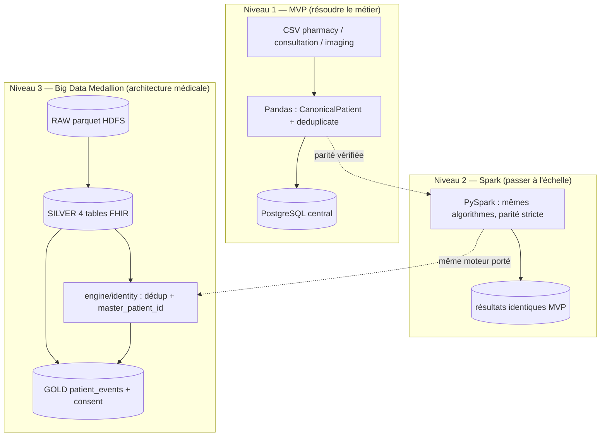

# Chapitre 4 — Conception

> **Statut** : rédigé (08/09/2026)

## Objectif

Concevoir la réponse au besoin analysé au chapitre 3 : architecture en trois
niveaux (MVP → Spark → Big Data), modèle canonique, algorithmes de déduplication
explicable (blocking, exact, probabiliste), modèle de données PostgreSQL et
gouvernance (RBAC, consentement, audit, clés API).

---

## 4.1 Architecture globale

L'architecture suit la démarche progressive du chapitre 1 : chaque niveau réutilise
la **même logique métier**, seule l'infrastructure d'exécution change.



Design retenu pour chaque brique [cahier des charges §4] :

| Brique | Conception |
|---|---|
| **Extraction** | couche d'extraction abstraite (CSV / PostgreSQL / SQLite) → RAW |
| **Normalisation** | modèle canonique `CanonicalPatient` |
| **Interopérabilité** | schéma pivot **FHIR** (4 entités) |
| **Déduplication** | blocking + exact + probabiliste (RapidFuzz), seuil 0.80 |
| **Consolidation** | master patient + identity map traçable |
| **Chargement** | PostgreSQL central idempotent (`ON CONFLICT`, `IF NOT EXISTS`) |
| **Exposition** | API REST + espace de gouvernance |

## 4.2 Modèle canonique et mapping des sources

Chaque source possède son vocabulaire (chapitre 3). La conception introduit une
représentation unique, `CanonicalPatient` [deduplication.md §2] :

```text
source_system · source_patient_id · first_name · last_name · full_name
birth_date · cin · birth_city · address · gender
```

Le mapping des colonnes source → canonique est **explicite et déterministe**
(`canonical.py::map_patient()`) ; le `matching_key` produit la clé de déduplication
`(birth_date, cin, nom normalisé)`.

| Champ | pharmacy | consultation | imaging | Standardisation `_*` |
|---|---|---|---|---|
| ID | `client_id` | `patient_code` | `id_personne` | — |
| Nom | `nom_complet` | `prenom` + `nom` | `patient_name` | `_normalized` : minuscules, sans accents, sans ponctuation |
| Naissance | `naissance` | `date_naiss` | `dob` | `_birth_date` → ISO `YYYY-MM-DD` |
| CIN | `cin` | `no_cin` | `cin_number` | `_cin` : chiffres uniquement |
| Ville de naissance | `ville_naissance` | `ville_nai` | `birth_place` | `_text` + `_normalized` |
| Genre | `sexe` H/F | `genre` male/female | `sex` Homme/femme | `_gender` → `M` / `F` |

La normalisation rend comparable ce que la saisie rendait divergent : les trois
formes du cas « Jean Rakoto » produisent des valeurs canoniques identiques.

## 4.3 Entity Resolution : blocking et déduplication

**Blocking.** Comparer chaque enregistrement à tous les autres est en O(n²). Le
concept utilise trois index de candidats : préfixe du nom (4 lettres), date de
naissance ISO, CIN (`_MasterIndex`, 3 buckets) ; le matching n'évalue que
l'union des candidats de ces buckets [deduplication.md §4].

**Déduplication en deux passes** (`deduplicate()`, seuil `probabilistic_threshold`
= 0.80) :

1. **Exact matching** — le patient partage la `matching_key` d'un master, ou bien
   naissance égale **et** CIN non vide identique (absorbe les inversions
   prénom/nom). Décision `exact`, score 1.0.
2. **Probabilistic matching** — parmi les candidats du blocking, score de
   similarité **pondéré** [deduplication.md §5] :

   | Critère | Similarité | Poids |
   |---|---|---:|
   | Nom | `fuzz.ratio` (token, insensible à l'ordre) | 0.50 |
   | Date de naissance | exacte | 0.30 |
   | CIN | exact (si présent, ~75 %) | 0.10 |
   | Ville de naissance | exacte (normalisée) | 0.10 |

   Score ≥ 0.80 → décision `probabilistic` (score conservé) ; sinon → nouveau
   master (`new_master`).
3. Chaque décision porte **`master_patient_id`, `method`, `score`, `explanation`** —
   la règle d'or « jamais fusionner sans logique explicable » est structurelle,
   pas une convention [deduplication.md — règle métier].

Le cas de référence est conçu pour être résolu : Jean Rakoto (exact, CIN) et
Nirina (probabiliste, score 0.8+) [deduplication.md §7].

## 4.4 Modèle de données PostgreSQL et idempotence

Le schéma central (`sql/schema.sql`) couvre la traçabilité des données brutes, des
identités et de la gouvernance [consentement_gouvernance.md §6] :

| Table | Rôle | Clés de conception |
|---|---|---|
| `raw_patient_record` | historique append-only, jamais exposé | payload `JSONB`, `UNIQUE(source_system, source_patient_id)` |
| `master_patient` | identité unique | `gender CHECK IN ('M','F','')` |
| `patient_identity_map` | source → master | `match_method CHECK IN ('new_master','exact','probabilistic')`, `match_score NUMERIC(4,3)`, `explanation` |
| `consent` | consentement purpose-by-purpose | `purpose`, `granted`, `recorded_at` |
| `api_user` | utilisateurs machine | `api_key_hash` (SHA-256), `role CHECK ('admin','analyst','viewer')` |
| `access_audit` | journal de toutes les tentatives | endpoint, status, IP |
| `medicine_purchase` / `patient_consultation` / `imaging_exam` | transactions métier rattachées au master | `payload JSONB`, `UNIQUE(source_system, source_record_id)` |

**Idempotence** : `CREATE TABLE IF NOT EXISTS` pour les tables, `ADD COLUMN IF
NOT EXISTS` pour les migrations — le pipeline est rejouable [consentement_gouvernance.md §6].

## 4.5 Gouvernance : RBAC, consentement, audit

- **Rôles** : `admin` / `analyst` / `viewer` — contrôlés par clé API sur la
  plateforme (et RBAC web optionnel côté frontend) [consentement_gouvernance.md §2].
- **Clés API** : hachées SHA-256 en base ; la clé en clair n'est jamais stockée ni
  exposée [consentement_gouvernance.md §5].
- **Consentement purpose-by-purpose** : table `consent` liée au master ; la
  décision d'accès ne dépend pas du rôle seul — un utilisateur **autorisé mais
  sans finalité consentie** est refusé (et le refus est audité)
  [consentement_gouvernance.md §3]. Cette conception matérialise l'article 9 du
  RGPD (dérogation par consentement explicite) appliqué à des données synthétiques.
- **Audit** : middleware journalisant chaque requête avec `user`, `endpoint`,
  `method`, `status`, `ip` et durée, **y compris les refus et les appels anonymes**
  [consentement_gouvernance.md §4].

## 4.6 Niveaux 2 et 3 : Spark et Data Lake Medallion

**Niveau 2 (conception de la parité).** L'algorithme est porté en PySpark sans
changer sa sémantique : clusters **exacts** construits par `groupBy` de la clé,
puis résolution **probabiliste driver-side sur les ancres de clusters**
(`_BoundedMasterIndex`) — la comparaison reste bornée, d'où la montée en charge
[`spark_dedup.py`]. La parité Panda/Spark est un **critère de conception**, vérifié
par test et par évaluation sur la vérité terrain.

**Niveau 3 (Design Medallion)** [bigdata_concepts.md §3] :

| Couche | Rôle dans la conception | Écriture |
|---|---|---|
| **RAW** | donnée brute, inchangée (schéma-on-read) | parquet HDFS `/datalake/raw/{source}/{table}` + tables Hive externes |
| **SILVER** | normalisée **FHIR** (4 entités), doublons **marqués et expliqués** | `datalake_silver.{patient,encounter,condition,observation}_fhir` |
| **GOLD** | agrégats prêts à l'analyse + consentement | `datalake_gold.patient_events_gold` (17→18 colonnes, 8 tranches RMA), `patient_consent_gold` |

La logique ELT impose : l'ingestion **charge** la donnée brute, la transformation
s'applique *a posteriori* dans les couches suivantes — la zone RAW reste le
référentiel de rejeu.

## Conclusion et transition

La conception fixe un système cohérent : un canonique + deux passes de dédup
expliquées, un PostgreSQL traçable et une gouvernance par consentement. Le chapitre
5 restitue l'implémentation effective — les scripts, les résultats réels (214
lines SILVER, 145 masters, 69 doublons) et les difficultés rencontrées sur la VM.

### Références

- `documents/documentation/deduplication.md` (canonique, blocking, seuil, règles).
- `documents/documentation/consentement_gouvernance.md` (RBAC, consentement, audit).
- `documents/documentation/bigdata_concepts.md` (Medallion, Spark, HDFS/Hive).
- `sql/schema.sql` ; `engine/identity/canonical.py`, `matcher.py`, `spark_dedup.py`.