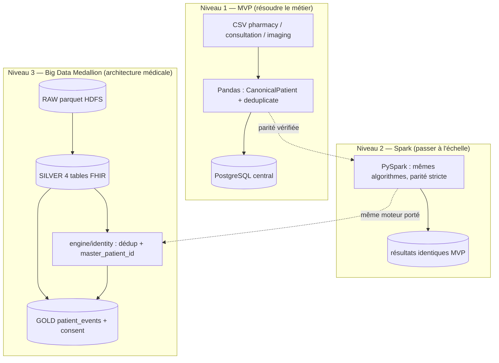
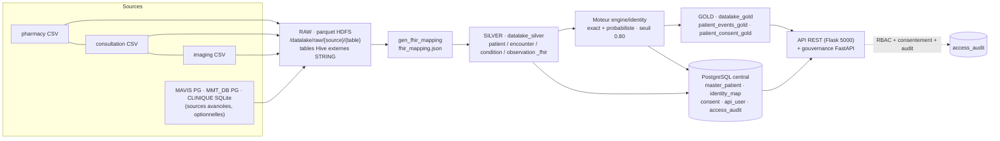

# Chapitre 5 — Conception et architecture

> **Statut** : rédigé (08/09/2026, actualisé 27/09/2026)

## Objectif

Concevoir la réponse au besoin analysé au chapitre 4 : architecture en trois
niveaux (MVP → Spark → Big Data), modèle canonique, algorithmes de déduplication
explicable (blocking, exact, probabiliste), modèle de données PostgreSQL et
gouvernance (RBAC, consentement, audit, clés API).

---

## 5.1 Architecture globale

L'architecture suit la démarche progressive du chapitre 1 : chaque niveau réutilise
la **même logique métier**, seule l'infrastructure d'exécution change.



> **Figure 5 — L'architecture en trois niveaux : le MVP Pandas, la parité PySpark
> vérifiée, puis le Data Lake Medallion RAW → SILVER → GOLD, qui porte le moteur et la
> gouvernance.**

Design retenu pour chaque brique [cahier des charges §4] :

**Tableau 20 — Les sept briques de la chaîne retenue et la conception adoptée pour chacune.**

| Brique | Conception |
|---|---|
| **Extraction** | couche d'extraction abstraite (CSV / PostgreSQL / SQLite) → RAW |
| **Normalisation** | modèle canonique `CanonicalPatient` |
| **Interopérabilité** | schéma pivot **FHIR** (4 entités) |
| **Déduplication** | blocking + exact + probabiliste (RapidFuzz), seuil 0.80 |
| **Consolidation** | master patient + identity map traçable |
| **Chargement** | PostgreSQL central idempotent (`ON CONFLICT`, `IF NOT EXISTS`) |
| **Exposition** | API REST + espace de gouvernance |

### 5.1.1 Chaîne de bout en bout (niveau 3 retenu)

La conception retenue en production est le **niveau 3** : une seule chaîne, de la source
hétérogène à l'API gouvernée. Le schéma ci-dessous relie les trois zones Medallion, le moteur de
déduplication et la gouvernance ; il sert de référence à la réalisation (chapitre 6).



> **Figure 6 — Le chemin d'une donnée, de la source à l'API : les trois zones du Data
> Lake, le moteur de déduplication, la base centrale, et l'audit de chaque accès.**

Traçabilité de bout en bout : chaque ligne SILVER conserve `_source_system`, `_source_table`,
`source_patient_id` et `patient_uuid` (`sha2(source|source_patient_id)`) ; chaque fusion porte
`master_patient_id`, `match_method`, `match_score` et `explanation` [bases_de_donnees.md §3].

### 5.1.2 Composants et ports de la plateforme

L'architecture est déployée sur **une VM unique** (`ubuntu/focal64`, Vagrant, 8 Go / 4 cœurs) ;
l'ordre de démarrage des services est strict [architecture.md §3] :

**Tableau 21 — Les composants déployés sur la VM, leur rôle et leur port ou leur chemin ; l'ordre de démarrage est imposé.**

| Composant | Rôle | Port / chemin |
|---|---|---|
| HDFS NameNode | entrepôt du Data Lake (parquet RAW/SILVER/GOLD) | 9000 — `start-dfs.sh` en premier |
| YARN | exécution des jobs Spark | 8088 — `start-yarn.sh` ensuite |
| Hive Metastore | métadonnées des bases `datalake_*` | 9083 (distant, évite le conflit Derby) |
| HiveServer2 | accès SQL (`beeline`) | 10000 |
| Moteur `engine/` | déduplication + gouvernance (PostgreSQL) | — |
| API données (Flask) | exposition de GOLD | 5000 |
| API gouvernance (FastAPI) | `/health`, `/metrics`, `/patients`, `/audit`, `/consent` | — |
| Frontend Next.js | visualisation RMA (**optionnel**) | 3000 (hôte Windows) |

> **Ordre strict :** `start-dfs.sh` → `start-yarn.sh` → metastore (9083) → HiveServer2 (10000) →
> jobs Spark → API. Toute inversion produit des erreurs d'écriture ou de métadonnées (§6.6).

## 5.2 Modèle canonique et mapping des sources

Chaque source possède son vocabulaire (chapitre 4). La conception introduit une
représentation unique, `CanonicalPatient` [deduplication.md §2] :

```text
source_system · source_patient_id · first_name · last_name · full_name
birth_date · cin · birth_city · address · gender
```

Le mapping des colonnes source → canonique est **explicite et déterministe**
(`canonical.py::map_patient()`) ; le `matching_key` produit la clé de déduplication
`(birth_date, cin, nom normalisé)`.

**Tableau 22 — Le mapping des colonnes source vers le modèle canonique, et la règle de standardisation appliquée à chaque champ.**

| Champ | pharmacy | consultation | imaging | Standardisation `_*` |
|---|---|---|---|---|
| ID | `client_id` | `patient_code` | `id_personne` | — |
| Nom | `nom_complet` | `prenom` + `nom` | `patient_name` | `_normalized` : minuscules, sans accents, sans ponctuation |
| Naissance | `naissance` | `date_naiss` | `dob` | `_birth_date` → ISO `YYYY-MM-DD` |
| CIN | `cin` | `no_cin` | `cin_number` | `_cin` : chiffres uniquement |
| Ville de naissance | `ville_naissance` | `ville_nai` | `birth_place` | `_text` + `_normalized` |
| Genre | `sexe` H/F | `genre` male/female | `sex` Homme/femme | `_gender` → `M` / `F` |

La normalisation rend comparable ce que la saisie rendait divergent : les trois
formes du cas « Jean Rakoto » produisent des valeurs canoniques identiques.

## 5.3 Entity Resolution : blocking et déduplication

**Blocking.** Comparer chaque enregistrement à tous les autres est en O(n²). Le
concept utilise trois index de candidats : préfixe du nom (4 lettres), date de
naissance ISO, CIN (`_MasterIndex`, 3 buckets) ; le matching n'évalue que
l'union des candidats de ces buckets [deduplication.md §4].

**Déduplication en deux passes** (`deduplicate()`, seuil `probabilistic_threshold`
= 0.80) :

1. **Exact matching** — le patient partage la `matching_key` d'un master, ou bien
   naissance égale **et** CIN non vide identique (absorbe les inversions
   prénom/nom). Décision `exact`, score 1.0.
2. **Probabilistic matching** — parmi les candidats du blocking, score de
   similarité **pondéré** [deduplication.md §5] :

**Tableau 23 — Le calcul du score de similarité : une similarité et un poids par critère, pour un total qui doit atteindre 0,80 pour fusionner.**

   | Critère | Similarité | Poids |
   |---|---|---:|
   | Nom | `fuzz.ratio` (token, insensible à l'ordre) | 0.50 |
   | Date de naissance | exacte | 0.30 |
   | CIN | exact (si présent, ~75 %) | 0.10 |
   | Ville de naissance | exacte (normalisée) | 0.10 |

   Score ≥ 0.80 → décision `probabilistic` (score conservé) ; sinon → nouveau
   master (`new_master`).
3. Chaque décision porte **`master_patient_id`, `method`, `score`, `explanation`** —
   la règle d'or « jamais fusionner sans logique explicable » est structurelle,
   pas une convention [deduplication.md — règle métier].

Le cas de référence est conçu pour être résolu : Jean Rakoto (exact, CIN) et
Nirina (probabiliste, score 0.8+) [deduplication.md §7].

## 5.4 Modèle de données PostgreSQL et idempotence

Le schéma central (`sql/schema.sql`) couvre la traçabilité des données brutes, des
identités et de la gouvernance [consentement_gouvernance.md §6] :

**Tableau 24 — Les tables du modèle central PostgreSQL, leur rôle et les clés qui rendent l'écriture idempotente.**

| Table | Rôle | Clés de conception |
|---|---|---|
| `raw_patient_record` | historique append-only, jamais exposé | payload `JSONB`, `UNIQUE(source_system, source_patient_id)` |
| `master_patient` | identité unique | `gender CHECK IN ('M','F','')` |
| `patient_identity_map` | source → master | `match_method CHECK IN ('new_master','exact','probabilistic')`, `match_score NUMERIC(4,3)`, `explanation` |
| `consent` | consentement par finalité (*purpose-by-purpose*) | `purpose` (`CHECK IN ('api_access','research','analytics')`), `granted`, `recorded_at` |
| `api_user` | utilisateurs machine | `api_key_hash` (SHA-256), `role CHECK ('admin','analyst','viewer')` |
| `access_audit` | journal de toutes les tentatives | endpoint, status, IP, `purpose`, `refusal_reason`, `accessed_at` |
| `medicine_purchase` / `patient_consultation` / `imaging_exam` | transactions métier rattachées au master | `payload JSONB`, `UNIQUE(source_system, source_record_id)` |

**Idempotence** — relancer le même traitement ne duplique rien et ne casse rien :
`CREATE TABLE IF NOT EXISTS` pour les tables, `ADD COLUMN IF
NOT EXISTS` pour les migrations — le pipeline est rejouable [consentement_gouvernance.md §6].

## 5.5 Gouvernance : RBAC, consentement, audit

Trois mécanismes, dans cet ordre : on **qui** demande, on **pourquoi** il demande,
et on **trace** ce qui s'est passé.

- **Rôles** : `admin` / `analyst` / `viewer` — contrôlés par clé API sur la
  plateforme (et RBAC web optionnel côté frontend) [consentement_gouvernance.md §2].
- **Clés API** : hachées SHA-256 en base ; la clé en clair n'est jamais stockée ni
  exposée [consentement_gouvernance.md §5]. Cette empreinte protège la lecture directe
  de la table, mais le hachage retenu n'est **ni salé ni lent** : c'est une dette
  déclarée, avec sa cause et sa voie de correction, en § 8.3.
- **Finalité déclarée** : `purpose` est un **paramètre obligatoire** de
  `/patients` et `/patients/{id}`, validé contre une liste fermée
  (`api_access`, `research`, `analytics`) — un code **422** est renvoyé pour une
  finalité inconnue. Le refus par finalité non consentie produit un **403**.
- **Consentement par finalité** (*purpose-by-purpose*) : table `consent` liée au master ; la
  décision d'accès ne dépend pas du rôle seul — un utilisateur **autorisé mais
  sans finalité consentie** est refusé. Sur la liste, les patients sans
  consentement sont **retirés** de la réponse, et le nombre d'exclusions est
  journalisé : l'endpoint ne peut pas servir par inadvertance un patient non
  consenti. Cette conception matérialise l'article 9 du RGPD (dérogation par
  consentement explicite) appliqué à des données synthétiques.
- **Audit** : middleware journalisant chaque requête avec `user`, `endpoint`,
  `method`, `status`, `ip`, **`purpose`** et **`refusal_reason`**, y compris les
  refus et les appels anonymes [consentement_gouvernance.md §4]. Le refus est donc
  *consultable* a posteriori, et pas seulement déductible du code HTTP.

**Ce que la conception ne couvre pas** (assumé, §8.3) : ni `data_scope` (périmètre
de données), ni durée de validité du consentement, ni chiffrement au repos du
journal d'audit, ni mesure de temps de traitement persistée.

## 5.6 Niveaux 2 et 3 : Spark et Data Lake Medallion

**Niveau 2 (conception de la parité).** L'algorithme est porté en PySpark sans
changer sa sémantique : clusters **exacts** construits par `groupBy` de la clé,
puis résolution **probabiliste driver-side sur les ancres de clusters**
(`_BoundedMasterIndex`) — la comparaison reste bornée, d'où la montée en charge
[`spark_dedup.py`]. La parité Panda/Spark est un **critère de conception**, vérifié
par test et par évaluation sur la vérité terrain.

**Niveau 3 (Design Medallion)** [bigdata_concepts.md §3] :

**Tableau 25 — L'écriture dans les trois zones du Data Lake : ce que chaque zone reçoit et sous quelle forme.**

| Couche | Rôle dans la conception | Écriture |
|---|---|---|
| **RAW** | donnée brute, inchangée (schéma-on-read) | parquet HDFS `/datalake/raw/{source}/{table}` + tables Hive externes |
| **SILVER** | normalisée **FHIR** (4 entités), doublons **marqués et expliqués** | `datalake_silver.{patient,encounter,condition,observation}_fhir` |
| **GOLD** | agrégats prêts à l'analyse + consentement | `datalake_gold.patient_events_gold` (17→18 colonnes, 8 tranches RMA), `patient_consent_gold` |

La logique ELT impose : l'ingestion **charge** la donnée brute, la transformation
s'applique *a posteriori* dans les couches suivantes — la zone RAW reste le
référentiel de rejeu.

## Conclusion et transition

La conception fixe un système cohérent : un canonique + deux passes de dédup
expliquées, un PostgreSQL traçable et une gouvernance par consentement. Le chapitre
6 restitue l'implémentation effective — les scripts, les résultats réels (214
lignes SILVER, 145 masters, 69 doublons) et les difficultés rencontrées sur la VM.

### Références

- `documents/documentation/deduplication.md` (canonique, blocking, seuil, règles).
- `documents/documentation/consentement_gouvernance.md` (RBAC, consentement, audit).
- `documents/documentation/bigdata_concepts.md` (Medallion, Spark, HDFS/Hive).
- `sql/schema.sql` ; `engine/identity/canonical.py`, `matcher.py`, `spark_dedup.py`.