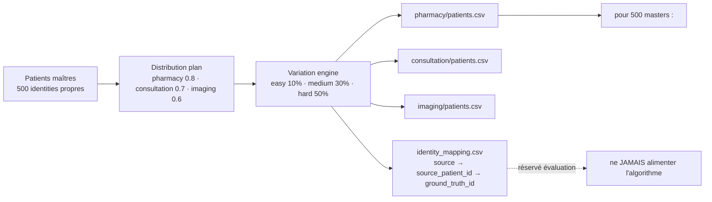

# Chapitre 5 — Exigences réalisées

## Objectif

Présenter ce que la plateforme fait, vu par l'utilisateur : les exigences fonctionnelles,
organisées selon les étapes du pipeline et illustrées par des cas d'utilisation ; les exigences
non fonctionnelles (utilisabilité, performance, scalabilité, sécurité, maintenance) ; et les
interfaces, côté écran comme côté systèmes.

---

## 5.1 Exigences fonctionnelles

Le cahier des charges fixe six objectifs [cahier_des_charges.md §3], traduits ici
en exigences vérifiables :

**Tableau 26 — Les six exigences fonctionnelles et leur critère de succès vérifiable.**

| # | Exigence fonctionnelle | Critère de succès |
|---|---|---|
| F1 | **Centraliser** les données hétérogènes dans un Data Lake | pipeline ELT Medallion RAW → SILVER → GOLD |
| F2 | **Nettoyer / standardiser** selon un modèle commun | modèle canonique `CanonicalPatient` + pivot FHIR |
| F3 | **Dédupliquer** de façon **explicable** | master patient + identity map (score, méthode, seuil) |
| F4 | **Gouverner les accès** | RBAC + consentement *purpose-by-purpose* + audit + clés SHA-256 |
| F5 | **Visualiser** les indicateurs | vues de gouvernance : déduplication et consentement (optionnel) |
| F6 | **Évaluer** la déduplication | vérité terrain, précision / rappel / F1 |

Les exigences sont organisées en **quatre étapes**, qui suivent le chemin de la donnée, puis
une activité transverse d'évaluation. Les cas d'utilisation (CU) ci-dessous précisent **qui**
agit, **à partir de quand** et **ce qui se passe quand ça échoue**. Ils reprennent les étapes du
pipeline détaillées au § 7.3, mais vues par l'usage et non par l'implémentation, et sont écrits
comme des scénarios, pas comme des lignes de code.

**Tableau 27 — Les quatre étapes fonctionnelles, les exigences qu'elles couvrent et les cas d'utilisation qui les illustrent.**

| Étape | Exigences | Cas d'utilisation |
|---|---|---|
| **1 — Intégration des sources** | F1, F2 | CU1, CU2 |
| **2 — Déduplication et MPI** | F3 | CU3 |
| **3 — Gouvernance des accès** | F4 | CU4, CU5 |
| **4 — Exploitation et pilotage** | F5 | CU6, CU7, CU8 |
| **Transverse — Évaluation** | F6 | générateur et vérité terrain (§ 5.1.5) |

### 5.1.1 Étape 1 — Intégration des sources

**CU1 — Ingérer un lot de sources.** *Acteur* : le développeur, ou le processus automatique
lui-même. *Prérequis* : trois fichiers CSV présents, un par source. *Déroulement* :
l'extraction lit chaque source et écrit ses fiches dans `raw_patient_record` et dans la zone
RAW du Data Lake, sans transformation. *Résultat attendu* : le nombre de lignes de RAW égale
la somme des lignes lues. *Cas limite* : un fichier source absent ou tronqué interrompt le lot
et l'erreur est journalisée dans `elt.log` — le lot n'est jamais repris à moitié, ce qui
interdit d'obtenir une zone RAW partiellement écrite.

**CU2 — Ramener des formats différents à un modèle unique.** *Acteur* : le processus
automatique. *Prérequis* : la zone RAW remplie. *Déroulement* : l'étape de mapping FHIR
associe chaque champ attendu à la colonne source la plus proche, puis la normalisation produit
le modèle canonique `CanonicalPatient` dans la zone SILVER. *Résultat attendu* : toute fiche,
quelle que soit sa source, sort au même format. *Cas limite* : un champ sans équivalent dans
la source reste vide et n'est pas deviné ; le mapping est écrit dans un fichier de règles et
non dans le code, pour qu'un changement de source ne demande pas de modifier le programme.

### 5.1.2 Étape 2 — Déduplication et MPI

**CU3 — Dédupliquer et décider qui est le même patient.** *Acteur* : le processus
automatique. *Prérequis* : la zone SILVER, et une vérité terrain pour évaluer le résultat.
*Déroulement* : le blocking réduit les comparaisons, le rapprochement exact s'applique d'abord,
puis le rapprochement probabiliste pondéré par champ, au-dessus du seuil de 0,80. *Résultat
attendu* : un `master_patient` par personne retenue, et une `patient_identity_map` qui relie
**chaque** fiche d'origine au master retenu, avec son score et la méthode qui a décidé. *Cas
limite* : deux fiches très proches mais non fusionnées restent traçables comme faux
négatifs, avec leur score ; aucune fusion n'est appliquée sans inscription dans cette table,
donc aucune fusion n'est invisible.

### 5.1.3 Étape 3 — Gouvernance des accès

**CU4 — Appliquer le consentement avant d'exposer la donnée.** *Acteur* : le processus
automatique. *Prérequis* : les tables de déduplication et de consentement. *Déroulement* :
la construction de la zone GOLD ne conserve, pour chaque master, que les finalités
effectivement accordées, avec le refus par défaut en l'absence d'avis. *Résultat attendu* :
aucune donnée sans consentement n'atteint la zone GOLD. *Cas limite* : le refus est
définitif tant qu'il n'est pas levé ; il n'y a pas d'« accès provisoire ».

**CU5 — Interroger l'API pour un patient donné.** *Acteur* : un utilisateur authentifié, ou
une application tierce présentant une clé d'API. *Prérequis* : une clé connue de la table
`api_user`, et un consentement enregistré. *Déroulement* : la clé est résolue en utilisateur
et en rôle, la finalité demandée est comparée aux consentements, la réponse est renvoyée, et
l'appel est journalisé dans `access_audit`. *Résultat attendu* : la liste des patients ou le
détail d'un patient, avec une trace d'audit systématique. *Cas limite* : un consentement
manquant ou une finalité non accordée produit un **403** — et non un 404 silencieux, ni une
liste réduite — et ce refus est journalisé au même titre qu'un accès accordé. C'est le point
où se joue la crédibilité du dispositif de gouvernance : un refus doit être visible.

### 5.1.4 Étape 4 — Exploitation et pilotage

**CU6 — Consulter les vues de gouvernance (déduplication et consentement).** *Acteur* : un
lecteur du frontend. *Prérequis* : la zone SILVER/GOLD peuplée, ou le jeu de
démonstration. *Déroulement* : le frontend appelle l'API REST des indicateurs du warehouse et
affiche les indicateurs de déduplication (masters, doublons, méthodes) et de consentement
(accords/refus par finalité). *Résultat attendu* : des indicateurs calculés sur les données
dédupliquées, donc sans double comptage. *Cas limite* : ce frontend est explicitement
**optionnel** dans le cahier des charges ; il est servi avec un repli sur un jeu de
démonstration chaque fois que Hive/Spark ne répond pas, ce repli étant signalé comme tel à
l'écran. Le mémoire ne présente donc pas le frontend comme un résultat du projet, mais comme
une illustration de ce que la zone GOLD pourrait exposer.

**CU7 — Planifier et piloter le pipeline.** *Acteur* : l'administrateur. *Prérequis* : les
services Spark/Hive démarrés et une planification définie. *Déroulement* : la fréquence
(`daily` / `weekly` / `monthly`) est fixée par l'API `/pipeline/schedule` ou le fichier
`schedule.yaml` ; le cron de la VM vérifie l'échéance chaque minute et lance
`run_pipeline.sh` en arrière-plan ; `/pipeline/status` expose le plan, le prochain run,
l'état du dernier run et la fraîcheur des sources. *Résultat attendu* : un run lancé
régulièrement, **sans doublon** tant qu'un run est en cours, et **reprise** de la première
étape non terminée en cas d'échec. *Cas limite* : une source dont l'empreinte n'a pas changé
est **sautée** (incrémental) — on ne retraite que ce qui a changé, par choix explicite ou
comparaison d'empreinte.

**CU8 — Consulter un dossier patient.** *Acteur* : un médecin authentifié (rôle `MEDECIN`
côté frontend), finalité déclarée. *Prérequis* : un accès web, un consentement enregistré.
*Déroulement* : la page `/patients` recherche et pagine, en **retirant silencieusement** les
masters sans consentement pour la finalité demandée ; `/patients/{id}` affiche l'identité, la
carte d'identité (identity map) et les consentements par finalité. *Résultat attendu* : une
lecture rapide et lisible, chaque appel journalisé dans `access_audit`. *Cas limite* : un
master sans consentement n'apparaît simplement pas dans la liste — l'exclusion est comptée et
journalisée plutôt qu'annoncée à l'écran.

### 5.1.5 Évaluation de la déduplication : générateur et vérité terrain

L'évaluation objective exige de **connaître la vérité** — impossible avec de vraies
données. Le générateur
[`synthetic-patient-generator`](../projet/code-source/evaluation/synthetic-patient-generator/README.md)
produit des données fictives **et** leur vérité terrain, en 7 étapes
(déterministe : `RANDOM_SEED = 42`, locale `fr_FR`, CIN malgache couvert à
~75 % des maîtres) :

> **Figure 3 — La chaîne du générateur : 500 patients maîtres, une distribution par
> défaut, le moteur de variation (easy / medium / hard), puis les trois sources
> synthétiques. La table de vérité reste hors du champ de l'algorithme.**

- **Patients maîtres** `master_patients.csv` : 500 identités propres (défaut des
  évaluateurs `--patients 500 --seed 42`), dont ~75 % portent un **CIN**.
- **Distribution** : probabilités de présence 0.8 / 0.7 / 0.6 par source →
  **1 057 enregistrements** répartis **404 / 353 / 300**
  (`identity_mapping.csv` compté : 500 groupes `GT000001..GT000500`).
- **Variation engine** : niveaux de difficulté `easy 10 % / medium 30 % / hard 50 %`
  de probabilité par variation ; types débloqués progressivement — easy :
  casse, espaces, formats date/CIN ; medium (ajout) : inversion
  nom/prénom, typo légère ; hard (ajout) : typo, abréviation, valeur manquante
  (naissance ou ville de naissance — **jamais le CIN**, dont l'absence est une
  décision de niveau maître, cohérente entre les sources).
- **Vérité terrain** : `identity_mapping.csv` (colonnes `source, source_patient_id,
  ground_truth_id`) **jamais fournie à l'algorithme**, réservée à l'évaluation
  [deduplication.md — règle métier].

Transactions adjointes (dataset hard) : 792 achats (pharmacie, 1–3/patient),
519 consultations (1–2/patient), 450 examens imagerie (1–2/patient).

> **Deux usages distincts.** Le dataset **hard** (404/353/300) sert à
> l'**évaluation** de la dédup (chapitre 8). Le dataset **brut** d'ingestion
> (76/76/62 enregistrements) alimente le **pipeline ELT** de démonstration :
> 214 lignes SILVER, 145 masters, 69 doublons — run 07/09/2026
> [contexte_projet.md].

## 5.2 Exigences non fonctionnelles

Les exigences non fonctionnelles du cahier des charges sont : données **fictives uniquement** ;
pipeline **rejouable** et **idempotent** ; déduplication **déterministe et reproductible**
(seed) ; logique **toujours explicable** ; architecture évolutive au volume (Spark) sans changer
la sémantique. L'exploitation impose enfin de **ne pas retraiter en boucle** (§ 4.1 du cahier
des charges) : l'ingestion est **incrémentale** (une source dont l'empreinte n'a pas changé
n'est pas ré-extraite), un run échoué **reprend** à la première étape non terminée, et le
lancement régulier est **planifiable** (fréquence `daily` / `weekly` / `monthly`, cron)
[cahier_des_charges.md §4.1].

**Tableau 28 — Les exigences non fonctionnelles, regroupées par qualité attendue : ce qui est réalisé, et sa preuve ou sa limite.**

| Qualité | Exigence | Réalisation | Preuve ou limite |
|---|---|---|---|
| **Utilisabilité** | un refus ou une erreur doit être compréhensible | `purpose` hors liste → **422** avec l'alphabet autorisé listé ; refus → **403** avec motif en audit ; bandeau « données de démonstration » à l'écran quand l'API se replie | cas vérifiés en § 8.4 ; frontend optionnel |
| **Performance** | pipeline bout en bout en moins de 30 minutes | cible atteinte au run de référence (quelques centaines de lignes) | cahier des charges §8 ; volume réel non mesuré (§ 4.2) |
| **Scalabilité** | changer d'échelle sans changer la sémantique | moteur porté en PySpark avec **parité stricte** ; comparaisons bornées par le blocking ; stockage HDFS | TP = 307, FP = 0, FN = 420 identiques Pandas et Spark (§ 8.5) ; volume démontré limité |
| **Sécurité** | aucun accès sans rôle, finalité et consentement | RBAC, clés API hachées SHA-256, consentement par finalité, audit de chaque appel, secrets hors du dépôt | 401/403/422 vérifiés (§ 8.4) ; dettes déclarées : hachage non salé, API Flask sans authentification |
| **Maintenance** | faire évoluer le comportement sans toucher la logique | poids, seuil et blocage déclarés dans `config/deduplication.yaml` ; schéma idempotent ; pièges anti-régression documentés | 102/102 tests verts (§ 8.1) ; `pipeline_elt.md` |
| **Fiabilité d'exploitation** | ne pas retraiter en boucle, reprendre après échec | watermark (empreinte des sources), reprise à la première étape non terminée, anti-double-run | 45 tests dédiés (§ 8.2) ; **non rejoué** sur la VM (§ 7.3.2) |
| **Confidentialité** | aucune donnée réelle | générateur synthétique à graine fixe | `RANDOM_SEED = 42` ; aucune donnée réelle dans le dépôt |

## 5.3 Interfaces détaillées

### 5.3.1 Interfaces homme-machine

L'interface web `front-optional/` (Next.js, hôte Windows, port 3000) est **optionnelle** au sens
du cahier des charges. Elle se limite au pilotage du pipeline, aux vues de gouvernance et à la
consultation des patients ; l'accès est contrôlé par jeton (JWT) avec les rôles **ADMIN** et
**MEDECIN**, et `purpose` reste un paramètre obligatoire des pages patients.

**Tableau 29 — Les pages de l'interface web, ce qu'elles affichent et l'API qui les alimente.**

| Page | Ce qu'elle affiche | Source des données |
|---|---|---|
| `/login` | authentification (rôles ADMIN, MEDECIN) | frontend |
| `/synthese` (page d'accueil) | qualité d'identité (masters, doublons, taux) et consentement (accords, refus) côte à côte | `/api/governance/duplicates`, `/api/governance/consent` |
| `/doublons` | patients en base, masters, doublons résolus, taux ; répartition par méthode (exacte, probabiliste) | `/api/governance/duplicates` |
| `/gouvernance` | consentements par couple (patient, finalité), filtrables par finalité ; taux d'accord | `/api/governance/consent` |
| `/pipeline` | statut du pipeline en badges texte, planification | `/pipeline/status`, `/pipeline/schedule` |
| `/dashboard` | vue d'exploitation visuelle : zones Medallion, étapes du run, fraîcheur des sources, planification et derniers déclenchements cron | `/pipeline/status` |
| `/patients`, `/patients/{id}` | recherche, pagination, fiche d'identité, identity map et badges de consentement par finalité | `/patients`, `/patients/{id}` |
| `/users`, `/settings` | pages d'administration | frontend |

Chaque vue alimentée par l'API Flask affiche un bandeau lorsque la réponse porte l'indicateur
`mocked` : une donnée de démonstration n'est jamais présentée comme une mesure réelle. Cette
interface de pilotage est distinguée au § 3.4 des **dashboards d'analyse** du PoC
(`visualisation_app`), hors périmètre.

### 5.3.2 Interfaces avec d'autres systèmes

**L'API de gouvernance (FastAPI).** C'est le seul point d'**application** de la règle d'accès :
chaque appel présente une clé d'API (`Authorization: Bearer <clé>`), résolue en utilisateur et
en rôle, et chaque appel est journalisé dans `access_audit` [`engine/governance/app.py`].

**Tableau 30 — Les points d'entrée de l'API de gouvernance, les rôles autorisés et les contrôles appliqués.**

| Point d'entrée | Méthode | Rôles autorisés | Contrôle et réponse |
|---|---|---|---|
| `/health` | GET | — | état du service |
| `/metrics` | GET | admin, analyst | indicateurs de la plateforme |
| `/patients` | GET | admin, analyst | `purpose` **obligatoire** (422 sinon) ; recherche `q`, pagination `page` / `limit` ; masters non consentis **retirés**, exclusions journalisées |
| `/patients/{id}` | GET | admin, analyst | `purpose` obligatoire ; finalité non consentie → **403** + `refusal_reason` en audit |
| `/consent`, `/consent/{id}` | GET | admin, analyst | lecture des consentements |
| `/consent` | POST | admin | enregistrement d'un avis (201) |
| `/pipeline/schedule` | GET / PUT | lecture admin, analyst ; écriture **admin** | validation stricte ; format identique à celui du cron de la VM |
| `/pipeline/status` | GET | admin, analyst | plan, prochain run, sources suivies, zones RAW/SILVER/GOLD, dernier run |
| `/audit` | GET | admin | journal des accès |

Une clé absente ou inconnue produit un **401**, un rôle insuffisant un **403**.

**L'API des indicateurs du warehouse (Flask, port 5000).** Elle expose **2 endpoints** de
gouvernance : `/api/governance/duplicates` sur la table SILVER `patient_fhir`, et
`/api/governance/consent` sur la table GOLD `patient_consent_gold`, avec une réponse unifiée
portant l'indicateur **`mocked`** (vrai uniquement en secours backend, jamais côté frontend).
C'est une surface de *reporting* : elle **n'impose rien**, ni authentification, ni contrôle de
finalité (§ 7.3.5).

**Les autres interfaces.** La plateforme échange aussi avec :

- les **sources** : fichiers CSV, bases PostgreSQL et SQLite, déclarées dans
  `data_sources.json` et lues par une couche d'extraction abstraite ;
- le **Data Lake** : HDFS (port 9000) et Hive (metastore 9083, HiveServer2 10000) ;
- la **base centrale** PostgreSQL, via `psycopg` ;
- le **planificateur** : le crontab de la VM appelle le scheduler chaque minute et lit
  `schedule.yaml`, le même format que celui écrit par `PUT /pipeline/schedule`.

## Conclusion et transition

Les exigences sont posées et rattachées à leur preuve : huit cas d'utilisation répartis en
quatre étapes, des qualités non fonctionnelles dont les limites sont nommées, et des interfaces
dont le contrôle d'accès est concentré sur un seul point, l'API de gouvernance. Le chapitre 6
présente l'**architecture** qui porte ces exigences.

### Références

- `documents/cahier_des_charges.md` §3, §4, §8.
- `evaluation/synthetic-patient-generator/README.md` et `config/settings.py`.
- `engine/governance/app.py`, `consent.py`, `auth.py` ; `provision/api/hive_api.py`.
- `front-optional/src/app/` (pages de l'interface web).
