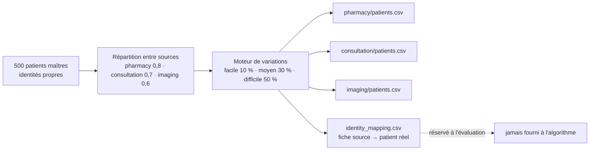

# Chapitre 5 — Exigences réalisées

## 5.1 Exigences fonctionnelles

Les six objectifs du cahier des charges (§ 3) sont traduits en exigences vérifiables :

**Tableau 24 — Les exigences fonctionnelles.**

| # | Exigence fonctionnelle | Critère de succès |
|---|---|---|
| F1 | **Centraliser** les données hétérogènes dans un Data Lake | pipeline ELT Medallion RAW → SILVER → GOLD |
| F2 | **Nettoyer et standardiser** selon un modèle commun | modèle canonique et pivot FHIR |
| F3 | **Dédupliquer** de façon **explicable** | patient maître et table de correspondance (score, méthode, seuil) |
| F4 | **Gouverner les accès** | rôles, consentement par finalité, audit, clés d'API hachées |
| F5 | **Visualiser** les indicateurs | vues de déduplication et de consentement (optionnel) |
| F6 | **Évaluer** la déduplication | vérité terrain, précision / rappel / F1 |

Les exigences sont organisées en **quatre étapes**, qui suivent le chemin de la donnée, puis
une activité transverse d'évaluation. Les cas d'utilisation (CU) précisent **qui** agit, dans
quelles conditions, et **ce qui se passe en cas d'échec** ; ils décrivent l'usage, l'implémentation
étant au § 7.3.

**Tableau 25 — Les étapes fonctionnelles et leurs cas d'utilisation.**

| Étape | Exigences | Cas d'utilisation |
|---|---|---|
| **1 — Intégration des sources** | F1, F2 | CU1, CU2 |
| **2 — Déduplication et MPI** | F3 | CU3 |
| **3 — Gouvernance des accès** | F4 | CU4, CU5 |
| **4 — Exploitation et pilotage** | F5 | CU6, CU7, CU8 |
| **Transverse — Évaluation** | F6 | générateur et vérité terrain (§ 5.1.5) |

### 5.1.1 Étape 1 — Intégration des sources

**CU1 — Ingérer un lot de sources.** *Acteur* : le processus automatique, lancé par
l'administrateur ou par le planificateur. *Prérequis* : les sources déclarées dans la
configuration (ici, trois fichiers CSV de test). *Déroulement* : l'extraction lit chaque source
et l'écrit telle quelle dans la zone RAW du Data Lake. *Résultat attendu* : le nombre de lignes
écrites par table figure dans le rapport d'extraction et dans l'historique du run. *Cas limite* :
une table absente ou illisible est consignée comme échec dans le rapport d'extraction, sans
bloquer les autres ; une source inchangée depuis le run précédent n'est pas relue (§ 7.3.2).

**CU2 — Ramener des formats différents à un modèle unique.** *Acteur* : le processus
automatique. *Prérequis* : la zone RAW remplie. *Déroulement* : l'étape de mapping FHIR
associe chaque champ attendu à la colonne source la plus proche, puis la normalisation produit
le modèle canonique `CanonicalPatient` dans la zone SILVER. *Résultat attendu* : toute fiche,
quelle que soit sa source, sort au même format. *Cas limite* : un champ sans équivalent dans
la source reste vide et n'est pas deviné ; les entités FHIR et leurs synonymes sont décrits dans
un fichier de configuration, pour qu'un changement de source ne demande pas de modifier le
programme.

### 5.1.2 Étape 2 — Déduplication et MPI

**CU3 — Décider qui est le même patient.** *Acteur* : le processus automatique.
*Prérequis* : la zone SILVER alimentée. *Déroulement* : le blocking réduit les comparaisons, le
rapprochement exact s'applique d'abord, puis le rapprochement probabiliste pondéré par champ,
au-dessus du seuil de 0,80. *Résultat attendu* : un patient maître par personne reconnue, et une
table de correspondance qui relie **chaque** fiche d'origine à son patient maître, avec le score
et la méthode de décision ; les deux sont chargés dans la base centrale. *Cas limite* : deux
fiches proches mais sous le seuil restent séparées, faux négatif possible que mesure la vérité
terrain (§ 8.5) ; aucune fusion n'est appliquée sans être inscrite dans la table de
correspondance.

### 5.1.3 Étape 3 — Gouvernance des accès

**CU4 — Préparer le consentement dans la zone GOLD.** *Acteur* : le processus automatique.
*Prérequis* : les patients maîtres et les consentements de la base centrale. *Déroulement* :
l'étape GOLD associe à chaque patient maître ses avis par finalité. *Résultat attendu* : une
table GOLD des consentements, prête pour les indicateurs. *Cas limite* : sans avis enregistré, la
finalité est considérée comme refusée. Le contrôle lui-même s'applique au moment de l'accès, par
l'API (CU5) : la zone GOLD ne filtre pas les événements de soin.

**CU5 — Interroger l'API pour un patient donné.** *Acteur* : un utilisateur authentifié, ou
une application tierce présentant une clé d'API. *Prérequis* : une clé connue de la table
`api_user`, et un consentement enregistré. *Déroulement* : la clé est résolue en utilisateur
et en rôle, la finalité demandée est comparée aux consentements, la réponse est renvoyée, et
l'appel est journalisé dans `access_audit`. *Résultat attendu* : la liste des patients ou le
détail d'un patient, avec une trace d'audit systématique. *Cas limite* : pour la fiche d'un
patient, une finalité non accordée produit un **403**, et non une réponse vide ; ce refus est
journalisé au même titre qu'un accès accordé. Pour une liste, les patients non consentis sont
retirés et leur nombre est journalisé (CU8). Un refus doit être visible pour que le dispositif
soit crédible.

### 5.1.4 Étape 4 — Exploitation et pilotage

**CU6 — Consulter les vues de gouvernance (déduplication et consentement).** *Acteur* : un
utilisateur de l'interface web. *Prérequis* : la zone SILVER/GOLD peuplée, ou le jeu de
démonstration. *Déroulement* : le frontend appelle l'API REST des indicateurs du warehouse et
affiche les indicateurs de déduplication (masters, doublons, méthodes) et de consentement
(accords/refus par finalité). *Résultat attendu* : des indicateurs calculés sur les données
dédupliquées, donc sans double comptage. *Cas limite* : si Hive ou Spark ne répond pas,
l'interface affiche un jeu de démonstration, signalé comme tel à l'écran. L'interface étant
**optionnelle** au sens du cahier des charges, elle illustre ce que la zone GOLD expose ; elle
n'est pas un résultat du projet.

**CU7 — Planifier et piloter le pipeline.** *Acteur* : l'administrateur. *Prérequis* : les
services Spark/Hive démarrés et une planification définie. *Déroulement* : la fréquence
(`daily` / `weekly` / `monthly`) est fixée par l'API `/pipeline/schedule` ou le fichier
`schedule.yaml` ; le cron de la VM vérifie l'échéance chaque minute et lance
`run_pipeline.sh` en arrière-plan ; `/pipeline/status` expose le plan, le prochain run,
l'état du dernier run et la fraîcheur des sources. *Résultat attendu* : un run lancé
régulièrement, **sans doublon** tant qu'un run est en cours, **reprise** de la première étape
non terminée en cas d'échec, et historique chiffré de chaque run conservé en base
(`/pipeline/runs`). *Cas limite* : une source dont l'empreinte n'a pas changé est **sautée** : on
ne retraite que ce qui a changé.

**CU8 — Consulter un dossier patient.** *Acteur* : un médecin authentifié (rôle `MEDECIN`
côté frontend), finalité déclarée. *Prérequis* : un accès web, un consentement enregistré.
*Déroulement* : la page `/patients` recherche et pagine, en **retirant silencieusement** les
patients sans consentement pour la finalité demandée ; `/patients/{id}` affiche l'identité, la
table de correspondance (identity map) et les consentements par finalité. *Résultat attendu* :
une lecture rapide, chaque appel journalisé dans `access_audit`. *Cas limite* : un patient sans
consentement n'apparaît pas dans la liste ; l'exclusion est comptée et journalisée plutôt
qu'annoncée à l'écran.

### 5.1.5 Évaluation de la déduplication : générateur et vérité terrain

Évaluer objectivement une déduplication exige de **connaître la vérité**, ce qui est
impossible avec des données réelles. Le générateur (`evaluation/synthetic-patient-generator/`)
produit des données fictives **et** leur vérité terrain, de façon déterministe (graine 42) ;
environ 75 % des patients maîtres portent un CIN :

> **Figure 3 — La chaîne du générateur de données synthétiques.**

- **Patients maîtres** : 500 identités propres, dont environ 75 % portent un **CIN**.
- **Répartition** : chaque patient est présent en pharmacie, en consultation et en imagerie
  avec une probabilité de 0,8, 0,7 et 0,6, soit **1 057 fiches** réparties **404 / 353 / 300**.
- **Variations** : trois niveaux de difficulté (10 %, 30 % et 50 % de probabilité par
  variation). Le niveau facile modifie casse, espaces et formats de date ou de CIN ; le niveau
  moyen ajoute l'inversion du nom et du prénom et des fautes de frappe légères ; le niveau
  difficile ajoute abréviations et valeurs manquantes (date ou ville de naissance, **jamais le
  CIN**, dont l'absence est décidée au niveau du patient maître).
- **Vérité terrain** : la table `identity_mapping.csv` relie chaque fiche à son patient réel ;
  elle n'est **jamais fournie à l'algorithme**.

Chaque source a aussi ses transactions : 792 achats, 519 consultations et 450 examens.

> **Deux usages.** Les jeux du générateur servent à **évaluer** le moteur (chapitre 8). Le jeu
> difficile a aussi servi de **source au pipeline** lors des runs du 29–30/09/2026, ce qui a permis
> de mesurer la chaîne complète sur la même vérité terrain (§ 7.3.2). Le run de référence du
> 07/09/2026 utilisait un jeu plus petit (76 / 76 / 62 fiches).

## 5.2 Exigences non fonctionnelles

Les exigences non fonctionnelles du cahier des charges sont : données **fictives uniquement** ;
pipeline **rejouable** et **idempotent** ; déduplication **déterministe et reproductible**
(seed) ; logique **toujours explicable** ; architecture évolutive au volume (Spark) sans changer
la sémantique. L'exploitation impose enfin de **ne pas retraiter en boucle** (§ 4.1 du cahier
des charges) : l'ingestion est **incrémentale** (une source dont l'empreinte n'a pas changé
n'est pas ré-extraite), un run échoué **reprend** à la première étape non terminée, et le
lancement régulier est **planifiable** (fréquence `daily` / `weekly` / `monthly`, cron)
(cahier des charges, § 4.1).

**Tableau 26 — Les exigences non fonctionnelles.**

| Qualité | Exigence | Réalisation | Preuve ou limite |
|---|---|---|---|
| **Utilisabilité** | un refus ou une erreur doit être compréhensible | `purpose` hors liste → **422** avec la liste des valeurs autorisées ; refus → **403** avec motif en audit ; bandeau « données de démonstration » à l'écran quand l'API se replie | cas vérifiés en § 8.4 ; frontend optionnel |
| **Performance** | pipeline bout en bout en moins de 30 minutes | run complet sur la VM : 2 min 56 s pour 1 057 fiches, 4 min 57 s pour 25 587 fiches (29–30/09/2026) | volume réel de l'établissement non mesuré (§ 4.2) |
| **Scalabilité** | changer d'échelle sans changer la sémantique | moteur porté en PySpark avec **parité stricte** ; comparaisons bornées par le blocking ; stockage HDFS | résultats identiques en Pandas et en Spark sur les trois jeux (§ 8.5) ; volume démontré limité |
| **Sécurité** | aucun accès sans rôle, finalité et consentement | RBAC, clés API hachées SHA-256, consentement par finalité, audit de chaque appel, secrets hors du dépôt | 401/403/422 vérifiés (§ 8.4) ; dettes déclarées : hachage non salé, API Flask sans authentification |
| **Maintenance** | faire évoluer le comportement sans toucher la logique | poids, seuil et blocking déclarés dans `config/deduplication.yaml` ; schéma idempotent ; pièges anti-régression documentés | 123 tests réussis (§ 8.1) |
| **Fiabilité d'exploitation** | ne pas retraiter en boucle, reprendre après échec | empreinte des sources, reprise à la première étape non terminée, anti-double-run, historique des runs | 66 tests (§ 8.2) ; run en reprise sur la VM : 6 tables sur 6 sautées (30/09/2026) ; cron non exécuté |
| **Confidentialité** | aucune donnée réelle | générateur synthétique à graine fixe | `RANDOM_SEED = 42` ; aucune donnée réelle dans le dépôt |

## 5.3 Interfaces détaillées

### 5.3.1 Interfaces homme-machine

L'interface web `front-optional/` (Next.js, hôte Windows, port 3000) est **optionnelle** au sens
du cahier des charges. Elle se limite au pilotage du pipeline, aux vues de gouvernance et à la
consultation des patients ; l'accès est contrôlé par jeton (JWT) avec les rôles **ADMIN** et
**MEDECIN**, et `purpose` reste un paramètre obligatoire des pages patients.

**Tableau 27 — Les pages de l'interface web.**

| Page | Ce qu'elle affiche | Source des données |
|---|---|---|
| `/login` | authentification (rôles ADMIN, MEDECIN) | frontend |
| `/synthese` (page d'accueil) | qualité d'identité (masters, doublons, taux) et consentement (accords, refus) côte à côte | `/api/governance/duplicates`, `/api/governance/consent` |
| `/doublons` | patients en base, masters, doublons résolus, taux ; répartition par méthode (exacte, probabiliste) | `/api/governance/duplicates` |
| `/gouvernance` | consentements par couple (patient, finalité), filtrables par finalité ; taux d'accord | `/api/governance/consent` |
| `/pipeline` | statut du pipeline en badges texte, planification | `/pipeline/status`, `/pipeline/schedule` |
| `/dashboard` | vue d'exploitation : zones Medallion, étapes du run, historique des runs, fraîcheur des sources, planification | `/pipeline/status`, `/pipeline/runs` |
| `/patients`, `/patients/{id}` | recherche, pagination, fiche d'identité, identity map et badges de consentement par finalité | `/patients`, `/patients/{id}` |
| `/users`, `/settings` | pages d'administration | frontend |

Chaque vue alimentée par l'API Flask affiche un bandeau lorsque la réponse porte l'indicateur
`mocked` : une donnée de démonstration n'est jamais présentée comme une mesure réelle. Cette
interface de pilotage est distinguée au § 3.4 des **dashboards d'analyse** du PoC
(`visualisation_app`), hors périmètre.

### 5.3.2 Interfaces avec d'autres systèmes

**L'API de gouvernance (FastAPI).** C'est le seul point d'**application** de la règle d'accès :
chaque appel présente une clé d'API (`Authorization: Bearer <clé>`), résolue en utilisateur et
en rôle, et chaque appel est journalisé dans `access_audit` [`engine/governance/app.py`].

**Tableau 28 — Les points d'entrée de l'API de gouvernance.**

| Point d'entrée | Méthode | Rôles autorisés | Contrôle et réponse |
|---|---|---|---|
| `/health` | GET | — | état du service |
| `/metrics` | GET | admin, analyst | indicateurs de la plateforme |
| `/patients` | GET | admin, analyst | `purpose` **obligatoire** (422 sinon) ; recherche `search`, pagination `page` / `page_size` ; patients non consentis **retirés**, exclusions journalisées |
| `/patients/{id}` | GET | admin, analyst | `purpose` obligatoire ; finalité non consentie → **403** + `refusal_reason` en audit |
| `/consent`, `/consent/{id}` | GET | admin, analyst | lecture des consentements |
| `/consent` | POST | admin | enregistrement d'un avis (201) |
| `/pipeline/schedule` | GET / PUT | lecture admin, analyst ; écriture **admin** | validation stricte ; format identique à celui du cron de la VM |
| `/pipeline/status` | GET | admin, analyst | plan, prochain run, sources suivies, zones RAW/SILVER/GOLD, dernier run |
| `/pipeline/runs` | GET | admin, analyst | historique des runs : lignes par source, patients maîtres, doublons, volumes GOLD |
| `/audit` | GET | admin | journal des accès |

Une clé absente ou inconnue produit un **401**, un rôle insuffisant un **403**.

**L'API des indicateurs du warehouse (Flask, port 5000).** Elle expose **2 endpoints** de
gouvernance : `/api/governance/duplicates` sur la table SILVER `patient_fhir`, et
`/api/governance/consent` sur la table GOLD `patient_consent_gold`, avec une réponse unifiée
portant l'indicateur **`mocked`**, vrai seulement quand l'API répond avec des données de
démonstration.
C'est une surface de *reporting* : elle **n'impose rien**, ni authentification, ni contrôle de
finalité (§ 7.3.5).

**Les autres interfaces.** La plateforme échange aussi avec :

- les **sources** : fichiers CSV, bases PostgreSQL et SQLite, déclarées dans
  `data_sources.json` et lues par une couche d'extraction abstraite ;
- le **Data Lake** : HDFS (port 9000) et Hive (metastore 9083, HiveServer2 10000) ;
- la **base centrale** PostgreSQL, via `psycopg` ;
- le **planificateur** : le crontab de la VM appelle le scheduler chaque minute et lit
  `schedule.yaml`, le même format que celui écrit par `PUT /pipeline/schedule`.

## Conclusion et transition

Les exigences sont posées et rattachées à leur preuve : huit cas d'utilisation répartis en
quatre étapes, des qualités non fonctionnelles dont les limites sont nommées, et des interfaces
dont le contrôle d'accès est concentré sur un seul point, l'API de gouvernance. Le chapitre 6
présente l'**architecture** qui porte ces exigences.
