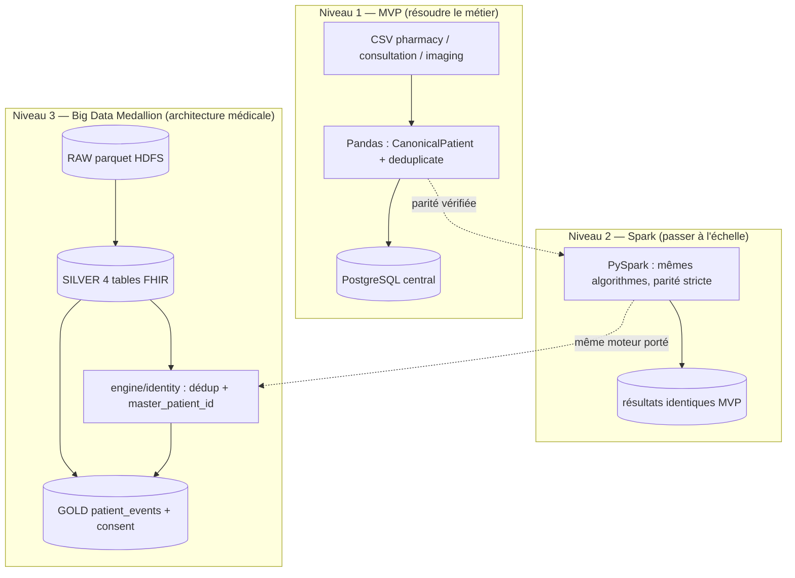
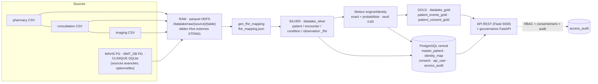

# Chapitre 6 — Architecture du système

## 6.1 Architecture logicielle

### 6.1.1 Une architecture en trois niveaux

L'architecture suit la démarche progressive du § 3.3 : chaque niveau réutilise
la **même logique métier**, seule l'infrastructure d'exécution change.

> **Figure 4 — L'architecture en trois niveaux : le MVP Pandas, la parité PySpark
> vérifiée, puis le Data Lake Medallion RAW → SILVER → GOLD, qui porte le moteur et la
> gouvernance.**

Design retenu pour chaque brique [cahier des charges §4] :

**Tableau 31 — Les sept briques de la chaîne retenue et la conception adoptée pour chacune.**

| Brique | Conception |
|---|---|
| **Extraction** | couche d'extraction abstraite (CSV / PostgreSQL / SQLite) → RAW |
| **Normalisation** | modèle canonique `CanonicalPatient` |
| **Interopérabilité** | schéma pivot **FHIR** (4 entités) |
| **Déduplication** | blocking + exact + probabiliste (RapidFuzz), seuil 0.80 |
| **Consolidation** | master patient + identity map traçable |
| **Chargement** | PostgreSQL central idempotent (`ON CONFLICT`, `IF NOT EXISTS`) |
| **Exposition** | API REST + espace de gouvernance |

### 6.1.2 Chaîne de bout en bout (niveau 3 retenu)

La conception retenue est le **niveau 3** : une seule chaîne, de la source hétérogène à l'API
gouvernée. Le schéma ci-dessous relie les trois zones Medallion, le moteur de déduplication et
la gouvernance ; il sert de référence à la réalisation (§ 7.3).

> **Figure 5 — Le chemin d'une donnée, de la source à l'API : les trois zones du Data
> Lake, le moteur de déduplication, la base centrale, et l'audit de chaque accès.**

Traçabilité de bout en bout : chaque ligne SILVER conserve `_source_system`, `_source_table`,
`source_patient_id` et `patient_uuid` (`sha2(source|source_patient_id)`) ; chaque fusion porte
`master_patient_id`, `match_method`, `match_score` et `explanation` [bases_de_donnees.md §3].

Les deux magasins n'ont pas le même rôle : HDFS, Hive et Spark portent le lac **rejouable** et
ses trois zones de qualité ; PostgreSQL porte l'**état de référence** — patients maîtres,
consentements, journal d'audit, comptes. C'est une séparation de rôles, pas une redondance.

## 6.2 Architecture technique

L'architecture est installée sur **une VM unique** (`ubuntu/focal64`, Vagrant, 8 Go / 4 cœurs) ;
l'ordre de démarrage des services est strict [architecture.md §3] :

**Tableau 32 — Les composants installés sur la VM, leur rôle et leur port ou leur chemin ; l'ordre de démarrage est imposé.**

| Composant | Rôle | Port / chemin |
|---|---|---|
| HDFS NameNode | entrepôt du Data Lake (parquet RAW/SILVER/GOLD) | 9000 — `start-dfs.sh` en premier |
| YARN | exécution des jobs Spark | 8088 — `start-yarn.sh` ensuite |
| Hive Metastore | métadonnées des bases `datalake_*` | 9083 (distant, évite le conflit Derby) |
| HiveServer2 | accès SQL (`beeline`) | 10000 |
| Moteur `engine/` | déduplication + gouvernance (PostgreSQL) | — |
| API données (Flask) | exposition de GOLD | 5000 |
| API gouvernance (FastAPI) | `/health`, `/metrics`, `/patients`, `/audit`, `/consent`, `/pipeline/schedule`, `/pipeline/status` | 8000 |
| Planificateur ELT | déclenche `run_pipeline.sh` selon `schedule.yaml` (`daily` / `weekly` / `monthly`), échéance vérifiée chaque minute, anti-double-run | cron VM + `provision/scripts/scheduler/scheduler.py` |
| Watermark / état | empreinte des sources (`watermark.json`) pour l'incrémental ; état des runs (`pipeline_state.json`) pour la reprise | `provision/metadata/` |
| Frontend Next.js | pages de pilotage et de consultation (§ 5.3.1) : RBAC ADMIN/MEDECIN, `purpose` obligatoire | 3000 (hôte Windows) |

> **Ordre strict :** `start-dfs.sh` → `start-yarn.sh` → metastore (9083) → HiveServer2 (10000) →
> jobs Spark → API. Toute inversion produit des erreurs d'écriture ou de métadonnées (§ 7.3.6).

Environnement d'exécution : VM `ubuntu/focal64` 8 Go / 4 cœurs — Hadoop 3.3.6,
Hive 3.1.3 (métastore distant 9083 pour éviter le conflit Derby), Spark 3.4.2,
Java 8 ; Spark configuré `executor 4g / driver 2g / shuffle.partitions=8`
[Vagrantfile, bootstrap.sh]. Les ports 9870 (interface HDFS), 10000 (Hive) et 5000 (API) sont
redirigés vers l'hôte.

## Conclusion et transition

L'architecture fixe deux choses : une **logique métier unique** portée par trois niveaux
d'infrastructure, et une **chaîne de bout en bout** où chaque donnée garde sa trace d'origine et
chaque accès sa trace d'audit. Le chapitre 7 descend d'un niveau : la plate-forme technique, la
structure du code, le modèle de données, les composants et la réalisation de chaque étape.

### Références

- `documents/documentation/architecture.md` (services, ports, ordre de démarrage).
- `documents/documentation/bases_de_donnees.md` §3 (traçabilité des colonnes).
- `provision/Vagrantfile`, `bootstrap.sh`.
