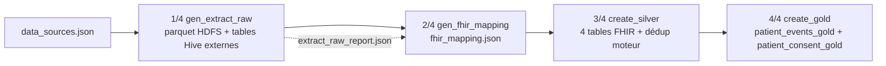

# Chapitre 6 — Réalisation

> **Statut** : rédigé (08/09/2026, actualisé 27/09/2026)

## Objectif

Restituer l'implémentation effective de la plateforme : générateur de données avec
vérité terrain, pipeline ELT Medallion en 4 étapes, moteur de déduplication
(Pandas + Spark), chargement PostgreSQL, gouvernance et API, puis difficultés
rencontrées sur la VM et leur résolution.

---

## 6.1 Générateur de données et vérité terrain

Le générateur
[`synthetic-patient-generator`](../projet/code-source/evaluation/synthetic-patient-generator)
est implémenté en 7 étapes, déterministe (seed 42) :

**Tableau 27 — Les six modules du générateur synthétique et le rôle réel de chacun.**

| Module | Rôle réalisé |
|---|---|
| `patient_generator.py` | 500 patients maîtres + `master_patients.csv` (vérité absolue) |
| `distribution_engine.py` | plan de distribution 0.8 / 0.7 / 0.6 → 3 sources |
| `variation_engine.py` | injection d'erreurs easy 10 % / medium 30 % / hard 50 % |
| `pharmacy/consultation/imaging_generator.py` | fichiers patients + transactions |
| `identity_mapping.py` | `identity_mapping.csv` : source → source_patient_id → ground_truth_id |
| `experiment_builder.py` | datasets easy / medium / hard |

Types de variations réels : casse, espaces, inversion prénom/nom, abréviation,
typo (suppression/duplication/permutation), formats CIN (espacé / compact) et
dates (ISO, DD/MM/YYYY…), valeurs manquantes (naissance ou ville de naissance).
Résultat pour le dataset hard :
**1 057 enregistrements, 500 groupes de vérité, répartition 404 / 353 / 300**, et
792 achats / 519 consultations / 450 examens. Le CIN est porté par ~75 % des
maîtres, stable entre les sources (autoritatif). Le fichier de vérité est **réservé à
l'évaluation** — jamais fourni à l'algorithme [deduplication.md — règle métier].

Le déterminisme n'est pas un détail d'implémentation : c'est ce qui rend l'évaluation
**comparable**. Les trois jeux easy / medium / hard sont produits à partir des
**mêmes 500 maîtres** (`--seed 42`) et ne diffèrent que par le **taux de variation**
appliqué (10 % / 30 % / 50 %). La dégradation de la qualité est ainsi attribuable à
un seul facteur, et deux exécutions sont comparables ligne à ligne — condition
nécessaire pour établir la parité Pandas/Spark (ch. 7) et pour rejouer une
évaluation après un changement de poids. Les tables de transactions (792 achats,
519 consultations, 450 examens sur le jeu hard) alimentent les entités FHIR autres
que `patient` : c'est leur rattachement au patient qui fait la dette
`patient_events_gold` du chapitre 7.

## 6.2 Pipeline ELT Medallion en 4 étapes

Orchestration par `run_pipeline.sh` (arrêt sur erreur, logs `elt.log`) : run
**4/4 vert** sur la VM le 07/09/2026 [contexte_projet.md].

> **Figure 7 — Le pipeline ELT en quatre étapes, de l'extraction RAW au chargement
> GOLD, piloté par `data_sources.json` et contrôlé par `extract_raw_report.json`.**

**Tableau 28 — Les quatre étapes du pipeline ELT, le script qui les exécute et la sortie réellement produite.**

| Étape | Script | Sortie réelle |
|---|---|---|
| **1 — Extraction RAW** | `gen_extract_raw.py` | parquet `/datalake/raw/{source}/{table}`, tables Hive externes, `extract_raw_report.json` |
| **2 — Mapping FHIR** | `gen_fhir_mapping.py` | `fhir_mapping.json` (table→entité FHIR, cartes explicites) |
| **3 — SILVER FHIR** | `create_silver.py` | `datalake_silver.{patient,encounter,condition,observation}_fhir` |
| **4 — GOLD** | `create_gold.py` | `patient_events_gold` (8 tranches d'âge), `patient_consent_gold` |

Résultats du run de référence (sources CSV synthétiques, 214 enregistrements) :
**`datalake_silver.patient_fhir` = 214 lignes** (76 + 76 + 62) ; **145 masters** ;
**69 doublons liés** (`is_duplicate`), tous `match_method = exact` ; `duplicate_rate`
**32.24 %** ; `patient_consent_gold` = **145** lignes. `patient_events_gold` reste à
**0 ligne** en intermédiaire (jointures FHIR non rattachées — dette identifiée au
chapitre 7).

L'étape 3 intègre la **fusion des doublons dans le Data Lake** : le moteur relit
`patient_fhir`, réapplique `deduplicate()` et enrichit chaque ligne des colonnes
`master_patient_id`, `match_method`, `match_score` et `is_duplicate` — la fusion
reste explicable *dans* le lac, pas seulement dans un script séparé.

Le passage **214 → 145** est le contrôle de cohérence le plus utile du run : 214
enregistrements, 69 doublons liés, 145 masters, et `214 − 69 = 145` se vérifie par un
simple comptage sur le lac, sans consulter la logique de fusion — c'est la
correspondance « un master = un enregistrement non dupliqué » qui est testée, pas la
décision elle-même. Le taux de 32.24 % est ce même rapport exprimé en pourcentage,
et `patient_consent_gold` aligne **145 lignes sur 145 masters**. Le tableau reste
néanmoins asymétrique et le dit explicitement : `patient_events_gold` est vide, donc
la zone GOLD ne certifie pour l'instant que **l'identité**, pas les événements de
soin rattachés.

## 6.3 Moteur de déduplication : Pandas et Spark

Le moteur `engine/identity/` est la pièce centrale, deux implantations alignées :

**Tableau 29 — Les deux implantations du moteur côte à côte : la sémantique est alignée, seule la mécanique change.**

| Aspect | `matcher.py` (Pandas) | `spark_dedup.py` (PySpark driver-side) |
|---|---|---|
| Canonique | `canonical.py` (`map_patient`, `from_dict`) | réutilise `matcher`/`canonical` |
| Exact | `matching_key` + naissance/CIN | clusters par `groupBy` de la clé |
| Probabiliste | `_MasterIndex` (3 buckets) | `_BoundedMasterIndex` sur ancres de clusters |
| Score | `fuzz.ratio(nom)×0.5 + naissance×0.3 + CIN×0.1 + ville×0.1` | identique |
| Décision | `exact` / `probabilistic` / `new_master`, seuil 0.80 | identique |
| Sortie | `MatchDecision` | dicts `(master_patient_id, method, score, explanation)` |

La **sémantique est strictement alignée** et la **parité est vérifiée** : démo 18
patients → 11 masters identiques Pandas et Spark, et évaluation ground-truth
« modes MVP+Spark identiques » (TP=307, FP=0, FN=420 pour les deux)
[`evaluation_truth.md`] — voir chapitre 7.

Cette parité n'est pas une coïncidence de développement mais une **propriété
structurelle** : les deux implantations partagent le même `canonical.py`, lisent les
**mêmes poids et le même seuil** dans `config/deduplication.yaml`, et ne diffèrent que
par la **stratégie de regroupement**. Le matcher Pandas indexe les masters sur trois
critères de blocage (préfixe de nom normalisé, date de naissance, CIN) pour borner les
comparaisons ; l'implantation Spark regroupe d'abord les enregistrements par clé
exacte (`groupBy`), puis ne compare que les **ancres de clusters** — un choix assumé
pour la montée en charge, au prix d'une comparaison moins exhaustive. Le protocole de
test rejoue les deux chemins sur le même jeu et compare les décisions méthode par
méthode : c'est le seul moyen de détecter une dérive entre les deux
implémentations, qu'aucune des deux ne peut détecter seule.

## 6.4 Chargement PostgreSQL et GOLD du consentement

- **Chargement central** : le schéma (`sql/schema.sql`) est créé de façon
  **idempotente** (`CREATE TABLE IF NOT EXISTS`, `ADD COLUMN IF NOT EXISTS`,
  `ON CONFLICT`) — le pipeline est rejouable sans état résiduel.
- **`patient_consent_gold`** : l'étape GOLD joint le PostgreSQL central (table
  `consent`, via `psycopg`) aux masters SILVER ; si la base est inaccessible, le
  schéma est créé vide et l'API bascule en mode `mock` — le consentement reste un
  composant formel de l'architecture.

## 6.5 Gouvernance et API

L'API d'indicateurs du warehouse (Flask, port 5000) expose **2 endpoints** de
gouvernance (`/api/governance/duplicates` sur la table SILVER `patient_fhir`,
`/api/governance/consent` sur la table GOLD `patient_consent_gold`), avec une
réponse unifiée portant l'indicateur **`mocked`** (vrai uniquement en secours
backend, jamais côté frontend). `test_api.py` couvre les 2 endpoints (+ la limite
`limit` du consentement) et retourne **3/3 PASS** en données réelles
[contexte_projet.md].

La gouvernance est implémentée dans le moteur : `auth.py` (authentification par
clé hachée SHA-256 + rôles `admin`/`analyst`/`viewer`), `consent.py` (router FastAPI
`/consent`, décision *purpose-by-purpose*), `audit.py` (middleware journalisant
chaque requête, refus compris). Les **payloads RAW ne sont jamais exposés** par
l'API — seuls les maîtres consolidés le sont [consentement_gouvernance.md §7].

Il faut distinguer deux couches qui portent le même mot « gouvernance » sans avoir le
même rôle. L'API **Flask** est une surface de *consommation et de reporting* : ses
endpoints lisent le GOLD et en rendent des agrégats ; `/api/governance/consent` en
particulier **liste** les consentements et leurs statistiques, mais **n'impose
rien** — ni authentification, ni contrôle de finalité. L'API **FastAPI** du moteur est
le seul point d'**application** de la règle : c'est là que se produisent les 401 (clé
inconnue), 403 (rôle insuffisant ou finalité non consentie) et 422 (`purpose`
obligatoire), chacun journalisé par `audit.py`. Cette frontière est assumée et
documentée : l'API Flask reste une dette — lancée avec `debug=True`, elle rend en outre
le nom du patient dans sa réponse de consentement — et le contrôle de consentement
s'applique à l'API de gouvernance, comme le rappelle `ai/dev/suivi_avancement.md`.

## 6.6 Difficultés rencontrées et résolutions

**Tableau 30 — Les six difficultés réellement rencontrées, leur cause et le correctif testé.**

| Problème réel | Cause | Correctif |
|---|---|---|
| SILVER explosait à **11 614 lignes** | `patient_uuid` capturé par le mapping FHIR dynamique → `source_patient_id` NULL → jointure **76×76** du moteur | `patient_uuid` **exclu** du mapping dynamique + colonne source utilisée une seule fois |
| Listing périmé (overwrite+append par source) | écritures répétées dans la boucle source | accumulation par entité, **une seule écriture `overwrite` par table** ; phase 5 en table temp puis `DROP` + `RENAME TO` |
| Parquet corrompu sur partage vboxsf | warehouse Spark écrit sur le montage partagé | `spark.sql.warehouse.dir = hdfs://localhost:9000/...` (toujours HDFS) |
| Spark ne démarrait pas | `JAVA_HOME` avec `\bin` en trop | normalisation `_resolve_java_home()` dans `spark/session.py` |
| HiveServer2/beeline instable sur la VM | service HS2 fragile | validation des comptages par **scripts Spark** (`check_data.py`) |
| NLP lourd inutilisable | `sentence_transformers` crash Python 3.8 | RapidFuzz + dictionnaire de synonymes (`fhir_synonyms.py`) |

Ces six incidents se répartissent en trois familles, et la famille conditionne le
correctif. Les **données** (les deux premières lignes) produisent les correctifs les
plus structurés : ils sont documentés dans `pipeline_elt.md` comme des pièges
anti-régression, avec le symptôme, la cause et la parade, précisément parce qu'ils
se reproduisent. L'**infrastructure** (parquet sur partage, démarrage de Spark,
HiveServer2 instable) impose des choix de configuration qui n'ont pas à être
justifiés fonction par fonction : la règle retenue est de **contourner** — écrire
toujours sur HDFS plutôt que sur le partage vboxsf, valider les comptages par scripts
Spark plutôt que par beeline. L'**outillage** (NLP trop lourd) est le seul cas où le
correctif change la méthode : l'approche par vecteurs a été abandonnée pour un score
pondéré et un dictionnaire de synonymes, arbitrage dicté par la contrainte Python
3.8 et rendu lisible par l'exigence d'explicabilité.

Environnement d'exécution: VM `ubuntu/focal64` 8 Go / 4 cœurs — Hadoop 3.3.6,
Hive 3.1.3 (métastore distant 9083 pour éviter le conflit Derby), Spark 3.4.2,
Java 8 ; Spark configuré `executor 4g / driver 2g / shuffle.partitions=8`
[Vagrantfile, bootstrap.sh].

## Conclusion et transition

La plateforme est réalisée et opérationnelle : 4/4 pipeline vert, dédup enregistrée
dans le lac, API gouvernance 3/3, gouvernance mécanisée. Reste à **démontrer la qualité** :
le chapitre 7 présente la stratégie de test, l'évaluation ground-truth (P/R/F1) et
les limites honnêtes du prototype (rappel « hard », GOLD incomplet).

### Références

- `provision/scripts/ELT/*` + `run_pipeline.sh` ; `provision/api/hive_api.py`,
  `mock_data.py`, `test_api.py`.
- `engine/identity/{canonical,matcher,spark_dedup}.py` ; `engine/governance/{auth,consent,audit}.py`.
- `sql/schema.sql` ; `ai/memoire/contexte_projet.md` (run 07/09/2026).
- `documents/documentation/pipeline_elt.md` (pièges anti-régression).