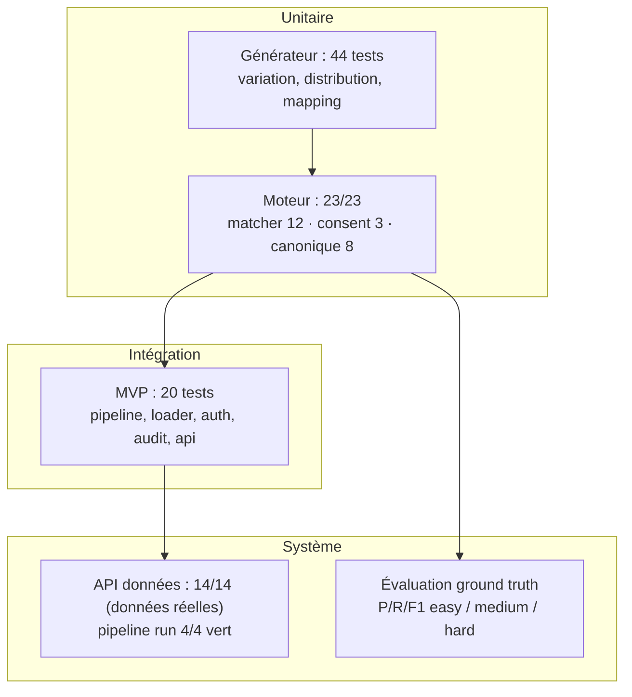

# Chapitre 6 — Tests et évaluation

> **Statut** : rédigé (08/09/2026)

## Objectif

Présenter la stratégie de test du projet, l'évaluation ground-truth de la
déduplication (précision / rappel / F1, par méthode et par source), la vérification
de la parité MVP/Spark, puis les limites honnêtes du prototype et les pistes
d'amélioration.

---

## 6.1 Stratégie de test

La validation suit une pyramide : unitaire (générateur et moteur), intégration
(pipeline, base) et système (API).

| Niveau | Périmètre | Résultat |
|---|---|---|
| **Générateur** (7 fichiers de tests) | variation engine, générateurs de sources, distribution, identity mapping, experiment builder | **44 tests PASS** [contexte_projet.md] |
| **Moteur `engine/`** | `test_matcher.py` (12 cas), `test_consent.py` (3 cas), `test_deduplication.py` (8 cas canonique) | **23/23 PASS** [logs.md] |
| **MVP** (`test_bigdata`) | pipeline, loader PostgreSQL, auth, audit, api | **20 tests PASS** [contexte_projet.md] |
| **API** | `test_api.py` — 14 tests sur données réelles (`RMA_USE_MOCK=false`) | **14/14 PASS** [logs.md] |
| **Pipeline** | `run_pipeline.sh` RAW → SILVER → GOLD | **4/4 vert** (07/09/2026) |

Les tests du moteur couvrent la sémantique de la dédup : match exact (clé
identique, formats de CIN normalisés), nom inversé compensé par (naissance + CIN)
exact, fusion au seuil 0.80 (nom + naissance), faute de frappe compensée par
naissance, ville de naissance qui augmente le score, **non-fusion de patients
distincts**, et **parité Pandas/Spark** (`test_spark_parity`) [deduplication.md §9].

## 6.2 Évaluation ground-truth

**Principe.** Trois jeux synthétiques easy / medium / hard sont générés à partir
**des mêmes masters** (`--seed 42`) : seul le **taux de variation** change
(10 % / 30 % / 50 %). La **vérité terrain** (`identity_mapping.csv`) regroupe les
enregistrements du même patient ; l'algorithme **ne la reçoit jamais**. Les
métriques sont calculées **par paires** d'enregistrements [evaluation.md §2].

| Métrique | Définition | Interprétation pour la santé |
|---|---|---|
| **Precision** | TP / (TP + FP) | exactitude des fusions — fusionner à tort est le risque le plus grave |
| **Recall** | TP / (TP + FN) | complétude — rater les vrais doublons |
| **F1** | 2·P·R / (P+R) | compromis global |

**Résultats de référence** (run 08/09/2026, 500 masters par niveau, ~1 000
enregistrements, parité MVP = Spark vérifiée à chaque niveau) [evaluation.md §3] :

| Niveau | Masters prédits | TP | FP | FN | Precision | Recall | F1 |
|---|---|---|---|---|---|---|---|
| easy (10 %) | 500 | 727 | 0 | 0 | **1.000** | **1.000** | **1.000** |
| medium (30 %) | 554 | 643 | 0 | 84 | **1.000** | 0.884 | 0.939 |
| hard (50 %) | 804 | 307 | 0 | 420 | **1.000** | 0.422 | 0.594 |

Lecture : l'algorithme **ne fusionne jamais à tort** (zéro faux positif, P 1.000 sur
les trois niveaux) — propriété essentielle en santé ; sur le dataset volontairement
dur (50 % de variations), il **ne reconnaît pas toutes les variantes** (R 0.422).
Les pondérations et le seuil sont configurables pour trader précision ↔ rappel
[deduplication.md §5]. L'introduction du **CIN en clé exacte** (couverture ~75 %)
a relevé le rappel hard de 0.287 (07/09) à **0.422** sans aucun faux positif.

## 6.3 Breakdown par méthode et par source

Sur le niveau hard, le découpage par technique de match localise la faiblesse
(identique MVP/Spark) [evaluation.md §3] :

| Méthode | Precision / Recall / F1 |
|---|---|
| exact | 1.000 / 0.854 / 0.921 |
| probabilistic | 1.000 / 0.533 / 0.696 |

Le rappel est homogène entre sources (hard) : pharmacy 0.422 · consultation 0.422 ·
imaging 0.423 — la dégradation vient du **taux de variation**, pas d'une source.

La parité est quasi triviale mais structurelle : sur le dataset hard, les deux
implantations (Pandas `matcher.py` et Spark `spark_dedup.py`) produisent
exactement mêmes **TP=307, FP=0, FN=420, 804 masters prédits pour 500 groupes de
vérité sur 1 057 enregistrements** [evaluation_truth.md]. Référence historique
(test_bigdata, 10 669 patients / 5 000 masters) : F1 0.403, zéro FP, là encore
Pandas = Spark [evaluation.md §3].

## 6.4 Cas de référence et intégrité

- **Cas « Jean Rakoto »** : démo 18 patients → **11 masters, 18 liens** ; Jean
  Rakoto fusionné par **exact** (CIN), Nirina par **probabilistic** (score
  0.8) — identique Pandas et Spark [deduplication.md §7].
- **Intégrité chargée** (run 07/09/2026) : SILVER `patient_fhir` **214** lignes
  (76 + 76 + 62) ; **145 masters**, **69 doublons** (tous `match_method=exact`,
  `match_score=1.0`) ; **214 − 69 = 145** — la cohérence se vérifie par comptage
  sur le lac [contexte_projet.md].
- **Gouvernance API** : `duplicate_rate` = **32.24 %** avec `mocked: false` ;
  `patient_consent_gold` = **145** lignes pour 145 masters.

## 6.5 Limites et dettes identifiées

Le prototype est évalué sans complaisance [contexte_projet.md — reste à faire] :

| Limite | Observation | Cause / piste |
|---|---|---|
| **Recall 0.422 (hard)** | 420 faux négatifs sur 1 057 | variations 50% ; seuil 0.80 conservateur ; abaisser le seuil / enrichir la clé (adresse), si le métier l'accepte |
| **`patient_events_gold` vide** | 0 ligne en intermédiaire | jointures FHIR non rattachées (Encounter/Condition sans `patient_uuid`) — enrichissement suspect |
| **Consentement non alimenté** | `granted`/`purpose` NULL dans GOLD | PostgreSQL central non peuplé en interim ; la mécanique est démontrée, pas les données |
| **Endpoints mock** | `laboratory`, `malaria` sur données de secours | sources métier absentes du run final ; flag `mocked` tracé |
| **Tests EI-déployés / CI absent** | — | hors périmètre stage (Docker/CI écartés) |

## Conclusion

La stratégie de test couvre le générateur (44), le moteur (23/23), le MVP (20),
l'API (14/14) et le pipeline (4/4). L'évaluation ground-truth démontre **une règle
d'or tenue** : zéro fusion à tort (Precision 1.000) sur tous les niveaux, avec une
parité Pandas/Spark parfaite, et un rappel hard relevé à 0.422 grâce à la clé CIN.
Le rappel sur le jeu dur indique précisément où la
logique pourrait s'enrichir. Avec l'architecture, la réalisation et l'évaluation,
l'ensemble répond à la problématique du chapitre 1 : centraliser, dédupliquer de
façon explicable, gouverner par consentement — sur données synthétiques et
architecture Big Data.

### Références

- `documents/documentation/evaluation.md` et `evaluation/evaluation_truth.md`.
- `tests/test_matcher.py`, `tests/test_consent.py` (engine) ; `provision/api/test_api.py`.
- `documents/documentation/deduplication.md` §9 ; `ai/memoire/contexte_projet.md`.