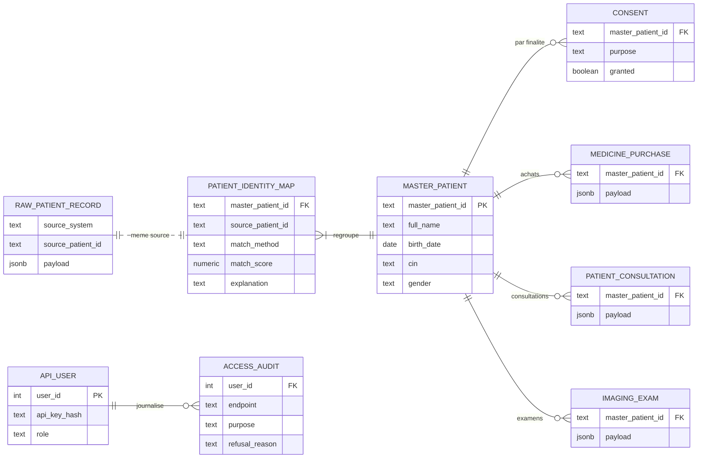
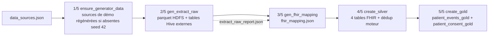

# Chapitre 7 — Conception du logiciel

## 7.1 Plate-forme technique

Chaque concept de l'état de l'art (chapitre 2) est porté par une brique technique précise.
Le schéma ci-dessous relie les deux.


> **Figure 6 — Des concepts de l'état de l'art aux briques techniques livrées.**

**Matrice de sélection technologique.** Les choix sont arbitrés sur des critères
**explicités et pondérés**, issus des contraintes du § 4.2 (Python 3.8, VM de 8 Go, exigence
d'explicabilité), et appliqués aux quatre arbitrages structurants.

**Tableau 31 — Les critères pondérés de la grille d'arbitrage.**

| Critère | Poids | Justification du poids |
|---|---:|---|
| C1 · Compatibilité environnement (Python 3.8, 8 Go) | 0,30 | contrainte la plus forte ; une option notée 1 est écartée quelle que soit sa note totale |
| C2 · Explicabilité de la décision | 0,25 | exigence F3 : toute fusion doit être justifiable, toute finalité contrôlable |
| C3 · Coût mémoire / performance | 0,20 | la VM limite les ressources |
| C4 · Maturité et documentation | 0,15 | autonomie du stage, sans expert dédié |
| C5 · Coût de licence | 0,10 | budget nul |

Les options sont notées de 1 à 5, 5 étant le meilleur :

**Tableau 32 — Notation pondérée des options.**

| Arbitrage | Option | C1 | C2 | C3 | C4 | C5 | **Score** | Verdict |
|---|:---|---:|---:|---:|---:|---:|---:|---|
| **1 · Moteur de similarité** | **RapidFuzz** [B4] | 5 | 5 | 5 | 5 | 5 | **5,00** | **retenu** |
| | `sentence_transformers` | 1 | 2 | 1 | 4 | 5 | 2,10 | écarté (plante sous Python 3.8) |
| | `difflib` (bibliothèque standard Python) | 4 | 3 | 2 | 5 | 5 | 3,60 | repli possible, trop lent |
| **2 · Base centrale** | **PostgreSQL** | 5 | 5 | 4 | 5 | 5 | **4,80** | **retenu** (JSONB, contraintes CHECK, `TIMESTAMPTZ`) |
| | SQLite | 5 | 3 | 5 | 4 | 5 | 4,35 | écarté (écriture concurrente des 3 sources) |
| | MySQL | 4 | 4 | 4 | 5 | 5 | 4,25 | écarté (JSONB moins intégré) |
| **3 · Framework d'API de gouvernance** | **FastAPI** | 5 | 5 | 4 | 4 | 5 | **4,65** | **retenu** |
| | Flask | 5 | 3 | 5 | 5 | 5 | 4,50 | écarté de peu — validation manuelle de la finalité |
| **4 · Moteur d'appariement** | **Moteur propre sur RapidFuzz** (poids fixés) | 5 | 5 | 4 | 3 | 5 | **4,50** | **retenu** |
| | Splink [B15] | 4 | 4 | 3 | 5 | 5 | 4,05 | écarté — poids estimés par EM, version figée à 4.0.11 sous Python 3.8 |
| | *recordlinkage* | 5 | 4 | 2 | 3 | 5 | 3,85 | écarté — Pandas seul, peu actif depuis 2023 |
| | *dedupe* | 5 | 2 | 3 | 4 | 5 | 3,70 | écarté — exige une campagne d'étiquetage humain |
| | Ditto / LLM [B21], [B22] | 1 | 1 | 1 | 3 | 5 | 1,70 | écarté — GPU ou service externe, décision non lisible |

> **Lecture du score.** Flask et FastAPI ne se séparent que de 0,15 : FastAPI est retenu parce
> qu'il rend le contrôle de finalité **exprimable dans le schéma de l'API** plutôt que dans le
> code de chaque route (C2 = 5 contre 3). SQLite (4,35) et MySQL (4,25) ne sont écartés que par un
> critère de cohérence (écritures concurrentes, support JSONB), pas par une incapacité.
> `sentence_transformers`, noté 1 sur C1, reste écarté quelle que soit la pondération.
>
> L'arbitrage 4 appelle la même prudence : Splink n'est distancé que de 0,45 et l'emporte en
> maturité (C4 = 5 contre 3) ; le moteur propre ne gagne que par l'explicabilité (poids fixés par
> le métier) et par la compatibilité durable avec Python 3.8 (§ 2.2.2). Enfin, le socle Hadoop,
> Hive et Spark n'est **pas** noté par cette grille : il découle du sujet (une plateforme Big
> Data), et le § 2.2.2 reconnaît que DuckDB ou Polars l'emporteraient sur de petits volumes.

La plate-forme retenue est donc : Hadoop 3.3.6 (HDFS, YARN), Hive 3.1.3 et Spark 3.4.2 pour le
Data Lake ; Python 3.8 avec Pandas, PySpark et RapidFuzz pour le moteur ; PostgreSQL pour la
base centrale ; FastAPI pour l'API de gouvernance et Flask pour l'API des indicateurs ; Next.js
pour l'interface optionnelle (Tableau 17, § 4.1.4).

## 7.2 Conception du code source

### 7.2.1 Vue statique : structure du projet

Le code consolidé vit dans `projet/code-source/`. Son découpage suit la séparation exigée par le
projet entre ingestion, normalisation, déduplication, gouvernance et exposition :

```text
projet/code-source/
├── engine/
│   ├── identity/        canonical.py · matcher.py · spark_dedup.py
│   └── governance/      auth.py · consent.py · audit.py · app.py
├── provision/
│   ├── Vagrantfile · bootstrap.sh
│   ├── scripts/         run_pipeline.sh · ELT/ · utils/ · scheduler/
│   ├── api/             hive_api.py · mock_data.py · test_api.py
│   ├── db/              seed_governance.py
│   └── config/          schedule.example.yaml (+ fichiers locaux non versionnés)
├── config/              deduplication.yaml
├── sql/                 schema.sql
├── evaluation/          synthetic-patient-generator/ · evaluate_engine.py · evaluation_truth.md
├── tests/               suites pytest du moteur, de la gouvernance et de la planification
├── front-optional/      interface Next.js (optionnelle)
└── scripts/dev/         rendu des figures et export du mémoire
```

- **Ingestion et pipeline** : `provision/scripts/` — l'orchestrateur `run_pipeline.sh`, les
  étapes ELT, les utilitaires d'état (`pipeline_state`, `watermark`, `schedule_logic`) et le
  planificateur.
- **Identité** : `engine/identity/` — le modèle canonique et les deux implantations du moteur.
- **Gouvernance** : `engine/governance/` — authentification, consentement, audit et API.
- **Exposition** : `provision/api/` (indicateurs du warehouse) et `front-optional/`.
- **Paramètres** : `config/deduplication.yaml` (poids, seuil, blocking) et `sql/schema.sql`
  (base centrale), lus par le code et jamais recopiés dans la logique.

### 7.2.2 Modélisation des données

**Le modèle canonique.** Chaque source possède son vocabulaire (§ 3.1.2). La conception
introduit une représentation unique, `CanonicalPatient` :

```text
source_system · source_patient_id · first_name · last_name · full_name
birth_date · cin · birth_city · address · gender
```

Le mapping des colonnes source → canonique est **explicite et déterministe**
(`canonical.py::map_patient()`) ; le `matching_key` produit la clé de déduplication
`(birth_date, cin, nom normalisé)`.

**Tableau 33 — Mapping des colonnes vers le modèle canonique.**

| Champ | pharmacy | consultation | imaging | Normalisation |
|---|---|---|---|---|
| ID | `client_id` | `patient_code` | `id_personne` | — |
| Nom | `nom_complet` | `prenom` + `nom` | `patient_name` | `_normalized` : minuscules, sans accents, sans ponctuation |
| Naissance | `naissance` | `date_naiss` | `dob` | `_birth_date` → ISO `YYYY-MM-DD` |
| CIN | `cin` | `no_cin` | `cin_number` | `_cin` : chiffres uniquement |
| Ville de naissance | `ville_naissance` | `ville_nai` | `birth_place` | `_text` + `_normalized` |
| Genre | `sexe` H/F | `genre` male/female | `sex` Homme/femme | `_gender` → `M` / `F` |

La normalisation rend comparable ce que la saisie rendait divergent : les trois
formes du cas « Jean Rakoto » produisent des valeurs canoniques identiques.

**La base centrale PostgreSQL.** Le schéma central (`sql/schema.sql`) couvre la traçabilité des
données brutes, des identités et de la gouvernance. Tout
converge vers `master_patient` : chaque fiche d'origine, chaque consentement et chaque
événement métier s'y rattache par clé étrangère.



> **Figure 7 — Le modèle de la base centrale, organisé autour du patient maître.**

La figure montre les neuf tables métier et de gouvernance ; deux tables d'historique des runs
s'y ajoutent (§ 7.3.2). Le tableau précise le rôle de chaque table :

**Tableau 34 — Les tables de la base centrale.**

| Table | Rôle | Clés de conception |
|---|---|---|
| `raw_patient_record` | fiches brutes, jamais exposées | payload `JSONB`, `UNIQUE(source_system, source_patient_id)` |
| `master_patient` | identité unique | `gender CHECK IN ('M','F','')` |
| `patient_identity_map` | fiche source → patient maître | `match_method CHECK IN ('new_master','exact','probabilistic')`, `match_score NUMERIC(4,3)`, `explanation` |
| `consent` | consentement par finalité (*purpose-by-purpose*) | `purpose` (`CHECK IN ('api_access','research','analytics')`), `granted`, `recorded_at` |
| `api_user` | utilisateurs machine | `api_key_hash` (SHA-256), `role CHECK ('admin','analyst','viewer')` |
| `access_audit` | journal de toutes les tentatives | endpoint, status, IP, `purpose`, `refusal_reason`, `accessed_at` |
| `medicine_purchase` / `patient_consultation` / `imaging_exam` | transactions métier rattachées au patient maître | `payload JSONB`, `UNIQUE(source_system, source_record_id)` |
| `pipeline_run` / `pipeline_run_source` | historique chiffré des runs, par run et par source | `status CHECK ('running','ok','failed')`, `PRIMARY KEY (run_id, source_system)` |

**Idempotence** — relancer le même traitement ne duplique rien et ne casse rien :
`CREATE TABLE IF NOT EXISTS` pour les tables, `ADD COLUMN IF
NOT EXISTS` pour les migrations, `ON CONFLICT` pour les écritures.
À cette idempotence **structurelle** s'ajoute une idempotence **opérationnelle**
(§ 7.3.2) : l'état des runs (`pipeline_state.json`) et l'empreinte des sources
(`watermark.json`) assurent qu'un run échoué **reprend**, et qu'une table dont
l'empreinte n'a pas changé n'est **pas ré-extraite** (incrémental, anti-retraitement).

**Les zones du Data Lake.**

**Tableau 35 — Les trois zones du Data Lake.**

| Couche | Rôle dans la conception | Écriture |
|---|---|---|
| **RAW** | donnée brute, inchangée (schéma-on-read) | parquet HDFS `/datalake/raw/{source}/{table}` + tables Hive externes |
| **SILVER** | normalisée **FHIR** (4 entités), chaque fiche rattachée à son patient maître (méthode, score) | `datalake_silver.{patient,encounter,condition,observation}_fhir` |
| **GOLD** | agrégats prêts à l'analyse + consentement | `datalake_gold.patient_events_gold` (8 tranches d'âge), `patient_consent_gold` |

La logique ELT impose : l'ingestion **charge** la donnée brute, la transformation
s'applique *a posteriori* dans les couches suivantes — la zone RAW reste le
référentiel de rejeu.

### 7.2.3 Composants

**Entity Resolution : blocking et déduplication.** Comparer chaque enregistrement à tous les
autres coûte O(n²). Le moteur indexe donc les patients maîtres selon trois clés : préfixe du nom
(4 lettres), date de naissance et CIN (`_MasterIndex`) ; il ne compare une fiche qu'aux candidats
qui partagent au moins une de ces clés.

**Déduplication en deux passes** (`deduplicate()`, seuil de 0,80) :

1. **Rapprochement exact** : la fiche partage la clé de rapprochement d'un patient maître, ou
   bien la même date de naissance **et** le même CIN non vide, ce qui absorbe les inversions de
   prénom et de nom. Décision `exact`, score 1,0.
2. **Rapprochement probabiliste** : parmi les candidats du blocking, un score de similarité
   **pondéré** est calculé :

**Tableau 36 — Le calcul du score de similarité.**

   | Critère | Similarité | Poids |
   |---|---|---:|
   | Nom | `fuzz.ratio` sur les noms complets en minuscules (sensible à l'ordre des mots) | 0,50 |
   | Date de naissance | égalité | 0,30 |
   | CIN | égalité (si présent, environ 75 % des patients) | 0,10 |
   | Ville de naissance | égalité après normalisation | 0,10 |

   Score ≥ 0,80 → décision `probabilistic` (score conservé) ; sinon, nouveau patient maître
   (`new_master`). La comparaison des noms étant sensible à l'ordre des mots, une inversion
   prénom/nom est rattrapée par la règle exacte (date de naissance et CIN), pas par ce score.
3. Chaque décision porte **`master_patient_id`, `method`, `score`, `explanation`** : la règle
   « jamais fusionner sans logique explicable » est inscrite dans la structure des données.

Le cas de référence est conçu pour être résolu : Jean Rakoto (exact, CIN) et Nirina
(probabiliste, score supérieur à 0,80).

**Gouvernance : RBAC, consentement, audit.** Trois mécanismes, dans cet ordre : on vérifie
**qui** demande, **pourquoi** il demande, et on **trace** ce qui s'est passé.

- **Rôles** : `admin` / `analyst` / `viewer` — contrôlés par clé API sur la
  plateforme (et rôles web dans l'interface optionnelle).
- **Clés API** : hachées SHA-256 en base ; la clé en clair n'est jamais stockée ni
  exposée. Cette empreinte protège la lecture directe
  de la table, mais le hachage retenu n'est **ni salé ni lent** : c'est une dette
  déclarée, avec sa cause et sa voie de correction, dans les limites de la conclusion
  générale.
- **Finalité déclarée** : `purpose` est un **paramètre obligatoire** de
  `/patients` et `/patients/{id}`, validé contre une liste fermée
  (`api_access`, `research`, `analytics`) — un code **422** est renvoyé pour une
  finalité inconnue. Le refus par finalité non consentie produit un **403**.
- **Consentement par finalité** (*purpose-by-purpose*) : table `consent` liée au patient maître ; la
  décision d'accès ne dépend pas du rôle seul — un utilisateur **autorisé mais
  sans finalité consentie** est refusé. Sur la liste, les patients sans
  consentement sont **retirés** de la réponse, et le nombre d'exclusions est
  journalisé : l'endpoint ne peut pas servir par inadvertance un patient non
  consenti. Cette conception traduit l'exigence de consentement de la loi n° 2014-038
  (art. 18) et du RGPD (art. 9), appliquée à des données synthétiques.
- **Audit** : middleware journalisant chaque requête avec `user`, `endpoint`,
  `method`, `status`, `ip`, **`purpose`** et **`refusal_reason`**, y compris les
  refus et les appels anonymes. Le refus est donc
  *consultable* a posteriori, et pas seulement déductible du code HTTP.
- **Planification du pipeline** : `GET/PUT /pipeline/schedule` (lecture
  admin/analyst, écriture **admin** uniquement avec validation stricte) et
  `GET /pipeline/status` (plan, prochain run, sources suivies, zones) — le format
  écrit étant identique à celui attendu par le cron de la VM ; `GET /pipeline/runs` restitue
  l'historique chiffré des runs.

**Ce que la conception ne couvre pas** (assumé, voir les limites en conclusion générale) : ni
`data_scope` (périmètre de données), ni durée de validité du consentement, ni chiffrement au
repos du journal d'audit, ni mesure de temps de traitement persistée.

**Parité Spark (niveau 2).** L'algorithme est porté en PySpark sans changer sa sémantique : les
groupes **exacts** sont construits par `groupBy` sur la clé, puis la résolution **probabiliste**
ne compare que les représentants de ces groupes (`_BoundedMasterIndex`). La comparaison reste
bornée ; en revanche, cette seconde passe s'exécute sur le driver, c'est-à-dire sur une seule
machine, ce qui limite le volume atteignable (perspective : partitionner le blocking). La parité
Pandas/Spark est vérifiée par test et par évaluation sur la vérité terrain.

### 7.2.4 Déploiement

La plateforme s'installe sur la VM de développement par **Vagrant** : le `Vagrantfile` décrit la
machine (`ubuntu/focal64`, 8 Go, 4 cœurs, ports redirigés) et `bootstrap.sh` installe Hadoop,
Hive, Spark et l'environnement Python. Les services démarrent ensuite dans l'ordre strict du
§ 6.2 ; le pipeline se lance par `run_pipeline.sh`, à la main ou par le cron de la VM ; le
frontend optionnel tourne sur l'hôte Windows.

> **Ce qui n'est pas déployé.** Aucun déploiement n'a été fait sur un serveur du commanditaire :
> ni export de la VM (`.box`), ni conteneurisation (Docker), ni intégration continue. La
> plateforme est **reproductible depuis le dépôt**, pas mise en production (§ 3.4).

## 7.3 Réalisation des étapes

### 7.3.1 Générateur de données et vérité terrain

Le générateur (`evaluation/synthetic-patient-generator/`), décrit au § 5.1.5, est organisé
en modules ; sa graine fixe (42) le rend déterministe.

**Tableau 37 — Les modules du générateur.**

| Module | Rôle réalisé |
|---|---|
| `patient_generator.py` | 500 patients maîtres (`master_patients.csv`) |
| `distribution_engine.py` | répartition entre les trois sources (0,8 / 0,7 / 0,6) |
| `variation_engine.py` | injection d'erreurs à 10 %, 30 % ou 50 % |
| `pharmacy/consultation/imaging_generator.py` | fichiers patients + transactions |
| `identity_mapping.py` | vérité terrain : fiche source → patient réel |
| `experiment_builder.py` | jeux facile, moyen et difficile |

Le déterminisme rend l'évaluation **comparable** : les trois jeux sont produits à partir des
**mêmes 500 patients maîtres** et ne diffèrent que par le **taux de variation**. La dégradation de
la qualité est ainsi attribuable à un seul facteur, et deux exécutions sont comparables ligne à
ligne, condition pour établir la parité Pandas/Spark et pour rejouer une évaluation après un
changement de poids. Les transactions (achats, consultations, examens) alimentent les entités
FHIR autres que `Patient`.

### 7.3.2 Pipeline ELT Medallion en 5 étapes

L'orchestration est confiée à `run_pipeline.sh`, qui s'arrête à la première erreur et
journalise chaque étape dans `elt.log`. Elle compte **cinq étapes** ; la première, préparatoire,
est sans effet quand les sources existent.



> **Figure 8 — Le pipeline ELT en cinq étapes.**

**Tableau 38 — Les étapes du pipeline ELT.**

| Étape | Script | Sortie réelle |
|---|---|---|
| **1 — Préparation (préparatoire)** | `ensure_generator_data.sh` | régénère les CSV synthétiques (seed 42) s'ils sont absents ; sans effet sinon |
| **2 — Extraction RAW** | `gen_extract_raw.py` | parquet `/datalake/raw/{source}/{table}`, tables Hive externes, `extract_raw_report.json` |
| **3 — Mapping FHIR** | `gen_fhir_mapping.py` | `fhir_mapping.json` (table→entité FHIR, cartes explicites) |
| **4 — SILVER FHIR** | `create_silver.py` | `datalake_silver.{patient,encounter,condition,observation}_fhir` ; patients maîtres et correspondances chargés dans la base centrale |
| **5 — GOLD** | `create_gold.py` | `patient_events_gold` (8 tranches d'âge), `patient_consent_gold` |

Chaque étape est un programme distinct plutôt qu'une fonction d'un programme
unique : une étape qui échoue ne laisse pas la zone suivante dans un état
intermédiaire, ce qui est la condition pour que le pipeline reste **relançable**
et **rejouable**.

**Reprise de run, ingestion incrémentale et historique.** Le cahier des charges (§ 4.1) exige
de **ne pas retraiter en boucle**. Trois mécanismes y répondent :

- **Reprise de run** — l'état de chaque exécution (identifiant `run_id`, statut
  `running` / `ok` / `failed`, statut par étape) est persisté dans
  `provision/metadata/pipeline_state.json`. En mode `resume`, un run échoué
  repart de la **première étape non terminée** au lieu de tout rejouer ; un run
  `running` **verrouille** tout lancement concurrent (le planificateur ne lance
  pas de doublon).
- **Watermark anti-retraitement** — chaque source de type CSV conserve une
  empreinte (SHA-256 + taille + `mtime`) dans `provision/metadata/watermark.json`.
  À un nouveau run, une table dont l'empreinte n'a pas changé est **sautée** ;
  le rapport d'extraction est reconstruit pour que le pipeline côté aval reste
  strictement identique. Priorité de décision : `ingest.mode` de la source
  (`full`) > mode du pipeline (`full` / `since`) > comparaison d'empreinte :
  on rejoue **par choix**, jamais par oubli.
- **Historique des runs** — chaque étape dépose ses compteurs (lignes extraites ou
  sautées par source, lignes SILVER, patients maîtres distincts, doublons, volumes
  GOLD) ; en fin de run, succès ou échec, ils sont enregistrés dans la base centrale
  (`pipeline_run`, `pipeline_run_source`) et restitués par `GET /pipeline/runs` et le
  tableau de bord. Sans base joignable, le run reste en attente et sera enregistré au
  run suivant : l'historique ne fait jamais échouer le pipeline.

`run_pipeline.sh` combine les deux : `--resume` (reprise), `--full` (purge et
tout rejouer), `--since YYYY-MM-DD` (ré-extraction forcée à partir d'une date),
`--from <étape>` (repartir d'une étape nommée) et `--dry-run` (afficher le plan
sans rien exécuter ni écrire).

**Planification automatique (scheduler cron).** Le lancement régulier est confié au crontab de
la VM, qui vérifie **chaque minute** `python -m provision.scripts.scheduler.scheduler --check`.
Le pipeline n'est lancé que si :

1. la planification est **active** (`enabled: true` dans `provision/config/schedule.yaml`,
   fichier runtime gitignoré, template committé `schedule.example.yaml`) ;
2. l'**échéance** (fréquence `daily` / `weekly` / `monthly`, heure fixe fuseau VM)
   vient d'être atteinte et n'a pas déjà été déclenchée (état persisté dans
   `scheduler_runs.json`) ;
3. **aucun run** n'est en cours (`pipeline_state.json` pas à `running`).

Le lancement se fait en arrière-plan (`start_new_session`) : le cron revient
aussitôt, le pipeline continue indépendamment et met à jour son propre état. La
même planification est lisible et modifiable par l'API `/pipeline/schedule` (§ 5.3.2),
dans un format identique à celui attendu par le cron de la VM.

L'étape SILVER intègre la **fusion des doublons dans le Data Lake** : le moteur relit
`patient_fhir`, applique `deduplicate()`, enrichit chaque ligne du patient maître, de la méthode
et du score, puis charge les patients maîtres et la table de correspondance dans la base
centrale. La fusion reste explicable *dans* le lac comme dans la base.

**Run de référence du 07/09/2026.** Sur un premier jeu de démonstration (76 + 76 + 62 fiches),
le pipeline produisait **214 lignes SILVER**, **145 patients maîtres** et **69 doublons**, tous
rattachés par la voie exacte (32,24 %) ; `214 − 69 = 145` se vérifie par un simple comptage sur
le lac. La table GOLD des événements était alors vide, et la base centrale n'était pas alimentée.

**Runs du 29 et du 30/09/2026.** Le pipeline a été rejoué sur la VM avec, en source, le jeu
d'évaluation **difficile** (404 / 353 / 300 fiches), dont la vérité terrain est connue. Ces runs
ont révélé deux défauts de données, corrigés depuis (§ 7.3.6) : des dates de naissance perdues à
l'extraction et des noms tronqués. Après correction :

**Tableau 39 — Runs réels du pipeline sur la VM (jeu difficile, 29–30/09/2026).**

| Indicateur | Valeur |
|---|---:|
| Fiches SILVER (404 + 353 + 300) | 1 057 |
| Patients maîtres distincts | 803 |
| Doublons rattachés (exacts / probabilistes) | 254 (245 / 9) |
| Taux de doublons | 24,03 % |
| Table GOLD des événements | 1 761 lignes |
| Table GOLD des consentements (803 patients × 3 finalités) | 2 409 lignes |
| Durée d'un run complet | 2 min 56 s |
| Run en mode reprise : tables sources sautées (inchangées) | 6 sur 6 |

Mesuré sur la vérité terrain, le run complet obtient une **précision de 1,000**, un **rappel de
0,424** et un **F1 de 0,595**, pour 0,422 et 0,594 avec le moteur seul (§ 8.5) : la chaîne Big
Data ne dégrade pas la déduplication. La planification par cron, elle, n'a pas été exécutée
(planification désactivée pendant ces runs).

### 7.3.3 Moteur de déduplication : Pandas et Spark

Le moteur `engine/identity/` est la pièce centrale du projet ; il existe en deux implantations
alignées :

**Tableau 40 — Les deux implantations du moteur.**

| Aspect | `matcher.py` (Pandas) | `spark_dedup.py` (PySpark driver-side) |
|---|---|---|
| Canonique | `canonical.py` (`map_patient`, `from_dict`) | réutilise `matcher`/`canonical` |
| Exact | `matching_key` + naissance/CIN | clusters par `groupBy` de la clé |
| Probabiliste | `_MasterIndex` (3 buckets) | `_BoundedMasterIndex` sur ancres de clusters |
| Score | `fuzz.ratio(nom)×0.5 + naissance×0.3 + CIN×0.1 + ville×0.1` | identique |
| Décision | `exact` / `probabilistic` / `new_master`, seuil 0,80 | identique |
| Sortie | `MatchDecision` | dicts `(master_patient_id, method, score, explanation)` |

La **parité est vérifiée** sur les jeux testés : 18 fiches de démonstration donnent 11 patients
maîtres identiques en Pandas et en Spark, et l'évaluation sur vérité terrain donne les mêmes
résultats pour les deux (VP = 307, FP = 0, FN = 420 sur le jeu difficile ; chapitre 8).

Cette parité tient à la structure : les deux implantations partagent `canonical.py`, lisent les
**mêmes poids et le même seuil** dans `config/deduplication.yaml`, et ne diffèrent que par la
**stratégie de regroupement**. Pandas indexe les patients maîtres sur trois clés de blocking ;
Spark regroupe d'abord par clé exacte (`groupBy`), puis ne compare que les représentants des
groupes, au prix d'une comparaison moins exhaustive. Rejouer les deux chemins sur le même jeu et
comparer leurs décisions est le seul moyen de détecter une dérive entre eux.

### 7.3.4 Chargement de la base centrale et consentement en GOLD

- **Chargement central** : à la fin de l'étape SILVER, les patients maîtres et la table de
  correspondance sont écrits dans la base centrale, après application idempotente du schéma
  (`IF NOT EXISTS`, `ON CONFLICT`). Sans `DATABASE_URL`, le pipeline continue sans l'alimenter.
- **`patient_consent_gold`** : l'étape GOLD lit les consentements de la base centrale et les
  associe aux patients maîtres ; au run du 30/09/2026, 2 409 lignes (803 patients, 3 finalités).
  Si la base est inaccessible, la table est créée avec des consentements vides et l'API des
  indicateurs bascule sur son jeu de démonstration.

### 7.3.5 Gouvernance et API

La gouvernance est implémentée dans le moteur : `auth.py` (authentification par
clé hachée SHA-256 + rôles `admin`/`analyst`/`viewer`), `consent.py` (router FastAPI
`/consent`, décision *purpose-by-purpose*), `audit.py` (middleware journalisant
chaque requête, refus compris), `app.py` (points d'entrée décrits au § 5.3.2). Les
**données brutes de la zone RAW ne sont jamais exposées** par l'API : seuls les patients maîtres
consolidés le sont. Les endpoints `/patients` et `/patients/{id}` réalisent la
recherche plein texte, la pagination et le **filtrage silencieux** conçus au § 7.2.3.

L'API des indicateurs (Flask, port 5000) est couverte par `test_api.py`, qui interroge ses deux
points d'entrée et réussit ses **3 vérifications** sur les données du lac (et non sur le jeu de
démonstration de secours).

Il faut distinguer deux couches qui portent le même mot « gouvernance » sans avoir le
même rôle. L'API **Flask** est une surface de *consommation et de reporting* : ses
endpoints lisent le GOLD et en rendent des agrégats ; `/api/governance/consent` en
particulier **liste** les consentements et leurs statistiques, mais **n'impose
rien** — ni authentification, ni contrôle de finalité. L'API **FastAPI** du moteur est
le seul point d'**application** de la règle : c'est là que se produisent les 401 (clé
inconnue), 403 (rôle insuffisant ou finalité non consentie) et 422 (`purpose`
obligatoire), chacun journalisé par `audit.py`. Cette frontière est assumée et
documentée : l'API Flask reste une dette — lancée avec `debug=True`, elle rend en outre
le nom du patient dans sa réponse de consentement — et le contrôle de consentement
s'applique à l'API de gouvernance.

### 7.3.6 Difficultés rencontrées et résolutions

**Tableau 41 — Les difficultés rencontrées et leur correctif.**

| Problème réel | Cause | Correctif |
|---|---|---|
| SILVER explosait à **11 614 lignes** | `patient_uuid` capturé par le mapping FHIR dynamique → `source_patient_id` NULL → jointure **76×76** du moteur | `patient_uuid` **exclu** du mapping dynamique + colonne source utilisée une seule fois |
| Écritures qui s'écrasaient d'une source à l'autre | écritures répétées dans la boucle par source | accumulation par entité, **une seule écriture par table** ; enrichissement écrit dans une table temporaire, puis renommée |
| Fichiers Parquet corrompus | entrepôt Spark écrit sur le dossier partagé de la VM | entrepôt toujours sur HDFS |
| Spark ne démarrait pas | chemin `JAVA_HOME` mal formé (`\bin` en trop) | normalisation automatique du chemin Java (prototype d'origine) |
| HiveServer2 instable sur la VM | service fragile | contrôle des volumes par **scripts Spark** |
| Bibliothèque de NLP inutilisable | `sentence_transformers` plante sous Python 3.8 | RapidFuzz ; dictionnaire de synonymes pour le mapping des colonnes |
| Script d'extraction non compilable | caractère invisible dans une chaîne de documentation | caractère supprimé, script recompilé |
| Le NameNode ne redémarrait plus (30/09) | métadonnées HDFS stockées dans `/tmp`, vidé au redémarrage de la VM | données HDFS déplacées hors de `/tmp` (`hadoop.tmp.dir`) |
| Environ 20 % des dates de naissance perdues (30/09) | une colonne mélange quatre formats ; seul le format dominant était lu | lecture valeur par valeur, format par format |
| Noms tronqués pour la source consultation (30/09) | nom en deux colonnes, dont une seule était retenue par le mapping | nom complet reconstitué (prénom + nom) avant le mapping |

Ces incidents relèvent de trois familles. Les incidents de **données** (la première, la
deuxième et les deux dernières lignes) sont documentés comme pièges anti-régression. Ceux
d'**infrastructure** (Parquet, Spark, HiveServer2, NameNode) ont été contournés par des règles de
configuration. L'incident d'**outillage** (NLP) est le seul qui ait changé la méthode : l'approche
par vecteurs a été abandonnée au profit d'un score pondéré, plus léger et plus explicable. Les
trois derniers ont été découverts en rejouant le pipeline sur la VM le 30/09 : aucun test hors VM
ne les révélait, ce qui justifie cette re-validation.

## Conclusion et transition

La plateforme est conçue et réalisée : un modèle canonique et deux passes de déduplication
expliquées, une base centrale traçable et alimentée par le pipeline, une gouvernance par
consentement, et un pipeline ELT en cinq étapes, rejoué sur la VM, avec reprise, ingestion
incrémentale et historique des runs. Le chapitre 8 en mesure la qualité : stratégie de test,
tests unitaires, d'intégration et fonctionnels, évaluation sur vérité terrain et limites du
prototype.
