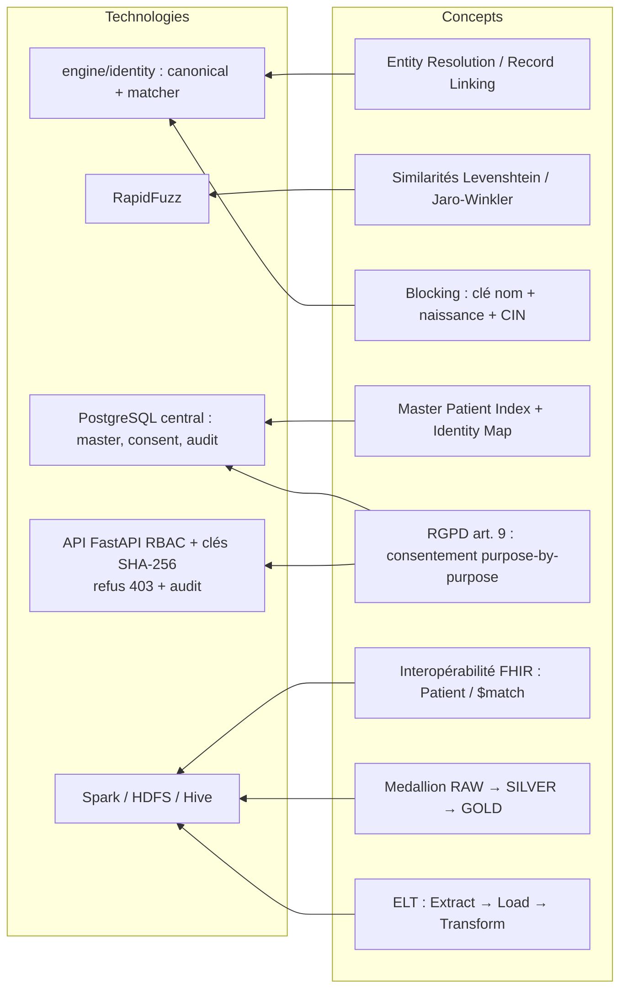
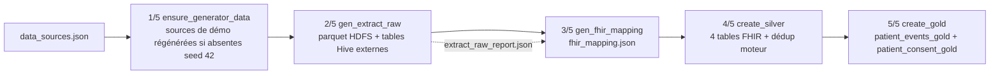

# Chapitre 7 — Conception du logiciel

## Objectif

Présenter le logiciel vu par le développeur : la plate-forme technique et les choix qui l'ont
fixée, la structure du code, le modèle de données, les composants (déduplication, gouvernance,
parité Spark), le déploiement, puis la réalisation effective de chaque étape et les difficultés
rencontrées.

---

## 7.1 Plate-forme technique

Chaque concept de l'état de l'art (chapitre 2) est porté par une brique technique précise.
Le schéma ci-dessous relie les deux.



> **Figure 6 — De la théorie à la brique technique : les huit concepts de l'état de l'art
> et les cinq briques réellement livrées, reliés par neuf correspondances.**

**Matrice de sélection technologique.** Les choix du projet ne sont pas des préférences : ils
sont arbitrés sur des critères **explicités et pondérés**. La grille ci-dessous est appliquée aux
trois arbitrages structurants ; les critères sont issus des contraintes du § 4.2 (Python 3.8,
VM 8 Go, interdiction de NLP lourd, exigence d'explicabilité).

**Tableau 33 — Les cinq critères pondérés de la grille d'arbitrage et la justification de chaque poids.**

| Critère | Poids | Justification du poids |
|---|---:|---|
| C1 · Compatibilité environnement (Python 3.8, 8 Go) | 0.30 | contrainte **éliminatoire** : une option incompatible est écartée quelles que soient ses qualités |
| C2 · Explicabilité de la décision | 0.25 | exigence F3 : toute fusion doit être justifiable, toute finalité contrôlable |
| C3 · Coût mémoire / performance | 0.20 | la VM limite les ressources |
| C4 · Maturité et documentation | 0.15 | autonomie du stage, sans expert dédié |
| C5 · Coût de licence | 0.10 | budget nul |

Les options sont notées de 1 à 5, 5 étant le meilleur :

**Tableau 34 — Notation des options sur les cinq critères pondérés, pour les trois arbitrages structurants.**

| Arbitrage | Option | C1 | C2 | C3 | C4 | C5 | **Score** | Verdict |
|---|:---|---:|---:|---:|---:|---:|---:|---|
| **1 · Moteur de similarité** | **RapidFuzz** [B4] | 5 | 5 | 5 | 5 | 5 | **5.00** | **retenu** |
| | `sentence_transformers` | 1 | 2 | 1 | 4 | 5 | 2.10 | écarté (crash Python 3.8) |
| | Levenshtein pur Python (`difflib`) | 4 | 3 | 2 | 5 | 5 | 3.60 | repli possible, trop lent |
| **2 · Base centrale** | **PostgreSQL** | 5 | 5 | 4 | 5 | 5 | **4.80** | **retenu** (JSONB, contraintes CHECK, `TIMESTAMPTZ`) |
| | SQLite | 5 | 3 | 5 | 4 | 5 | 4.35 | écarté (écriture concurrente des 3 sources) |
| | MySQL | 4 | 4 | 4 | 5 | 5 | 4.25 | écarté (JSONB moins intégré) |
| **3 · Framework d'API de gouvernance** | **FastAPI** | 5 | 5 | 4 | 4 | 5 | **4.65** | **retenu** |
| | Flask | 5 | 3 | 5 | 5 | 5 | 4.50 | écarté de peu — validation manuelle de la finalité |

> **Lecture honnête du score.** Flask et FastAPI ne se séparent que de 0.15 : le
> choix n'est pas « le meilleur », mais « celui qui rend le contrôle de finalité
> **exprimable dans le schéma de l'API** plutôt que dans le code de la route »
> (C2 = 5 contre 3). De même, `SQLite` (4.35) et MySQL (4.25) ne sont écartés que
> par un critère de cohérence (écriture concurrente, support JSONB), pas par une
> incapacité. Le pondérage est **sensible** : C1 étant éliminatoire, aucune
> pondération ne réintroduirait `sentence_transformers`. Le même raisonnement
> appliqué à la déduplication (§ 2.1.3, poids 0.5/0.3/0.1/0.1) impose de garder le
> **score de similarité explicite**, jamais une décision opaque — c'est le principe
> commun aux deux exercices.

La plate-forme retenue est donc : Hadoop 3.3.6 (HDFS, YARN), Hive 3.1.3 et Spark 3.4.2 pour le
Data Lake ; Python 3.8 avec Pandas, PySpark et RapidFuzz pour le moteur ; PostgreSQL pour la
base centrale ; FastAPI pour l'API de gouvernance et Flask pour l'API des indicateurs ; Next.js
pour l'interface optionnelle (Tableau 17, § 4.1.4).

## 7.2 Conception du code source

### 7.2.1 Vue statique : structure du projet

Le code consolidé vit dans `projet/code-source/`. Son découpage suit la séparation exigée par le
projet entre ingestion, normalisation, déduplication, gouvernance et exposition [AGENTS.md] :

```text
projet/code-source/
├── engine/
│   ├── identity/        canonical.py · matcher.py · spark_dedup.py
│   └── governance/      auth.py · consent.py · audit.py · app.py
├── provision/
│   ├── Vagrantfile · bootstrap.sh
│   ├── scripts/         run_pipeline.sh · ELT/ · utils/ · scheduler/
│   ├── api/             hive_api.py · mock_data.py · test_api.py
│   ├── db/              seed_governance.py
│   └── config/          schedule.example.yaml (+ fichiers locaux non versionnés)
├── config/              deduplication.yaml
├── sql/                 schema.sql
├── evaluation/          synthetic-patient-generator/ · evaluate_engine.py · evaluation_truth.md
├── tests/               suites pytest du moteur, de la gouvernance et de la planification
├── front-optional/      interface Next.js (optionnelle)
└── scripts/dev/         rendu des figures et export du mémoire
```

- **Ingestion et pipeline** : `provision/scripts/` — l'orchestrateur `run_pipeline.sh`, les
  étapes ELT, les utilitaires d'état (`pipeline_state`, `watermark`, `schedule_logic`) et le
  planificateur.
- **Identité** : `engine/identity/` — le modèle canonique et les deux implantations du moteur.
- **Gouvernance** : `engine/governance/` — authentification, consentement, audit et API.
- **Exposition** : `provision/api/` (indicateurs du warehouse) et `front-optional/`.
- **Paramètres** : `config/deduplication.yaml` (poids, seuil, blocage) et `sql/schema.sql`
  (base centrale), lus par le code et jamais recopiés dans la logique.

### 7.2.2 Modélisation des données

**Le modèle canonique.** Chaque source possède son vocabulaire (§ 3.1.2). La conception
introduit une représentation unique, `CanonicalPatient` [deduplication.md §2] :

```text
source_system · source_patient_id · first_name · last_name · full_name
birth_date · cin · birth_city · address · gender
```

Le mapping des colonnes source → canonique est **explicite et déterministe**
(`canonical.py::map_patient()`) ; le `matching_key` produit la clé de déduplication
`(birth_date, cin, nom normalisé)`.

**Tableau 35 — Le mapping des colonnes source vers le modèle canonique, et la règle de standardisation appliquée à chaque champ.**

| Champ | pharmacy | consultation | imaging | Standardisation `_*` |
|---|---|---|---|---|
| ID | `client_id` | `patient_code` | `id_personne` | — |
| Nom | `nom_complet` | `prenom` + `nom` | `patient_name` | `_normalized` : minuscules, sans accents, sans ponctuation |
| Naissance | `naissance` | `date_naiss` | `dob` | `_birth_date` → ISO `YYYY-MM-DD` |
| CIN | `cin` | `no_cin` | `cin_number` | `_cin` : chiffres uniquement |
| Ville de naissance | `ville_naissance` | `ville_nai` | `birth_place` | `_text` + `_normalized` |
| Genre | `sexe` H/F | `genre` male/female | `sex` Homme/femme | `_gender` → `M` / `F` |

La normalisation rend comparable ce que la saisie rendait divergent : les trois
formes du cas « Jean Rakoto » produisent des valeurs canoniques identiques.

**La base centrale PostgreSQL.** Le schéma central (`sql/schema.sql`) couvre la traçabilité des
données brutes, des identités et de la gouvernance [consentement_gouvernance.md §6] :

**Tableau 36 — Les tables du modèle central PostgreSQL, leur rôle et les clés qui rendent l'écriture idempotente.**

| Table | Rôle | Clés de conception |
|---|---|---|
| `raw_patient_record` | historique append-only, jamais exposé | payload `JSONB`, `UNIQUE(source_system, source_patient_id)` |
| `master_patient` | identité unique | `gender CHECK IN ('M','F','')` |
| `patient_identity_map` | source → master | `match_method CHECK IN ('new_master','exact','probabilistic')`, `match_score NUMERIC(4,3)`, `explanation` |
| `consent` | consentement par finalité (*purpose-by-purpose*) | `purpose` (`CHECK IN ('api_access','research','analytics')`), `granted`, `recorded_at` |
| `api_user` | utilisateurs machine | `api_key_hash` (SHA-256), `role CHECK ('admin','analyst','viewer')` |
| `access_audit` | journal de toutes les tentatives | endpoint, status, IP, `purpose`, `refusal_reason`, `accessed_at` |
| `medicine_purchase` / `patient_consultation` / `imaging_exam` | transactions métier rattachées au master | `payload JSONB`, `UNIQUE(source_system, source_record_id)` |

**Idempotence** — relancer le même traitement ne duplique rien et ne casse rien :
`CREATE TABLE IF NOT EXISTS` pour les tables, `ADD COLUMN IF
NOT EXISTS` pour les migrations — le pipeline est rejouable [consentement_gouvernance.md §6].
À cette idempotence **structurelle** s'ajoute une idempotence **opérationnelle**
(§ 7.3.2) : l'état des runs (`pipeline_state.json`) et l'empreinte des sources
(`watermark.json`) assurent qu'un run échoué **reprend**, et qu'une table dont
l'empreinte n'a pas changé n'est **pas ré-extraite** (incrémental, anti-retraitement).

**Les zones du Data Lake** [bigdata_concepts.md §3] :

**Tableau 37 — L'écriture dans les trois zones du Data Lake : ce que chaque zone reçoit et sous quelle forme.**

| Couche | Rôle dans la conception | Écriture |
|---|---|---|
| **RAW** | donnée brute, inchangée (schéma-on-read) | parquet HDFS `/datalake/raw/{source}/{table}` + tables Hive externes |
| **SILVER** | normalisée **FHIR** (4 entités), doublons **marqués et expliqués** | `datalake_silver.{patient,encounter,condition,observation}_fhir` |
| **GOLD** | agrégats prêts à l'analyse + consentement | `datalake_gold.patient_events_gold` (17→18 colonnes, 8 tranches d'âge), `patient_consent_gold` |

La logique ELT impose : l'ingestion **charge** la donnée brute, la transformation
s'applique *a posteriori* dans les couches suivantes — la zone RAW reste le
référentiel de rejeu.

### 7.2.3 Composants

**Entity Resolution : blocking et déduplication.** Comparer chaque enregistrement à tous les
autres est en O(n²). Le concept utilise trois index de candidats : préfixe du nom (4 lettres),
date de naissance ISO, CIN (`_MasterIndex`, 3 buckets) ; le matching n'évalue que l'union des
candidats de ces buckets [deduplication.md §4].

**Déduplication en deux passes** (`deduplicate()`, seuil `probabilistic_threshold`
= 0.80) :

1. **Exact matching** — le patient partage la `matching_key` d'un master, ou bien
   naissance égale **et** CIN non vide identique (absorbe les inversions
   prénom/nom). Décision `exact`, score 1.0.
2. **Probabilistic matching** — parmi les candidats du blocking, score de
   similarité **pondéré** [deduplication.md §5] :

**Tableau 38 — Le calcul du score de similarité : une similarité et un poids par critère, pour un total qui doit atteindre 0,80 pour fusionner.**

   | Critère | Similarité | Poids |
   |---|---|---:|
   | Nom | `fuzz.ratio` (token, insensible à l'ordre) | 0.50 |
   | Date de naissance | exacte | 0.30 |
   | CIN | exact (si présent, ~75 %) | 0.10 |
   | Ville de naissance | exacte (normalisée) | 0.10 |

   Score ≥ 0.80 → décision `probabilistic` (score conservé) ; sinon → nouveau
   master (`new_master`).
3. Chaque décision porte **`master_patient_id`, `method`, `score`, `explanation`** —
   la règle d'or « jamais fusionner sans logique explicable » est structurelle,
   pas une convention [deduplication.md — règle métier].

Le cas de référence est conçu pour être résolu : Jean Rakoto (exact, CIN) et
Nirina (probabiliste, score 0.8+) [deduplication.md §7].

**Gouvernance : RBAC, consentement, audit.** Trois mécanismes, dans cet ordre : on vérifie
**qui** demande, **pourquoi** il demande, et on **trace** ce qui s'est passé.

- **Rôles** : `admin` / `analyst` / `viewer` — contrôlés par clé API sur la
  plateforme (et RBAC web optionnel côté frontend) [consentement_gouvernance.md §2].
- **Clés API** : hachées SHA-256 en base ; la clé en clair n'est jamais stockée ni
  exposée [consentement_gouvernance.md §5]. Cette empreinte protège la lecture directe
  de la table, mais le hachage retenu n'est **ni salé ni lent** : c'est une dette
  déclarée, avec sa cause et sa voie de correction, dans les limites de la conclusion
  générale.
- **Finalité déclarée** : `purpose` est un **paramètre obligatoire** de
  `/patients` et `/patients/{id}`, validé contre une liste fermée
  (`api_access`, `research`, `analytics`) — un code **422** est renvoyé pour une
  finalité inconnue. Le refus par finalité non consentie produit un **403**.
- **Consentement par finalité** (*purpose-by-purpose*) : table `consent` liée au master ; la
  décision d'accès ne dépend pas du rôle seul — un utilisateur **autorisé mais
  sans finalité consentie** est refusé. Sur la liste, les patients sans
  consentement sont **retirés** de la réponse, et le nombre d'exclusions est
  journalisé : l'endpoint ne peut pas servir par inadvertance un patient non
  consenti. Cette conception matérialise l'article 9 du RGPD (dérogation par
  consentement explicite) appliqué à des données synthétiques.
- **Audit** : middleware journalisant chaque requête avec `user`, `endpoint`,
  `method`, `status`, `ip`, **`purpose`** et **`refusal_reason`**, y compris les
  refus et les appels anonymes [consentement_gouvernance.md §4]. Le refus est donc
  *consultable* a posteriori, et pas seulement déductible du code HTTP.
- **Planification du pipeline** : `GET/PUT /pipeline/schedule` (lecture
  admin/analyst, écriture **admin** uniquement avec validation stricte) et
  `GET /pipeline/status` (plan, prochain run, sources suivies, zones) — le format
  écrit étant identique à celui attendu par le cron de la VM
  [cahier_des_charges.md §4.4].

**Ce que la conception ne couvre pas** (assumé, voir les limites en conclusion générale) : ni
`data_scope` (périmètre de données), ni durée de validité du consentement, ni chiffrement au
repos du journal d'audit, ni mesure de temps de traitement persistée.

**Parité Spark (niveau 2).** L'algorithme est porté en PySpark sans changer sa sémantique :
clusters **exacts** construits par `groupBy` de la clé, puis résolution **probabiliste
driver-side sur les ancres de clusters** (`_BoundedMasterIndex`) — la comparaison reste bornée,
d'où la montée en charge [`spark_dedup.py`]. La parité Pandas/Spark est un **critère de
conception**, vérifié par test et par évaluation sur la vérité terrain.

### 7.2.4 Déploiement

La plateforme s'installe sur la VM de développement par **Vagrant** : le `Vagrantfile` décrit la
machine (`ubuntu/focal64`, 8 Go, 4 cœurs, ports redirigés) et `bootstrap.sh` installe Hadoop,
Hive, Spark et l'environnement Python. Les services démarrent ensuite dans l'ordre strict du
§ 6.2 ; le pipeline se lance par `run_pipeline.sh`, à la main ou par le cron de la VM ; le
frontend optionnel tourne sur l'hôte Windows.

> **Ce qui n'est pas déployé.** Aucun déploiement n'a été fait sur un serveur du commanditaire :
> ni export de la VM (`.box`), ni conteneurisation (Docker), ni intégration continue. La
> plateforme est **reproductible depuis le dépôt**, pas mise en production (§ 3.4).

## 7.3 Réalisation des étapes

### 7.3.1 Générateur de données et vérité terrain

Le générateur
[`synthetic-patient-generator`](../projet/code-source/evaluation/synthetic-patient-generator)
est implémenté en 7 étapes, déterministe (seed 42) :

**Tableau 39 — Les six modules du générateur synthétique et le rôle réel de chacun.**

| Module | Rôle réalisé |
|---|---|
| `patient_generator.py` | 500 patients maîtres + `master_patients.csv` (vérité absolue) |
| `distribution_engine.py` | plan de distribution 0.8 / 0.7 / 0.6 → 3 sources |
| `variation_engine.py` | injection d'erreurs easy 10 % / medium 30 % / hard 50 % |
| `pharmacy/consultation/imaging_generator.py` | fichiers patients + transactions |
| `identity_mapping.py` | `identity_mapping.csv` : source → source_patient_id → ground_truth_id |
| `experiment_builder.py` | datasets easy / medium / hard |

Types de variations réels : casse, espaces, inversion prénom/nom, abréviation,
typo (suppression/duplication/permutation), formats CIN (espacé / compact) et
dates (ISO, DD/MM/YYYY…), valeurs manquantes (naissance ou ville de naissance).
Résultat pour le dataset hard :
**1 057 enregistrements, 500 groupes de vérité, répartition 404 / 353 / 300**, et
792 achats / 519 consultations / 450 examens. Le CIN est porté par ~75 % des
maîtres, stable entre les sources (autoritatif). Le fichier de vérité est **réservé à
l'évaluation** — jamais fourni à l'algorithme [deduplication.md — règle métier].

Le déterminisme n'est pas un détail d'implémentation : c'est ce qui rend l'évaluation
**comparable**. Les trois jeux easy / medium / hard sont produits à partir des
**mêmes 500 maîtres** (`--seed 42`) et ne diffèrent que par le **taux de variation**
appliqué (10 % / 30 % / 50 %). La dégradation de la qualité est ainsi attribuable à
un seul facteur, et deux exécutions sont comparables ligne à ligne — condition
nécessaire pour établir la parité Pandas/Spark (chapitre 8) et pour rejouer une
évaluation après un changement de poids. Les tables de transactions (792 achats,
519 consultations, 450 examens sur le jeu hard) alimentent les entités FHIR autres
que `patient` : c'est leur rattachement au patient qui fait la dette
`patient_events_gold` du § 8.6.

### 7.3.2 Pipeline ELT Medallion en 5 étapes

Orchestration par `run_pipeline.sh` (arrêt sur erreur, logs `elt.log`) : le run
de référence du 07/09/2026 est **4/4 vert** sur la VM ; l'orchestration compte
désormais **cinq étapes**, l'ajout de `ensure_generator_data` étant préparatoire
et sans effet quand les sources existent [contexte_projet.md].



> **Figure 7 — Le pipeline ELT en cinq étapes, de la préparation des sources au
> chargement GOLD, piloté par `data_sources.json` et contrôlé par `extract_raw_report.json`.**
> L'étape 1/5 est préparatoire : si les fichiers de démonstration existent déjà,
> elle ne ré-écrit rien (idempotence).

**Tableau 40 — Les cinq étapes du pipeline ELT, le script qui les exécute et la sortie réellement produite.**

| Étape | Script | Sortie réelle |
|---|---|---|
| **1 — Préparation (préparatoire)** | `ensure_generator_data.sh` | régénère les CSV synthétiques (seed 42) s'ils sont absents ; sans effet sinon |
| **2 — Extraction RAW** | `gen_extract_raw.py` | parquet `/datalake/raw/{source}/{table}`, tables Hive externes, `extract_raw_report.json` |
| **3 — Mapping FHIR** | `gen_fhir_mapping.py` | `fhir_mapping.json` (table→entité FHIR, cartes explicites) |
| **4 — SILVER FHIR** | `create_silver.py` | `datalake_silver.{patient,encounter,condition,observation}_fhir` |
| **5 — GOLD** | `create_gold.py` | `patient_events_gold` (8 tranches d'âge), `patient_consent_gold` |

Chaque étape est un programme distinct plutôt qu'une fonction d'un programme
unique : une étape qui échoue ne laisse pas la zone suivante dans un état
intermédiaire, ce qui est la condition pour que le pipeline reste **relançable**
et **rejouable**.

**Reprise de run et ingestion incrémentale (watermark).** Le cahier des charges ajoute une
exigence : **pas de retraitement en boucle**. Deux mécanismes la réalisent
[cahier_des_charges.md §4.1] :

- **Reprise de run** — l'état de chaque exécution (identifiant `run_id`, statut
  `running` / `ok` / `failed`, statut par étape) est persisté dans
  `provision/metadata/pipeline_state.json`. En mode `resume`, un run échoué
  repart de la **première étape non terminée** au lieu de tout rejouer ; un run
  `running` **verrouille** tout lancement concurrent (le planificateur ne lance
  pas de doublon).
- **Watermark anti-retraitement** — chaque source de type CSV conserve une
  empreinte (SHA-256 + taille + `mtime`) dans `provision/metadata/watermark.json`.
  À un nouveau run, une table dont l'empreinte n'a pas changé est **sautée** ;
  le rapport d'extraction est reconstruit pour que le pipeline côté aval reste
  strictement identique. Priorité de décision : `ingest.mode` de la source
  (`full`) > mode du pipeline (`full` / `since`) > comparaison d'empreinte —
  l'ordre garantit qu'on rejoue **par choix**, jamais par oubli.

`run_pipeline.sh` combine les deux : `--resume` (reprise), `--full` (purge et
tout rejouer), `--since YYYY-MM-DD` (ré-extraction forcée à partir d'une date),
`--from <étape>` (repartir d'une étape nommée) et `--dry-run` (afficher le plan
sans rien exécuter ni écrire).

**Planification automatique (scheduler cron).** Le lancement régulier est confié au crontab de
la VM, qui vérifie **chaque minute** `python -m provision.scripts.scheduler.scheduler --check`
[`cahier_des_charges.md` §4.1]. Le pipeline n'est lancé que si :

1. la planification est **active** (`enabled: true` dans `provision/config/schedule.yaml`,
   fichier runtime gitignoré, template committé `schedule.example.yaml`) ;
2. l'**échéance** (fréquence `daily` / `weekly` / `monthly`, heure fixe fuseau VM)
   vient d'être atteinte et n'a pas déjà été déclenchée (état persisté dans
   `scheduler_runs.json`) ;
3. **aucun run** n'est en cours (`pipeline_state.json` pas à `running`).

Le lancement se fait en arrière-plan (`start_new_session`) : le cron revient
aussitôt, le pipeline continue indépendamment et met à jour son propre état. La
même planification est lisible et modifiable par l'API `/pipeline/schedule` (§ 5.3.2),
dans un format identique à celui attendu par le cron de la VM.

> **Honnêteté d'exécution.** La mécanique (scheduler, watermark, reprise) est
> **écrite et testée** (chapitre 8), mais la VM étant indisponible sur le poste de
> préparation, **aucune exécution réelle planifiée d'un run incrémental n'a encore
> été rejouée sur la VM** : c'est une re-validation en attente, assumée au § 8.6
> et dans les perspectives de la conclusion générale.

**Résultats du run de référence** (sources CSV synthétiques, 214 enregistrements) :
**`datalake_silver.patient_fhir` = 214 lignes** (76 + 76 + 62) ; **145 masters** ;
**69 doublons liés** (`is_duplicate`), tous `match_method = exact` ; `duplicate_rate`
**32.24 %** ; `patient_consent_gold` = **145** lignes. `patient_events_gold` reste à
**0 ligne** en intermédiaire (jointures FHIR non rattachées — dette identifiée au
§ 8.6).

L'étape SILVER intègre la **fusion des doublons dans le Data Lake** : le moteur relit
`patient_fhir`, réapplique `deduplicate()` et enrichit chaque ligne des colonnes
`master_patient_id`, `match_method`, `match_score` et `is_duplicate` — la fusion
reste explicable *dans* le lac, pas seulement dans un script séparé.

Le passage **214 → 145** est le contrôle de cohérence le plus utile du run : 214
enregistrements, 69 doublons liés, 145 masters, et `214 − 69 = 145` se vérifie par un
simple comptage sur le lac, sans consulter la logique de fusion — c'est la
correspondance « un master = un enregistrement non dupliqué » qui est testée, pas la
décision elle-même. Le taux de 32.24 % est ce même rapport exprimé en pourcentage,
et `patient_consent_gold` aligne **145 lignes sur 145 masters**. Le tableau reste
néanmoins asymétrique et le dit explicitement : `patient_events_gold` est vide, donc
la zone GOLD ne certifie pour l'instant que **l'identité**, pas les événements de
soin rattachés.

### 7.3.3 Moteur de déduplication : Pandas et Spark

Le moteur `engine/identity/` est la pièce centrale, deux implantations alignées :

**Tableau 41 — Les deux implantations du moteur côte à côte : la sémantique est alignée, seule la mécanique change.**

| Aspect | `matcher.py` (Pandas) | `spark_dedup.py` (PySpark driver-side) |
|---|---|---|
| Canonique | `canonical.py` (`map_patient`, `from_dict`) | réutilise `matcher`/`canonical` |
| Exact | `matching_key` + naissance/CIN | clusters par `groupBy` de la clé |
| Probabiliste | `_MasterIndex` (3 buckets) | `_BoundedMasterIndex` sur ancres de clusters |
| Score | `fuzz.ratio(nom)×0.5 + naissance×0.3 + CIN×0.1 + ville×0.1` | identique |
| Décision | `exact` / `probabilistic` / `new_master`, seuil 0.80 | identique |
| Sortie | `MatchDecision` | dicts `(master_patient_id, method, score, explanation)` |

La **sémantique est strictement alignée** et la **parité est vérifiée** : démo 18
patients → 11 masters identiques Pandas et Spark, et évaluation ground-truth
« modes MVP+Spark identiques » (TP=307, FP=0, FN=420 pour les deux)
[`evaluation_truth.md`] — voir chapitre 8.

Cette parité n'est pas une coïncidence de développement mais une **propriété
structurelle** : les deux implantations partagent le même `canonical.py`, lisent les
**mêmes poids et le même seuil** dans `config/deduplication.yaml`, et ne diffèrent que
par la **stratégie de regroupement**. Le matcher Pandas indexe les masters sur trois
critères de blocage (préfixe de nom normalisé, date de naissance, CIN) pour borner les
comparaisons ; l'implantation Spark regroupe d'abord les enregistrements par clé
exacte (`groupBy`), puis ne compare que les **ancres de clusters** — un choix assumé
pour la montée en charge, au prix d'une comparaison moins exhaustive. Le protocole de
test rejoue les deux chemins sur le même jeu et compare les décisions méthode par
méthode : c'est le seul moyen de détecter une dérive entre les deux
implémentations, qu'aucune des deux ne peut détecter seule.

### 7.3.4 Chargement PostgreSQL et GOLD du consentement

- **Chargement central** : le schéma (`sql/schema.sql`) est créé de façon
  **idempotente** (`CREATE TABLE IF NOT EXISTS`, `ADD COLUMN IF NOT EXISTS`,
  `ON CONFLICT`) — le pipeline est rejouable sans état résiduel.
- **`patient_consent_gold`** : l'étape GOLD joint le PostgreSQL central (table
  `consent`, via `psycopg`) aux masters SILVER ; si la base est inaccessible, le
  schéma est créé vide et l'API bascule en mode `mock` — le consentement reste un
  composant formel de l'architecture.

### 7.3.5 Gouvernance et API

La gouvernance est implémentée dans le moteur : `auth.py` (authentification par
clé hachée SHA-256 + rôles `admin`/`analyst`/`viewer`), `consent.py` (router FastAPI
`/consent`, décision *purpose-by-purpose*), `audit.py` (middleware journalisant
chaque requête, refus compris), `app.py` (points d'entrée décrits au § 5.3.2). Les
**payloads RAW ne sont jamais exposés** par l'API — seuls les maîtres consolidés le sont
[consentement_gouvernance.md §7]. Les endpoints `/patients` et `/patients/{id}` réalisent la
recherche plein texte, la pagination et le **filtrage silencieux** conçus au § 7.2.3.

L'API des indicateurs du warehouse (Flask, port 5000) est couverte par `test_api.py`, qui
interroge ses 2 endpoints (plus la limite `limit` du consentement) et retourne **3/3 PASS** en
données réelles [contexte_projet.md].

Il faut distinguer deux couches qui portent le même mot « gouvernance » sans avoir le
même rôle. L'API **Flask** est une surface de *consommation et de reporting* : ses
endpoints lisent le GOLD et en rendent des agrégats ; `/api/governance/consent` en
particulier **liste** les consentements et leurs statistiques, mais **n'impose
rien** — ni authentification, ni contrôle de finalité. L'API **FastAPI** du moteur est
le seul point d'**application** de la règle : c'est là que se produisent les 401 (clé
inconnue), 403 (rôle insuffisant ou finalité non consentie) et 422 (`purpose`
obligatoire), chacun journalisé par `audit.py`. Cette frontière est assumée et
documentée : l'API Flask reste une dette — lancée avec `debug=True`, elle rend en outre
le nom du patient dans sa réponse de consentement — et le contrôle de consentement
s'applique à l'API de gouvernance, comme le rappelle `ai/dev/suivi_avancement.md`.

### 7.3.6 Difficultés rencontrées et résolutions

**Tableau 42 — Les sept difficultés réellement rencontrées, leur cause et le correctif testé.**

| Problème réel | Cause | Correctif |
|---|---|---|
| SILVER explosait à **11 614 lignes** | `patient_uuid` capturé par le mapping FHIR dynamique → `source_patient_id` NULL → jointure **76×76** du moteur | `patient_uuid` **exclu** du mapping dynamique + colonne source utilisée une seule fois |
| Listing périmé (overwrite+append par source) | écritures répétées dans la boucle source | accumulation par entité, **une seule écriture `overwrite` par table** ; phase 5 en table temp puis `DROP` + `RENAME TO` |
| Parquet corrompu sur partage vboxsf | warehouse Spark écrit sur le montage partagé | `spark.sql.warehouse.dir = hdfs://localhost:9000/...` (toujours HDFS) |
| Spark ne démarrait pas | `JAVA_HOME` avec `\bin` en trop | normalisation `_resolve_java_home()` dans `spark/session.py` |
| HiveServer2/beeline instable sur la VM | service HS2 fragile | validation des comptages par **scripts Spark** (`check_data.py`) |
| NLP lourd inutilisable | `sentence_transformers` crash Python 3.8 | RapidFuzz + dictionnaire de synonymes (`fhir_synonyms.py`) |
| `gen_extract_raw` ne passait pas `py_compile` | caractère insécable dans sa docstring, interprété comme fin de fichier | docstring corrigée, script recompilé (aucun drapeau d'encodage requis) |

Ces sept incidents se répartissent en trois familles, et la famille conditionne le
correctif. Les **données** (les deux premières lignes) produisent les correctifs les
plus structurés : ils sont documentés dans `pipeline_elt.md` comme des pièges
anti-régression, avec le symptôme, la cause et la parade, précisément parce qu'ils
se reproduisent. L'**infrastructure** (parquet sur partage, démarrage de Spark,
HiveServer2 instable) impose des choix de configuration qui n'ont pas à être
justifiés fonction par fonction : la règle retenue est de **contourner** — écrire
toujours sur HDFS plutôt que sur le partage vboxsf, valider les comptages par scripts
Spark plutôt que par beeline. L'**outillage** (NLP trop lourd) est le seul cas où le
correctif change la méthode : l'approche par vecteurs a été abandonnée pour un score
pondéré et un dictionnaire de synonymes, arbitrage dicté par la contrainte Python
3.8 et rendu lisible par l'exigence d'explicabilité.

## Conclusion et transition

La plateforme est conçue et réalisée : un canonique et deux passes de déduplication
expliquées, un PostgreSQL traçable, une gouvernance par consentement, un pipeline ELT en
5 étapes (4/4 au run de référence, reprise et watermark implémentées, planification cron
intégrée) et une déduplication enregistrée dans le lac. Reste à **démontrer la qualité** :
le chapitre 8 présente la stratégie de test, les tests unitaires, d'intégration et
fonctionnels, l'évaluation ground-truth (P/R/F1) et les limites honnêtes du prototype.

### Références

- `documents/documentation/deduplication.md` (canonique, blocking, seuil, règles).
- `documents/documentation/consentement_gouvernance.md` (RBAC, consentement, audit).
- `documents/documentation/bigdata_concepts.md` (Medallion, Spark, HDFS/Hive).
- `documents/documentation/pipeline_elt.md` (pièges anti-régression).
- `sql/schema.sql` ; `engine/identity/{canonical,matcher,spark_dedup}.py` ;
  `engine/governance/{auth,consent,audit,app,pipeline}.py`.
- `provision/scripts/ELT/*` + `run_pipeline.sh` ; `provision/api/hive_api.py`,
  `mock_data.py`, `test_api.py`.
- `provision/scripts/utils/{pipeline_state,watermark,schedule_logic}.py` ;
  `provision/scripts/scheduler/scheduler.py` ; `provision/config/schedule.example.yaml`.
- `ai/memoire/contexte_projet.md` (run 07/09/2026).
