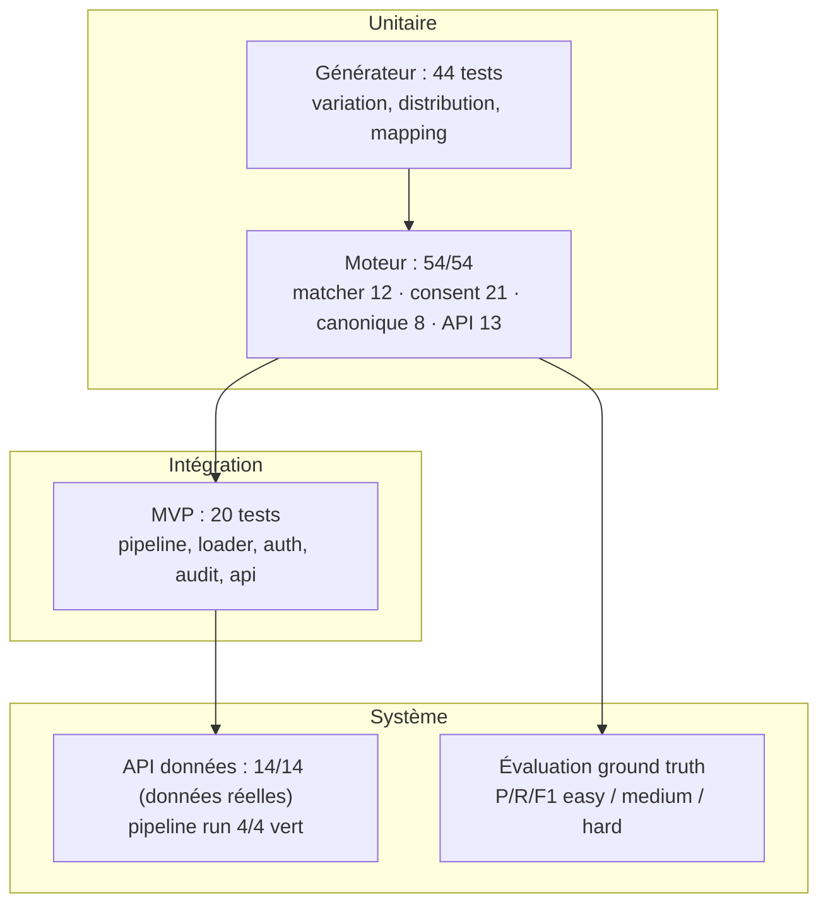

# Chapitre 7 — Tests et évaluation

> **Statut** : rédigé (08/09/2026, actualisé 27/09/2026)

## Objectif

Présenter la stratégie de test du projet, l'évaluation ground-truth de la
déduplication (précision / rappel / F1, par méthode et par source), la vérification
de la parité MVP/Spark, puis les limites honnêtes du prototype et les pistes
d'amélioration.

---

## 7.1 Stratégie de test

La validation suit une pyramide : unitaire (générateur et moteur), intégration
(pipeline, base) et système (API).

> **Figure 8 — La stratégie de test : un socle hors ligne (générateur, moteur), puis le
> MVP, et enfin la preuve système (API sur données réelles, évaluation ground truth).**

**Tableau 30 — Les cinq niveaux de test, leur périmètre et le résultat obtenu ; les 14 tests de l'API ne prouvent que la joignabilité.**

| Niveau | Périmètre | Résultat |
|---|---|---|
| **Générateur** (7 fichiers de tests) | variation engine, générateurs de sources, distribution, identity mapping, experiment builder | **44 tests PASS** [contexte_projet.md] |
| **Moteur `engine/`** | `test_matcher.py` (12 cas), `test_consent.py` (21 cas), `test_deduplication.py` (8 cas canonique), `test_governance_api.py` (13 cas) | **54/54 PASS** (`pytest projet/code-source/tests`, 27/09/2026) |
| **MVP** (`test_bigdata`) | pipeline, loader PostgreSQL, auth, audit, api | **20 tests PASS** [contexte_projet.md] |
| **API** | `test_api.py` — 14 tests sur données réelles (`RMA_USE_MOCK=false`) | **14/14 PASS** [logs.md] |
| **Pipeline** | `run_pipeline.sh` RAW → SILVER → GOLD | **4/4 vert** (07/09/2026) |

L'ordre des niveaux n'est pas décoratif : il suit le **coût de retour à l'échec**. Un test
unitaire échoue en quelques secondes et pointe une ligne de code ; un test de système n'échoue
qu'après un pipeline complet et demande la VM. La pyramide est ici le substitut d'une intégration
continue, écartée du périmètre du stage : la preuve est **reproductible manuellement** (`pytest`
pour le moteur, `run_pipeline.sh` pour le lac, `test_api.py` pour l'API) plutôt que rejouée à
chaque commit.

Une précision de portée, sur les **14/14 de l'API** : `test_api.py` est un **test de fumée**. Il
vérifie que chaque endpoint renvoie le code de statut attendu sur données réelles, sans en-tête
d'authentification — il prouve la **joignabilité** des 11 endpoints et l'absence de régression de
statut, **pas** le contrôle d'accès. Celui-ci est vérifié ailleurs, par les 13 cas de l'API de
gouvernance, qui emprunte le chemin d'authentification réel (tableau ci-dessous). Aucun des deux
niveaux ne se substitue à l'autre.

Les tests du moteur couvrent la sémantique de la dédup : match exact (clé
identique, formats de CIN normalisés), nom inversé compensé par (naissance + CIN)
exact, fusion au seuil 0.80 (nom + naissance), faute de frappe compensée par
naissance, ville de naissance qui augmente le score, **non-fusion de patients
distincts**, et **parité Pandas/Spark** (`test_spark_parity`) [deduplication.md §9].

### Couverture du contrôle d'accès et du consentement

Ces 13 cas d'API ne simulent que le transport PostgreSQL : ils empruntent le
**chemin réel** `Authorization: Bearer <clé>` → résolution de l'utilisateur →
contrôle du rôle → contrôle du consentement, et **n'overrident jamais la
dépendance d'authentification**. Ils constituent la preuve du §2.5.

**Tableau 31 — Les dix cas de contrôle d'accès vérifiés sur le chemin réel, et le code ou le comportement attendu.**

| Cas vérifié | Attendu |
|---|---|
| Aucun `Authorization` | **401**, journalisé en `anonymous` |
| Clé inconnue | **401** (clé invalide) |
| Rôle `viewer` sur un endpoint `admin` | **403** |
| `purpose` absent de `/patients` | **422** (finalité obligatoire) |
| `purpose` hors liste fermée (`marketing`) | **422**, alphabet autorisé listé |
| Finalité non consentie sur `/patients/{id}` | **403** + `refusal_reason` en audit |
| Finalité consentie sur `/patients/{id}` | **200**, `refusal_reason` vide |
| `/patients` avec consentements partiels | seuls les patients consentis sont renvoyés, exclusions comptées |
| `/audit` | lit `accessed_at` (régression : la requête interrogeait `recorded_at`, inexistant) |
| Absence de ligne de consentement | refus (fail closed) |

> **Sensibilité des tests.** Le test de refus 403 a été vérifié par *mutation* :
> neutraliser l'appel au contrôle de consentement fait **échouer** le test. Un
> test qui passe quelle que soit l'implémentation ne prouverait rien — c'est la
> raison de cette vérification explicite.

## 7.2 Évaluation ground-truth

**Principe.** Trois jeux synthétiques easy / medium / hard sont générés à partir
**des mêmes masters** (`--seed 42`) : seul le **taux de variation** change
(10 % / 30 % / 50 %). La **vérité terrain** (`identity_mapping.csv`) regroupe les
enregistrements du même patient ; l'algorithme **ne la reçoit jamais**. Les
métriques sont calculées **par paires** d'enregistrements [evaluation.md §2].

Les trois métriques sont définies par comptage sur les intersections de groupes. La
**précision** (`TP / (TP + FP)`) mesure l'exactitude des fusions : c'est le risque le
plus grave en santé, où fusionner deux personnes distinctes est plus grave que d'en
laisser deux séparées. Le **rappel** (`TP / (TP + FN)`) mesure la complétude, c'est-à-dire
la part des vrais doublons effectivement trouvés. Le **F1** (`2·P·R / (P+R)`) est le
compromis global des deux.

**Résultats de référence** (run 08/09/2026, 500 masters par niveau, ~1 000
enregistrements, parité MVP = Spark vérifiée à chaque niveau) [evaluation.md §3] :

**Tableau 32 — Les résultats de l'évaluation ground-truth sur les trois niveaux de variation.**

| Niveau | Masters prédits | TP | FP | FN | Precision | Recall | F1 |
|---|---|---|---|---|---|---|---|
| easy (10 %) | 500 | 727 | 0 | 0 | **1.000** | **1.000** | **1.000** |
| medium (30 %) | 554 | 643 | 0 | 84 | **1.000** | 0.884 | 0.939 |
| hard (50 %) | 804 | 307 | 0 | 420 | **1.000** | 0.422 | 0.594 |

Lecture : l'algorithme **ne fusionne jamais à tort** (zéro faux positif, P 1.000 sur
les trois niveaux) — propriété essentielle en santé ; sur le dataset volontairement
dur (50 % de variations), il **ne reconnaît pas toutes les variantes** (R 0.422).
Les pondérations et le seuil sont configurables pour trader précision ↔ rappel
[deduplication.md §5]. L'introduction du **CIN en clé exacte** (couverture ~75 %)
a relevé le rappel hard de 0.287 (07/09) à **0.422** sans aucun faux positif.

Ces métriques sont calculées **par comptage analytique** sur les intersections de groupes, et non
en générant toutes les paires : le nombre de paires d'un groupe est obtenu directement, ce qui rend
l'évaluation applicable à des jeux de l'ordre du millier d'enregistrements sans explosion
combinatoire. La décomposition par méthode et par source réutilise ce même décompte en ne retenant
que les paires « pertinentes ».

Un point d'honnêteté sur le **zéro faux positif**. Le générateur ne fait que dégrader des
enregistrements existants — casse, espaces, inversion, abréviation, faute de frappe, format de CIN
ou de date, champ manquant — et ne construit **jamais** deux personnes distinctes qui se
ressemblent. Les collisions de noms survenues fortuitement ont donc été absorbées par le seuil,
mais le cas adversariaire — un homonyme proche fusionné à tort — n'est **pas sollicité** par la
vérité terrain. La précision affichée est donc un **plancher**, pas une borne : la confirmer
exigerait un générateur d'homophones quasi identiques, identifié comme piste au §7.5.

## 7.3 Breakdown par méthode et par source

Le découpage par technique de match localise la faiblesse : sur le niveau hard, la
méthode **exacte** atteint 1.000 / 0.854 / 0.921 (précision / rappel / F1) contre
1.000 / 0.533 / 0.696 pour la méthode **probabiliste**. La précision reste parfaite
dans les deux cas : toute la perte de rappel se situe sur les variantes que la passe
probabiliste ne franchit pas le seuil 0.80 (identique MVP/Spark) [evaluation.md §3].

Le rappel est homogène entre sources (hard) : pharmacy 0.422 · consultation 0.422 ·
imaging 0.423 — la dégradation vient du **taux de variation**, pas d'une source.

La parité est quasi triviale mais structurelle : sur le dataset hard, les deux
implantations (Pandas `matcher.py` et Spark `spark_dedup.py`) produisent
exactement mêmes **TP=307, FP=0, FN=420, 804 masters prédits pour 500 groupes de
vérité sur 1 057 enregistrements** [evaluation_truth.md]. Référence historique
(test_bigdata, 10 669 patients / 5 000 masters) : F1 0.403, zéro FP, là encore
Pandas = Spark [evaluation.md §3].

## 7.4 Cas de référence et intégrité

- **Cas « Jean Rakoto »** : démo 18 patients → **11 masters, 18 liens** ; Jean
  Rakoto fusionné par **exact** (CIN), Nirina par **probabilistic** (score
  0.8) — identique Pandas et Spark [deduplication.md §7].
- **Intégrité chargée** (run 07/09/2026) : SILVER `patient_fhir` **214** lignes
  (76 + 76 + 62) ; **145 masters**, **69 doublons** (tous `match_method=exact`,
  `match_score=1.0`) ; **214 − 69 = 145** — la cohérence se vérifie par comptage
  sur le lac [contexte_projet.md].
- **Gouvernance API** : `duplicate_rate` = **32.24 %** avec `mocked: false` ;
  `patient_consent_gold` = **145** lignes pour 145 masters — la table est produite
  par jointure, mais `purpose` / `granted` y sont à `NULL`, le consentement n'ayant
  pas été injecté en base au moment du run (cf. §7.5).

## 7.5 Limites et dettes identifiées

Le prototype est évalué sans complaisance [contexte_projet.md — reste à faire].
Sept limites ont été relevées, toutes reprises et documentées au § 8.3 : le **rappel
de 0.422** sur le jeu « hard » (420 faux négatifs ; à corriger en abaissant le seuil ou
en enrichissant la clé avec l'adresse, si le métier l'accepte) ; **`patient_events_gold`
vide**, les Encounter et Condition n'étant pas rattachées à un `patient_uuid`, donc un
enrichissement du mapping FHIR à prévoir ; le **consentement non alimenté** en base
centrale (`purpose` et `granted` à `NULL`), le seed étant fourni mais non exécuté, la
mécanique étant prouvée et la donnée absente ; les **endpoints `laboratory` et
`malaria`** sur données de secours, le flag `mocked` étant tracé ; l'absence de
**cas adversariaire d'homophones**, qui fait de la précision 1.000 un plancher et non
une borne ; le **contrôle d'accès de l'API Flask non testé**, `test_api.py` ne
contrôlant que 14 statuts sans authentification, dette assumée puisque le contrôle par
rôle et par consentement est appliqué et testé sur l'API de gouvernance ; enfin
l'absence de **tests EI-déployés et d'intégration continue**, hors périmètre du stage.

Ces limites sont **assumées et non masquées** : chacune est écrite ici avec sa cause
et, quand elle existe, sa piste de correction, plutôt que passée sous silence.

## Conclusion

La stratégie de test couvre le générateur (44), le moteur et la gouvernance
(54/54), le MVP (20), l'API (14/14) et le pipeline (4/4). L'évaluation
ground-truth démontre **une règle d'or tenue** : zéro fusion à tort (Precision
1.000) sur tous les niveaux, avec une parité Pandas/Spark parfaite, et un rappel
hard relevé à 0.422 grâce à la clé CIN. Le rappel sur le jeu dur indique
précisément où la logique pourrait s'enrichir. La gouvernance, elle, est vérifiée
par le comportement observable : 401, 403 (rôle et consentement), 422, et un audit
contenant la finalité et le motif du refus. Avec l'architecture, la réalisation et
l'évaluation, l'ensemble répond à la problématique du chapitre 1 : centraliser,
dédupliquer de façon explicable, gouverner par consentement — sur données
synthétiques et architecture Big Data. La **conclusion générale** (chapitre 8)
reprend ces acquis, expose les limites assumées et les perspectives.

### Références

- `documents/documentation/evaluation.md` et `evaluation/evaluation_truth.md`.
- `tests/test_matcher.py`, `tests/test_consent.py`, `tests/test_governance_api.py`
  (engine) ; `provision/api/test_api.py`.
- `engine/governance/consent.py`, `engine/governance/audit.py` (comportements vérifiés).
- `documents/documentation/deduplication.md` §9 ; `ai/memoire/contexte_projet.md`.