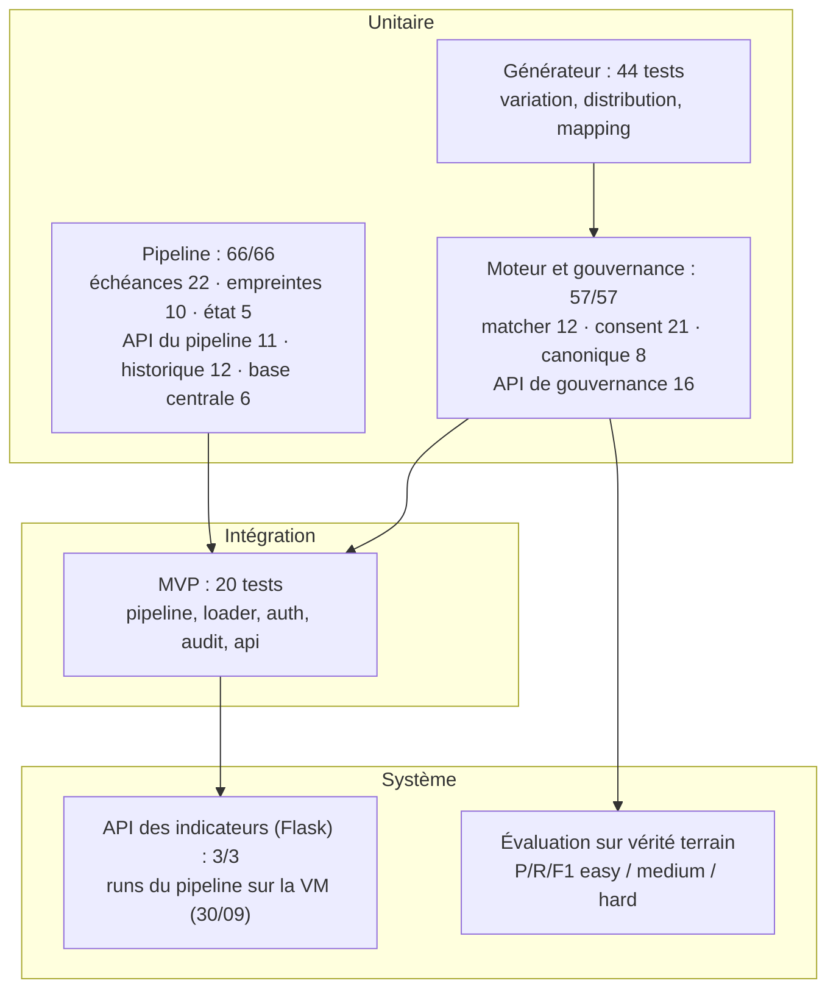

# Chapitre 8 — Tests du système

## 8.1 Stratégie de test

La validation suit une pyramide : unitaire (générateur et moteur), intégration
(pipeline, base) et système (API).

> **Figure 9 — La stratégie de test.**

**Tableau 42 — Les niveaux de test et leurs résultats.**

| Niveau | Périmètre | Résultat |
|---|---|---|
| **Générateur** (7 fichiers de tests) | moteur de variations, générateurs de sources, répartition, vérité terrain, construction des jeux | **44 tests réussis** |
| **Moteur et gouvernance `engine/`** | `test_matcher.py` (12 cas), `test_consent.py` (21), `test_deduplication.py` (8, modèle canonique), `test_governance_api.py` (16) | **57 sur 57** (`pytest projet/code-source/tests`, 30/09/2026) |
| **Pipeline `provision/`** | `test_schedule_logic.py` (22 cas), `test_watermark.py` (10), `test_pipeline_state.py` (5), `test_pipeline_api.py` (11), `test_run_metrics.py` (12), `test_central_db.py` (6) | **66 sur 66** (même suite) |
| **MVP** (`test_bigdata`) | pipeline, chargement PostgreSQL, authentification, audit, API | **20 tests réussis** |
| **API des indicateurs (Flask)** | `test_api.py` — 3 vérifications sur les données du lac | **3 sur 3** (joignabilité seulement) |
| **Pipeline sur la VM** | `run_pipeline.sh` RAW → SILVER → GOLD | runs complets et en reprise réussis (29–30/09/2026) ; évaluation du run : précision 1,000, rappel 0,424 |

L'ordre des niveaux suit le **coût d'un échec** : un test unitaire échoue en quelques secondes
et désigne une ligne de code ; un test système n'échoue qu'après un pipeline complet et demande
la VM. En l'absence d'intégration continue, hors périmètre du stage, chaque niveau est
**rejouable manuellement** (`pytest` pour le moteur et le pipeline, `run_pipeline.sh` pour le lac,
`test_api.py` pour l'API des indicateurs).

La suite principale (`pytest projet/code-source/tests`) réussit **123 tests sur 123** (57 pour le
moteur et la gouvernance, 66 pour le pipeline), sans échec.

## 8.2 Tests unitaires

**Générateur.** Sept fichiers de tests couvrent le moteur de variation, les générateurs de
sources, la distribution, l'identity mapping et la construction des jeux easy / medium / hard :
**44 tests PASS**.

**Moteur.** Les tests couvrent la sémantique de la déduplication : rapprochement exact (clé
identique, formats de CIN différents), inversion du nom compensée par la date de naissance et le
CIN, fusion au seuil de 0,80, faute de frappe compensée par la date de naissance, contribution de
la ville de naissance au score, **non-fusion de patients distincts**, et **parité Pandas/Spark**.

**Pipeline.** Six fichiers vérifient hors VM la mécanique d'exploitation : calcul des échéances
(22 cas), empreintes et décision de saut (10), état et reprise d'un run (5), API du pipeline,
historique compris (11), historique des runs (12) et chargement de la base centrale (6) :
**66 sur 66**.

## 8.3 Tests d'intégration

**MVP.** Les 20 tests du MVP (`test_bigdata`) enchaînent les composants : pipeline, chargement
PostgreSQL, authentification, audit et API — **20 tests PASS**.

**Pipeline complet.** Le run de référence du 07/09/2026 exécutait `run_pipeline.sh` de bout en
bout sur la VM (214 lignes SILVER, 145 patients maîtres, 69 doublons). Les runs du 29 et du
30/09/2026 ont rejoué les cinq étapes sur le jeu difficile, avec chargement de la base centrale et
enregistrement de l'historique (§ 7.3.2) ; un run en mode reprise a sauté les six tables
inchangées. Seule la planification par cron n'a pas été exécutée.

## 8.4 Tests fonctionnels

**L'API des indicateurs (Flask).** `test_api.py` est un **test de fumée** : il vérifie que chaque
point d'entrée répond avec le code attendu sur les données du lac, sans authentification. Il
prouve la **joignabilité** des deux points d'entrée (`/api/governance/duplicates` et
`/api/governance/consent`), **pas** le contrôle d'accès. Celui-ci est vérifié ailleurs, par les 16 cas de l'API de
gouvernance, qui emprunte le chemin d'authentification réel (tableau ci-dessous). Aucun des deux
niveaux ne se substitue à l'autre.

**Le contrôle d'accès et le consentement (FastAPI).** Les 16 cas de l'API ne simulent que la
connexion PostgreSQL : ils empruntent le **chemin réel** `Authorization: Bearer <clé>` →
résolution de l'utilisateur → contrôle du rôle → contrôle du consentement, sans jamais
contourner l'authentification. Ils prouvent les mécanismes du § 7.2.3, qui traduisent les
exigences juridiques du § 2.1.6. Le tableau reprend les principaux.

**Tableau 43 — Les cas de contrôle d'accès vérifiés.**

| Cas vérifié | Attendu |
|---|---|
| Aucun `Authorization` | **401**, journalisé en `anonymous` |
| Clé inconnue | **401** (clé invalide) |
| Rôle `viewer` sur un endpoint `admin` | **403** |
| `purpose` absent de `/patients` | **422** (finalité obligatoire) |
| `purpose` hors liste fermée (`marketing`) | **422**, valeurs autorisées listées |
| Finalité non consentie sur `/patients/{id}` | **403** + `refusal_reason` en audit |
| Finalité consentie sur `/patients/{id}` | **200**, `refusal_reason` vide |
| `/patients` avec consentements partiels | seuls les patients consentis sont renvoyés, exclusions comptées |
| `/patients` — recherche plein texte | `search=<nom>` retrouve les patients maîtres dont le nom normalisé correspond |
| `/patients` — recherche par CIN ou identifiant | `search=<CIN ou identifiant>` retrouve le patient maître correspondant |
| `/patients` — pagination | `page` / `page_size` renvoient une tranche bornée avec le total |
| `/audit` | lit `accessed_at` (régression : la requête interrogeait `recorded_at`, inexistant) |
| Absence de ligne de consentement | refus par défaut |

> **Sensibilité des tests.** Le test de refus 403 a été vérifié par *mutation* : neutraliser le
> contrôle de consentement fait **échouer** le test. Un test qui réussirait quelle que soit
> l'implémentation ne prouverait rien.

**Sur une base peuplée.** Le 30/09/2026, ces cas ont aussi été rejoués sur une base centrale de
test alimentée par le pipeline (803 patients maîtres) et par le jeu de consentements de
démonstration (2 409 avis) : 401 sans clé, 403 pour un rôle insuffisant, 422 pour une finalité
absente ou inconnue, 403 avec son motif en audit pour une finalité refusée ; pour la finalité
« statistiques », la liste renvoie 294 patients et en écarte 509, nombre journalisé (annexe H).

## 8.5 Évaluation sur vérité terrain

### 8.5.1 Principe et résultats

**Principe.** Trois jeux synthétiques (facile, moyen, difficile) sont générés à partir **des
mêmes patients maîtres** : seul le **taux de variation** change (10 %, 30 %, 50 %). La **vérité
terrain** (`identity_mapping.csv`) regroupe les fiches d'un même patient ; l'algorithme **ne la
reçoit jamais**. Les métriques sont calculées **par paires** de fiches : un vrai positif (VP) est
une paire correctement réunie, un faux positif (FP) une paire réunie à tort, un faux négatif (FN)
une paire manquée.

La **précision** (`VP / (VP + FP)`) mesure l'exactitude des fusions : c'est la propriété
critique en santé, où fusionner deux personnes distinctes est plus grave que d'en laisser deux
séparées. Le **rappel** (`VP / (VP + FN)`) mesure la part des vrais doublons retrouvés. Le **F1**
(`2·P·R / (P+R)`) est le compromis des deux.

**Résultats de référence** (run du 08/09/2026, 500 patients maîtres et 1 057 fiches par niveau,
mêmes résultats en Pandas et en Spark) :

**Tableau 44 — L'évaluation du moteur sur vérité terrain.**

| Niveau | Patients maîtres prédits | VP | FP | FN | Précision | Rappel | F1 |
|---|---|---|---|---|---|---|---|
| facile (10 %) | 500 | 727 | 0 | 0 | **1,000** | **1,000** | **1,000** |
| moyen (30 %) | 554 | 643 | 0 | 84 | **1,000** | 0,884 | 0,939 |
| difficile (50 %) | 804 | 307 | 0 | 420 | **1,000** | 0,422 | 0,594 |

Lecture : l'algorithme **ne fusionne jamais à tort** (aucun faux positif sur les trois niveaux) ;
sur le jeu volontairement difficile, il **ne reconnaît pas toutes les variantes** (rappel de
0,422). Poids et seuil sont configurables pour arbitrer entre précision et rappel. L'ajout du
**CIN à la clé exacte** a relevé le rappel du jeu difficile de 0,287 à **0,422**, sans faux
positif.

**Le pipeline complet, mesuré de la même façon.** Le jeu difficile a aussi servi de source au
pipeline Big Data (run du 29/09/2026, § 7.3.2) ; la table de correspondance écrite dans la base
centrale a été comparée à la même vérité terrain (`evaluation/evaluate_pipeline_run.py`) :
803 patients maîtres, VP = 308, FP = 0, FN = 419, soit une **précision de 1,000**, un **rappel de
0,424** et un **F1 de 0,595**. Le passage par le lac (extraction, mapping FHIR, SILVER) ne dégrade
donc pas la déduplication.

Les paires sont comptées analytiquement, groupe par groupe, sans être énumérées : l'évaluation
reste applicable à des jeux plus grands sans explosion combinatoire.

**Portée du zéro faux positif.** Le générateur dégrade des fiches existantes (casse, espaces,
inversion, abréviation, faute de frappe, format, champ manquant) mais ne crée **jamais** deux
personnes distinctes qui se ressemblent. Le cas le plus dangereux, deux homonymes proches
fusionnés à tort, n'est donc **pas sollicité** par la vérité terrain. La précision de 1,000 vaut
pour les erreurs simulées : face à des homonymes réels, elle est une estimation **optimiste**. La
confirmer exigerait un générateur de quasi-homonymes (§ 8.6).

### 8.5.2 Décomposition par méthode et par source

Le découpage par méthode localise la faiblesse : sur le jeu difficile, la méthode **exacte**
atteint 1,000 / 0,854 / 0,921 (précision / rappel / F1), la méthode **probabiliste**
1,000 / 0,533 / 0,696. La perte de rappel se situe sur les variantes dont le score reste sous le
seuil de 0,80.

Le rappel est homogène entre sources (pharmacy 0,422 ; consultation 0,422 ; imaging 0,423) : la
dégradation vient du **taux de variation**, pas d'une source.

Les deux implantations (Pandas `matcher.py` et Spark `spark_dedup.py`) produisent exactement les
mêmes résultats sur le jeu difficile : VP = 307, FP = 0, FN = 420, et 804 patients maîtres prédits
pour 500 patients réels et 1 057 fiches.

### 8.5.3 Cas de référence et intégrité

- **Cas « Jean Rakoto »** : 18 fiches de démonstration donnent **11 patients maîtres et 18
  liens** ; Jean Rakoto est rattaché par la voie **exacte** (CIN), Nirina par la voie
  **probabiliste** (score supérieur à 0,80), à l'identique en Pandas et en Spark.
- **Cohérence du lac** : au run du 07/09/2026, 214 lignes SILVER, 145 patients maîtres et
  69 doublons, soit `214 − 69 = 145`, vérifiable par simple comptage ; au run du 29/09/2026,
  1 057 lignes, 803 patients maîtres et 254 doublons (`1 057 − 254 = 803`).
- **Consentement en GOLD** : au 07/09, la table des consentements comptait une ligne par patient
  maître, finalité et accord vides faute de base alimentée ; au 30/09, elle porte les 2 409 avis
  enregistrés (803 patients, 3 finalités).

## 8.6 Limites et dettes identifiées

Les limites suivantes sont reprises dans la conclusion générale :

- **Rappel de 0,424** sur le jeu difficile (419 paires manquées) : piste, abaisser le seuil ou
  enrichir la clé, si le métier l'accepte.
- **Pas de cas de quasi-homonymes** dans la vérité terrain : la précision de 1,000 est une
  estimation optimiste.
- **API des indicateurs (Flask) sans contrôle d'accès** : `test_api.py` ne vérifie que trois
  statuts ; le contrôle par rôle et consentement est appliqué et testé sur l'API de gouvernance.
- **Planification par cron non exécutée** sur la VM : la logique est couverte par 22 tests.
- **Base centrale de test seulement** : elle a été alimentée par le pipeline et par un jeu de
  consentements de démonstration, pas par des avis réellement recueillis.
- **Consentement par type de dossier** (consultations, imagerie…) : en cours de développement ;
  le contrôle actuel porte sur la finalité.
- **Ni tests sur un environnement déployé, ni intégration continue**, hors périmètre du stage.

## Conclusion

La stratégie de test couvre le générateur (44 tests), le moteur et la gouvernance (57), le
pipeline (66), le MVP (20), l'API des indicateurs (3) et le pipeline complet rejoué sur la VM.
L'évaluation sur vérité terrain montre que la règle centrale est tenue : aucune fusion à tort,
pour le moteur seul comme pour le pipeline complet, avec un rappel de 0,42 sur le jeu difficile
qui indique où la logique peut s'enrichir. La gouvernance est vérifiée par son comportement
observable (401, 403, 422, audit avec finalité et motif), y compris sur une base peuplée. La
**conclusion générale** reprend ces acquis, les limites et les perspectives.
