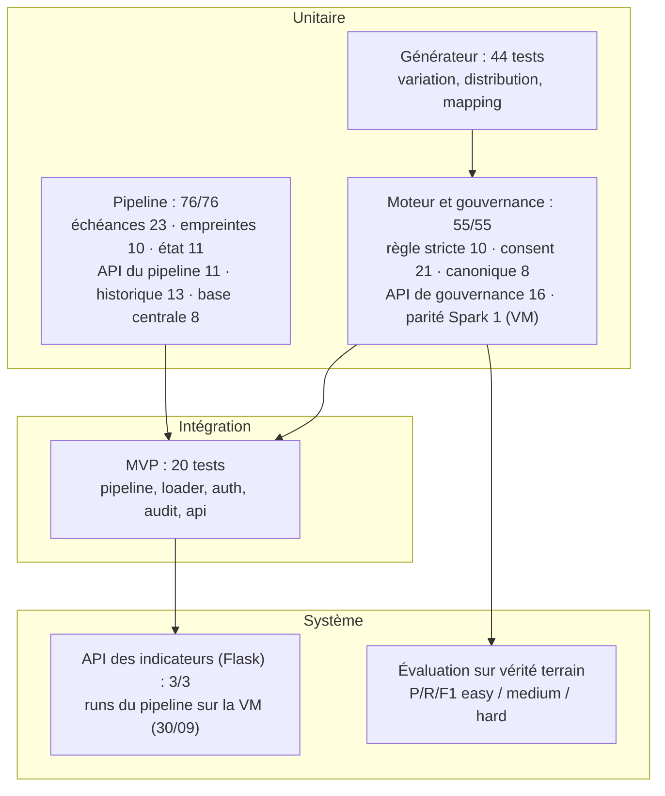

# Chapitre 8 — Tests du système

## 8.1 Stratégie de test

La validation suit une pyramide : unitaire (générateur et moteur), intégration
(pipeline, base) et système (API).

> **Figure 9 — La stratégie de test.**

**Tableau 42 — Les niveaux de test et leurs résultats.**

| Niveau | Périmètre | Résultat |
|---|---|---|
| **Générateur** (7 fichiers de tests) | moteur de variations, générateurs de sources, répartition, vérité terrain, construction des jeux | **44 tests réussis** |
| **Moteur et gouvernance `engine/`** | `test_matcher.py` (10 cas, règle stricte), `test_consent.py` (21), `test_deduplication.py` (8, modèle canonique), `test_governance_api.py` (16) ; `test_spark_dedup.py` (parité, dans la VM) | **55 sur 55** (`pytest projet/code-source/tests`, 30/09/2026) ; parité : 1 sur 1 dans la VM |
| **Pipeline `provision/`** | `test_schedule_logic.py` (23 cas), `test_watermark.py` (10), `test_pipeline_state.py` (11), `test_pipeline_api.py` (11), `test_run_metrics.py` (13), `test_central_db.py` (8) | **76 sur 76** (même suite) |
| **MVP** (`test_bigdata`) | pipeline, chargement PostgreSQL, authentification, audit, API | **20 tests réussis** |
| **API des indicateurs (Flask)** | `test_api.py` — 3 vérifications sur les données du lac | **3 sur 3** (joignabilité seulement) |
| **Pipeline sur la VM** | `run_pipeline.sh` RAW → SILVER → GOLD | runs complets, en reprise et à 100 000 patients réussis (29–30/09/2026) ; v2 : précision 1,000, rappel 0,179 (jeu difficile), parité Spark = Python |

L'ordre des niveaux suit le **coût d'un échec** : un test unitaire échoue en quelques secondes
et désigne une ligne de code ; un test système n'échoue qu'après un pipeline complet et demande
la VM. En l'absence d'intégration continue, hors périmètre du stage, chaque niveau est
**rejouable manuellement** (`pytest` pour le moteur et le pipeline, `run_pipeline.sh` pour le lac,
`test_api.py` pour l'API des indicateurs).

La suite principale (`pytest projet/code-source/tests`) réussit **131 tests sur 131** (55 pour le
moteur et la gouvernance, 76 pour le pipeline), sans échec ; le test de parité Spark, ignoré sans
PySpark, réussit dans la VM avec les 10 cas de la règle.

## 8.2 Tests unitaires

**Générateur.** Sept fichiers de tests couvrent le moteur de variation, les générateurs de
sources, la distribution, l'identity mapping et la construction des jeux easy / medium / hard :
**44 tests PASS**.

**Moteur.** Les tests couvrent la règle d'identité stricte : fusion quand CIN, genre, date et
ville sont identiques (malgré un nom mal saisi ou un format de CIN différent), **non-fusion** dès
qu'un de ces champs diffère ou manque, cas sans CIN (nom identique exigé), homonymes parfaits du
jeu de 100 000 patients, identifiants identiques quel que soit l'ordre des fiches, identifiant
protégé par secret, et **parité avec Spark** (test exécuté dans la VM).

**Pipeline.** Six fichiers vérifient hors VM la mécanique d'exploitation : calcul des échéances
(23 cas), empreintes et décision de saut (10), état et reprise d'un run, runs orphelins compris
(11), API du pipeline, historique compris (11), historique des runs (13) et chargement de la base
centrale, par lots compris (8) : **76 sur 76**.

## 8.3 Tests d'intégration

**MVP.** Les 20 tests du MVP (`test_bigdata`) enchaînent les composants : pipeline, chargement
PostgreSQL, authentification, audit et API — **20 tests PASS**.

**Pipeline complet.** Le run de référence du 07/09/2026 exécutait `run_pipeline.sh` de bout en
bout sur la VM (214 lignes SILVER, 145 patients maîtres, 69 doublons). Les runs du 29 et du
30/09/2026 ont rejoué les cinq étapes sur le jeu difficile, avec chargement de la base centrale et
enregistrement de l'historique (§ 7.3.2) ; un run en mode reprise a sauté les six tables
inchangées. Avec la v2, le pipeline a traité le jeu difficile et celui de 100 000 patients, avec
des identifiants identiques à la référence Python. Seule la planification par cron n'a pas été
exécutée.

## 8.4 Tests fonctionnels

**L'API des indicateurs (Flask).** `test_api.py` est un **test de fumée** : il vérifie que chaque
point d'entrée répond avec le code attendu sur les données du lac, sans authentification. Il
prouve la **joignabilité** des deux points d'entrée (`/api/governance/duplicates` et
`/api/governance/consent`), **pas** le contrôle d'accès. Celui-ci est vérifié ailleurs, par les 16 cas de l'API de
gouvernance, qui emprunte le chemin d'authentification réel (tableau ci-dessous). Aucun des deux
niveaux ne se substitue à l'autre.

**Le contrôle d'accès et le consentement (FastAPI).** Les 16 cas de l'API ne simulent que la
connexion PostgreSQL : ils empruntent le **chemin réel** `Authorization: Bearer <clé>` →
résolution de l'utilisateur → contrôle du rôle → contrôle du consentement, sans jamais
contourner l'authentification. Ils prouvent les mécanismes du § 7.2.3, qui traduisent les
exigences juridiques du § 2.1.6. Le tableau reprend les principaux.

**Tableau 43 — Les cas de contrôle d'accès vérifiés.**

| Cas vérifié | Attendu |
|---|---|
| Aucun `Authorization` | **401**, journalisé en `anonymous` |
| Clé inconnue | **401** (clé invalide) |
| Rôle `viewer` sur un endpoint `admin` | **403** |
| `purpose` absent de `/patients` | **422** (finalité obligatoire) |
| `purpose` hors liste fermée (`marketing`) | **422**, valeurs autorisées listées |
| Finalité non consentie sur `/patients/{id}` | **403** + `refusal_reason` en audit |
| Finalité consentie sur `/patients/{id}` | **200**, `refusal_reason` vide |
| `/patients` avec consentements partiels | seuls les patients consentis sont renvoyés, exclusions comptées |
| `/patients` — recherche plein texte | `search=<nom>` retrouve les patients maîtres dont le nom normalisé correspond |
| `/patients` — recherche par CIN ou identifiant | `search=<CIN ou identifiant>` retrouve le patient maître correspondant |
| `/patients` — pagination | `page` / `page_size` renvoient une tranche bornée avec le total |
| `/audit` | lit `accessed_at` (régression : la requête interrogeait `recorded_at`, inexistant) |
| Absence de ligne de consentement | refus par défaut |

> **Sensibilité des tests.** Le test de refus 403 a été vérifié par *mutation* : neutraliser le
> contrôle de consentement fait **échouer** le test. Un test qui réussirait quelle que soit
> l'implémentation ne prouverait rien.

**Sur une base peuplée.** Le 30/09/2026, ces cas ont aussi été rejoués sur la base de
démonstration, alimentée par le pipeline v2 (942 patients maîtres) et par le jeu de
consentements de démonstration (2 826 avis) : 401 sans clé, 403 pour un rôle insuffisant, 422 pour
une finalité absente ou inconnue, 403 avec son motif en audit pour une finalité refusée ; pour la
finalité « statistiques », la liste renvoie 395 patients et en écarte 547, nombre journalisé
(annexe H).

## 8.5 Évaluation sur vérité terrain

### 8.5.1 Principe et résultats

**Principe.** Trois jeux synthétiques (facile, moyen, difficile) sont générés à partir **des
mêmes patients maîtres** : seul le **taux de variation** change (10 %, 30 %, 50 %). La **vérité
terrain** (`identity_mapping.csv`) regroupe les fiches d'un même patient ; l'algorithme **ne la
reçoit jamais**. Les métriques sont calculées **par paires** de fiches : un vrai positif (VP) est
une paire correctement réunie, un faux positif (FP) une paire réunie à tort, un faux négatif (FN)
une paire manquée.

La **précision** (`VP / (VP + FP)`) mesure l'exactitude des fusions : c'est la propriété
critique en santé, où fusionner deux personnes distinctes est plus grave que d'en laisser deux
séparées. Le **rappel** (`VP / (VP + FN)`) mesure la part des vrais doublons retrouvés. Le **F1**
(`2·P·R / (P+R)`) est le compromis des deux.

**Résultats** (500 patients maîtres et 1 057 fiches par niveau ; v1 : run du 08/09/2026 ;
v2 : 30/09/2026 ; dernière ligne : jeu facile de 100 000 patients, 212 523 fiches) :

**Tableau 44 — L'évaluation du moteur sur vérité terrain, v1 (score) et v2 (règle stricte).**

| Niveau | Patients maîtres (v1 / v2) | VP (v1 / v2) | FP (v1 / v2) | FN (v1 / v2) | Rappel (v1 / v2) | F1 (v1 / v2) |
|---|---|---|---|---|---|---|
| facile (10 %) | 500 / 500 | 727 / 727 | 0 / 0 | 0 / 0 | 1,000 / 1,000 | 1,000 / 1,000 |
| moyen (30 %) | 554 / 589 | 643 / 599 | 0 / 0 | 84 / 128 | 0,884 / 0,824 | 0,939 / 0,903 |
| difficile (50 %) | 804 / 942 | 307 / 130 | 0 / 0 | 420 / 597 | 0,422 / 0,179 | 0,594 / 0,303 |
| 100 000 patients (facile) | 99 998 / 100 000 | 146 186 / 146 186 | **13 / 0** | 0 / 0 | 1,000 / 1,000 | 1,000 / 1,000 |

Lecture : aucune des deux versions ne fusionne à tort sur les trois jeux de référence (précision
de 1,000) ; la v2 n'en fusionne aucune non plus à 100 000 patients, là où la v1 réunissait deux
homonymes. Le prix est un rappel plus faible dès que la saisie se dégrade : 0,824 au lieu de 0,884
sur le jeu moyen, 0,179 au lieu de 0,422 sur le jeu difficile. La v2 ne rattrape ni une faute de
frappe sur le nom d'un patient sans CIN, ni surtout une fiche dont le générateur a effacé la date
ou la ville : une valeur manquante n'est jamais identique. C'est un choix : une fusion à tort est
plus grave qu'une fusion manquée, et une fiche non rattachée reste visible et corrigeable. En v1,
l'ajout du CIN à la clé exacte avait relevé le rappel du jeu difficile de 0,287 à 0,422.

**Le pipeline complet, mesuré de la même façon.** Le jeu difficile a aussi servi de source au
pipeline Big Data (run du 29/09/2026, moteur v1, § 7.3.2) ; la table de correspondance écrite dans la base
centrale a été comparée à la même vérité terrain (`evaluation/evaluate_pipeline_run.py`) :
803 patients maîtres, VP = 308, FP = 0, FN = 419, soit une **précision de 1,000**, un **rappel de
0,424** et un **F1 de 0,595**. En v2, le pipeline obtient exactement le résultat du moteur seul :
942 patients maîtres, VP = 130, FP = 0, FN = 597 (précision de 1,000, rappel de 0,179), avec des
identifiants identiques fiche par fiche (0 différence sur 1 057 fiches, et sur 212 523 à 100 000
patients). Le passage par le lac (extraction, mapping FHIR, SILVER) ne dégrade donc pas la
déduplication.

Les paires sont comptées analytiquement, groupe par groupe, sans être énumérées : l'évaluation
reste applicable à des jeux plus grands sans explosion combinatoire.

**Portée du zéro faux positif.** Le générateur dégrade des fiches existantes (casse, espaces,
inversion, abréviation, faute de frappe, format, champ manquant) mais ne crée pas volontairement
deux personnes distinctes qui se ressemblent. Sur les jeux de 500 patients, le cas le plus
dangereux, deux homonymes proches fusionnés à tort, n'est donc **pas sollicité** par la vérité
terrain. La précision de 1,000 vaut pour les erreurs simulées : elle est une estimation
**optimiste**. Avec la v2, une fusion à tort exige deux personnes de même CIN (erreur de saisie)
ou, sans CIN, de même nom, genre, date et ville de naissance ; la vérité terrain ne construit pas
ces cas (§ 8.6).

**Premières fusions à tort, à 100 000 patients.** Sur un jeu facile de 100 000 patients
(212 523 fiches), le hasard produit ce que les petits jeux ne contenaient pas : des **homonymes
parfaits**. Le moteur v1 retrouve 99 998 patients maîtres au lieu de 100 000 : deux fois, deux
personnes distinctes de même nom et de même date de naissance ont été réunies (13 paires à tort ;
précision de 0,9999, rappel de 1,000). Le score atteint exactement le seuil (nom 0,5 + date 0,3 =
0,80), alors que les CIN diffèrent dans un cas et manquent d'un côté dans l'autre, où seule la
ville de naissance, de faible poids, distingue les deux personnes. Ce constat a conduit à la
**v2** : avec la règle stricte, les deux paires restent séparées, et la précision revient à 1,000
sans perte de rappel sur ce jeu.

### 8.5.2 Décomposition par méthode et par source

En v1, le découpage par méthode localisait la faiblesse : sur le jeu difficile, la méthode
**exacte** atteignait 1,000 / 0,854 / 0,921 (précision / rappel / F1), la méthode **probabiliste**
1,000 / 0,533 / 0,696. La v2 n'a plus qu'une méthode, la règle stricte.

Le rappel est homogène entre sources (v1 : 0,422 / 0,422 / 0,423 ; v2 : pharmacy 0,181,
consultation 0,175, imaging 0,180) : la dégradation vient du **taux de variation**, pas d'une
source.

En v1, les deux implantations (Pandas et Spark) donnaient les mêmes résultats sur le jeu difficile
(VP = 307, FP = 0, FN = 420, 804 patients maîtres) ; en v2, la parité entre la référence Python et
Spark est vérifiée fiche par fiche (§ 7.3.3).

### 8.5.3 Cas de référence et intégrité

- **Cas « Jean Rakoto »** (PoC, v1) : 18 fiches de démonstration donnent **11 patients maîtres
  et 18 liens** ; Jean Rakoto est rattaché par la voie **exacte**, Nirina par la voie
  **probabiliste** (score supérieur à 0,80), à l'identique en Pandas et en Spark. Ces fiches du PoC
  n'ont pas de ville de naissance : la v2 ne les rattacherait pas (identité incomplète).
- **Cohérence du lac** : au run du 07/09/2026, 214 lignes SILVER, 145 patients maîtres et
  69 doublons, soit `214 − 69 = 145`, vérifiable par simple comptage ; au run du 29/09/2026,
  1 057 lignes, 803 patients maîtres et 254 doublons (`1 057 − 254 = 803`) ; en v2, 1 057 lignes,
  942 patients maîtres et 115 doublons (`1 057 − 115 = 942`).
- **Consentement en GOLD** : au 07/09, la table des consentements comptait une ligne par patient
  maître, finalité et accord vides faute de base alimentée ; au 30/09, elle porte les 2 409 avis
  enregistrés (803 patients, 3 finalités), puis 2 826 sur la base de démonstration v2 (942
  patients).

## 8.6 Limites et dettes identifiées

Les limites suivantes sont reprises dans la conclusion générale :

- **Rappel de 0,179** sur le jeu difficile (v2, 597 paires manquées) : une fiche à date ou ville
  manquante n'est jamais rattachée ; piste, la validation humaine de ces fiches, pas un score.
- **Ni CIN partagé ni quasi-homonymes construits** dans la vérité terrain : la précision de 1,000
  reste une estimation optimiste.
- **API des indicateurs (Flask) sans contrôle d'accès** : `test_api.py` ne vérifie que trois
  statuts ; le contrôle par rôle et consentement est appliqué et testé sur l'API de gouvernance.
- **Planification par cron non exécutée** sur la VM : la logique est couverte par 22 tests.
- **Base centrale de test seulement** : elle a été alimentée par le pipeline et par un jeu de
  consentements de démonstration, pas par des avis réellement recueillis.
- **Consentement par type de dossier** (consultations, imagerie…) : en cours de développement ;
  le contrôle actuel porte sur la finalité.
- **Ni tests sur un environnement déployé, ni intégration continue**, hors périmètre du stage.

## Conclusion

La stratégie de test couvre le générateur (44 tests), le moteur et la gouvernance (55, plus la
parité Spark dans la VM), le pipeline (76), le MVP (20), l'API des indicateurs (3) et le pipeline
complet rejoué sur la VM. L'évaluation sur vérité terrain montre que la règle centrale est tenue :
la v2 ne fusionne à tort sur aucun jeu, y compris à 100 000 patients où la v1 réunissait deux
homonymes, pour le moteur seul comme pour le pipeline complet. Son prix est un rappel de 0,18 sur le
jeu difficile, où les fiches incomplètes restent seules. La gouvernance est vérifiée par son comportement
observable (401, 403, 422, audit avec finalité et motif), y compris sur une base peuplée. La
**conclusion générale** reprend ces acquis, les limites et les perspectives.
