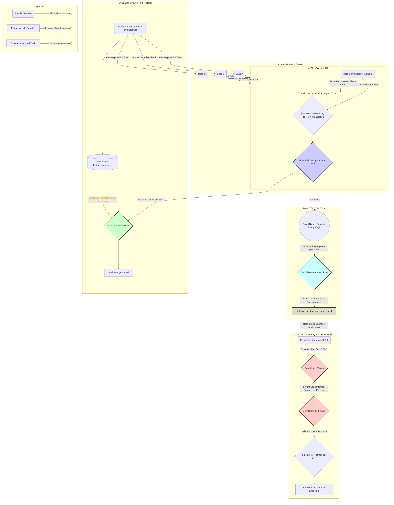

# 🧬 Diagramme de Flux des Données - Plateforme Mon Memoire (Mermaid)

# Explication Détaillée du Flux

Ce schéma modélise l'architecture Big Data Medallion (Bronze $\rightarrow$ Silver $\rightarrow$ Gold) avec les couches de gouvernance et l'évaluation ground-truth intégrées.

1.  **Sources (Entrée) :** trois sources hétérogènes génériques (`Base A`, `Base B`, `Base C`) de données
    fictives (modélisées dans le périmètre mémoire). La plateforme est **agnostique** : le nombre, le type
    (PostgreSQL, SQLite, …) et les noms des sources sont configurables via `provision/config/data_sources.json`.
2.  **RAW (Bronze Zone):** Les données sont chargées **brutes et inchangées** (`datalake/raw/...`). C'est la source de vérité non modifiée, essentielle pour l'audit.
3.  **SILVER (Argent Zone) - Le Maître Patient Index (MPI):**
    - Le moteur combine les données brutes avec un mapping FHIR.
    - La transformation clé est le **Moteur de Déduplication**, qui utilise des techniques d'Exact et de Probabilistic Matching pour créer l'`master_patient_id`. Chaque fusion est tracée (`match_method` / `score`).
4.  **GOLD (Or Zone):**
    - Ici, les données sont **agrégées et enrichies** avec le statut du consentement réel (via la jointure avec `datalake_gold.patient_consent_gold`). Seules les combinaisons de données dont la finalité est consentie peuvent être stockées comme "analyse utilisable".
5.  **Gouvernance & API (Couche d'Accès):**
    - C'est le point d'interception critique (`Contrôleur d'Accès`). Toute requête utilisateur doit passer par la vérification des **Rôles (RBAC)** et du **Consentement Purpose-by-Purpose**. Le refus d'accès est un mécanisme de protection fondamental.
    - **Audit:** Chaque étape de lecture ou de tentative d'accès génère un enregistrement immuable dans la table `access_audit`.
6.  **Évaluation Ground Truth (latérale - validation du moteur) :**
    - Le **générateur de données synthétiques** produit des jeux de référence `easy` / `medium` / `hard`
      ainsi que la **vérité de référence** (`identity_mapping.csv`).
    - Le **comparateur** mesure la **Precision / Recall / F1** des décisions du moteur (Pandas et Spark)
      contre cette vérité et écrit le rapport `evaluation_truth.md`.
    - **Règle d'explicabilité :** le ground truth n'est **jamais** fourni au moteur de déduplication ; il sert
      uniquement à mesurer la qualité du regroupement, en aval des décisions.