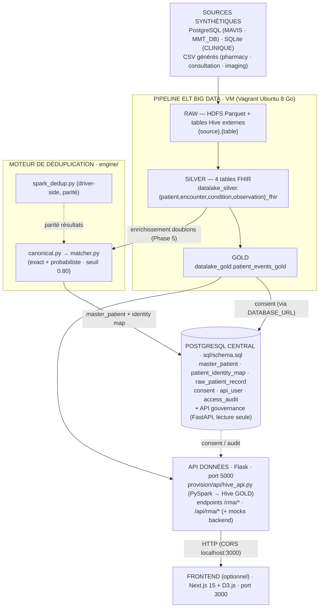
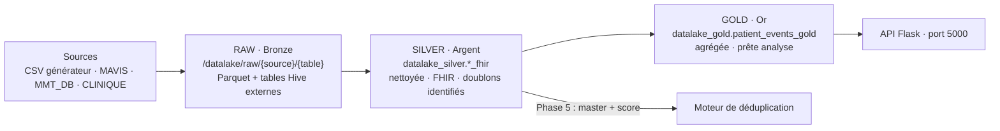

# Architecture — Data Lake Final

## 1. Vue d'ensemble

Plateforme Big Data **Medallion** (RAW → SILVER → GOLD) pour la centralisation et la gouvernance de
données patients synthétiques. Deux voies complémentaires cohabitent :

1. **Pipeline ELT Big Data** (VM Hadoop/Hive/Spark) : ingestion multi-sources → FHIR → GOLD → API Flask.
2. **Moteur de déduplication** (`engine/`) : canonicalisation + matching exact/probabiliste → master
   patient + identity map → PostgreSQL central → API gouvernance + évaluation ground-truth.



## 2. Structure du dépôt

```
Mon_Memoire/
├── README.md                  ← présentation + démarrage
├── AGENTS.md                  ← consignes agents IA + règle unique
├── documents/
│   ├── cahier_des_charges.md  ← objectifs et périmètre
│   └── documentation/         ← manuel conceptuel (ce dossier)
│       ├── architecture.md
│       ├── bigdata_concepts.md
│       ├── pipeline_elt.md
│       ├── deduplication.md
│       ├── consentement_gouvernance.md
│       ├── api.md
│       └── evaluation.md
├── ai/                        ← instructions agents IA
│   ├── memoire/               ← rédaction du mémoire
│   └── dev/                   ← développement
├── references/                ← bibliographie (réservé)
└── projet/code-source/
    ├── provision/             ← VM + pipeline ELT + API (ex datalake_mavis)
    ├── engine/                ← moteur de déduplication porté
    ├── evaluation/            ← générateur + évaluateur ground-truth
    ├── tests/                 ← tests moteur + consentement
    ├── sql/schema.sql         ← schéma PostgreSQL central
    └── front-optional/        ← visualisation Next.js (optionnel)
```

## 3. Catalogue de services et ports (VM)

| Service | Port | Note |
|---|---|---|
| HDFS NameNode | 9000 | `start-dfs.sh` en premier |
| YARN | 8088 | `start-yarn.sh` ensuite |
| Hive Metastore | 9083 | distant (évite le conflit Derby) |
| HiveServer2 | 10000 | `beeline -u jdbc:hive2://localhost:10000` |
| API Flask | 5000 | `python -m provision.api.hive_api` |
| Frontend Next.js | 3000 | hôte Windows |

**Ordre STRICT :** `start-dfs.sh` → `start-yarn.sh` → metastore (9083) → HiveServer2 (10000) → jobs Spark/API.

## 4. Zones de données (Medallion)

| Zone | Contenu | Stockage |
|---|---|---|
| RAW (Bronze) | Données brutes extraites, inchangées, avec `_source_table` | `/datalake/raw/{source}/{table}` Parquet + tables Hive externes `{source}.{table}` |
| SILVER (Argent) | Nettoyée, normalisée, standardisée FHIR, doublons identifiés | `datalake_silver.{patient,encounter,condition,observation}_fhir` |
| GOLD (Or) | Agrégée, prête pour l'analyse/API | `datalake_gold.patient_events_gold` |



Règles Silver :
- `patient_uuid` = `sha2(concat(source, '|', source_patient_id), 256)` ; `source_patient_id` préfixé (`MAVIS_123`).
- Genre normalisé `GENDER_MAP` (m/h/homme/male → male ; f/femme/female → female).
- Doublons : Window `partitionBy(name, birth_date, gender)` → `is_duplicate = count > 1` (phase 5 : enrichi
  avec `master_patient_id`, `match_method`, `match_score` via le moteur).
- Traçabilité : colonne `_source_table` + `update_sync_metadata("<ZONE>")`.

## 5. Composants clés du code

| Composant | Rôle | Fichiers principaux |
|---|---|---|
| VM Big Data | Environnement reproductible Hadoop/Hive/Spark | `provision/Vagrantfile`, `provision/bootstrap.sh` |
| Pipeline ELT | 5 étapes (0/5 générateur → 4/5) | `ensure_generator_data.sh`, `provision/scripts/ELT/gen_extract_raw.py`, `gen_fhir_mapping.py`, `create_silver.py`, `create_gold.py` |
| Utilitaires pipeline | Config + schéma FHIR, synonymes, sync | `provision/scripts/utils/paths.py`, `fhir_schema.py`, `fhir_synonyms.py`, `sync_utils.py` |
| Configuration pipeline | Chemins, bases Hive, tables, Spark, API (un seul fichier, commité) | `provision/config/pipeline.yaml` |
| Config FHIR déclarative | Schéma 4 entités + synonymes + mapping table→entité | `provision/config/fhir_entities.json` |
| API données | Exposition GOLD | `provision/api/hive_api.py`, `mock_data.py` |
| Moteur dédup | Canonique, matcher, Spark | `engine/identity/canonical.py`, `matcher.py`, `spark_dedup.py` |
| Gouvernance moteur | BDD, auth, consent, audit | `engine/governance/database.py`, `auth.py`, `consent.py`, `audit.py` |
| Évaluation | Vérification ground-truth | `evaluation/evaluate_engine.py`, `evaluation_truth.py`, `synthetic-patient-generator/` |
| PostgreSQL central | Master patient + gouvernance | `sql/schema.sql` |

## 6. Répertoires non commités

- `provision/config/data_sources.json` (secrets — template : `data_sources.example.json`)
- `provision/metadata/` (artefacts générés : extract_raw_report, fhir_mapping, sync_metadata)
- `provision/logs/`, `provision/reports/`
- `.env` (front-optional, API)
- `data/` (données générées), `*.db`
- venv, node_modules, `.next`

## 7. Liens

- Concepts : [`bigdata_concepts.md`](bigdata_concepts.md) — pourquoi HDFS/Hive/Spark.
- Bases de données : [`bases_de_donnees.md`](bases_de_donnees.md) — recension complète PostgreSQL + Hive (RAW/SILVER/GOLD).
- Pipeline : [`pipeline_elt.md`](pipeline_elt.md) — détail des 5 étapes.
- Déduplication : [`deduplication.md`](deduplication.md).
- Gouvernance : [`consentement_gouvernance.md`](consentement_gouvernance.md).
- API : [`api.md`](api.md).
- Évaluation : [`evaluation.md`](evaluation.md).
