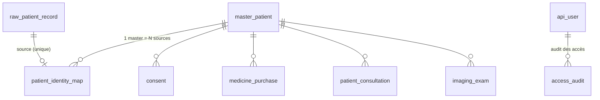
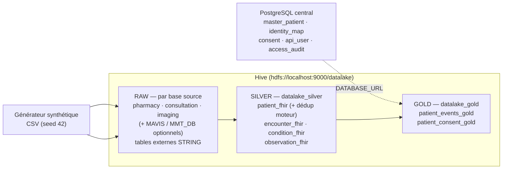

# Bases de données — Recension complète

Le projet repose sur **deux systèmes de stockage distincts** :

1. **PostgreSQL central** (`projet/code-source/sql/schema.sql`) : registre **MPI + gouvernance**
   (master patient, identity map, consentement, audit). Pilier du moteur `engine/` et de l'API.
2. **Hive sur HDFS** (`hdfs://localhost:9000/datalake/...`) : couches **Medallion RAW → SILVER → GOLD**
   du pipeline ELT. Les bases Hive sont `datalake_silver`, `datalake_gold` et une **base par source**
   pour le RAW (ex. `pharmacy`, `consultation`, `imaging`).

> Sources de vérité : `projet/code-source/sql/schema.sql`, `provision/config/fhir_entities.json`,
> `provision/config/pipeline.yaml`, `provision/scripts/ELT/create_silver.py` et `create_gold.py`.

---

## 1. PostgreSQL central (schéma MPI + gouvernance)

9 tables, alimentées par le moteur de déduplication et l'API. Cet entrepôt vit **en dehors** du
pipeline Spark (sauf `patient_consent_gold` qui est hydraté *depuis* PostgreSQL via la variable
d'environnement `DATABASE_URL` — sinon l'API retourne un consent vide / fallback mock).

### Tables

| # | Table (clé) | Colonnes principales | Contraintes notables |
|---|-------------|----------------------|----------------------|
| 1 | `raw_patient_record` (`raw_id` BIGSERIAL) | `source_system`, `source_patient_id`, `source_file`, `payload` JSONB, `extracted_at` | `UNIQUE (source_system, source_patient_id)` |
| 2 | `master_patient` (`master_patient_id` TEXT) | `first_name`, `last_name`, `full_name`, `birth_date`, `cin`, `birth_city`, `address`, `gender` | `gender CHECK IN ('M','F','')` ; `ADD COLUMN IF NOT EXISTS` (idempotent) |
| 3 | `patient_identity_map` (`identity_map_id` BIGSERIAL) | `master_patient_id` FK, `source_system`, `source_patient_id`, `match_method`, `match_score`, `explanation`, `matched_at` | `match_method IN ('new_master','exact','probabilistic')` ; `match_score ∈ [0,1]` ; `UNIQUE (source_system, source_patient_id)` |
| 4 | `consent` (`consent_id` BIGSERIAL) | `master_patient_id` FK, `purpose`, `granted` BOOL, `recorded_at` | consentement **purpose-by-purpose** |
| 5 | `medicine_purchase` (`purchase_id` BIGSERIAL) | `source_record_id`, `master_patient_id` FK, `source_system`, `source_patient_id`, `payload` JSONB | `UNIQUE (source_system, source_record_id)` |
| 6 | `patient_consultation` (`consultation_id` BIGSERIAL) | `source_record_id`, `master_patient_id` FK, `source_system`, `source_patient_id`, `payload` JSONB | `UNIQUE (source_system, source_record_id)` |
| 7 | `imaging_exam` (`exam_id` BIGSERIAL) | `source_record_id`, `master_patient_id` FK, `source_system`, `source_patient_id`, `payload` JSONB | `UNIQUE (source_system, source_record_id)` |
| 8 | `api_user` (`user_id` SERIAL) | `username` UNIQUE, `api_key_hash` (SHA-256), `role`, `active`, `created_at` | `role IN ('admin','analyst','viewer')` |
| 9 | `access_audit` (`audit_id` BIGSERIAL) | `user_id` FK, `username`, `endpoint`, `method`, `response_status`, `ip_address`, `accessed_at` | journal d'accès des endpoints |

---

## 2. Couche RAW (Hive) — une base externe par source

Le script `gen_extract_raw.py` crée `CREATE DATABASE IF NOT EXISTS {source}` puis, pour chaque table,
une **table externe Hive** sur parquet HDFS : `hdfs://localhost:9000/datalake/raw/{source}/{table}`
(helpers `paths.hdfs_raw`). Toutes les colonnes sont typées `STRING` (le typage FHIR arrive en SILVER).

### Sources actives par défaut (générateur synthétique, `data_sources.example.json`)

| Base Hive | Tables externes | Contenu (colonnes) |
|-----------|-----------------|--------------------|
| `pharmacy` | `patients`, `achats` | `patients` : client_id, nom_complet, naissance, cin, ville_naissance, adresse, sexe — `achats` : purchase_id, customer_id, medicine, quantity, purchase_date |
| `consultation` | `patients`, `consultations` | `patients` : patient_code, prenom, nom, date_naiss, no_cin, ville_nai, genre — `consultations` : consultation_id, patient_id, diagnosis, consultation_date |
| `imaging` | `patients`, `examens` | `patients` : id_personne, patient_name, dob, cin_number, birth_place, sex — `examens` : exam_id, patient_code, exam_type, exam_date |

Chacune de ces bases est alimentée en CSV par le générateur
(`evaluation/synthetic-patient-generator/data/raw/{source}`), garanti par l'étape 0
(`ensure_generator_data.sh`, seed 42).

### Sources avancées optionnelles (`data_sources.mavis.example.json`)

| Base Hive | Tables (parmi `tables_to_include`) | Rôle |
|-----------|-------------------------------------|------|
| `MAVIS` (postgres distant via tunnel SSH) | `hms_patient`, `res_partner`, `account_move`, `patient_death_register`, … | entités de la source Odoo/HMS |
| `MMT_DB` (postgres local) | `gnuhealth_patient`, `party_party`, `gnuhealth_family` | entités GNU Health |

Seules les tables **mappées** dans `fhir_entities.json` (`table_mappings`) atteignent la couche SILVER ;
les autres restent en RAW (externes Hive, non consommées).

---

## 3. Couche SILVER (base `datalake_silver`) — FHIR harmonisé + déduplication

Table cible par entité : `datalake_silver.{entité}_fhir` (écriture `overwrite` unique, multi-sources
fusionnées via `unionByName`). Schéma = `fields` de l'entité (config `fhir_entities.json`) **+ traçabilité**.

### Colonnes communes à toutes les entités

- **Champs FHIR** de l'entité (voir `fhir_entities.json`).
- `_source_table` : table source d'origine (ex. `achats`, `consultations`).
- `_source_system` : base Hive / source (ex. `pharmacy`, `consultation`, `imaging`).
- `patient_uuid` : `sha2(source + "|" + source_"_"source_patient_id, 256)` — clé de jointure GOLD,
  alignée entre le Patient et ses événements (même `source_patient_id` local).

### Entités (colonnes FHIR)

| Table SILVER | Colonnes FHIR | Alimentation actuelle |
|--------------|---------------|-----------------------|
| `patient_fhir` | `patient_uuid`, `source_patient_id`, `name`, `birth_date`, `gender`, `address`, `cin`, `birth_city`, `email` | `patients` des 3 sources |
| `encounter_fhir` | `patient_uuid`, `encounter_id`, `admission_date`, `discharge_date`, `create_date`, `visit_type` | `achats` (FK `customer_id`), `consultations` (FK `patient_id`), `examens` (FK `patient_code`) |
| `condition_fhir` | `patient_uuid`, `diagnosis`, `diagnosis_code`, `category`, `code`, `info`, `name` | (à mapper — pas de table d'événements du générateur dédiée) |
| `observation_fhir` | `patient_uuid`, `mortality`, `parity`, `gravida`, `live_births` | (non alimenté par le générateur) |

### Enrichissement déduplication (uniquement `patient_fhir`)

Après écriture, `create_silver.enrichir_dedup_moteur()` joint les décisions du moteur `engine/`
explicable (exact + probabiliste) sur `("_source_system", "source_patient_id")` et ajoute :
`master_patient_id`, `match_method`, `match_score`, `is_duplicate` (booléen). La règle :
chaque master patient est justifié par un `match_method` (jamais de fusion sans match).

---

## 4. Couche GOLD (base `datalake_gold`) — analytique

### `patient_events_gold` (table principale, `pipeline.yaml → tables.gold`)

Construite comme **lampe de chevet de `encounter_fhir`** :
`encounter_fhir JOIN patient_fhir JOIN condition_fhir JOIN observation_fhir` sur `patient_uuid`.

| Colonnes | Provenance |
|----------|------------|
| `patient_uuid`, `source_patient_id`, `name`, `gender`, `birth_date` | patient_fhir |
| `age` (années, `datediff / 365.25`) | calculé |
| `age_tranche` (8 classes démo RMA, `unknown` si absent) | `pipeline.yaml → gold.age_tranches` |
| `encounter_id`, `admission_date`, `discharge_date`, `visit_type` | encounter_fhir |
| `diagnosis_code`, `category`, `diagnosis` | condition_fhir |
| `mortality`, `parity`, `gravida`, `live_births` | observation_fhir |

Dédup GOLD : `dropDuplicates(["patient_uuid", "encounter_id", "diagnosis_code"])`.
> **État au dernier run consolidé (07/09/2026)** : vide (0 ligne — les événements du générateur
> n'étaient pas mappés). Depuis le branchement `achats`/`consultations`/`examens → Encounter`,
> à revalider : attendre `COUNT(*) > 0` après `run_pipeline.sh`.

### `patient_consent_gold` (`pipeline.yaml → tables.consent_gold`)

1. Patient maîtrisés depuis `patient_fhir` (`master_patient_id`, `patient_uuid`, `name`).
2. Consentements lus depuis PostgreSQL (`consent`, via `DATABASE_URL`) — si absent : lignes NULL
   (schéma créé, API en fallback mock).
3. Join sur `master_patient_id` → colonnes : `master_patient_id`, `patient_uuid`, `name`, `purpose`,
   `granted`, `recorded_at`.

---

## 5. Synthèse des flux

