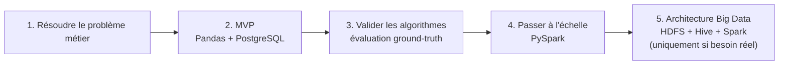
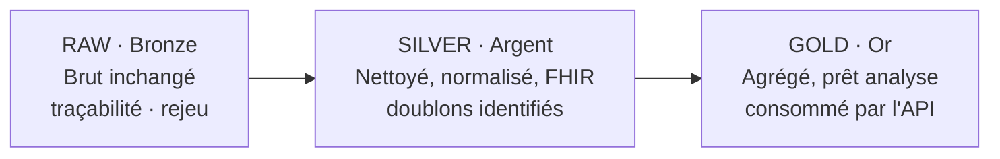
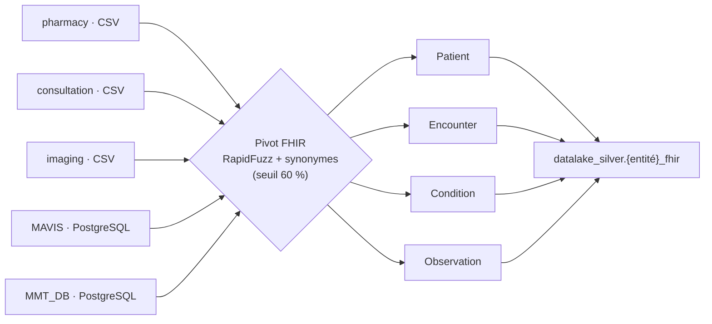
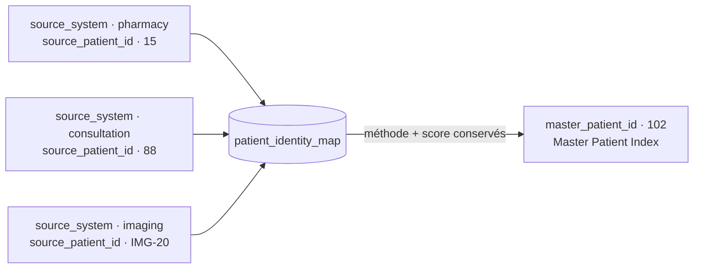

# Concepts Big Data à maîtriser

Document conceptuel (destiné au mémoire) : pourquoi et quand utiliser chaque technologie, sur la base de
ce qui a réellement été mis en œuvre dans le projet. Les choix sont **justifiés par un besoin**, jamais
par effet de mode.

## 1. Problème et progressivité

Le projet vise à intégrer, nettoyer, dédupliquer et gouverner des données patients de sources
hétérogènes. L'approche adoptée est **progressive** :

```text
1. Résoudre correctement le problème métier
2. Construire un MVP fonctionnel (Pandas + PostgreSQL)
3. Valider les algorithmes (évaluation ground-truth)
4. Passer à l'échelle (PySpark)
5. Ajouter l'architecture Big Data lorsque nécessaire (HDFS + Hive + Spark)
```



Chaque technologie n'est introduite **que** lorsqu'un besoin précis apparaît :

| Besoin | Technologie |
|---|---|
| Prototype rapide | Pandas |
| Données hétérogènes (CSV, PostgreSQL, SQLite) | Couche d'extraction abstraite |
| Déduplication avec similarité | RapidFuzz / Entity Resolution |
| Passage à l'échelle (volume, traitements longs) | Apache Spark |
| Stockage distribué / Data Lake | HDFS |
| SQL analytique sur le Data Lake | Hive |
| Environnement isolé reproductible | Vagrant / VirtualBox |

## 2. Pandas vs Spark

| Critère | Pandas | Apache Spark |
|---|---|---|
| Petit volume | Excellent | Possible mais excessif |
| Prototype rapide | Excellent | Plus complexe |
| Machine unique | Oui | Oui |
| Cluster | Non | Oui |
| Gros volume | Limité par la RAM | Très adapté |
| Traitement distribué | Non | Oui |

**Constat réel du projet :** à ~6–36 lignes, Pandas ~1–2 ms vs Spark ~0.4–4 s — l'overhead JVM domine sur
petit volume. Spark se justifie sur **gros volume** (le projet le conserve pour la démonstration de
parité : résultats Spark **strictement identiques** au pipeline Pandas sur les 3 sources).

## 3. Architecture Medallion

Le modèle **Medallion** organise les données en couches de qualité croissante (Databricks) :

```
RAW (Bronze) → SILVER (Argent) → GOLD (Or)
```



| Couche | Rôle | Dans le projet |
|---|---|---|
| **RAW** | Conserver la donnée brute, inchangée, telle qu'extraite | Parquet HDFS `/datalake/raw/{source}/{table}` + tables Hive externes ; permet traçabilité, rejeu du pipeline, comparaison avant/après |
| **SILVER** | Données **nettoyées, normalisées, standardisées** ; les doublons sont identifiés | 4 tables Hive harmonisées **FHIR** : `datalake_silver.*_fhir` |
| **GOLD** | Données **agrégées, prêtes pour l'analyse** | `datalake_gold.patient_events_gold` (18 colonnes, 8 tranches d'âge RMA), consommée par l'API |

Bénéfices : séparation claire des états de la donnée, rejeu possible, qualité progressive, et
**séparation des données** exigée par la gouvernance (brutes / nettoyées / consolidées).

## 4. HDFS (Hadoop Distributed File System)

**Pourquoi HDFS ?** — les volumes dépassent la capacité d'un seul disque, plusieurs machines doivent
stocker les données, une architecture distribuée est nécessaire, un Data Lake doit être construit.

Propriétés :
- Stockage distribué, **répliqué** par défaut (tolérance aux pannes).
- Architecture NameNode (métadonnées) + DataNodes (blocs).
- Optimisé pour les gros fichiers / scans séquentiels (pas pour les écritures aléatoires).
- Bénéficie aux traitements **local aux données** (data locality avec Spark/YARN).

**Piège rencontré :** le warehouse Spark ne doit **jamais** être écrit sur le montage vboxsf
(`part-*.snappy.parquet` corrompu) → toujours `spark.sql.warehouse.dir = hdfs://localhost:9000/...`.

## 5. Hive (SQL sur Data Lake)

**Pourquoi Hive ?** — interroger de grandes quantités de données en **SQL** sur un Data Lake, créer des
tables **externes** sur des fichiers HDFS, faire des analyses.

- Metastore : catalogue des tables/partitions (ici thrift://localhost:9083).
- HiveServer2 : accès JDBC/beeline (port 10000).
- Les jobs Hive utilisent Spark/MapReduce pour exécution.
- Idéal pour la couche **SILVER/GOLD** : les tables Hive exposent les Parquet HDFS aux pipelines Spark
  et aux analyses (ex : `beeline -e "SELECT count(*) FROM datalake_gold.patient_events_gold"`).

## 6. Spark (traitement distribué)

**Pourquoi Spark ?** — le volume augmente, les traitements deviennent longs, plusieurs sources doivent
être transformées, les comparaisons de patients deviennent nombreuses.

- Modèle **RDD/DataFrame**, exécution **distribuée** en mémoire (bien plus rapide que MapReduce).
- **PySpark** : API Python, utilisée pour le mapping FHIR, la normalisation, la détection des doublons,
  l'agrégation GOLD.
- La déduplication probabiliste a aussi été **portée en Spark** (driver-side) avec parité stricte des
  résultats avec la version Pandas.
- Config mémoire VM 8 Go : `executor_memory=4g`, `driver_memory=2g`, `spark.sql.shuffle.partitions=8`.

## 7. ELT vs ETL

Le pipeline suit la logique **ELT** :

1. **Extract** — extraire tel quel vers RAW (présence du modulo de données ; aucune transformation à
   l'ingestion). `gen_extract_raw.py`.
2. **Load** — charger la donnée brute dans le lac (HDFS) + tables Hive externes.
3. **Transform** — nettoyer/standardiser/agréger dans le warehouse (zones SILVER puis GOLD) à la demande,
   de façon power/automatisée. `create_silver.py`, `create_gold.py`.

Avantages sur l'architecture : les données brutes restent disponibles et ré-ingérables ; le schéma
n'est appliqué qu'à la lecture/transformation (schéma-on-read) — caractéristique du Data Lake.

## 8. Interopérabilité : schéma pivot FHIR

FHIR (HL7) sert de **schéma pivot** pour harmoniser des sources structurées différemment. Le mapping
automatique colonnes → FHIR repose sur **RapidFuzz + dictionnaire de synonymes** (`fhir_synonyms.py`) :

- correspondance exacte (champ FHIR = nom colonne),
- synonymes (birth_date ≡ dob, birthday, bdate),
- fuzzy matching (seuil 60 %),
- fallback première colonne.

4 entités : `Patient`, `Encounter`, `Condition`, `Observation`. Ce choix évite tout modèle NLP lourd
(`sentence_transformers` interdit : crash Python 3.8).



## 9. Data Integration & MDM

Le cœur du projet relève du **Master Data Management** appliqué aux données de santé : construire une
identité patient **unique** (Master Patient Index) à partir de plusieurs identifiants sources, avec des
liens `source_system → source_patient_id → master_patient_id` **traçables** et **explicables**
(voir [`deduplication.md`](deduplication.md)).



## 10. Vocabulaire utile

| Terme | Définition |
|---|---|
| Data Lake | Réserve centralisée de données brutes (type HDFS), schéma-on-read |
| Warehouse | Données structurées pour l'analyse (Hive) |
| Medallion | Modélisation en couches RAW/SILVER/GOLD |
| Blocking | Réduction des comparaisons en groupes de candidats (préfixe nom, année, CIN…) |
| Master Patient Index (MPI) | Référentiel des identités patients uniques |
| Entity Resolution | Technique visant à déterminer si deux enregistrements désignent la même entité |
| Ground Truth | Vérité terrain de référence utilisée en évaluation |