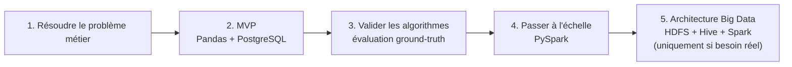
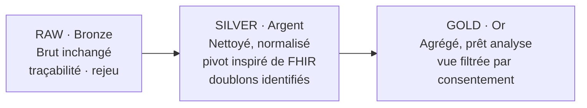
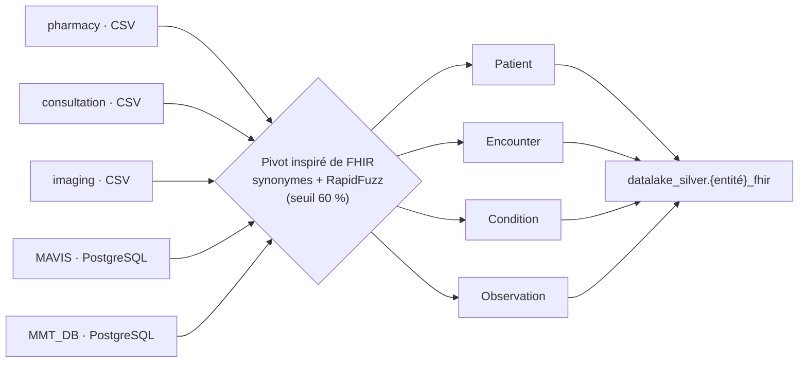
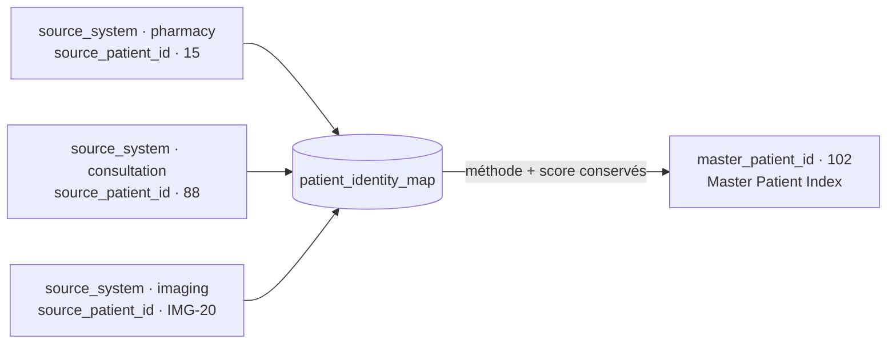

# Concepts Big Data à maîtriser

Document conceptuel (destiné au mémoire) : pourquoi et quand utiliser chaque technologie, sur la base de
ce qui a réellement été mis en œuvre dans le projet. Les choix sont **justifiés par un besoin**, jamais
par effet de mode.

## 1. Problème et progressivité

Le projet vise à intégrer, nettoyer, dédupliquer et gouverner des données patients de sources
hétérogènes. L'approche adoptée est **progressive** :

```text
1. Résoudre correctement le problème métier
2. Construire un MVP fonctionnel (Pandas + PostgreSQL)
3. Valider les algorithmes (évaluation ground-truth)
4. Passer à l'échelle (PySpark)
5. Ajouter l'architecture Big Data lorsque nécessaire (HDFS + Hive + Spark)
```


```mermaid
flowchart LR
    P1["1. Résoudre le problème métier"] --> P2["2. MVP<br/>Pandas + PostgreSQL"]
    P2 --> P3["3. Valider les algorithmes<br/>évaluation ground-truth"]
    P3 --> P4["4. Passer à l'échelle<br/>PySpark"]
    P4 --> P5["5. Architecture Big Data<br/>HDFS + Hive + Spark<br/>(uniquement si besoin réel)"]
```

Chaque technologie n'est introduite **que** lorsqu'un besoin précis apparaît :

| Besoin | Technologie |
|---|---|
| Prototype rapide | Pandas |
| Données hétérogènes (CSV, PostgreSQL, SQLite) | Couche d'extraction abstraite |
| Déduplication avec similarité | RapidFuzz / Entity Resolution |
| Passage à l'échelle (volume, traitements longs) | Apache Spark |
| Stockage distribué / Data Lake | HDFS |
| SQL analytique sur le Data Lake | Hive |
| Environnement isolé reproductible | Vagrant / VirtualBox |

## 2. Pandas vs Spark

| Critère | Pandas | Apache Spark |
|---|---|---|
| Petit volume | Excellent | Possible mais excessif |
| Prototype rapide | Excellent | Plus complexe |
| Machine unique | Oui | Oui |
| Cluster | Non | Oui |
| Gros volume | Limité par la RAM | Très adapté |
| Traitement distribué | Non | Oui |

**Constat réel du projet :** à ~6–36 lignes, Pandas ~1–2 ms vs Spark ~0.4–4 s — l'overhead JVM domine sur
petit volume. Spark se justifie sur **gros volume** (le projet le conserve pour la démonstration de
parité : résultats Spark **strictement identiques** au pipeline Pandas sur les 3 sources).

## 3. Architecture Medallion

Le modèle **Medallion** organise les données en couches de qualité croissante (Databricks) :

```
RAW (Bronze) → SILVER (Argent) → GOLD (Or)
```


```mermaid
flowchart LR
    RAW["RAW · Bronze<br/>Brut inchangé<br/>traçabilité · rejeu"] --> SIL["SILVER · Argent<br/>Nettoyé, normalisé<br/>pivot inspiré de FHIR<br/>doublons identifiés"] --> GOLD["GOLD · Or<br/>Agrégé, prêt analyse<br/>vue filtrée par consentement"]
```

| Couche | Rôle | Dans le projet |
|---|---|---|
| **RAW** | Conserver la donnée brute, inchangée, telle qu'extraite | Parquet HDFS `/datalake/raw/{source}/{table}` + tables Hive externes ; permet traçabilité, rejeu du pipeline, comparaison avant/après |
| **SILVER** | Données **nettoyées, normalisées, standardisées** ; les doublons sont identifiés | 4 tables Hive au **schéma pivot inspiré de FHIR** (§ 8) : `datalake_silver.*_fhir` |
| **GOLD** | Données **agrégées, prêtes pour l'analyse** | `datalake_gold.patient_events_gold` (19 colonnes, dont `master_patient_id` ; 8 tranches d'âge), `patient_consent_gold` (lue par l'API Flask) et la vue `patient_events_analytics` (patients consentant à `analytics`, sans donnée identifiante) |

Bénéfices : séparation claire des états de la donnée, rejeu possible, qualité progressive, et
**séparation des données** exigée par la gouvernance (brutes / nettoyées / consolidées).

## 4. HDFS (Hadoop Distributed File System)

**Pourquoi HDFS ?** — les volumes dépassent la capacité d'un seul disque, plusieurs machines doivent
stocker les données, une architecture distribuée est nécessaire, un Data Lake doit être construit.

Propriétés :
- Stockage distribué, **répliqué** par défaut (tolérance aux pannes).
- Architecture NameNode (métadonnées) + DataNodes (blocs).
- Optimisé pour les gros fichiers / scans séquentiels (pas pour les écritures aléatoires).
- Bénéficie aux traitements **local aux données** (data locality avec Spark/YARN).

**Piège rencontré :** le warehouse Spark ne doit **jamais** être écrit sur le montage vboxsf
(`part-*.snappy.parquet` corrompu) → toujours `spark.sql.warehouse.dir = hdfs://localhost:9000/...`.
Les **trois** étapes Spark le fixent : l'extraction RAW ne le faisait pas (30/09/2026), et ses bases
Hive par source étaient créées dans `spark-warehouse/` du dossier partagé (les données, en
emplacement explicite, étaient déjà sur HDFS).

## 5. Hive (SQL sur Data Lake)

**Pourquoi Hive ?** — interroger de grandes quantités de données en **SQL** sur un Data Lake, créer des
tables **externes** sur des fichiers HDFS, faire des analyses.

- Metastore : catalogue des tables/partitions (ici thrift://localhost:9083).
- HiveServer2 : accès JDBC/beeline (port 10000).
- Les jobs Hive utilisent Spark/MapReduce pour exécution.
- Idéal pour la couche **SILVER/GOLD** : les tables Hive exposent les Parquet HDFS aux pipelines Spark
  et aux analyses (ex : `beeline -e "SELECT count(*) FROM datalake_gold.patient_events_gold"`).

## 6. Spark (traitement distribué)

**Pourquoi Spark ?** — le volume augmente, les traitements deviennent longs, plusieurs sources doivent
être transformées, les comparaisons de patients deviennent nombreuses.

- Modèle **RDD/DataFrame**, exécution **distribuée** en mémoire (bien plus rapide que MapReduce).
- **PySpark** : API Python, utilisée pour le mapping FHIR, la normalisation, la détection des doublons,
  l'agrégation GOLD.
- La règle d'identité stricte (v2) s'exécute **dans Spark** (UDF + `row_number`, sans `collect()`),
  avec parité stricte des décisions avec la référence Python.
- Exécution en **`local[*]`** (un seul processus, 4 cœurs de la VM) : `driver_memory=2g` fixe la mémoire
  réellement disponible ; `executor_memory` est sans effet dans ce mode et YARN n'est pas utilisé.
  `spark.sql.shuffle.partitions=8`.
- **Journal d'événements** (`spark.eventLog.*`, dossier `/home/vagrant/spark-events`) : chaque job du
  pipeline reste consultable après sa fin (DAG, étapes, durées, shuffles) avec le serveur d'historique
  (`$SPARK_HOME/sbin/start-history-server.sh`, http://192.168.56.10:18080).
- GOLD : tranches d'âge en expression native (`CASE WHEN`), sans UDF Python.

## 7. ELT vs ETL

Le pipeline suit la logique **ELT** :

1. **Extract** — extraire tel quel vers RAW (présence du modulo de données ; aucune transformation à
   l'ingestion). `gen_extract_raw.py`.
2. **Load** — charger la donnée brute dans le lac (HDFS) + tables Hive externes.
3. **Transform** — nettoyer/standardiser/agréger dans le warehouse (zones SILVER puis GOLD) à la demande,
   de façon power/automatisée. `create_silver.py`, `create_gold.py`.

Avantages sur l'architecture : les données brutes restent disponibles et ré-ingérables ; le schéma
n'est appliqué qu'à la lecture/transformation (schéma-on-read) — caractéristique du Data Lake.

## 8. Interopérabilité : schéma pivot inspiré de FHIR

FHIR (HL7) sert de **modèle d'inspiration** pour un schéma pivot qui harmonise des sources
structurées différemment. Ce schéma reprend le nom de 4 ressources (`Patient`, `Encounter`,
`Condition`, `Observation`) et leurs champs principaux, **à plat** (une colonne par champ, une
table Hive par ressource). Il n'est **pas conforme** à FHIR : aucune ressource FHIR (JSON, `resourceType`)
n'est produite ni lue, il n'y a ni API REST FHIR, ni terminologie déclarée (CIM-10, LOINC), et les
ressources FHIR du consentement (`Consent`), de l'audit (`AuditEvent`) et de l'identité maître
(`Patient.link`, opération `$match`) ne sont pas utilisées : le projet les implémente dans ses propres
tables PostgreSQL. Produire ces ressources à partir des tables existantes reste une perspective.

Le mapping automatique colonnes → champs pivots repose sur un **dictionnaire de synonymes**
(`fhir_entities.json`) complété par **RapidFuzz** :

- correspondance exacte (champ = nom colonne),
- synonymes (birth_date ≡ dob, birthday, bdate),
- fuzzy matching (seuil 60 %) : sur les 6 tables du générateur, il ne trouve qu'une colonne
  (`adresse` → `address`) ; ses autres candidats (`purchase_date` pour `discharge_date`, par exemple)
  sont écartés par le garde-fou « une colonne source n'alimente qu'un seul champ »,
- fallback première colonne (clé du patient).

Ce choix évite tout modèle NLP lourd (`sentence_transformers` interdit : crash Python 3.8).

**Correspondance avec FHIR R4.**

| Entité | Colonne SILVER | Élément FHIR R4 | Écart |
|---|---|---|---|
| Patient | `patient_uuid` | `Patient.id` | empreinte technique de la fiche source |
| Patient | `source_patient_id` | `Patient.identifier` (système = source) | |
| Patient | `master_patient_id` | `Patient.link` (type `refer`, vers le patient maître) | ajouté par le moteur |
| Patient | `name` | `Patient.name` (`HumanName.text`) | nom complet en une chaîne, sans `family` / `given` |
| Patient | `birth_date` | `Patient.birthDate` | |
| Patient | `gender` | `Patient.gender` | `male` / `female` ; valeur non reconnue gardée en minuscules (FHIR : `other`, `unknown`) |
| Patient | `address` | `Patient.address.text` | |
| Patient | `cin` | `Patient.identifier` (système = CIN) | |
| Patient | `birth_city` | extension `patient-birthPlace` | |
| Patient | `email` | `Patient.telecom` (système = `email`) | |
| Encounter | `encounter_id` | `Encounter.identifier` | |
| Encounter | `patient_uuid` | `Encounter.subject` | valeur, pas référence |
| Encounter | `admission_date`, `discharge_date` | `Encounter.period.start`, `.end` | |
| Encounter | `visit_type` | `Encounter.class`, `Encounter.type` | texte libre |
| Encounter | `create_date` | — | aucun équivalent direct |
| Condition | `diagnosis_code` | `Condition.code.coding` | système de codage non déclaré |
| Condition | `diagnosis` | `Condition.code.text` | |
| Condition | `category` | `Condition.category` | |
| Condition | `code`, `info`, `name` | — | champs sources conservés |
| Observation | `parity`, `gravida`, `live_births` | une `Observation` par mesure (code LOINC, `valueInteger`) | trois mesures sur une ligne |
| Observation | `mortality` | `Patient.deceased[x]` | n'est pas une `Observation` en FHIR |


```mermaid
flowchart LR
    PHA["pharmacy · CSV"] --> PIVOT{"Pivot inspiré de FHIR<br/>synonymes + RapidFuzz<br/>(seuil 60 %)"}
    CON["consultation · CSV"] --> PIVOT
    IMA["imaging · CSV"] --> PIVOT
    MAV["MAVIS · PostgreSQL"] --> PIVOT
    MMT["MMT_DB · PostgreSQL"] --> PIVOT
    PIVOT --> PAT["Patient"]
    PIVOT --> ENC["Encounter"]
    PIVOT --> CON2["Condition"]
    PIVOT --> OBS["Observation"]
    PAT --> SIL2["datalake_silver.{entité}_fhir"]
    ENC --> SIL2
    CON2 --> SIL2
    OBS --> SIL2
```

## 9. Data Integration & MDM

Le cœur du projet relève du **Master Data Management** appliqué aux données de santé : construire une
identité patient **unique** (Master Patient Index) à partir de plusieurs identifiants sources, avec des
liens `source_system → source_patient_id → master_patient_id` **traçables** et **explicables**
(voir [`deduplication.md`](deduplication.md)).


```mermaid
flowchart LR
    S1["source_system · pharmacy<br/>source_patient_id · 15"] -->IM[("patient_identity_map")]
    S2["source_system · consultation<br/>source_patient_id · 88"] --> IM
    S3["source_system · imaging<br/>source_patient_id · IMG-20"] --> IM
    IM -->|"méthode + score conservés"| M["master_patient_id · 102<br/>Master Patient Index"]
```

## 10. Vocabulaire utile

| Terme | Définition |
|---|---|
| Data Lake | Réserve centralisée de données brutes (type HDFS), schéma-on-read |
| Warehouse | Données structurées pour l'analyse (Hive) |
| Medallion | Modélisation en couches RAW/SILVER/GOLD |
| Blocking | Réduction des comparaisons en groupes de candidats (préfixe nom, année, CIN…) |
| Master Patient Index (MPI) | Référentiel des identités patients uniques |
| Entity Resolution | Technique visant à déterminer si deux enregistrements désignent la même entité |
| Ground Truth | Vérité terrain de référence utilisée en évaluation |