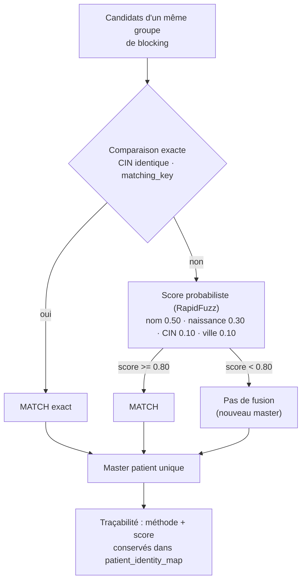
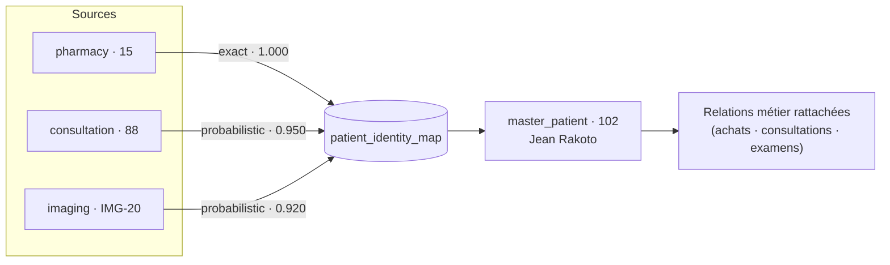

# Déduplication — méthode et moteur

Cœur intelligent du projet : déterminer si deux enregistrements provenant de sources différentes
désignent le **même patient**, puis construire une identité **unique** — le **Master Patient Index**
(MPI) — avec une **identity map** traçable. La logique est **toujours explicable** : chaque fusion est
justifiée par un score, une méthode et un seuil.

## 1. Chaîne de traitement

```
EXTRACTION → RAW → MAPPING (canonique) → STANDARDISATION → NETTOYAGE
   → BLOCKING → DÉDUPLICATION (exact puis probabiliste) → MASTER PATIENT INDEX
   → IDENTITY MAP → CHARGEMENT PostgreSQL → API / DASHBOARD / ÉVALUATION
```



```mermaid
flowchart LR
    EX["EXTRACTION"] --> RAW["RAW"]
    RAW --> CAN["MAPPING canonique"]
    CAN --> STD["STANDARDISATION"]
    STD --> NET["NETTOYAGE"]
    NET --> BLK["BLOCKING"]
    BLK --> DED["DÉDUPLICATION<br/>exact puis probabiliste"]
    DED --> MPI["MASTER PATIENT INDEX"]
    MPI --> IM["IDENTITY MAP"]
    IM --> PG[("PostgreSQL central")]
    PG --> OUT["API / DASHBOARD / ÉVALUATION"]
```

## 2. Modèle canonique

Chaque source a ses propres noms de colonnes et formats :

| Concept | Pharmacy | Consultation | Imaging |
|---|---|---|---|
| Identifiant | client_id | patient_code | id_personne |
| Nom | nom_complet | prenom + nom | patient_name |
| Naissance | naissance | date_naiss | dob |
| CIN | cin | no_cin | cin_number |
| Ville de naissance | ville_naissance | ville_nai | birth_place |

Le **modèle canonique** `CanonicalPatient` normalise la contre-partie entre sources, transformation et
déduplication :

```text
source_system · source_patient_id · first_name · last_name · full_name
birth_date · cin · birth_city · address · gender · source_file
```

Implémentation : [`engine/identity/canonical.py`](../../projet/code-source/engine/identity/canonical.py)
— `map_patient()` transforme une ligne source, `CanonicalPatient.from_dict()` reconstruit l'objet.
Les fonctions `_text`/`_normalized`/`_cin`/`_gender`/`_birth_date` assurent la standardisation, et
`matching_key` produit la clé de matching `(birth_date, cin, nom normalisé)`.

## 3. Standardisation / nettoyage

`" Jean Rakoto "` / `"JEAN RAKOTO"` / `"jean rakoto"` → `jean rakoto`.

- suppression des espaces ;
- uniformisation majuscules/minuscules ;
- normalisation des accents ;
- normalisation des CIN (chiffres uniquement, formats espacé/compact uniformisés) ;
- standardisation des dates (formats multiples → ISO `YYYY-MM-DD`) ;
- normalisation du genre instructive : `F`/`female`/`femme` → `F` ; `H`/`male`/`Homme`/`M` → `M` ;
- traitement des valeurs manquantes (naissance, ville de naissance).

## 4. Blocking

Comparer chaque patient à tous les autres est inefficace (O(n²)) :

```text
1 000 000 patients → 1 000 000 × 1 000 000 comparaisons
```

Le **blocking** crée des groupes de candidats (même préfixe du nom, même date de naissance, même
CIN) ; le matching n'est exécuté qu'entre candidats **du même groupe**.

## 5. Matching EXACT puis PROBABILISTE

1. **Exact matching** : comparaison exacte d'informations fiables (CIN identique non vide, clé de
   matching identique).
2. **Probabilistic matching** : lorsque les informations diffèrent légèrement (variations de casse,
   d'ordre, de format), calcul d'un **score de similarité** (RapidFuzz).

**Score pondéré :** les poids et le seuil sont la **source de vérité** dans
[`config/deduplication.yaml`](../../projet/code-source/config/deduplication.yaml), lus par le
moteur (Pandas et Spark) et l'évaluation. Valeurs courantes :

| Critère | Poids |
|---|---:|
| Nom | 0.50 |
| Date de naissance | 0.30 |
| CIN | 0.10 |
| Ville de naissance | 0.10 |

Recalibrer (= éditer le YAML) propage le changement partout sans toucher au code :
`threshold`, `weights.*`, `blocking.name_prefix_len`.

**Décision (seuil configurable via `config/deduplication.yaml`, valeur courante 0.80) :**

```text
Score >= 0.80  →  MATCH (fusion automatique)
Score <  0.80  →  pas de fusion (pas de logique arbitraire)
```



> Pour mémoire, la version pédagogique initiale utilisait : score ≥ 90 % → match auto, 70–90 % →
> review, < 70 % → no match.

## 6. Master Patient Index & Identity Map

Après déduplication, chaque groupe de doublons devient un **master patient** unique. Chaque identifiant
source est relié au master dans `patient_identity_map` avec sa justification :

| Source | ID Source | Master ID | Score | Méthode |
|---|---|---|---|---|
| pharmacy | 15 | 102 | 1.000 | exact |
| consultation | 88 | 102 | 0.950 | probabilistic |
| imaging | IMG-20 | 102 | 0.920 | probabilistic |

La table conserve l'origine des données, la traçabilité, les identifiants historiques et les relations
métier (achats, consultations, examens rattachés au master).



## 7. Cas de référence — « Jean Rakoto »

Vecteur de validation reproductible :

```text
PHARMACIE    Jean Rakoto · CIN 101 02404 5 · 1990-01-10
CONSULTATION Rakoto Jean · 101024045 · 10/01/1990
IMAGERIE     J. RAKOTO  · 101024045 · 1990/01/10
```

Résultat attendu : les 3 enregistrements fusionnés en **un seul master** — Jean Rakoto par **exact**
(CIN) + **probabiliste** (score 0.8+ pour les variations de pseudo).

## 8. Implémentation (moteur `engine/`)

Répertoire : [`projet/code-source/engine/`](../../projet/code-source/engine/)

| Fichier | Rôle |
|---|---|
| `identity/canonical.py` | `CanonicalPatient`, standardisation, `matching_key` |
| `identity/config.py` | Chargement de `config/deduplication.yaml` (poids, seuil, préfixe) — fallback défauts si absent |
| `identity/matcher.py` | `_MasterIndex`, `deduplicate()` — exact + probabiliste, seuil/poids depuis la config |
| `identity/spark_dedup.py` | Version **driver-side** Parquet même logique, `_BoundedMasterIndex` |
| `identity/__init__.py` | API publique du paquet |

- **Pandas** (`matcher.py`) et **Spark** (`spark_dedup.py`) produisent des résultats **strictement
  identiques** (validé : démo 18 patients → 11 masters, 18 liens ; Jean Rakoto exact, Nirina probabiliste 0.8).
- Compatible Python 3.8 (`from __future__ import annotations`) pour tourner sur la VM.

## 9. Tests

`tests/test_matcher.py` — 12 cas :

1. match exact (clé identique) ;
2. nom inversé + CIN non vide (exact Naissance+CIN) ;
3. CIN au seuil 0.80 (nom + naissance = 0.8, sans CIN ni ville) ;
4. faute de frappe compensée par naissance ;
5. ville de naissance identique → score augmenté ;
6. formats de CIN (espacé / compact) normalisés ;
7. patients distincts → non fusionnés (précision) ;
8. CIN différents (même nom, même naissance) → non fusionnés ;
9. parité Pandas / Spark sur le jeu de référence ;
10. aucun match → nouveau master ;
11. lecture config YAML (seuil/poids) ;
12. override des poids modifie la décision.

## 10. Synchronisation avec la zone SILVER

Le flag `is_duplicate` de la zone SILVER (Window `partitionBy(name, birth_date, gender)`) est enrichi
par le moteur lors de la **Phase 5** de la fusion : `master_patient_id`, `match_method`, `match_score`
pour chaque ligne Patient, rendant la fusion **explicable** au niveau du Data Lake
(voir [`pipeline_elt.md`](pipeline_elt.md) et [`evaluation.md`](evaluation.md)).

## Règles métier

- Ne **jamais** fusionner sans logique explicable (score + méthode toujours conservés).
- Conserver la chaîne : `source -> canonique -> master patient`.
- Le **ground_truth** ne doit jamais être fourni à l'algorithme (réservé à l'évaluation).