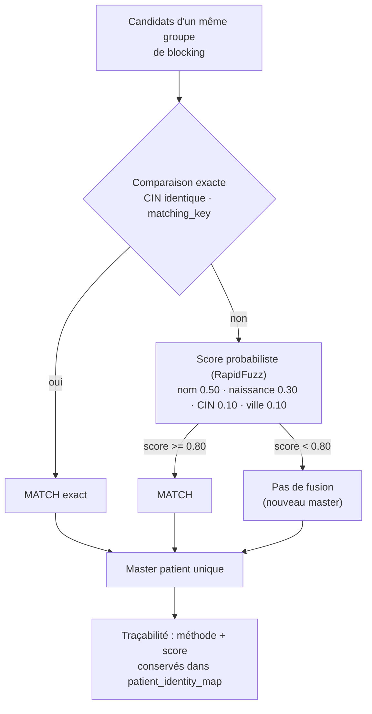
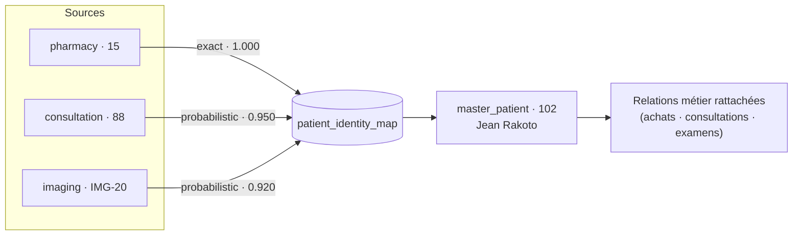

# Déduplication — méthode et moteur

Cœur intelligent du projet : déterminer si deux enregistrements provenant de sources différentes
désignent le **même patient**, puis construire une identité **unique** — le **Master Patient Index**
(MPI) — avec une **identity map** traçable. La logique est **toujours explicable** : chaque fusion est
justifiée par une méthode et la règle appliquée.

## 0. Règle en vigueur : identité stricte (v2, 30/09/2026)

Deux fiches désignent la même personne **si et seulement si** elles partagent la clé d'identité
(`engine/identity/rules.py::identity_key`) :

| Cas | Clé | Explication enregistrée |
|---|---|---|
| CIN présent | (CIN, genre, date de naissance, ville de naissance normalisée) | « CIN, genre, date et ville de naissance identiques » |
| CIN absent des deux côtés | (nom normalisé, genre, date, ville) | « sans CIN : nom, genre, date et ville de naissance identiques » |
| Genre, date ou ville manquant (ou nom, sans CIN) | aucune | « identité incomplète (…) : aucune fusion » — la fiche reste seule |

- **Aucun score, aucun seuil, aucun poids** : une valeur manquante n'est jamais « identique » ; deux CIN
  différents ne sont jamais réunis.
- **Identifiant du patient maître dérivé de la clé** (`master_id`) : `PAT-` + 20 caractères hexadécimaux
  de SHA-256 de la clé (d'une fiche isolée : de `fiche|source|identifiant`) ; **HMAC** si la variable
  `PATIENT_ID_SECRET` est définie (recommandé hors démonstration : la clé contient des données
  identifiantes). Même identifiant à chaque run et quel que soit l'ordre des fiches.
- **Méthodes** : `new_master` (fiche fondatrice d'une identité, ou identité incomplète) et `exact`
  (rattachement) ; score 1,0.
- **Exécution** : `matcher.deduplicate(patients)` (référence Python : évaluation, tests) et
  `spark_dedup.deduplicate_df(df)` (étape SILVER : UDF + `row_number` par clé, sans `collect()`), avec les
  mêmes fonctions de règle. Parité vérifiée : 0 différence d'identifiant sur 212 523 et 1 057 fiches.
- **Pourquoi** : la v1 (sections 4 et 5, conservées pour l'historique) fusionnait deux homonymes parfaits
  sur 100 000 patients (nom 0,5 + date 0,3 = seuil de 0,80, CIN différents). Résultats v2 : aucune fusion à
  tort sur tous les jeux ; rappel 1,000 (facile, 12 000, 100 000), 0,824 (moyen), 0,179 (difficile, où les
  dates et villes effacées empêchent tout rattachement). Voir [`evaluation.md`](evaluation.md).

## 1. Chaîne de traitement

```
EXTRACTION → RAW → MAPPING (canonique) → STANDARDISATION → NETTOYAGE
   → BLOCKING → DÉDUPLICATION (exact puis probabiliste) → MASTER PATIENT INDEX
   → IDENTITY MAP → CHARGEMENT PostgreSQL → API / DASHBOARD / ÉVALUATION
```


```mermaid
flowchart LR
    EX["EXTRACTION"] --> RAW["RAW"]
    RAW --> CAN["MAPPING canonique"]
    CAN --> STD["STANDARDISATION"]
    STD --> NET["NETTOYAGE"]
    NET --> BLK["BLOCKING"]
    BLK --> DED["DÉDUPLICATION<br/>exact puis probabiliste"]
    DED --> MPI["MASTER PATIENT INDEX"]
    MPI --> IM["IDENTITY MAP"]
    IM --> PG[("PostgreSQL central")]
    PG --> OUT["API / DASHBOARD / ÉVALUATION"]
```

## 2. Modèle canonique

Chaque source a ses propres noms de colonnes et formats :

| Concept | Pharmacy | Consultation | Imaging |
|---|---|---|---|
| Identifiant | client_id | patient_code | id_personne |
| Nom | nom_complet | prenom + nom | patient_name |
| Naissance | naissance | date_naiss | dob |
| CIN | cin | no_cin | cin_number |
| Ville de naissance | ville_naissance | ville_nai | birth_place |

Le **modèle canonique** `CanonicalPatient` normalise la contre-partie entre sources, transformation et
déduplication :

```text
source_system · source_patient_id · first_name · last_name · full_name
birth_date · cin · birth_city · address · gender · source_file
```

Implémentation : [`engine/identity/canonical.py`](../../projet/code-source/engine/identity/canonical.py)
— `map_patient()` transforme une ligne source, `CanonicalPatient.from_dict()` reconstruit l'objet.
Les fonctions `_text`/`_normalized`/`_cin`/`_gender`/`_birth_date` assurent la standardisation, et
`matching_key` produit la clé de matching `(birth_date, cin, nom normalisé)`.

## 3. Standardisation / nettoyage

`" Jean Rakoto "` / `"JEAN RAKOTO"` / `"jean rakoto"` → `jean rakoto`.

- suppression des espaces ;
- uniformisation majuscules/minuscules ;
- normalisation des accents ;
- normalisation des CIN (chiffres uniquement, formats espacé/compact uniformisés) ;
- standardisation des dates (formats multiples → ISO `YYYY-MM-DD`) ;
- normalisation du genre instructive : `F`/`female`/`femme` → `F` ; `H`/`male`/`Homme`/`M` → `M` ;
- traitement des valeurs manquantes (naissance, ville de naissance).

## 4. Blocking (v1, historique)

Comparer chaque patient à tous les autres est inefficace (O(n²)) :

```text
1 000 000 patients → 1 000 000 × 1 000 000 comparaisons
```

Le **blocking** crée des groupes de candidats (même préfixe du nom, même date de naissance, même
CIN) ; le matching n'est exécuté qu'entre candidats **du même groupe**.

## 5. Matching EXACT puis PROBABILISTE (v1, historique)

1. **Exact matching** : comparaison exacte d'informations fiables (CIN identique non vide, clé de
   matching identique). Recherche **directe par dictionnaire** (`_MasterIndex.exact`,
   `_BoundedMasterIndex.exact_birth_cin`), sans parcourir les patients maîtres : jusqu'au
   30/09/2026, la passe exacte de `matcher` comparait chaque fiche à tous les patients maîtres
   (coût quadratique, 887 s sur 25 587 fiches, contre 13 s après correction, décisions identiques).
2. **Probabilistic matching** : lorsque les informations diffèrent légèrement (variations de casse,
   d'ordre, de format), calcul d'un **score de similarité** (RapidFuzz).

**Score pondéré :** les poids et le seuil sont la **source de vérité** dans
[`config/deduplication.yaml`](../../projet/code-source/config/deduplication.yaml), lus par le
moteur (Pandas et Spark) et l'évaluation. Valeurs courantes :

| Critère | Poids |
|---|---:|
| Nom | 0.50 |
| Date de naissance | 0.30 |
| CIN | 0.10 |
| Ville de naissance | 0.10 |

Recalibrer (= éditer le YAML) propage le changement partout sans toucher au code :
`threshold`, `weights.*`, `blocking.name_prefix_len`.

**Décision (seuil configurable via `config/deduplication.yaml`, valeur courante 0.80) :**

```text
Score >= 0.80  →  MATCH (fusion automatique)
Score <  0.80  →  pas de fusion (pas de logique arbitraire)
```


```mermaid
flowchart TD
    CAND["Candidats d'un même groupe<br/>de blocking"] --> EX{"Comparaison exacte<br/>CIN identique · matching_key"}
    EX -->|"oui"| MATCH["MATCH exact"]
    EX -->|"non"| PROB["Score probabiliste (RapidFuzz)<br/>nom 0.50 · naissance 0.30 · CIN 0.10 · ville 0.10"]
    PROB -->|"score >= 0.80"| MATCH2["MATCH"]
    PROB -->|"score < 0.80"| NOMATCH["Pas de fusion<br/>(nouveau master)"]
    MATCH --> DED["Master patient unique"]
    MATCH2 --> DED
    NOMATCH --> DED
    DED --> TRACE["Traçabilité : méthode + score<br/>conservés dans patient_identity_map"]
```

> Pour mémoire, la version pédagogique initiale utilisait : score ≥ 90 % → match auto, 70–90 % →
> review, < 70 % → no match.

## 6. Master Patient Index & Identity Map

Après déduplication, chaque groupe de doublons devient un **master patient** unique. Chaque identifiant
source est relié au master dans `patient_identity_map` avec sa justification :

| Source | ID Source | Master ID | Score | Méthode |
|---|---|---|---|---|
| pharmacy | 15 | 102 | 1.000 | exact |
| consultation | 88 | 102 | 0.950 | probabilistic |
| imaging | IMG-20 | 102 | 0.920 | probabilistic |

La table conserve l'origine des données, la traçabilité, les identifiants historiques et les relations
métier (achats, consultations, examens rattachés au master).


```mermaid
flowchart LR
    subgraph SOURCES["Sources"]
        S1["pharmacy · 15"]
        S2["consultation · 88"]
        S3["imaging · IMG-20"]
    end
    IM[(patient_identity_map)]
    M["master_patient · 102<br/>Jean Rakoto"]
    S1 -->|"exact · 1.000"| IM
    S2 -->|"probabilistic · 0.950"| IM
    S3 -->|"probabilistic · 0.920"| IM
    IM --> M
    M --> EVENTS["Relations métier rattachées<br/>(achats · consultations · examens)"]
```

## 7. Cas de référence — « Jean Rakoto »

Vecteur de validation reproductible :

```text
PHARMACIE    Jean Rakoto · CIN 101 02404 5 · 1990-01-10
CONSULTATION Rakoto Jean · 101024045 · 10/01/1990
IMAGERIE     J. RAKOTO  · 101024045 · 1990/01/10
```

Résultat en v1 : les 3 enregistrements fusionnés en **un seul master** — Jean Rakoto par **exact**
(CIN) + **probabiliste** (score 0.8+ pour les variations de pseudo). En v2, la fusion exige aussi le
genre et la ville de naissance identiques : sans ville renseignée, ces fiches resteraient séparées.

## 8. Implémentation (moteur `engine/`)

Répertoire : [`projet/code-source/engine/`](../../projet/code-source/engine/)

| Fichier | Rôle |
|---|---|
| `identity/canonical.py` | `CanonicalPatient`, standardisation (`_cin`, `_gender`, `_birth_date`, `_normalized`) |
| `identity/rules.py` | `identity_key()`, `master_id()`, libellés d'explication — la règle stricte (v2) |
| `identity/matcher.py` | `deduplicate(patients)` — référence Python de la règle |
| `identity/spark_dedup.py` | `deduplicate_df(df)` — même règle dans Spark (UDF + `row_number`), sans `collect()` |
| `identity/__init__.py` | API publique du paquet |

- La v1 (`config.py`, `config/deduplication.yaml`, `_similarity`, `_MasterIndex`, `matching_key`) a été
  retirée le 30/09/2026 ; elle reste consultable dans l'historique Git.
- Parité Python / Spark : `tests/test_spark_dedup.py` (dans la VM) et `evaluate_pipeline_run.py --parity`.
- Compatible Python 3.8 (`from __future__ import annotations`) pour tourner sur la VM.

## 9. Tests

`tests/test_matcher.py` — 10 cas (règle v2) :

1. CIN, genre, date et ville identiques, noms différents → fusion ;
2. CIN différents (homonymes parfaits du jeu de 100 000) → séparés ;
3. genre différent → séparés ;
4. date ou ville différente → séparés ;
5. champ manquant → identité incomplète, aucune fusion ;
6. sans CIN des deux côtés : nom identique exigé ;
7. CIN d'un seul côté → séparés ;
8. identifiant dérivé de la clé, identique quel que soit l'ordre ;
9. HMAC quand `PATIENT_ID_SECRET` est défini ;
10. la fonction appelée par l'UDF Spark donne la même clé et le même identifiant.

`tests/test_spark_dedup.py` — parité Spark = Python sur des cas choisis (ignoré sans PySpark, exécuté dans
la VM).

## 10. Synchronisation avec la zone SILVER

Le flag `is_duplicate` de la zone SILVER (Window `partitionBy(name, birth_date, gender)`) est remplacé
par la décision de la règle stricte, calculée **dans Spark** (`deduplicate_df`) : `master_patient_id`,
`match_method`, `match_score` pour chaque ligne Patient, rendant la fusion **explicable** au niveau du
Data Lake ; la base centrale reçoit ensuite les décisions en flux (lots de 5 000)
(voir [`pipeline_elt.md`](pipeline_elt.md) et [`evaluation.md`](evaluation.md)).

## Règles métier

- Ne **jamais** fusionner sans logique explicable (méthode + explication toujours conservées).
- Ne **jamais** réunir deux fiches dont un champ d'identité diffère ou manque (règle stricte v2).
- Conserver la chaîne : `source -> canonique -> master patient`.
- Le **ground_truth** ne doit jamais être fourni à l'algorithme (réservé à l'évaluation).